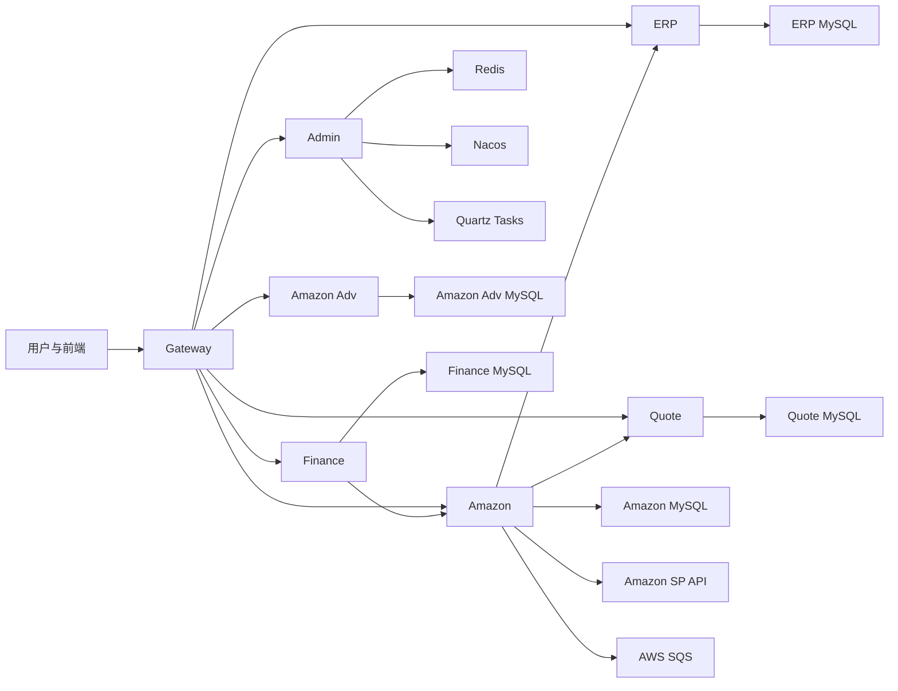

# 01. 系统总览

## 1.1 系统定位

Wimoor 是一套面向跨境电商经营场景的微服务系统，核心业务围绕供应链、Amazon 店铺运营、广告投放、财务核算和报价协同展开。系统由多个 Spring Cloud 微服务组成，统一通过 Gateway 暴露入口，并通过 Nacos 管理配置与服务发现。

从业务角度看，系统不是按技术模块拆开理解，而是按以下业务域协同运行：

- 平台治理域：用户、权限、网关、任务中心、配置治理。
- ERP 供应链域：采购、库存、仓库、调库、组装、出入库。
- Amazon 履约域：商品、Listing、订单、入库计划、货件、通知消费。
- Amazon 广告域：活动管理、报表、快照、调度执行。
- 财务核算域：凭证、账簿、期间、结账、报表、编码规则。
- 报价协同域：询价、拼团、供应商报价、报价确认。

## 1.2 顶层模块边界

系统顶层聚合由根目录 [pom.xml](../pom.xml) 组织，主要模块如下：

- `wimoor-gateway`：统一网关与鉴权入口。
- `wimoor-admin`：系统管理、用户权限、任务中心。
- `wimoor-erp`：供应链与仓储执行。
- `wimoor-amazon`：Amazon 交易履约与异步通知。
- `wimoor-amazon-adv`：Amazon 广告与调度业务。
- `wimoor-modules/wimoor-finance`：财务核算。
- `wimoor-modules/wimoor-quote`：报价业务。
- `wimoor-common`：公共组件。
- `wimoor-api`：跨服务契约层。

## 1.3 统一业务执行模型

Wimoor 的执行逻辑由三类主线叠加组成。

### 请求驱动

用户请求通过 Gateway 进入具体服务控制器，控制器将业务动作委派给 Service，再由 Service 访问 Mapper、调用其他服务或触发外部 API。

典型入口包括：

- ERP 采购入口 `PurchaseFormController`
- Amazon 入库入口 `ShipInboundPlanV2Controller`
- 广告调度入口 `SchedulingConfigController`
- 财务凭证入口 `FinVouchersController`

### 任务驱动

Admin 模块会在系统启动后读取任务表，装载 Quartz 调度，并通过 HTTP 回调的方式触发业务接口。这意味着很多批处理逻辑并不是 `@Scheduled` 直接调用方法，而是以可配置任务的方式由系统统一编排。

### 事件驱动

Amazon 模块在应用就绪后启动 SQS 消费线程，持续接收 Amazon 通知，并将消息路由到订单、Feed、报告等处理器。这条链负责订单状态变更、补偿同步和异步刷新。

## 1.4 全系统业务上下文图

## 1.5 关键跨模块关系

### Admin 与 Gateway

Admin 负责权限规则维护并将 URL 与角色规则刷新到 Redis，Gateway 读取这些规则完成实时鉴权。这是系统统一权限决策面的核心关系。

### Admin 与业务服务

Admin 通过任务中心和 Quartz 装载业务任务，并用 HTTP 回调触发 Amazon、广告等服务的批处理入口。

### ERP 与 Amazon

Amazon 入库计划审核、货件执行等动作会调用 ERP 的库存能力，对库存进行锁定、转移或回写。ERP 则在部分业务中读取 Amazon 站点与店铺信息。

### Amazon 与 Quote

Amazon 入库货件在某些场景会向 Quote 服务写入询价请求，将物流报价流程接入履约执行链。

### Finance 与 Amazon

Finance 模块会读取 Amazon 组织和站点维度信息，用于期间初始化和核算边界划分。

## 1.6 核心业务对象

业务上最重要的对象包括：

- 采购单与采购单明细
- 库存与库存流水
- 调库单与调库轨迹
- 组装单与组装入库记录
- Amazon 订单与订单明细
- Amazon 入库计划与货件
- 广告报表请求与快照请求
- 财务凭证、期间、账簿
- 报价单、订单供应商、供应商报价

这些对象共同构成了系统的业务状态机网络。

## 1.7 阅读建议

如果只想快速掌握系统运行逻辑，建议先阅读下一篇 [02-runtime-topology-and-execution.md](02-runtime-topology-and-execution.md)。
