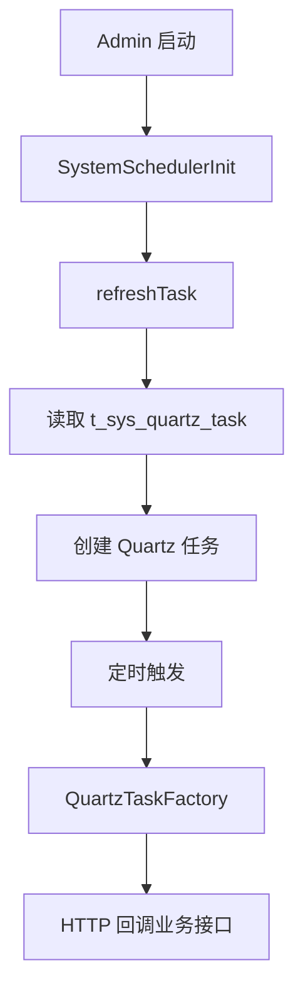
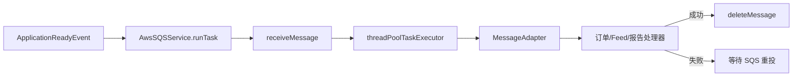
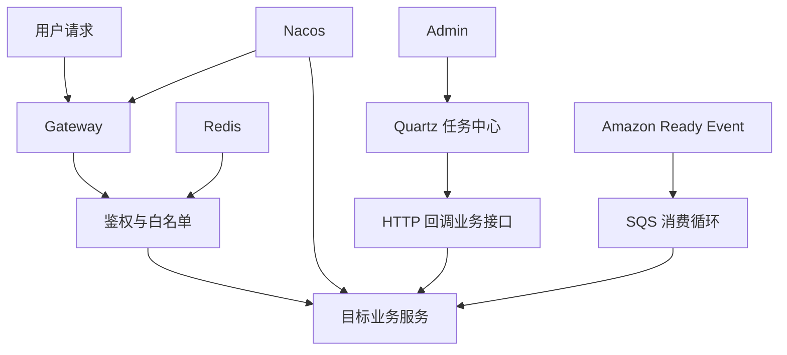

# 02. 运行拓扑与执行机制

## 2.1 目标

本篇说明业务执行是如何被系统驱动起来的，重点回答以下问题：

1. 请求如何进入系统。
2. 权限如何生效。
3. 任务如何自动执行。
4. 异步通知如何进入业务链。
5. 配置中心、缓存和调度器如何影响业务执行。

## 2.2 启动与配置装载

系统各服务都依赖 Nacos 进行服务发现和配置读取。业务服务启动后，会加载共享配置、注册自己、装配 Feign、事务和缓存能力。

### 关键启动类

- Gateway：`GatewayApplication`
- Admin：`AdminApplication`
- Amazon：`AmazonApplication`
- Amazon Adv：`AmazonAdvApplication`
- ERP：`ERPApplication`

### 业务意义

- Gateway 启动后，统一路由和鉴权开始生效。
- Admin 启动后，权限缓存和任务中心开始装载。
- Amazon 启动后，Ready 事件会拉起 SQS 消费。
- Amazon Adv 启动后，可以被任务中心调度广告读取任务。

## 2.3 Gateway：统一入口与统一鉴权

Gateway 是所有业务请求的统一入口。它不只是转发请求，还承担了白名单放行、token 校验、权限规则读取和用户信息透传。

### 路由来源

系统路由主要由 Nacos 中的 `wimoor-gateway` 配置定义，使用 Path 前缀转发到各微服务。

业务效果是：

- `/admin/**` 进入 Admin
- `/erp/**` 进入 ERP
- `/amazon/**` 进入 Amazon
- `/amazonadv/**` 进入 Amazon Adv
- 其他模块按各自路径前缀进入对应服务

### 权限模型

Gateway 会读取白名单并对其余 URL 做 token 校验。鉴权逻辑依赖 Redis 中的 URL 对应角色列表，因此权限不是静态写在网关里的，而是由 Admin 动态维护后同步到缓存中。

### 透传模型

在 token 校验通过后，Gateway 会向下游服务透传用户上下文，供业务服务直接使用，避免每个服务单独重新做登录态解析。

## 2.4 Admin：任务中心与统一调度编排

Admin 模块不仅承担平台治理能力，还承担“自动业务驱动器”的角色。

### 装载流程

1. Admin 启动。
2. `SystemSchedulerInit` 在启动阶段执行 `refreshTask`。
3. 调度服务删除旧任务并重新从数据库任务表装载启用任务。
4. 每条任务根据 `target`、`cron`、`path` 等信息建立 Quartz Job。
5. 任务触发时，`QuartzTaskFactory` 通过 HTTP 请求调用业务接口。

### 业务含义

这意味着系统中的很多批量动作，例如抓单、广告报表读取、快照下载，并不是由服务内部固定时间器执行，而是由平台层的任务配置来驱动。

### 调度总流程图

## 2.5 Amazon：事件驱动与 SQS 消费

Amazon 模块拥有系统中最明确的事件驱动入口。

### 启动驱动

应用 Ready 后，系统启动 SQS 消费线程。关闭应用时，会停止消费线程。

### 消费流程

1. 消费器线程持续轮询 SQS。
2. 每批最多拉取若干消息。
3. 每条消息提交给线程池处理。
4. 消息适配器按 NotificationType 决定路由目标。
5. 对应 Handler 处理成功后删除消息。
6. 处理失败则不删除，依赖 SQS 重试。

### 业务含义

Amazon 订单状态刷新、部分异步补偿和平台通知同步，并不依赖用户主动操作，而是由这条事件主线异步驱动。

### 异步消费流程图

## 2.6 线程池与分散异步

Amazon 模块内部还存在大量 `threadPoolTaskExecutor` 和 `new Thread` 调用。这说明：

- 某些业务动作不是严格串行。
- 追踪完整执行链时，需要同时关注控制器线程、线程池线程和消息线程。
- 对失败补偿、日志追踪和幂等校验提出更高要求。

## 2.7 运行态依赖

### Nacos

负责服务注册和配置中心，决定路由、数据库参数、白名单、共享配置等是否正确装载。

### Redis

负责登录态和权限规则缓存，是 Gateway 实时鉴权的决策依赖。

### Quartz

负责按任务表调度批处理业务，是自动化业务执行的中枢。

### MySQL

各业务域都有自己的库表，状态机的大多数权威定义都来自 DDL 注释。

### Seata

配置存在，但并非所有链路都依赖它，更多是作为分布式事务能力预留。

## 2.8 系统级执行骨架图

## 2.9 文档结论

系统执行骨架可以概括为一句话：

Wimoor 的业务不是只靠 Controller 同步执行，而是由 Gateway 的统一准入、Admin 的任务调度、Amazon 的事件消费和各服务内部状态机共同驱动。
