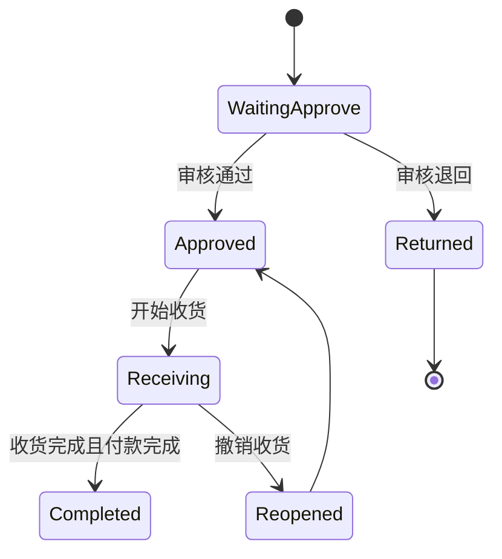
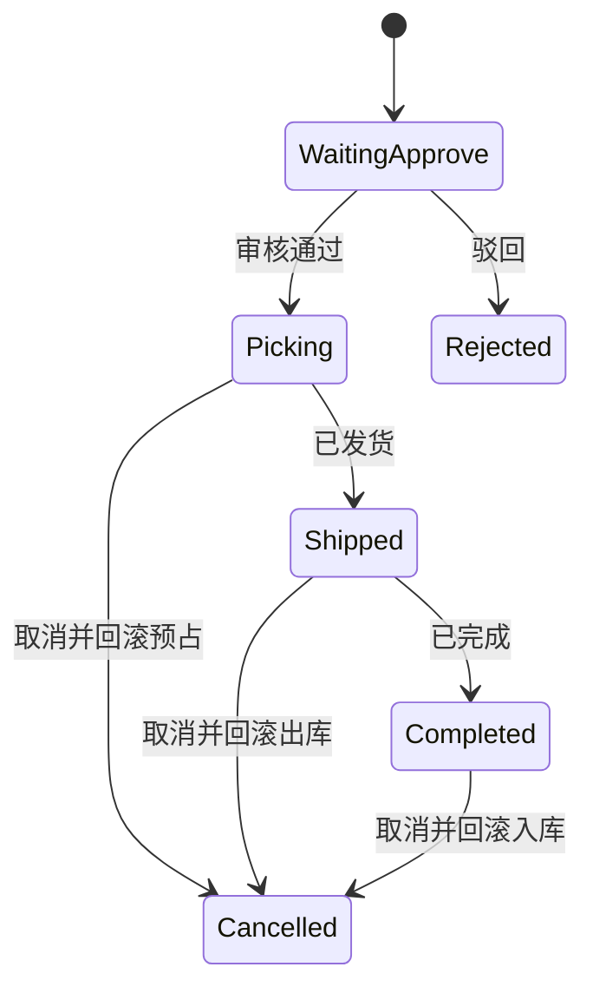
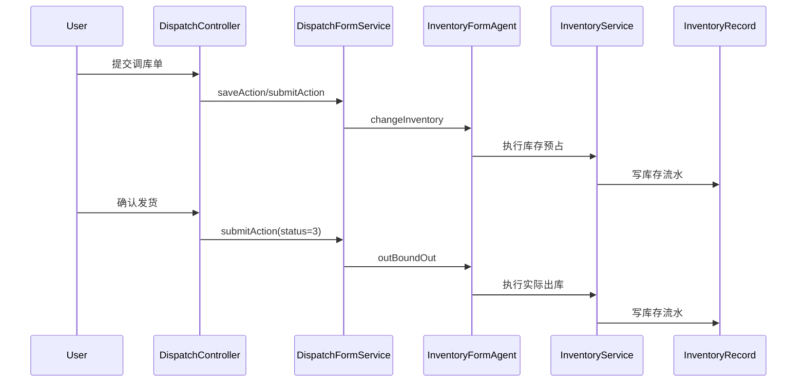
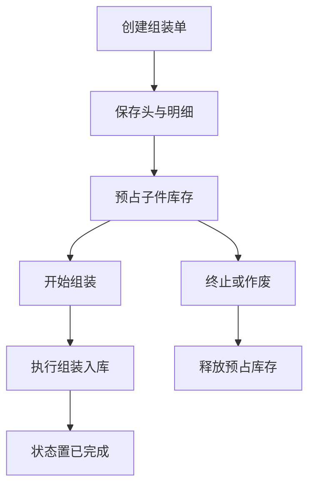
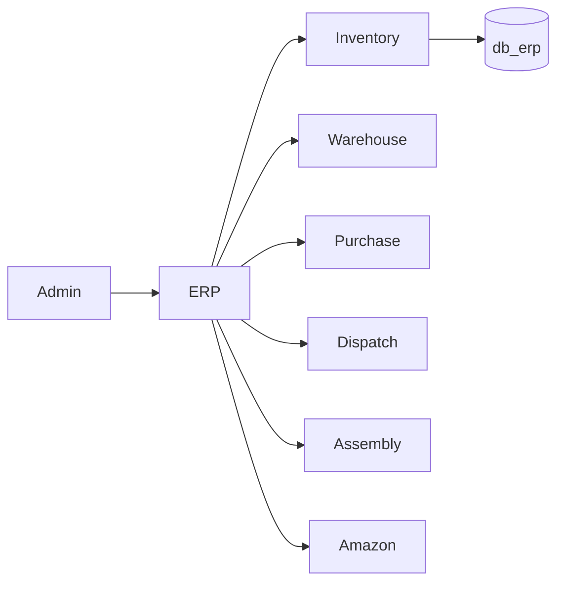

# 03. ERP 供应链业务分析

## 3.1 业务定位

ERP 模块承担供应链执行主线，是系统内部“实物流、库存流、单据流”的核心。业务上覆盖采购、库存、仓库、调库、组装、其他出入库和订单计划等能力。

## 3.2 领域划分

### 采购域

负责采购单、采购单明细、收货与付款关联状态。

### 库存域

负责库存当前量、库存准备量和库存流水。

### 仓库域

负责仓库、库位、库位库存组织。

### 调库域

负责本地调库、海外仓调库和 SKU 互调。

### 组装域

负责组装单、组装明细和组装入库。

### 其他出入库域

负责非采购、非调库、非组装场景的直接入库和直接出库。

## 3.3 核心业务对象

### 采购对象

- 采购头：`t_erp_purchase_form`
- 采购明细：`t_erp_purchase_form_entry`
- 收货轨迹：`t_erp_purchase_form_receive`

### 库存对象

- 当前库存：`t_erp_inventory`
- 库存流水：`t_erp_inventory_record`

### 调库对象

- 本地调库头：`t_erp_dispatch_form`
- 本地调库明细：`t_erp_dispatch_form_entry`
- 调库轨迹：`t_erp_dispatch_form_record`
- 海外仓调库头：`t_erp_dispatch_oversea_form`
- 海外仓调库明细：`t_erp_dispatch_oversea_form_entry`

### 组装对象

- 组装头：`t_erp_assembly_form`
- 组装明细：`t_erp_assembly_form_entry`
- 组装入库：`t_erp_assembly_from_instock`

## 3.4 采购流程

采购的状态主体是采购明细，不是采购头。其业务主线如下：

1. 创建采购单并按供应商拆分明细。
2. 采购明细进入待审核。
3. 审核通过后初始化待入库、待付款状态。
4. 收货与付款分别推进并行状态。
5. 当收货和付款都满足完成条件时，采购明细进入已完成。
6. 如果审核驳回或收货撤销，则回退状态并保留操作轨迹。

### 采购状态图

## 3.5 调库流程

调库是 ERP 中最典型的状态机业务之一。本地调库和海外仓调库都遵循“审核前置 + 库存预占 + 实际出库 + 到货入库 + 回滚补偿”的模式。

### 业务动作矩阵

- 审核通过：预占库存。
- 已发货：将库存从可售转入出库执行状态。
- 已完成：将目标库存转入可售。
- 驳回或取消：按当前阶段执行反向库存补偿。

### 调库状态图

### 调库时序图

## 3.6 组装流程

组装流程的核心是预占子件库存、执行组装入库、以及在终止或作废时做反向释放。它与采购和调库不同，更强调物料结构与库存消耗之间的关系。

### 主线步骤

1. 保存组装单和子件明细。
2. 对子件库存做预占。
3. 启动组装。
4. 生成组装入库记录。
5. 完成后更新状态。
6. 如果终止或作废，则释放已预占资源并停止后续动作。

### 组装流程图

## 3.7 库存引擎

ERP 的底层执行能力实际上集中在库存引擎，而不是任何单据控制器中。库存状态被抽象成三态：

- inbound：待入库
- fulfillable：可售
- outbound：待出库或出库中

各种业务流程本质上都在驱动这三种库存状态之间的数量转移。

### 库存引擎的业务作用

- 采购收货使库存进入 inbound 或 fulfillable。
- 调库先从源仓做预占和出库，再在目标仓做入库。
- 组装通过消耗子件和入库成品改变结构性库存。
- 其他入库和其他出库是直接调用库存能力的简单流程。

## 3.8 供应链上下文图

## 3.9 风险点

- 部分状态定义集中度不一致，例如海外仓调库有明确状态名函数，但本地调库的状态命名分散在控制器与服务逻辑中。
- 组装状态在 DDL 和部分 Java 展示函数间存在轻微不一致，需要以后统一为单一状态字典。
- 供应链流程的库存副作用很多，任何单据状态机分析都必须同时参考库存流水，而不能只看单据状态本身。
