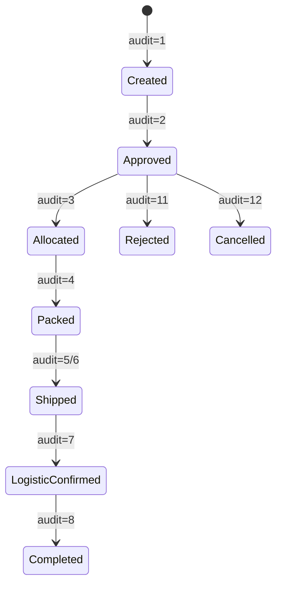
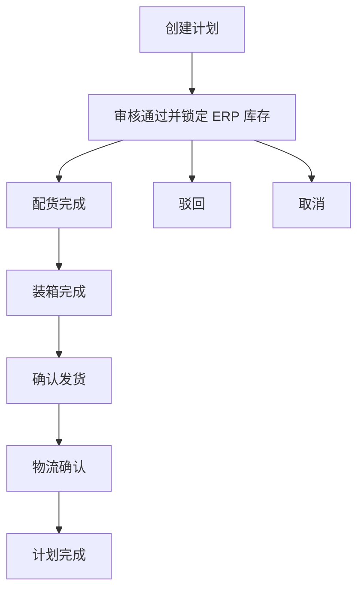
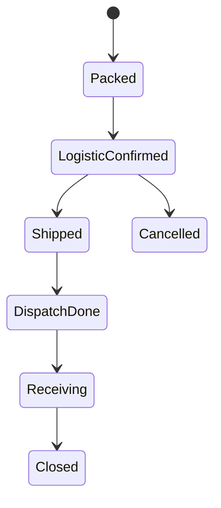
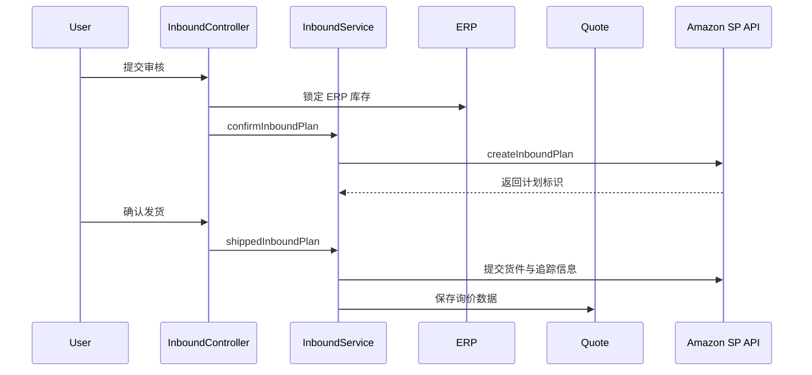
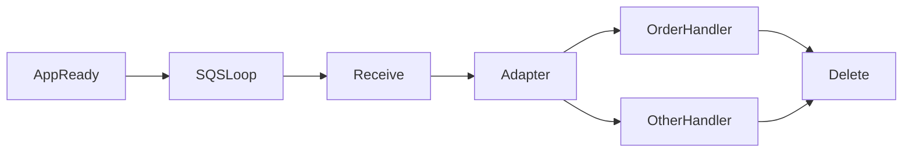

# 04. Amazon 履约业务分析

## 4.1 业务定位

Amazon 模块负责店铺前台商品运营和交易履约执行，是系统连接 Amazon 平台、ERP 供应链、报价服务和财务数据的重要中枢。

## 4.2 领域划分

### 商品与 Listing 域

负责商品资料、标题描述获取、状态刷新和页面侧维护。

### 订单履约域

负责抓取订单主单、订单明细、订单状态变更和发货进度。

### 入库计划域

负责 FBA 入库计划从创建、审核、配货、装箱、发货到完成的主流程。

### 货件执行域

负责货件级装箱、追踪号、物流确认和平台回传状态。

### 事件通知域

负责通过 SQS 消费 Amazon 通知，驱动订单或其他对象的异步同步。

## 4.3 核心业务对象

- 商品对象：`t_product_info`
- 订单主单：`t_amz_order_main`
- 订单明细：`t_amz_order_item`
- 入库计划：`t_erp_ship_v2_inboundplan`
- 入库货件：`t_erp_ship_v2_inboundshipment`
- 入库明细：`t_erp_ship_v2_inbounditem`
- 货件状态轨迹：`t_erp_ship_v2_inbound_record`

## 4.4 Listing 与商品流程

Listing 流程是相对轻状态机的业务。用户可以发起保存、刷新、删除等动作，服务侧通过 SP-API 获取远端数据并回写本地对象。

业务重点不在复杂状态流转，而在“平台数据拉取 + 本地缓存更新 + 异常处理”。

## 4.5 订单流程

订单履约的基本链路如下：

1. 控制器触发抓单或刷新。
2. 订单服务调用 Amazon Orders API 拉取订单主信息。
3. 主单写入本地订单表。
4. 明细服务补抓订单项。
5. 异步通知到达后，根据变更内容更新本地订单状态与发货数量。

### 订单业务含义

订单模块既支持手工触发，也支持事件驱动刷新，因此它是请求驱动与事件驱动叠加最明显的业务域之一。

## 4.6 入库计划 V2

入库计划 V2 是 Amazon 履约中最关键的状态机。它同时连接 ERP 库存、货件执行和报价链路。

### 主线步骤

1. 创建入库计划。
2. 审核通过并锁定 ERP 出库库存。
3. 完成配货。
4. 完成装箱。
5. 确认发货。
6. 物流确认。
7. 完成计划。
8. 在异常情况下执行驳回或取消。

### 入库计划状态图

### 入库计划流程图

## 4.7 货件执行流程

货件是入库计划下的子执行对象，其状态通常比计划更贴近物流现实。货件会经历装箱完成、物流确认、已发货、处理中、接收中、已关闭等状态变化，并且平台回传状态会反向更新本地状态。

### 货件状态图

## 4.8 入库计划跨模块协作

Amazon 入库计划不是独立流程，它至少和两个模块发生直接协作：

- 与 ERP：审核通过时锁定出库库存，执行货件过程时持续依赖库存与发货信息。
- 与 Quote：在货件阶段可以将询价请求写入 Quote，扩展出物流报价流程。

### 跨模块时序图

## 4.9 SQS 异步通知

Amazon 异步通知是订单和部分平台状态同步的重要入口。其业务价值在于：

- 减少纯轮询带来的延迟。
- 在订单状态变化时及时更新本地视图。
- 将平台事件接入本地履约执行链。

### 异步消费图

## 4.10 风险点

- 入库计划部分状态值在 SQL 注释和代码实际使用之间存在扩展关系，文档必须以真实控制器推进逻辑补足状态含义。
- 发货阶段存在异步线程处理，失败时更多是记录 remark 或日志，补偿机制应继续增强。
- Amazon 履约涉及 ERP、Quote、SP-API、SQS 多方协作，是跨模块耦合最强的域之一。
