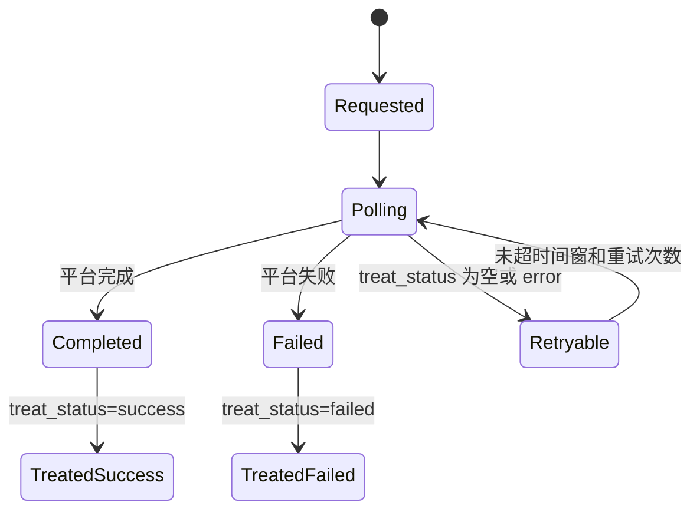
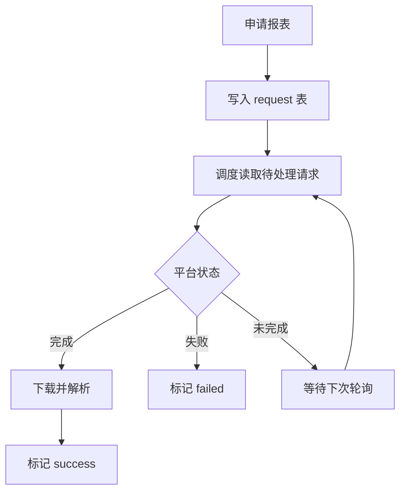
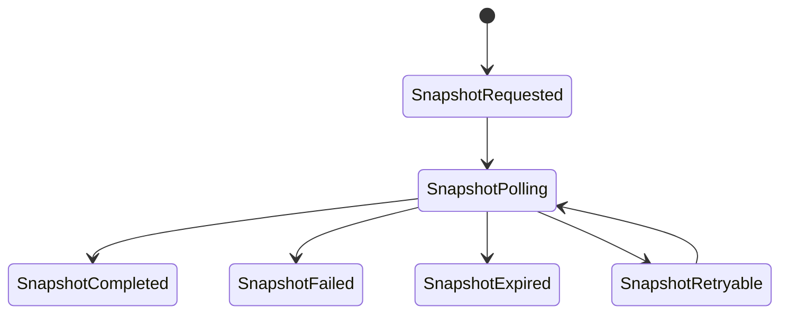
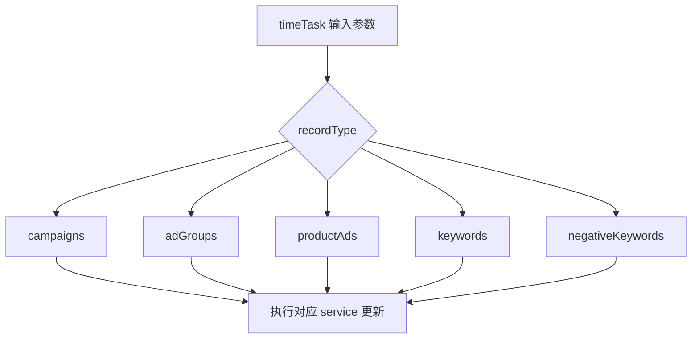
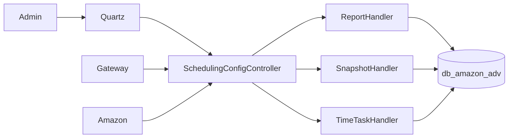

# 05. Amazon 广告与调度业务分析

## 5.1 业务定位

Amazon 广告模块负责广告活动管理、广告报表抓取、快照导出和时间任务执行。它的核心特征不是单纯管理广告对象，而是围绕异步任务生命周期组织业务流程。

## 5.2 领域划分

### 活动管理域

负责 Campaign、Ad Group、Product Ads、Keywords 等对象的列表查询、详情、创建和更新。

### 报表请求域

负责向平台申请广告报表、轮询报表状态、下载并解析结果。

### 快照处理域

负责申请快照、轮询结果、下载文件并沉淀业务数据。

### 调度计划域

负责保存时间任务计划，根据 recordType 对活动、广告组、关键词等对象执行变更。

## 5.3 核心业务对象

- 广告报表请求：`t_amz_adv_report_request`
- 广告报表类型配置：`t_amz_adv_report_request_type`
- 广告快照：`t_amz_adv_snapshot`
- 调度计划：`t_amz_adv_schedule_plan`
- 调度计划项：`t_amz_adv_schedule_planitem`
- 调度计划数据：`t_amz_adv_schedule_plandata`

## 5.4 广告活动管理

活动管理是广告模块中最同步的一部分。用户通过控制器查看活动、查看详情、创建或更新活动。它面向前台运营操作，更多是管理入口，而不是复杂状态机。

## 5.5 报表请求与读取流程

广告报表链的核心逻辑是：

1. 申请报表请求。
2. 将请求写入请求表。
3. 后续任务读取待处理请求。
4. 根据平台状态判断是否完成。
5. 完成后下载并解析结果。
6. 根据处理结果写入 success、failed 或 error。

### 报表生命周期状态图

### 报表流程图

## 5.6 快照处理流程

快照链路与报表类似，但会额外受到过期时间和更短重试窗口约束。

### 快照生命周期状态图

## 5.7 调度计划与时间任务

广告调度的核心不是单次接口，而是“计划对象 + 计划项 + 执行器”三层结构。

### 执行逻辑

1. 计划定义目标对象、时间策略和参数。
2. 计划项保存具体执行对象。
3. 时间任务处理器读取 recordType。
4. 根据不同 recordType 分发到 campaign、adGroup、productAds、keywords、negativeKeywords 等处理分支。

### 时间任务分支图

## 5.8 与系统其他模块的关系

### 与 Gateway

广告服务通过 `/amazonadv/**` 路由进入，是统一网关暴露的标准微服务之一。

### 与 Admin

广告的报表读取、快照读取和部分任务调度主要依赖 Admin Quartz 通过 HTTP 回调来触发，因此广告模块的批处理节奏实际上受平台任务中心控制。

### 与 Amazon 主业务

Amazon 主业务可通过 Feign 调用广告服务，获取部分广告相关统计或协同数据。这意味着广告域虽然独立，但并非完全孤立。

## 5.9 广告业务上下文图

## 5.10 风险点

- 报表和快照处理强依赖重试计数、运行锁和时间窗，应重点监控积压与失败率。
- 部分计划服务功能未完全收敛，文档应区分“当前实现”与“目标设计”。
- 广告模块的主要复杂度来自异步生命周期，而不是单次业务接口复杂度。
