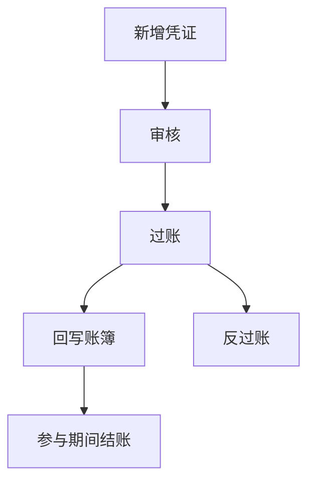
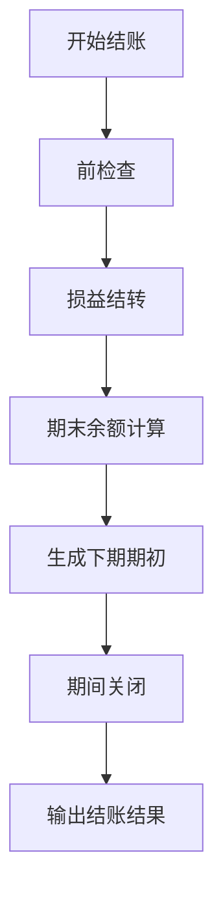
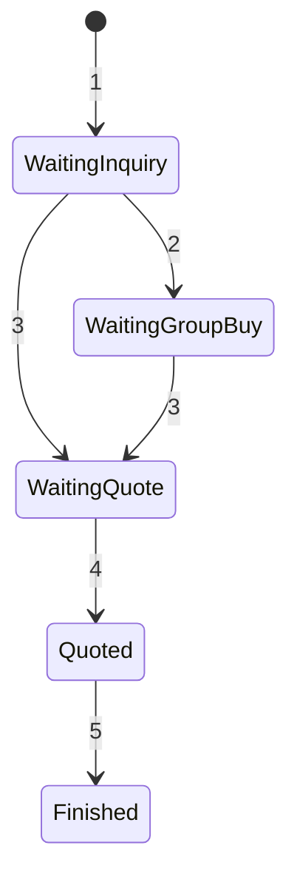
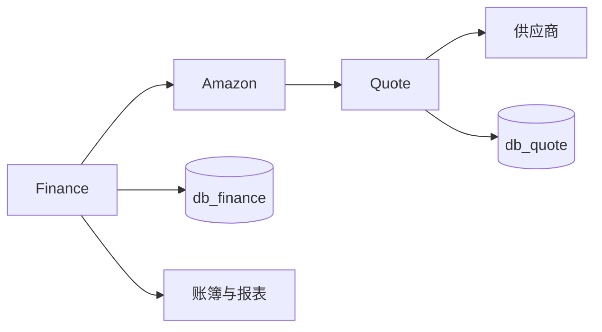

# 06. 财务与报价业务分析

## 6.1 业务定位

财务与报价是全系统分析中的补齐层。财务提供经营核算闭环，报价负责将物流询价和供应商报价接入履约链路，二者共同支撑“业务执行结果”向“经营决策结果”的转化。

## 6.2 财务业务域

### 凭证域

负责凭证新增、审核、过账、反过账、修改和删除。

### 账簿域

负责凭证过账后的账簿回写和余额聚合。

### 期间域

负责会计期间开启、关闭和反关闭。

### 结账域

负责前检查、损益结转、期末计算、下期期初和反结账。

### 编码规则与报表域

负责会计编码规则与报表模板管理。

## 6.3 报价业务域

### 询价单域

负责货件、目的地、询价单头信息。

### 订单供应商域

负责询价单和供应商之间的状态协同。

### 供应商报价域

负责供应商提交报价、记录价格与确认结果。

## 6.4 财务凭证主线

财务凭证流程是系统中最规范的状态机之一。其主线如下：

1. 新增凭证。
2. 审核凭证。
3. 过账到总账和明细账。
4. 如有需要执行反过账。
5. 作废或删除须受期间状态约束。

### 凭证流程图

## 6.5 财务期间与结账

结账流程不只是状态切换，而是一条严格的业务编排链：

1. 检查是否存在未过账凭证。
2. 初始化结账上下文。
3. 执行损益结转。
4. 计算期末余额。
5. 生成下期期初。
6. 更新期间状态。
7. 输出结果与报告。

### 结账流程图

## 6.6 报价单主线

报价流程连接 Amazon 货件与供应商报价，是外部物流协同的入口。

### 主线步骤

1. 创建询价单。
2. 发单给供应商。
3. 供应商提交报价。
4. 买家确认价格。
5. 报价单与供应商关系结束。

### 报价状态图

## 6.7 Amazon 与 Quote 的联动

报价业务并不是孤立存在。Amazon 入库货件在部分场景会把询价数据写入 Quote，因此报价单是履约流程的延伸，不只是采购辅助工具。

### 联动含义

- Amazon 履约产生货件。
- 货件可能触发报价请求。
- Quote 管理供应商报价与确认。
- 最终报价结果反过来影响履约成本与经营决策。

## 6.8 财务与 Amazon 的边界

财务模块会读取 Amazon 组织和站点相关信息，用于期间初始化和核算边界划分。这个关系说明财务虽然独立，但口径划分依赖平台侧组织结构。

## 6.9 财务与报价上下文图

## 6.10 风险点

- 财务凭证和期间状态在 SQL 与 Java 中存在个别语义不完全一致的地方，后续应统一状态字典。
- 报价流程依赖业务发单与供应商操作，适合补充更多审计轨迹和通知机制。
- 财务与 Amazon 组织口径绑定后，组织结构调整可能影响核算边界。
