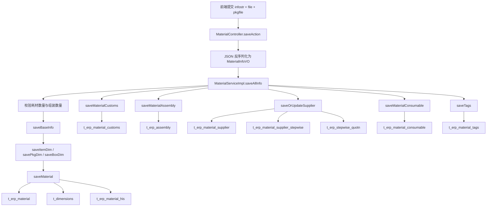
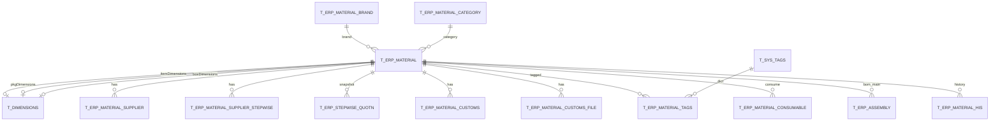
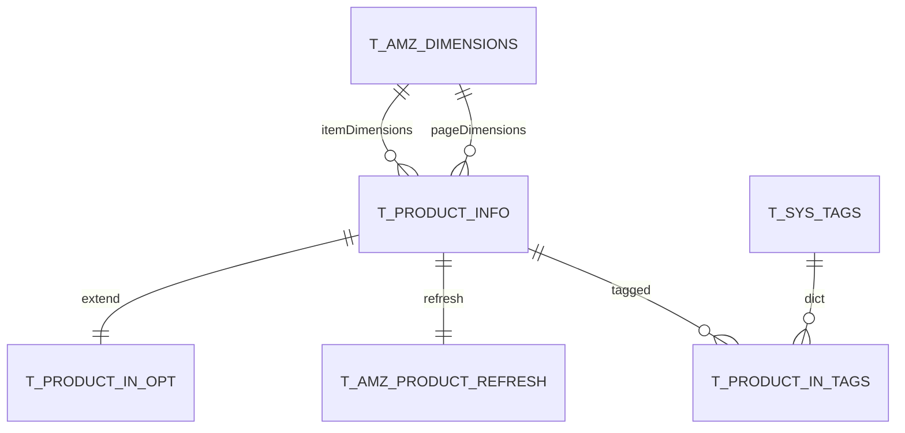
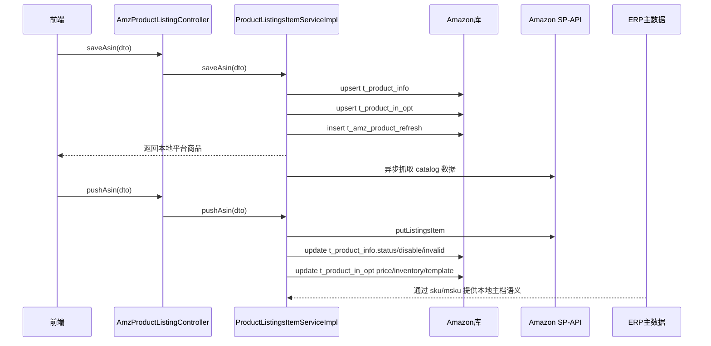
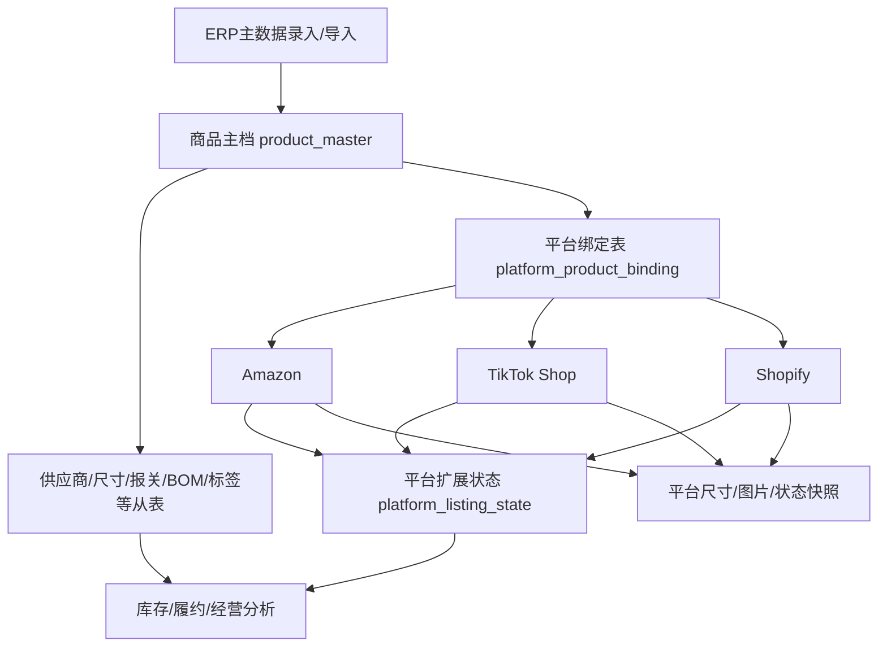

# 09. 商品基础资料与主数据业务分析

## 1. 结论先说

本项目里的商品基础资料不是由 Amazon 平台侧主导，而是由 ERP 的 material 领域主导。

最核心的结论有 6 个：

1. 商品主数据主表是 `db_erp.t_erp_material`，它承载本地 SKU、名称、负责人、默认供应商、价格、尺寸引用、分类、品牌、组装属性等核心字段。
2. 商品基础资料的标准进入路径在 ERP：手工保存、Excel 批量导入、图片压缩包导入、批量字段更新、标签维护、归档/恢复。
3. 一次完整的商品保存并不是只写一张表，而是由 `MaterialServiceImpl.saveAllInfo` 统一编排，按顺序落到主表、尺寸表、供应商表、阶梯价表、耗材表、组装关系表、报关表、标签关系表、历史表。
4. Amazon 模块不保存“主档”，而是保存“平台映射与平台扩展”。其核心表是 `db_amazon.t_product_info`、`db_amazon.t_product_in_opt`、`db_amazon.t_amz_product_refresh`、`db_amazon.t_product_in_tags`。
5. ERP 与 Amazon 之间的核心关联键是本地 SKU。Amazon 侧广泛采用 `ifnull(opt.msku, info.sku)` 作为“本地商品标识”，即优先使用 `t_product_in_opt.msku`，回退到 `t_product_info.sku`。
6. 系统里存在“平台反向补主档”机制。Amazon 侧的 `syncProductList` 会把 ERP 中缺失的本地 SKU 反向插入 `t_erp_material`，这说明当前系统为了保证业务不断链，允许平台数据倒灌基础资料。

一句话概括：

`ERP material = 主数据中心`，`Amazon product = 平台商品视图与运营扩展`。

---

## 2. 本文分析范围

本文基于以下源码与 DDL 归纳：

- ERP 商品主数据入口：`wimoor-erp/erp-boot/src/main/java/com/wimoor/erp/material/controller/MaterialController.java`
- ERP 商品主数据编排：`wimoor-erp/erp-boot/src/main/java/com/wimoor/erp/material/service/impl/MaterialServiceImpl.java`
- ERP 供应商与阶梯价编排：`wimoor-erp/erp-boot/src/main/java/com/wimoor/erp/material/service/impl/MaterialSupplierServiceImpl.java`
- ERP Excel 导入：`wimoor-erp/erp-boot/src/main/java/com/wimoor/erp/common/service/impl/ExcelDownLoadServiceImpl.java`
- ERP 图片压缩包导入：`wimoor-erp/erp-boot/src/main/java/com/wimoor/erp/material/service/impl/ZipRarUploadServiceImpl.java`
- Amazon 建品与刷新入口：`wimoor-amazon/amazon-boot/src/main/java/com/wimoor/amazon/product/controller/AmzProductListingController.java`
- Amazon 平台商品保存逻辑：`wimoor-amazon/amazon-boot/src/main/java/com/wimoor/amazon/product/service/impl/ProductListingsItemServiceImpl.java`
- Amazon 与 ERP 映射 SQL：`wimoor-amazon/amazon-boot/src/main/resources/mapper/product/ProductInOptMapper.xml`
- 相关 DDL：`init-config/mysql/数据库结构/db_erp/*.sql`、`init-config/mysql/数据库结构/db_amazon/*.sql`、`init-config/mysql/数据库结构/db_admin/t_sys_tags.sql`

---

## 3. 商品基础资料如何进入系统

### 3.1 手工录入与编辑

最标准的保存入口是 ERP 的：

- `POST /api/v1/material/saveData`
- Controller 方法：`MaterialController.saveAction`
- 服务编排：`MaterialServiceImpl.saveAllInfo`

调用链如下：

这里的关键不是单表保存，而是“以 `MaterialInfoVO` 为载体的一次性聚合保存”。

`MaterialInfoVO` 组合了：

- `material`：主档字段
- `itemDim` / `pkgDim` / `boxDim`：尺寸重量
- `supplierList`：供应商与阶梯价
- `customs`：报关信息
- `assemblyList`：组装 BOM
- `consumableList`：耗材关系
- `taglist`：标签关系

### 3.2 Excel 批量导入

ERP 侧提供多类基础资料导入入口：

- `uploadBaseInfoFile`：商品基础信息导入
- `uploadSupplierFile`：默认供应商导入
- `uploadMoreSupplierFile`：备选供应商导入
- `uploadConsumableFile`：耗材关系导入
- `uploadCustomsFile`：报关资料导入
- `uploadAssemblyFile`：组装清单导入

其中已经直接读到源码的基础信息导入模板字段包括：

- SKU
- 名称
- 采购成本
- 带包装长宽高重
- 净产品长宽高重
- 箱规长宽高重
- 单箱数量
- 品牌名
- 其它费用
- 分类
- 规格
- 备注
- 生效日期
- 负责人

基础信息导入的业务特征：

1. 以 SKU 为幂等键。
2. 先查是否已有 `t_erp_material`。
3. 如已有则更新主档与尺寸引用；如没有则插入新主档。
4. 品牌和分类通过名称反查维表 `t_erp_material_brand`、`t_erp_material_category`。
5. 负责人通过 admin 服务返回的用户映射表做名称到用户 ID 的转换。

### 3.3 图片压缩包导入

图片导入入口在：

- Controller：`ZipRarUploadController`
- Service：`ZipRarUploadServiceImpl.uploadZipOrRar`

它的业务规则非常直接：

1. 上传 zip 文件。
2. 解压到临时目录。
3. 用文件名去掉扩展名后的值作为 SKU。
4. 按 `sku + shopid + isDelete=0` 查找 `t_erp_material`。
5. 找到后把图片上传到物料图片目录并回写 `material.image`。

这说明当前系统对商品图片主档的绑定规则是：`图片文件名必须等于本地 SKU`。

### 3.4 批量字段更新

ERP 还支持：

- `POST /api/v1/material/updateMaterial/{ftype}`

它通过 `MaterialServiceImpl.updateMaterialType` 对商品某类字段做批量更新，属于“主档维护运维入口”，而不是建品入口。

### 3.5 商品归档与恢复

ERP 商品并不直接物理删除，而是支持归档与恢复：

- `GET /api/v1/material/deleteData`
- `GET /api/v1/material/recoverData`

归档前会校验：

- 是否存在未完结采购单
- 如果是耗材，是否还被别的主 SKU 引用
- 如果是组装品/半成品，是否仍被有效 BOM 使用

这说明主数据在系统里是“强业务约束对象”，不是简单字典。

### 3.6 Amazon 平台反向补主档

Amazon 侧有一个容易被忽略但非常关键的入口：

- `ProductInOptMapper.xml` 的 `syncProductList`

它会执行类似逻辑：

1. 从 `t_product_info` + `t_product_in_opt` 聚合出本地商品标识 `ifnull(o.msku, i.sku)`。
2. 左连接 `t_erp_material`。
3. 对 ERP 中不存在的 SKU 自动插入 `t_erp_material`。

这意味着当前系统允许“平台商品先出现，本地主档后补齐”。

从治理角度看，这是一种兜底机制，不应被当作理想主流程。

---

## 4. 商品主数据保存的完整业务逻辑

### 4.1 聚合保存入口：saveAllInfo

`MaterialServiceImpl.saveAllInfo` 是整个商品资料维护的总编排器，业务顺序如下：

1. 校验 `MaterialInfoVO` 是否为空。
2. 校验耗材数量必须大于 0。
3. 校验组装子件数量必须大于 0。
4. trim SKU。
5. 保存基础信息 `saveBaseInfo`。
6. 覆盖保存报关信息 `saveMaterialCustoms`。
7. 覆盖保存组装关系 `saveMaterialAssembly`。
8. 覆盖保存供应商与阶梯价 `saveOrUpdateSupplier`。
9. 覆盖保存耗材关系 `saveMaterialConsumable`。
10. 覆盖保存标签关系 `saveTags`。
11. 返回商品 ID。

这里最重要的设计点是：

- 多个从表都是“先删后写”或“先清后重建”。
- 所以这套接口更像“商品资料聚合根整体覆盖保存”，而不是细粒度 patch。

### 4.2 主档保存：saveMaterial

`saveMaterial` 是真正决定主数据如何落库的方法。

它做了以下事情：

1. 按 `shopid + sku + isDelete=false` 查询已有商品。
2. 如果不存在，则新建 `Material`，并生成 ID。
3. 如果存在但 ID 不一致，报“SKU 已存在”。
4. 如果尝试修改 `issfg` 组装类别，还会校验该物料是否已经进入补货计划，若已进入则禁止修改。
5. 处理图片：
   - 支持复制原图
   - 支持新文件上传
   - 支持包装图单独上传
6. 回填主档字段：价格、其它费用、箱规、附加费、退税率、分类、负责人、SKU、UPC、名称、品牌、规格、备注、物料类型、供货周期、生效日期、组装周期。
7. 回填尺寸引用：`itemdimensions`、`pkgdimensions`、`boxdimensions`。
8. 调 Amazon Feign：如果负责人变化，则同步修改平台商品负责人。
9. 插入或更新 `t_erp_material`。
10. 无论插入还是更新，都写一条 `t_erp_material_his` 历史记录。

### 4.3 尺寸处理：saveDim

本地主档尺寸保存在 `t_dimensions`，不是直接平铺到 `t_erp_material`。

处理规则是：

1. 如果长宽高重都为空，则删除旧尺寸引用。
2. 如果长宽高重都为 0，也视为删除尺寸。
3. 如果传入有旧 ID，则更新旧尺寸记录。
4. 如果没有旧 ID，则新增尺寸记录。

这说明尺寸在当前模型中是“可复用的独立实体”，但从业务使用上看，它实际上还是被物料单向引用。

### 4.4 组装品处理：saveMaterialAssembly

组装逻辑使用 `t_erp_assembly` 表表达。

规则如下：

1. 如果当前物料存在主件清单，则当前物料必须是主产品，`issfg=1`。
2. 被引用为子件的物料会被标记为半成品，`issfg=2`。
3. 子件不能再是组合产品，防止 BOM 嵌套失控。
4. 关系保存时会做差量更新：已有的更新，没有的新增，多余的删除。
5. 当某个子件不再被任何主件引用时，会把其 `issfg` 恢复为 `0`。

也就是说，`issfg` 不是单纯手工字段，而是由 BOM 关系反向推导出来的业务状态。

### 4.5 供应商与阶梯价处理：saveOrUpdateSupplier

供应商逻辑比主档字段复杂，因为存在 3 套价格语义：

1. `t_erp_material_supplier`：商品与供应商关系
2. `t_erp_material_supplier_stepwise`：按供应商维护的阶梯价
3. `t_erp_stepwise_quotn`：默认供应商阶梯价快照

保存规则：

1. 先删除当前物料的全部供应商关系。
2. 先删除当前物料的全部供应商阶梯价。
3. 同时清空 `t_erp_stepwise_quotn` 默认阶梯价快照。
4. 遍历提交的 `supplierList`。
5. 对每个供应商写入 `t_erp_material_supplier`。
6. 对每个供应商的阶梯价写入 `t_erp_material_supplier_stepwise`。
7. 如果供应商被标记为默认供应商，则把默认供应商信息冗余回写到 `t_erp_material`：
   - `supplier`
   - `other_cost`
   - `MOQ`
   - `productCode`
   - `purchaseUrl`
   - `delivery_cycle`
   - `badrate`
   - 默认采购价格快照 `t_erp_stepwise_quotn`

这说明 `t_erp_material` 上的供应商相关字段并不是全部供应商信息，而是“默认供应商的冗余投影”。

### 4.6 耗材处理：saveMaterialConsumable

耗材通过 `t_erp_material_consumable` 建模。

规则：

1. 先按 `materialid` 删除旧关系。
2. 再把新耗材清单整批插入。
3. 约束一个主 SKU 对某个耗材 SKU 只允许一条关系。

### 4.7 报关信息处理：saveMaterialCustoms

报关信息通过 `t_erp_material_customs` 存储。

规则：

1. 先按 `materialid` 清空旧报关信息。
2. 再按国家逐条插入。
3. 主键是 `(materialid, country)`。

这意味着同一个商品可以有多国家报关申报信息。

### 4.8 标签处理：saveTags

标签本身来自 admin 库字典表 `t_sys_tags`，商品标签关系保存在：

- ERP：`t_erp_material_tags`
- Amazon：`t_product_in_tags`

ERP 商品保存时会：

1. 先删除当前商品全部标签关系。
2. 把 `taglist` 逗号分隔字符串逐条转成 `mid-tagid` 关系。

### 4.9 历史记录

`saveMaterial` 每次插入或更新主档时，都会复制一份快照到 `t_erp_material_his`。

因此系统的主档追溯是：

- 主表看当前态
- 历史表看变更态

---

## 5. 商品基础资料数据模型

## 5.1 ERP 侧主数据模型

### 5.1.1 主表：t_erp_material

用途：本地商品主档。

主键与约束：

- 主键：`id`
- 唯一键：`(sku, shopid)`

字段结构：

| 字段 | 类型 | 说明 |
| --- | --- | --- |
| id | bigint unsigned | 商品 ID |
| sku | varchar(50) | 本地 SKU |
| name | varchar(500) | 商品名称 |
| shopid | bigint unsigned | 公司 ID |
| upc | char(30) | 条码 |
| brand | char(50) | 品牌 ID |
| image | bigint unsigned | 主图 |
| pkgimage | bigint unsigned | 包装图 |
| itemDimensions | bigint unsigned | 产品尺寸引用 |
| pkgDimensions | bigint unsigned | 带包装尺寸引用 |
| boxDimensions | bigint unsigned | 箱规尺寸引用 |
| boxnum | int unsigned | 单箱数量 |
| specification | varchar(100) | 规格 |
| supplier | bigint unsigned | 默认供应商 |
| badrate | float | 不良率 |
| vatrate | float | 退税率 |
| productCode | char(36) | 默认供应商产品编码 |
| delivery_cycle | int | 默认供应商供货周期 |
| other_cost | decimal(10,2) | 其它成本 |
| MOQ | int unsigned | 起订量 |
| purchaseUrl | varchar(1000) | 默认供应商采购链接 |
| remark | varchar(2000) | 备注 |
| categoryid | bigint unsigned | 分类 |
| issfg | char(1) | 0 单独成品，1 组装成品，2 半成品 |
| color | char(10) | 颜色 |
| owner | bigint unsigned | 负责人 |
| operator | bigint unsigned | 操作人 |
| opttime | datetime | 操作时间 |
| price | decimal(10,2) | 价格 |
| price_wavg | decimal(10,2) | 加权价格 |
| price_ship_wavg | decimal(10,2) | 加权运费 |
| addfee | decimal(10,2) | 附加费 |
| createdate | datetime | 创建时间 |
| creator | bigint unsigned | 创建人 |
| effectivedate | datetime | 生效日期 |
| isSmlAndLight | bit(1) | 是否轻小 |
| assembly_time | int | 组装周期 |
| isDelete | bit(1) | 是否归档 |
| mtype | int | 物料类型，常见为成品/耗材/包材 |

### 5.1.2 尺寸表：t_dimensions

用途：ERP 商品尺寸实体。

| 字段 | 类型 | 说明 |
| --- | --- | --- |
| id | bigint unsigned | 尺寸 ID |
| length | decimal(15,2) | 长 |
| length_units | char(15) | 长单位 |
| width | decimal(15,2) | 宽 |
| width_units | char(15) | 宽单位 |
| height | decimal(15,2) | 高 |
| height_units | char(15) | 高单位 |
| weight | decimal(15,2) | 重量 |
| weight_units | char(15) | 重量单位 |

### 5.1.3 品牌维表：t_erp_material_brand

| 字段 | 类型 | 说明 |
| --- | --- | --- |
| id | char(36) | 品牌 ID |
| name | char(100) | 品牌名 |
| shopid | bigint unsigned | 公司 ID |
| remark | varchar(500) | 备注 |
| opttime | datetime | 修改时间 |
| operator | bigint unsigned | 操作人 |

### 5.1.4 分类维表：t_erp_material_category

| 字段 | 类型 | 说明 |
| --- | --- | --- |
| id | bigint unsigned | 分类 ID |
| name | char(100) | 分类名 |
| number | char(50) | 分类编号 |
| color | char(10) | 颜色 |
| shopid | bigint unsigned | 公司 ID |
| remark | varchar(500) | 备注 |
| opttime | datetime | 修改时间 |
| operator | bigint unsigned | 操作人 |

### 5.1.5 商品供应商关系：t_erp_material_supplier

用途：一个商品可绑定多个供应商。

主键与约束：

- 主键：`id`
- 唯一键：`(materialid, supplierid)`

字段结构：

| 字段 | 类型 | 说明 |
| --- | --- | --- |
| id | bigint unsigned | 关系 ID |
| materialid | bigint unsigned | 商品 ID |
| supplierid | bigint unsigned | 供应商 ID |
| purchaseUrl | varchar(1000) | 采购链接 |
| productCode | char(36) | 采购编码 |
| specId | char(36) | 规格 ID |
| offerid | char(36) | 报价单 ID |
| otherCost | decimal(10,2) | 其它成本 |
| deliverycycle | int | 发货周期 |
| isdefault | bit(1) | 是否默认供应商 |
| badrate | float | 不良率 |
| MOQ | int | 起订量 |
| creater | bigint unsigned | 创建人 |
| createdate | datetime | 创建时间 |
| remark | varchar(500) | 下单备注 |
| operator | bigint unsigned | 修改人 |
| opttime | datetime | 修改时间 |

### 5.1.6 供应商阶梯价：t_erp_material_supplier_stepwise

用途：按供应商维度维护阶梯采购价。

| 字段 | 类型 | 说明 |
| --- | --- | --- |
| id | bigint unsigned | 主键 |
| materialid | bigint unsigned | 商品 ID |
| supplierid | bigint unsigned | 供应商 ID |
| currency | char(5) | 币种 |
| price | decimal(10,2) unsigned | 阶梯价 |
| amount | int unsigned | 数量阈值 |
| operator | bigint unsigned | 操作人 |
| opttime | datetime | 操作时间 |

### 5.1.7 默认供应商阶梯价快照：t_erp_stepwise_quotn

用途：把默认供应商阶梯价冗余成一份商品维度快照，便于快速读取。

| 字段 | 类型 | 说明 |
| --- | --- | --- |
| id | bigint unsigned | 主键 |
| material | bigint unsigned | 商品 ID |
| amount | int | 数量阈值 |
| price | decimal(10,2) | 价格 |
| operator | bigint unsigned | 操作人 |
| opttime | datetime | 操作时间 |
| oldid | char(36) | 原始记录标识 |

### 5.1.8 报关主表：t_erp_material_customs

用途：同一商品针对不同国家的报关信息。

主键与约束：

- 主键：`(materialid, country)`

字段结构：

| 字段 | 类型 | 说明 |
| --- | --- | --- |
| materialid | bigint unsigned | 商品 ID |
| country | char(2) | 国家 |
| price | decimal(20,6) | 报关价格 |
| code | char(50) | 海关编码 |
| rate | decimal(20,6) | 税率 |
| material | char(50) | 材质英文 |
| materialcn | char(50) | 材质中文 |
| application | char(50) | 用途 |
| url | char(50) | 链接 |
| ename | varchar(500) | 报关英文名 |
| cname | varchar(500) | 报关中文名 |
| operator | bigint unsigned | 操作人 |
| opttime | datetime | 操作时间 |
| creator | bigint unsigned | 创建人 |
| createtime | datetime | 创建时间 |

### 5.1.9 报关附件表：t_erp_material_customs_file

| 字段 | 类型 | 说明 |
| --- | --- | --- |
| id | bigint unsigned | 主键 |
| materialid | bigint unsigned | 商品 ID |
| filename | varchar(500) | 文件名 |
| filepath | varchar(1000) | 文件路径 |
| operator | bigint unsigned | 操作人 |
| creator | bigint unsigned | 创建人 |
| createtime | datetime | 创建时间 |
| opttime | datetime | 操作时间 |

### 5.1.10 商品标签关系：t_erp_material_tags

| 字段 | 类型 | 说明 |
| --- | --- | --- |
| mid | bigint unsigned | 商品 ID |
| tagid | bigint unsigned | 标签 ID |
| operator | bigint unsigned | 操作人 |
| opttime | datetime | 操作时间 |

### 5.1.11 标签字典：t_sys_tags

用途：ERP 与 Amazon 标签体系共用的字典基础。

| 字段 | 类型 | 说明 |
| --- | --- | --- |
| id | bigint unsigned | 标签 ID |
| name | char(100) | 标签名称 |
| value | varchar(200) | 值 |
| sort | int | 排序 |
| color | char(50) | 颜色 |
| taggroupid | bigint unsigned | 标签组 |
| shopid | bigint unsigned | 公司 ID |
| description | varchar(100) | 描述 |
| creator | bigint unsigned | 创建人 |
| operator | bigint unsigned | 修改人 |
| remark | char(200) | 备注 |
| status | tinyint(1) | 状态 |
| gmt_create | datetime | 创建时间 |
| gmt_modified | datetime | 修改时间 |

### 5.1.12 商品耗材关系：t_erp_material_consumable

用途：一个主 SKU 对应多个耗材 SKU。

主键与约束：

- 主键：`id`
- 唯一键：`(materialid, submaterialid)`

字段结构：

| 字段 | 类型 | 说明 |
| --- | --- | --- |
| id | bigint unsigned | 主键 |
| materialid | bigint unsigned | 主商品 ID |
| submaterialid | bigint unsigned | 耗材商品 ID |
| amount | decimal(10,4) unsigned | 单位耗用量 |
| operator | bigint unsigned | 操作人 |
| opttime | datetime | 操作时间 |

### 5.1.13 组装关系：t_erp_assembly

用途：商品 BOM 关系。

主键与约束：

- 主键：`id`
- 唯一键：`(mainmid, submid)`

字段结构：

| 字段 | 类型 | 说明 |
| --- | --- | --- |
| id | bigint unsigned | 主键 |
| mainmid | bigint unsigned | 主产品 |
| submid | bigint unsigned | 子产品 |
| subnumber | int | 子件数量 |
| remark | varchar(200) | 备注 |
| operator | bigint unsigned | 操作人 |
| opttime | datetime | 操作时间 |

### 5.1.14 主档历史：t_erp_material_his

用途：商品主档变更历史快照。

主键与约束：

- 主键：`(id, opttime)`
- 唯一键：`(shopid, sku, opttime)`

字段结构与 `t_erp_material` 高度一致，额外包含：

- `parentid`：用于导入时引用的父记录
- `opttime`：历史快照时间

该表保留了主档的几乎全量快照，是审计和追溯的基础。

## 5.2 Amazon 侧平台商品模型

### 5.2.1 平台商品主表：t_product_info

用途：Amazon 平台商品实体，按账号和站点分开保存。

主键与约束：

- 主键：`id`
- 唯一键：`(amazonAuthId, marketplaceid, sku)`

字段结构：

| 字段 | 类型 | 说明 |
| --- | --- | --- |
| id | bigint unsigned | 平台商品 ID |
| asin | char(36) | ASIN |
| sku | varchar(50) | 平台侧记录里的 SKU |
| marketplaceid | char(36) | 站点 |
| name | varchar(1000) | 标题 |
| openDate | datetime | 创建日期 |
| itemDimensions | bigint unsigned | 商品尺寸引用 |
| pageDimensions | bigint unsigned | 包装尺寸引用 |
| fulfillChannel | varchar(120) | 履约渠道 |
| binding | varchar(50) | 装订/绑定属性 |
| totalOfferCount | int | 卖家数量 |
| brand | varchar(100) | 品牌 |
| manufacturer | varchar(250) | 厂商 |
| pgroup | varchar(50) | 分组 |
| typename | varchar(50) | 类型 |
| price | decimal(14,2) | 价格 |
| image | bigint unsigned | 图片 |
| parentMarketplace | char(36) | 父体站点 |
| parentAsin | char(36) | 父体 ASIN |
| isparent | bit(1) | 是否父体 |
| lastupdate | datetime | 最后更新时间 |
| createdate | datetime | 创建时间 |
| amazonAuthId | bigint unsigned | 授权账号 |
| invalid | bit(1) | 是否失效 |
| oldid | char(36) | 历史标识 |
| inSnl | bit(1) | 是否轻小 |
| fnsku | char(20) | FNSKU |
| pcondition | char(20) | 商品状况 |
| status | char(20) | 平台状态 |
| disable | bit(1) | 是否禁用 |
| refreshtime | datetime | 刷新时间 |

### 5.2.2 平台运营扩展：t_product_in_opt

用途：平台商品的运营、价格、备注、负责人、映射 SKU 等扩展信息。

主键与约束：

- 主键：`pid`，即与 `t_product_info.id` 一一对应

字段结构：

| 字段 | 类型 | 说明 |
| --- | --- | --- |
| pid | bigint unsigned | 平台商品 ID |
| remark | varchar(2000) | 备注 |
| priceremark | varchar(1000) | 价格公告 |
| buyprice | decimal(10,2) | 采购单价/运营价 |
| businessprice | decimal(10,2) | 销售价 |
| businesstype | char(10) | 价格类型 |
| businesslist | varchar(1000) | 价格列表 |
| disable | bit(1) | 是否隐藏/停用 |
| presales | int | 手工预估销量 |
| lastupdate | datetime | 更新时间 |
| remark_analysis | varchar(1000) | 分析备注 |
| msku | varchar(50) | 本地 SKU 映射 |
| fnsku | varchar(100) | FNSKU |
| review_daily_refresh | int | 评论刷新周期 |
| fulfillment_availability | int | 自发货库存 |
| merchant_shipping_group | varchar(50) | 运费模板 |
| profitid | bigint unsigned | 利润方案 |
| status | int unsigned | 运营状态 |
| owner | bigint unsigned | 运营负责人 |
| operator | bigint unsigned | 操作人 |
| lowestprice | decimal(20,6) | 最低限价 |

### 5.2.3 平台刷新任务：t_amz_product_refresh

用途：记录平台商品明细、价格、目录信息的刷新状态。

| 字段 | 类型 | 说明 |
| --- | --- | --- |
| pid | bigint unsigned | 平台商品 ID |
| amazonauthid | bigint unsigned | 授权账号 |
| detail_refresh_time | datetime | 明细刷新时间 |
| price_refresh_time | datetime | 价格刷新时间 |
| catalog_refresh_time | datetime | 目录刷新时间 |
| sku | char(50) | SKU |
| asin | char(50) | ASIN |
| marketplaceid | char(15) | 站点 |
| isparent | bit(1) | 是否父体 |
| notfound | bit(1) | 是否未找到 |

### 5.2.4 平台标签关系：t_product_in_tags

| 字段 | 类型 | 说明 |
| --- | --- | --- |
| pid | bigint unsigned | 平台商品 ID |
| tagid | bigint unsigned | 标签 ID |
| operator | bigint unsigned | 操作人 |
| opttime | datetime | 操作时间 |

### 5.2.5 Amazon 尺寸表：t_amz_dimensions

用途：Amazon 侧目录/包装尺寸快照。

字段结构与 ERP 的 `t_dimensions` 基本同构：

| 字段 | 类型 | 说明 |
| --- | --- | --- |
| id | bigint unsigned | 尺寸 ID |
| length | decimal(15,2) | 长 |
| length_units | char(15) | 长单位 |
| width | decimal(15,2) | 宽 |
| width_units | char(15) | 宽单位 |
| height | decimal(15,2) | 高 |
| height_units | char(15) | 高单位 |
| weight | decimal(15,2) | 重量 |
| weight_units | char(15) | 重量单位 |

---

## 6. ERP 与 Amazon 是如何关联的

### 6.1 关键标识的语义

当前系统里最重要的几个商品标识如下：

| 标识 | 所在表 | 语义 |
| --- | --- | --- |
| id | t_erp_material | ERP 本地主商品 ID |
| sku | t_erp_material.sku | ERP 本地 SKU |
| id / pid | t_product_info.id / t_product_in_opt.pid | Amazon 平台商品 ID |
| sku | t_product_info.sku | Amazon 记录中的 SKU |
| msku | t_product_in_opt.msku | 平台商品映射到 ERP 的本地 SKU |
| asin | t_product_info.asin | Amazon ASIN |
| fnsku | t_product_info.fnsku / t_product_in_opt.fnsku | FNSKU |
| materialid | 多个 ERP/Ship 表 | 业务引用 ERP 商品 ID |

### 6.2 真实映射规则：msku 优先，sku 回退

Amazon 侧 SQL 广泛采用：

- `ifnull(opt.msku, info.sku)`

这意味着：

1. 如果运营明确设置了本地 SKU 映射 `msku`，就以它为准。
2. 如果没有设置 `msku`，就退回平台商品本身的 `sku`。

这条规则实际上定义了 ERP 与 Amazon 的主连接键。

### 6.3 Amazon 建品与刷新逻辑

Amazon 侧建品主要分为两层：

1. 本地先有平台商品记录：`saveAsin`
2. 再调用 SP-API 真正推送 Listing：`pushAsin`

流程如下：

`saveAsin` 的核心行为：

1. 找不到 `t_product_info` 时先建本地平台商品。
2. 同步写 `t_product_in_opt`。
3. 如果有图片 URL，则下载并入库图片。
4. 插入 `t_amz_product_refresh`。
5. 异步触发 `captureCatalogProductSync` 补充目录数据。

`pushAsin` 的核心行为：

1. 如果平台商品本地不存在，先调用 `saveAsin` 补本地记录。
2. 调用 Amazon Listings API 的 `putListingsItem`。
3. 成功后更新 `t_product_info` 的状态和价格。
4. 同步更新 `t_product_in_opt` 的库存、价格、运费模板。

### 6.4 ERP 到 Amazon 的主数据外溢

ERP 保存商品主档时，至少有一个显式外溢动作：

- 如果商品负责人变化，调用 Amazon Feign `updateProductOwner` 同步平台商品负责人。

这说明 ERP 主档对平台商品具有“主导者”角色。

### 6.5 Amazon 到 ERP 的反向补录

Amazon 到 ERP 也存在反向链路：

- `syncProductList` 会把 Amazon 侧已有但 ERP 没有的商品插回 `t_erp_material`

这条链路保证了：

- 订单
- 库存
- 履约
- 报表

不会因为 ERP 主档缺失而完全断链。

但它也带来一个架构问题：平台侧变成了主档来源之一。

---

## 7. 主数据如何被下游业务消费

从源码可以看出，商品主档并不是一个孤立的基础资料模块，而是多个业务域的共同底座。

### 7.1 采购域

消费方式：

- 采购计划、采购单、供应商报价都以 `materialid` 或 `sku` 为核心键。
- 默认供应商、MOQ、供货周期、采购链接、产品编码直接来自 `t_erp_material` 和 `t_erp_material_supplier`。
- 阶梯价来自 `t_erp_material_supplier_stepwise` 与 `t_erp_stepwise_quotn`。

### 7.2 库存与仓储域

消费方式：

- 库位库存、在库、待出库、待入库等均建立在本地 SKU 与 materialid 上。
- `materialListCache`、`inventoryByMskuCache` 的缓存失效点覆盖了商品保存、库存调整、耗材变更等操作，说明库存计算强依赖商品主档。

### 7.3 组装域

消费方式：

- `t_erp_assembly` 定义主 SKU 与子 SKU 的 BOM 结构。
- 商品是否为单独成品/组装品/半成品由 BOM 关系反向决定。

### 7.4 Amazon 履约与发货域

消费方式：

- 发货计划、货件、入库明细对象里普遍同时存在 `sku`、`msku`、`materialid`。
- 说明 Amazon 履约链在平台 SKU 与本地 SKU 之间依赖主数据映射。

### 7.5 运营与报表域

消费方式：

- Amazon 商品列表、价格、评论、预估销量、标签、负责人等由 `t_product_info + t_product_in_opt` 表示。
- 但其本地业务识别仍回到 `msku/sku -> ERP material`。

---

## 8. 当前模型的优点与问题

### 8.1 优点

1. 已经形成“本地主档 + 平台扩展”的基本分层。
2. ERP 侧主档足够完整，覆盖了采购、包装、报关、组装、耗材、标签、负责人等信息。
3. Amazon 侧运营数据与平台状态不直接污染 ERP 主档。
4. 主档历史、组装关系、供应商关系都具备可追溯性。

### 8.2 问题

1. 平台反向补录 ERP 主档，说明主数据边界不够严格。
2. `msku` 和 `sku` 的双重语义增加了跨平台扩展成本。
3. ERP `t_dimensions` 与 Amazon `t_amz_dimensions` 是两套尺寸体系，存在重复。
4. 默认供应商信息冗余在 `t_erp_material`，同时又有供应商关系表和阶梯价表，读写一致性依赖服务逻辑保证。
5. 标签字典共用，但 ERP 与 Amazon 各自维护关系表，尚未抽象成统一平台关系模型。

---

## 9. 如果要做成“多平台商品主数据”，应该怎么做

当前模型已经具备雏形，但要真正支持多平台，建议沿着以下方向重构，而不是直接复制 Amazon 这套表。

### 9.1 保留 ERP 作为唯一商品主数据中心

建议原则：

1. ERP `product master` 只接受 ERP 主入口、标准导入入口、审批入口写入。
2. 平台侧不再直接反向插入主档，而是进入“待认领商品池”或“候选映射池”。
3. 平台商品必须先完成本地商品映射，才能进入采购、库存、履约与经营分析链路。

### 9.2 把“平台商品”从 Amazon 专属模型抽象出来

建议抽象成以下层次：

1. `product_master`
   - 一个内部商品唯一 ID
   - 本地 SKU、名称、品牌、分类、负责人、尺寸、包装、BOM、合规资料
2. `product_supplier_binding`
   - 商品与供应商关系
   - 默认供应商、MOQ、交期、阶梯价
3. `product_compliance`
   - 报关、材质、用途、申报价、附件
4. `product_media`
   - 主图、包装图、附件图
5. `platform_product_binding`
   - 平台类型、店铺账号、站点、平台商品 ID、平台 SKU、ASIN/FNSKU 等
6. `platform_listing_state`
   - 平台上架状态、价格、库存模板、运营负责人、备注、刷新时间
7. `platform_dimension_snapshot`
   - 平台抓回来的尺寸快照，独立于 ERP 主尺寸

### 9.3 统一标识体系

建议所有平台都统一为以下标识：

| 标识 | 用途 |
| --- | --- |
| product_id | 内部商品唯一 ID，平台无关 |
| local_sku | 本地 SKU，人可读业务编码 |
| platform | 平台类型，如 Amazon/TikTok/Shopify |
| account_id | 平台授权账号 |
| market_id | 站点/国家/店铺 |
| channel_sku | 平台 SKU |
| listing_id | 平台 Listing 主键 |
| platform_spu | 平台父体/商品组 |

这样可以避免不同平台继续重复发明 `msku`、`sku`、`pid`、`asin` 之间的隐式映射关系。

### 9.4 数据流建议

多平台建议流转如下：

### 9.5 当前代码层可直接复用的设计

当前仓库中最值得保留的做法：

1. 以聚合对象 `MaterialInfoVO` 一次性保存商品全貌。
2. 供应商、BOM、耗材、报关、标签等从表与主档分离。
3. 主档历史表保留全量快照。
4. 平台商品采用“主档 + 扩展”两层模型。

最应该避免直接复制的做法：

1. 平台反向写 ERP 主档。
2. 默认供应商字段在多个表间强冗余。
3. 通过 `msku` 优先、`sku` 回退维持长期映射。

---

## 10. 最终结论

如果你要把本项目的商品基础资料能力推广到多平台，正确理解应该是：

1. 现有系统已经有商品主数据雏形，中心就在 ERP 的 material 领域。
2. Amazon 模块本质是平台商品扩展层，而不是商品主档中心。
3. 现有代码最大价值是已经把商品拆成了：主档、尺寸、供应商、报关、耗材、组装、标签、历史、平台扩展。
4. 真正要做多平台时，应把 Amazon 专属表抽象成统一 `platform binding + listing state + snapshot` 模型，让 ERP 主档成为唯一事实来源。
5. 当前允许平台反向补主档的机制，只适合过渡期兜底，不适合作为多平台长期架构。

如果继续往下拆，下一步最值得单独梳理的是 3 条链：

1. 商品主档如何驱动采购计划与补货。
2. 本地 SKU 与平台 SKU/MSKU 在订单和库存链里如何映射。
3. BOM、耗材、报关资料如何在发货和合规链路里参与计算。