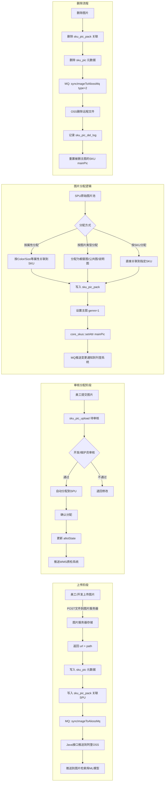
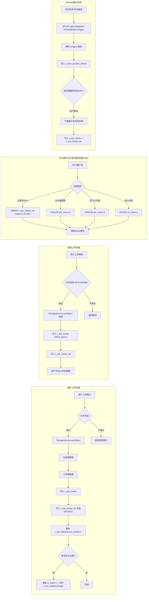
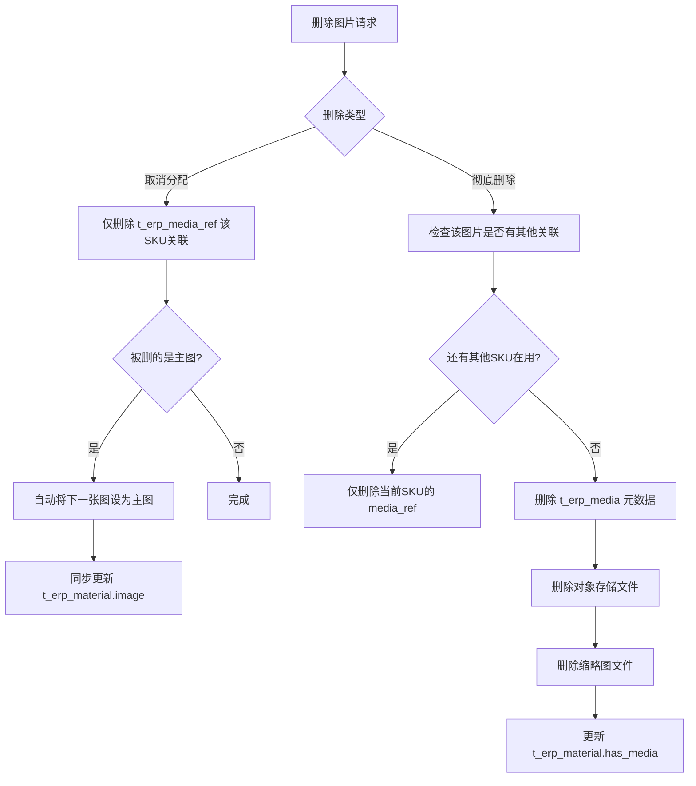

# 11. 商品图片视频存储与流转设计方案

> 版本：v1.0  日期：2026-05-28  
> 基于 PDM 基础资料系统图片/视频管理架构调研，结合 Wimoor ERP 现有能力规划

---

## 一、PDM 系统图片/视频架构调研总结

### 1.1 PDM 数据模型（核心表结构）

PDM 系统采用**「图片/视频 + 关联包」**的两表分离设计，实现了媒体资源与商品的多对多复用关系。

#### 图片核心表

```
┌─────────────────────────────────────────────────────────────┐
│ sku_pic（图片元数据表）                                       │
├─────────────────────────────────────────────────────────────┤
│ picId      VARCHAR(42)  PK   -- 图片唯一ID（文件名去扩展名）    │
│ picType    INT               -- 图片用途类型                  │
│            10=参考图 20=授权图 30=原图 40=成品图               │
│            60=橱窗图 70=公共图 80=认证资料图                   │
│            90=说明图 100=说明书 110=暂停销售图                 │
│ mark       VARCHAR           -- 数据空间标识（base/ebayUs等）  │
│ genre      INT               -- 图片来源种类                  │
│            1=引用图 2=自拍图 3=白底图                          │
│ url        VARCHAR           -- 图片服务器根域名               │
│ path       VARCHAR           -- 相对存储路径                   │
│ name       VARCHAR           -- 图片原始文件名                 │
│ createUser VARCHAR           -- 上传人                        │
│ createTime DATETIME          -- 上传时间                      │
└─────────────────────────────────────────────────────────────┘

┌─────────────────────────────────────────────────────────────┐
│ sku_pic_pack（图片-商品关联表）                                │
├─────────────────────────────────────────────────────────────┤
│ picId      VARCHAR(42)  FK → sku_pic.picId                   │
│ skuId      VARCHAR      FK → 商品SKU/SPU                     │
│ mark       VARCHAR           -- 数据空间                      │
│ genre      INT               -- 排序/主图标记（1=主图,0=普通） │
│ picClass   INT               -- 图片分类                      │
│            1=成品图 2=橱窗图 3=公共图 4=说明图 5=场景图 6=参考图 │
│ 复合PK：(picId, skuId, mark)                                 │
└─────────────────────────────────────────────────────────────┘
```

#### 视频核心表

```
┌─────────────────────────────────────────────────────────────┐
│ sku_video（视频元数据表）                                      │
├─────────────────────────────────────────────────────────────┤
│ vidId      VARCHAR  PK       -- 视频唯一ID（文件名去扩展名）    │
│ vidType    INT               -- 视频用途类型（40=成品视频）     │
│ mark       VARCHAR           -- 数据空间                      │
│ genre      INT               -- 视频种类                      │
│ url        VARCHAR           -- 视频服务器根域名               │
│ path       VARCHAR           -- 相对存储路径                   │
│ name       VARCHAR           -- 视频原始文件名                 │
│ createUser VARCHAR           -- 上传人                        │
│ createTime DATETIME          -- 上传时间                      │
└─────────────────────────────────────────────────────────────┘

┌─────────────────────────────────────────────────────────────┐
│ sku_video_pack（视频-商品关联表）                              │
├─────────────────────────────────────────────────────────────┤
│ vidId      VARCHAR  FK → sku_video.vidId                     │
│ skuId      VARCHAR  FK → 商品SKU/SPU                         │
│ mark       VARCHAR           -- 数据空间                      │
│ vidClass   INT               -- 视频分类                      │
│ genre      INT               -- 排序/主视频标记               │
│ 复合PK：(vidId, skuId, mark)                                 │
└─────────────────────────────────────────────────────────────┘
```

#### 图片上传审核表

```
┌─────────────────────────────────────────────────────────────┐
│ sku_pic_upload（图片上传审核记录表）                           │
├─────────────────────────────────────────────────────────────┤
│ id         INT  PK AUTO      -- 自增主键                     │
│ spu        VARCHAR           -- SPU编码                      │
│ sku        VARCHAR           -- SKU编码                      │
│ imageCate  INT               -- 图片种类（1引用/2自拍/3白底）  │
│ imageList  JSON              -- 图片列表JSON                  │
│ auditState INT               -- 审核状态（0待审/1通过/2不通过）│
│ auditLog   JSON              -- 审核日志JSON                  │
│ allotState INT               -- 分配状态（0未分配/1已分配）    │
│ allotUser  VARCHAR           -- 分配人                        │
│ allotTime  DATETIME          -- 分配时间                      │
│ createUser VARCHAR           -- 上传人                        │
│ uploadTime DATETIME          -- 上传时间                      │
└─────────────────────────────────────────────────────────────┘
```

### 1.2 PDM 业务流转架构



### 1.3 PDM 关键设计亮点

| 设计要点 | 说明 |
|---|---|
| **媒体与商品多对多** | 同一张图可通过 `sku_pic_pack` 关联多个 SKU/SPU，实现一图多用 |
| **SPU 图片池 + SKU 分配** | 图片先上传到 SPU 维度，再按属性/SKU 分配到具体变体 |
| **图片分类体系** | picType（用途：成品/橱窗/公共/说明等） + genre（来源：引用/自拍/白底） + picClass（分配角色） |
| **主图标记在关联表** | `sku_pic_pack.genre=1` 标识主图，同一SKU仅一张主图 |
| **异步 OSS 同步** | 上传/删除通过 Redis MQ 异步推送到阿里 OSS + 图片检索服务 |
| **审核工作流** | 图片上传 → 审核通过 → 分配确认，三步流程保证质量 |
| **缓存策略** | Redis 缓存 `pic_sku::` 前缀，支持分空间缓存，1小时过期 |
| **url + path 分离** | 域名和路径分离存储，方便 CDN 切换和多环境适配 |
| **视频与图片并行** | 视频采用完全对称的 `sku_video` + `sku_video_pack` 结构 |
| **图片侵权管理** | 独立的 `pic_tort_normal_spu` 表管理侵权图片恢复流程 |

### 1.4 PDM 存储路径规则

```
图片存储路径：{年}/{月}/{日}/{SPU编码}/original/{文件名}
  示例: 2026/05/28/CL010889/original/abc123def.jpg

视频存储路径：{年}/{月}/{日}/{SPU编码}/{文件名}
  示例: 2026/05/28/CL010889/product_video.mp4

CDN 完整 URL = url + '/' + path
  示例: https://img.yafex.cn/2026/05/28/CL010889/original/abc123def.jpg
```

---

## 二、Wimoor ERP 现状分析（简要回顾）

| 项目 | 现状 |
|---|---|
| ERP 商品图片 | `t_erp_material.image` / `pkgimage` → `t_picture.id`，仅单主图+单包装图 |
| t_picture 表 | `id, url, location, height, width, opttime` — 简单平铺 |
| Amazon 图片 | 仅同步主图到 `t_product_info.image` → `t_picture` |
| 视频 | 完全缺失 |
| 图片复用 | 无复用机制，ERP/Amazon 各存各的 |
| 多图 Gallery | 无 |
| 审核流程 | 无 |

---

## 三、新架构设计方案

### 3.1 设计原则

1. **借鉴 PDM 的「元数据 + 关联包」分离架构**：实现图片/视频资源与商品的多对多关系
2. **保持 Wimoor 简洁性**：不引入 PDM 的数据空间（mark）、ES 索引等复杂度，适配 Wimoor 的多租户（shopid）模型
3. **保留现有 t_picture 表不变**：向后兼容，新建独立的媒体管理表
4. **统一图片/视频管理**：用一套表结构同时管理图片和视频
5. **对接已有 StorageService**：复用 Wimoor 现有对象存储抽象

### 3.2 数据库设计

#### 3.2.1 媒体资源表（db_erp.t_erp_media）

> 对标 PDM 的 `sku_pic` + `sku_video`，统一为一张媒体元数据表

```sql
CREATE TABLE `t_erp_media` (
  `id`           bigint unsigned NOT NULL COMMENT '主键(Snowflake)',
  `shopid`       varchar(64) NOT NULL COMMENT '企业ID(租户隔离)',
  `media_type`   tinyint NOT NULL DEFAULT 0 
                 COMMENT '媒体类型: 0=图片 1=视频',
  `usage_type`   tinyint NOT NULL DEFAULT 40 
                 COMMENT '用途类型: 10=参考图 30=原图 40=成品图 60=橱窗图 70=公共图 90=说明图 100=场景图',
  `source`       tinyint NOT NULL DEFAULT 1 
                 COMMENT '来源种类: 1=引用图 2=自拍图 3=白底图 4=Amazon同步 5=批量导入',
  `url`          varchar(500) COMMENT '外部原始URL(如Amazon CDN)',
  `location`     varchar(500) COMMENT '对象存储相对路径',
  `thumb_location` varchar(500) COMMENT '缩略图/视频封面存储路径',
  `name`         varchar(255) COMMENT '原始文件名',
  `width`        int COMMENT '宽度px',
  `height`       int COMMENT '高度px',
  `file_size`    bigint COMMENT '文件大小(bytes)',
  `duration`     int COMMENT '视频时长(秒,仅视频)',
  `content_type` varchar(100) COMMENT 'MIME类型(image/jpeg, video/mp4等)',
  `md5`          varchar(32) COMMENT '文件MD5(用于去重)',
  `creator`      varchar(64) COMMENT '上传人',
  `create_time`  datetime NOT NULL DEFAULT CURRENT_TIMESTAMP,
  `update_time`  datetime DEFAULT NULL ON UPDATE CURRENT_TIMESTAMP,
  PRIMARY KEY (`id`),
  KEY `idx_shop` (`shopid`),
  KEY `idx_md5` (`shopid`, `md5`)
) ENGINE=InnoDB DEFAULT CHARSET=utf8mb4 COMMENT='媒体资源元数据表';
```

#### 3.2.2 媒体-商品关联表（db_erp.t_erp_media_ref）

> 对标 PDM 的 `sku_pic_pack` + `sku_video_pack`，实现多对多关联

```sql
CREATE TABLE `t_erp_media_ref` (
  `id`           bigint unsigned NOT NULL COMMENT '主键',
  `media_id`     bigint unsigned NOT NULL COMMENT 'FK → t_erp_media.id',
  `material_id`  bigint unsigned NOT NULL COMMENT 'FK → t_erp_material.id(SPU/SKU)',
  `shopid`       varchar(64) NOT NULL COMMENT '企业ID',
  `ref_type`     tinyint NOT NULL DEFAULT 0 
                 COMMENT '关联类型: 0=SPU级图片池 1=SKU级展示图 2=SKU级主图',
  `pic_class`    tinyint NOT NULL DEFAULT 1 
                 COMMENT '分配角色: 1=成品图 2=橱窗图 3=公共图 4=说明图 5=场景图',
  `sort_order`   int NOT NULL DEFAULT 0 COMMENT '排序(越小越靠前)',
  `is_main`      tinyint NOT NULL DEFAULT 0 COMMENT '是否主图 0=否 1=是',
  `create_time`  datetime NOT NULL DEFAULT CURRENT_TIMESTAMP,
  PRIMARY KEY (`id`),
  UNIQUE KEY `uk_media_material` (`media_id`, `material_id`),
  KEY `idx_material` (`material_id`),
  KEY `idx_shop_material` (`shopid`, `material_id`)
) ENGINE=InnoDB DEFAULT CHARSET=utf8mb4 COMMENT='媒体-商品关联表';
```

#### 3.2.3 Amazon 商品媒体表（db_amazon.t_amz_product_media）

> 独立存储从 Amazon SP-API 同步的 listing 图片/视频

```sql
CREATE TABLE `t_amz_product_media` (
  `id`           bigint unsigned NOT NULL,
  `shopid`       varchar(64) NOT NULL COMMENT '企业ID',
  `authorityid`  varchar(64) NOT NULL COMMENT '授权店铺ID',
  `marketplace_id` varchar(20) NOT NULL COMMENT '站点ID',
  `sku`          varchar(200) NOT NULL,
  `asin`         varchar(50),
  `media_type`   tinyint NOT NULL COMMENT '0=图片 1=视频',
  `variant`      varchar(20) COMMENT 'Amazon图片位(MAIN/PT01~PT08/SWCH)',
  `sort_order`   int NOT NULL DEFAULT 0,
  `url`          varchar(500) COMMENT 'Amazon CDN URL',
  `location`     varchar(500) COMMENT '本地缓存路径',
  `width`        int,
  `height`       int,
  `sync_time`    datetime COMMENT '最近同步时间',
  `create_time`  datetime NOT NULL DEFAULT CURRENT_TIMESTAMP,
  PRIMARY KEY (`id`),
  KEY `idx_sku` (`shopid`, `authorityid`, `sku`),
  KEY `idx_asin` (`shopid`, `asin`)
) ENGINE=InnoDB DEFAULT CHARSET=utf8mb4 COMMENT='Amazon商品多媒体';
```

#### 3.2.4 t_erp_material 兼容变更

```sql
-- 保留原有 image/pkgimage 字段向后兼容
-- 新增标记位，方便列表页快速判断是否有多媒体资料
ALTER TABLE `t_erp_material` 
  ADD COLUMN `has_media` tinyint NOT NULL DEFAULT 0 COMMENT '是否有多媒体 0=否 1=是';
```

### 3.3 存储路径规则

借鉴 PDM 的 `{日期}/{SPU}/original/` 结构，适配 Wimoor 多租户模型：

```
图片存储路径:
  erp/media/{shopid}/{materialid}/{yyyy}/{MM}/{dd}/{mediaId}_{filename}
  
缩略图路径:
  erp/media/{shopid}/{materialid}/{yyyy}/{MM}/{dd}/thumb/{mediaId}_{filename}

视频存储路径:
  erp/media/{shopid}/{materialid}/{yyyy}/{MM}/{dd}/video/{mediaId}_{filename}

视频封面路径:
  erp/media/{shopid}/{materialid}/{yyyy}/{MM}/{dd}/video/cover/{mediaId}.jpg

示例:
  erp/media/1001/8827361723/2026/05/28/192837465_product_main.jpg
  erp/media/1001/8827361723/2026/05/28/thumb/192837465_product_main.jpg
  erp/media/1001/8827361723/2026/05/28/video/192837466_product_demo.mp4
```

---

## 四、业务流转设计

### 4.1 整体流程架构



### 4.2 图片分配模型（借鉴 PDM 的 SPU→SKU 分配）

PDM 系统中，图片管理的核心理念是：**图片先上传到 SPU 图片池，然后分配到具体 SKU**。

Wimoor 中的映射关系：

| PDM 概念 | Wimoor 映射 | 说明 |
|---|---|---|
| SPU | `t_erp_material`（isparent=1 的父商品） | 商品大类 |
| SKU | `t_erp_material`（子商品/独立商品） | 具体变体 |
| 图片池 | `t_erp_media_ref.ref_type=0` | SPU级别的原始图片集合 |
| 分配到SKU | `t_erp_media_ref.ref_type=1` | 分配到具体SKU的展示图 |
| 主图标记 | `t_erp_media_ref.is_main=1` | 每个SKU仅一张主图 |

**分配规则**：
1. 图片首先上传到 SPU（父商品）的图片池（ref_type=0）
2. 可通过「分配」操作将图片关联到子 SKU（ref_type=1）
3. 同一张图片（同一 media_id）可以分配给多个 SKU（一图多用）
4. 每个 SKU 只能有一张主图（is_main=1），设新主图时自动清除旧主图
5. 独立商品（无父子关系）直接上传即关联，ref_type=1

### 4.3 图片用途分类体系

借鉴 PDM 的 picType 体系，结合跨境电商实际需求：

| usage_type | 名称 | 说明 | 对应PDM |
|:---:|---|---|---|
| 10 | 参考图 | 供内部参考，不对外发布 | picType=10 |
| 30 | 原图（素材） | 原始拍摄素材，未经处理 | picType=30 |
| 40 | 成品图 | 正式使用的产品图 | picType=40 |
| 60 | 橱窗图 | 类目/店铺橱窗展示图 | picType=60 |
| 70 | 公共图 | 品牌/公共说明图 | picType=70 |
| 90 | 说明图 | 产品说明/使用方法图 | picType=90 |
| 100 | 场景图 | 使用场景/生活场景图 | picType=100 |

### 4.4 图片来源分类

| source | 名称 | 说明 |
|:---:|---|---|
| 1 | 引用图 | 从网络引用或供应商提供 |
| 2 | 自拍图 | 自有摄影棚拍摄 |
| 3 | 白底图 | 白底专业产品图 |
| 4 | Amazon同步 | 从Amazon SP-API同步 |
| 5 | 批量导入 | ZIP批量上传或Excel导入 |

### 4.5 删除流转（借鉴 PDM 删除逻辑）



### 4.6 主图同步逻辑

与 PDM 的 `core_skus::setAttr mainPic` 对应，Wimoor 需保持 `t_erp_material.image` 字段向后兼容：

```
设置主图操作:
  1. UPDATE t_erp_media_ref SET is_main=0 WHERE material_id=? AND is_main=1
  2. UPDATE t_erp_media_ref SET is_main=1 WHERE id=?
  3. 获取新主图的 t_erp_media.id
  4. 查找或创建对应 t_picture 记录
  5. UPDATE t_erp_material SET image=? WHERE id=materialId
  6. 清除 Redis 缓存
```

---

## 五、后端实现规划

### 5.1 模块结构（wimoor-erp）

```
wimoor-erp/erp-boot/src/main/java/com/wimoor/erp/material/
├── controller/
│   └── MaterialMediaController.java     -- 媒体管理 REST 接口
├── service/
│   ├── IMaterialMediaService.java       -- 接口定义
│   └── impl/
│       └── MaterialMediaServiceImpl.java -- 业务实现
├── pojo/
│   ├── entity/
│   │   ├── ErpMedia.java               -- 媒体元数据实体
│   │   └── ErpMediaRef.java            -- 媒体关联实体
│   └── dto/
│       ├── MediaUploadDTO.java          -- 上传请求
│       ├── MediaRefDTO.java             -- 分配请求
│       └── MediaSortDTO.java            -- 排序请求
└── mapper/
    ├── ErpMediaMapper.java
    ├── ErpMediaRefMapper.java
    └── xml/
        ├── ErpMediaMapper.xml
        └── ErpMediaRefMapper.xml
```

### 5.2 接口设计

| HTTP方法 | 路径 | 说明 |
|---|---|---|
| POST | `/api/v1/material/media/upload` | 上传图片/视频（multipart） |
| POST | `/api/v1/material/media/uploadBatch` | ZIP批量上传 |
| GET | `/api/v1/material/media/list` | 查询商品媒体列表（含SPU池和SKU分配） |
| GET | `/api/v1/material/media/pool` | 查询SPU图片池 |
| POST | `/api/v1/material/media/assign` | 将图片从SPU池分配到SKU |
| POST | `/api/v1/material/media/batchAssign` | 批量分配 |
| POST | `/api/v1/material/media/unassign` | 取消SKU图片分配 |
| POST | `/api/v1/material/media/setMain` | 设为主图 |
| POST | `/api/v1/material/media/sort` | 调整排序 |
| POST | `/api/v1/material/media/updateUsage` | 修改图片用途类型 |
| DELETE | `/api/v1/material/media/{id}` | 删除媒体资源 |
| GET | `/api/v1/material/media/download/{id}` | 下载媒体文件 |

### 5.3 核心业务逻辑

#### 上传流程

```java
// 1. 校验
//    图片: image/jpeg, image/png, image/webp, ≤10MB
//    视频: video/mp4, ≤500MB
// 2. 计算MD5，检查是否已存在（同shopid+md5 → 直接复用）
// 3. 生成存储路径: erp/media/{shopid}/{materialid}/{yyyy/MM/dd}/{mediaId}_{filename}
// 4. StorageService.putObject() 上传原图
// 5. 如果是图片，Thumbnails 生成缩略图并上传
// 6. INSERT t_erp_media（元数据）
// 7. INSERT t_erp_media_ref（关联到material）
// 8. 如果 material.image 为空 且 是图片，自动设为主图
// 9. UPDATE t_erp_material.has_media = 1
```

#### 分配流程（PDM 风格）

```java
// 从SPU图片池分配到SKU
// 1. 校验 media_id 属于当前 shopid
// 2. 检查目标 SKU 是否已关联该图片（防重复分配）
// 3. INSERT t_erp_media_ref (media_id, material_id=skuId, ref_type=1)
// 4. 如果该SKU还没有主图，自动设为主图
// 5. 清除缓存
```

#### MD5 去重机制

```java
// 借鉴 PDM picId 设计（文件名即ID），Wimoor 使用 MD5 实现：
// 1. 上传前计算文件 MD5
// 2. 查询 t_erp_media WHERE shopid=? AND md5=?
// 3. 如果存在 → 不重复上传，直接创建新的 media_ref 关联
// 4. 如果不存在 → 执行完整上传流程
```

### 5.4 Amazon 附图同步模块（wimoor-amazon）

```
wimoor-amazon/amazon-boot/src/main/java/com/wimoor/amazon/product/
├── controller/
│   └── AmzProductMediaController.java
├── service/
│   ├── IAmzProductMediaService.java
│   └── impl/
│       └── AmzProductMediaServiceImpl.java
├── pojo/entity/
│   └── AmzProductMedia.java
└── mapper/
    └── AmzProductMediaMapper.java
```

#### 同步策略

```
现有 refreshByAuthority() 方法扩展:
  原有: 仅取 summary.getMainImage() → 更新 t_product_info.image
  新增: 
    1. 调用 getListingsItem(sku, includedData=images)
    2. 遍历 images[].images[] 数组
    3. 按 variant (MAIN/PT01~PT08) 写入 t_amz_product_media
    4. MAIN 图继续原有逻辑更新 t_product_info.image

手动触发接口:
  POST /api/v1/product/media/sync   -- 同步指定SKU的Amazon图片
  POST /api/v1/product/media/copyToErp  -- 将Amazon图片复制到ERP媒体库
```

---

## 六、前端实现规划

### 6.1 组件架构

```
wimoorui/src/views/erp/baseinfo/material/
├── components/
│   ├── MediaGallery.vue         -- 核心媒体管理组件（图片/视频展示+管理）
│   ├── MediaUploadDialog.vue    -- 上传弹窗
│   ├── MediaAssignDialog.vue    -- SPU→SKU分配弹窗
│   └── VideoPlayerCard.vue      -- 视频卡片组件
├── editinfo/components/
│   └── base.vue                 -- 改造：嵌入 MediaGallery 替代原有单图上传
└── media/
    └── index.vue                -- 媒体库独立页面

wimoorui/src/api/erp/material/
└── mediaApi.js                  -- 媒体管理API模块
```

### 6.2 MediaGallery 核心组件设计

```
┌─────────────────────────────────────────────────────────────────┐
│  SPU 图片池                                        [上传图片]   │
│ ┌──────┐ ┌──────┐ ┌──────┐ ┌──────┐ ┌──────┐                  │
│ │ 成品 │ │ 成品 │ │ 白底 │ │ 成品 │ │  +   │   ← 可拖拽排序    │
│ │  图  │ │  图  │ │  图  │ │  图  │ │ 添加 │                  │
│ └──────┘ └──────┘ └──────┘ └──────┘ └──────┘                  │
│                                                                │
│  ── 分配到SKU ──                                               │
│  [SKU-A 红色]  [SKU-B 蓝色]  [SKU-C 绿色]   [全选分配]        │
│ ┌──────┐     ┌──────┐     ┌──────┐                            │
│ │★主图│     │★主图│     │  无  │     ← 分配后的SKU图片       │
│ │ img1 │     │ img2 │     │ 图片 │                            │
│ └──────┘     └──────┘     └──────┘                            │
│                                                                │
│  ── 视频 ──                                      [上传视频]    │
│ ┌────────────────┐                                             │
│ │  ▶ 商品视频    │  00:45                                      │
│ │  product.mp4   │  [删除]                                     │
│ └────────────────┘                                             │
└─────────────────────────────────────────────────────────────────┘
```

### 6.3 交互流程

```
图片上传:
  用户点击[上传图片] → 打开 MediaUploadDialog
  → 选择文件(支持多选,最多9张)
  → 选择图片用途类型(成品图/橱窗图/说明图等)
  → 选择图片来源(自拍/引用/白底)
  → 确认上传 → 调用 /media/upload
  → 刷新图片列表

图片分配(PDM风格):
  SPU图片池中的图片 → 用户点击[分配]或拖拽
  → 打开 MediaAssignDialog 或直接拖入SKU区域
  → 选择目标SKU(支持多选)
  → 确认 → 调用 /media/assign
  → 刷新SKU图片列表

设主图:
  SKU图片列表中 → 悬浮显示[设为主图]按钮
  → 点击 → 调用 /media/setMain
  → 角标显示★主图

拖拽排序:
  使用 vuedraggable 实现
  → 拖拽结束 → 调用 /media/sort 批量更新 sort_order
```

---

## 七、缓存策略

借鉴 PDM 的 `pic_sku::` Redis 缓存模式：

| 缓存Key | 内容 | 过期时间 |
|---|---|---|
| `erp:media:list:{materialId}` | 该商品的完整媒体列表JSON | 1小时 |
| `erp:media:main:{materialId}` | 该商品主图URL | 1小时 |
| `amz:media:list:{shopid}:{authorityid}:{sku}` | Amazon商品图片列表 | 2小时 |

**缓存清除时机**：
- 上传/删除/分配/取消分配/设主图/排序 → 清除对应 `erp:media:list:*` 和 `erp:media:main:*`
- Amazon 同步完成 → 清除 `amz:media:list:*`

---

## 八、与 PDM 系统对接方案

### 8.1 数据同步方向

```
PDM (基础资料系统)  ←→  Wimoor ERP (经营管理系统)
     sku_pic                  t_erp_media
     sku_pic_pack             t_erp_media_ref
     sku_video                t_erp_media (media_type=1)
     sku_video_pack           t_erp_media_ref
```

### 8.2 同步接口设计

若后续需要从 PDM 同步图片到 Wimoor（PDM 为主数据源场景）：

| 接口 | 方向 | 说明 |
|---|---|---|
| `/api/v1/material/media/syncFromPdm` | PDM → Wimoor | 根据SPU编码拉取PDM图片到ERP |
| `/api/v1/material/media/pushToPdm` | Wimoor → PDM | 将ERP新上传图片推送到PDM |

### 8.3 字段映射

| PDM 字段 | Wimoor 字段 | 转换规则 |
|---|---|---|
| `sku_pic.picId` | `t_erp_media.id` | Snowflake ID，原picId存入name或扩展字段 |
| `sku_pic.picType` | `t_erp_media.usage_type` | 值直接对应(40,60,70,90等) |
| `sku_pic.genre` | `t_erp_media.source` | 值直接对应(1引用,2自拍,3白底) |
| `sku_pic.url + '/' + path` | `t_erp_media.url` | 拼接为完整URL |
| `sku_pic.path` | `t_erp_media.location` | 若下载到本地 |
| `sku_pic_pack.genre` | `t_erp_media_ref.is_main` | 1→is_main=1, 0→is_main=0 |
| `sku_pic_pack.picClass` | `t_erp_media_ref.pic_class` | 值直接对应 |
| `sku_video.vidId` | `t_erp_media.id` | media_type=1 区分 |

---

## 九、约束与限制

| 项目 | 限制 | 原因 |
|---|---|---|
| 图片数量 | 每个SPU图片池最多30张 | 合理上限，覆盖多SKU分配需求 |
| SKU展示图 | 每个SKU最多9张 | 对齐Amazon listing限制 |
| 图片格式 | JPG/JPEG/PNG/WEBP | 主流格式 |
| 图片大小 | 单张≤10MB | 存储与带宽考量 |
| 图片分辨率建议 | 主图≥2000px（长边） | Amazon主图最低1000px |
| 视频格式 | MP4（H.264） | 兼容性最好 |
| 视频大小 | ≤500MB | 本地存储合理限制 |
| 视频时长 | ≤10分钟 | 商品视频一般较短 |
| 视频数量 | 每个SKU最多3个 | Amazon主视频+附加视频 |
| MD5去重 | 同企业同MD5视为同一文件 | 节省存储空间 |

---

## 十、实施分期

### 第一期：ERP 多图管理基础能力（约2周）

- [ ] DDL：创建 `t_erp_media` 和 `t_erp_media_ref` 表
- [ ] 后端：`MaterialMediaController` + Service（上传/列表/删除/设主图）
- [ ] 后端：MD5 去重逻辑
- [ ] 后端：设主图时同步更新 `t_erp_material.image`（向后兼容）
- [ ] 前端：`MediaGallery.vue` 基础版（图片列表+上传+删除+设主图）
- [ ] 前端：`mediaApi.js` API 模块
- [ ] 前端：商品编辑页集成 MediaGallery 组件
- [ ] 菜单权限：`erp:material:media:upload` / `erp:material:media:delete`

### 第二期：SPU图片池分配 + 视频（约1.5周）

- [ ] 后端：SPU→SKU 图片分配/取消分配接口
- [ ] 后端：批量分配接口
- [ ] 后端：视频上传支持
- [ ] 前端：`MediaAssignDialog.vue` 分配弹窗
- [ ] 前端：拖拽排序（vuedraggable）
- [ ] 前端：`VideoPlayerCard.vue` 视频展示

### 第三期：Amazon 同步 + 媒体库（约1.5周）

- [ ] DDL：创建 `t_amz_product_media` 表
- [ ] 后端：`AmzProductMediaController` + Amazon 附图同步逻辑
- [ ] 后端：Amazon图片一键复制到ERP接口
- [ ] 前端：Amazon图片同步按钮
- [ ] 前端：媒体库独立页面 `media/index.vue`
- [ ] 前端：批量操作（下载ZIP/批量删除）

### 第四期（可选）：PDM 系统对接

- [ ] PDM→Wimoor 图片同步接口
- [ ] Wimoor→PDM 变更通知（MQ）
- [ ] 图片侵权标记联动

---

## 十一、与原方案（docs/10）的差异对比

| 对比维度 | 原方案（10-plan） | 本方案（借鉴PDM） |
|---|---|---|
| 数据模型 | 单表 `t_erp_material_media` 平铺 | 双表分离：`t_erp_media`(元数据) + `t_erp_media_ref`(关联) |
| 图片复用 | 无，每个SKU独立存图 | 支持一图多SKU复用（通过media_ref多对多） |
| SPU图片池 | 无概念 | 引入SPU图片池→SKU分配模型 |
| 图片分类 | 简单的 media_type 枚举 | 完整的 usage_type(用途) + source(来源) + pic_class(角色) 三维分类 |
| 去重机制 | 无 | MD5 文件去重 |
| 缓存策略 | 未规划 | 借鉴PDM的Redis缓存模式 |
| PDM对接 | 无 | 预留字段映射和同步接口 |
| 删除安全 | 直接删除 | 检查关联引用，防止误删共享图片 |

---

## 十二、数据库初始化文件

按项目约定，新增 DDL 放置到：

```
init-config/mysql/数据库结构/db_erp/t_erp_media.sql
init-config/mysql/数据库结构/db_erp/t_erp_media_ref.sql
init-config/mysql/数据库结构/db_amazon/t_amz_product_media.sql
deploy/mysql-init/（部署环境自动执行）
```

---

*文档来源：PDM 系统完整源码分析（`model/goods/skuPicModel.php`、`model/goods/skuVideoModel.php`、`model/goods/skuImgModel.php`、`model/goods/imageModel.php`、`model/goods/skuPicDataMode.php`、`ctrl/goods/uploadCtrl.php`、`ctrl/goods/uploadVideoCtrl.php`、`ctrl/goods/skuPicCtrl.php`、`config/base/dev.php`）结合 Wimoor ERP 现有架构设计。*
