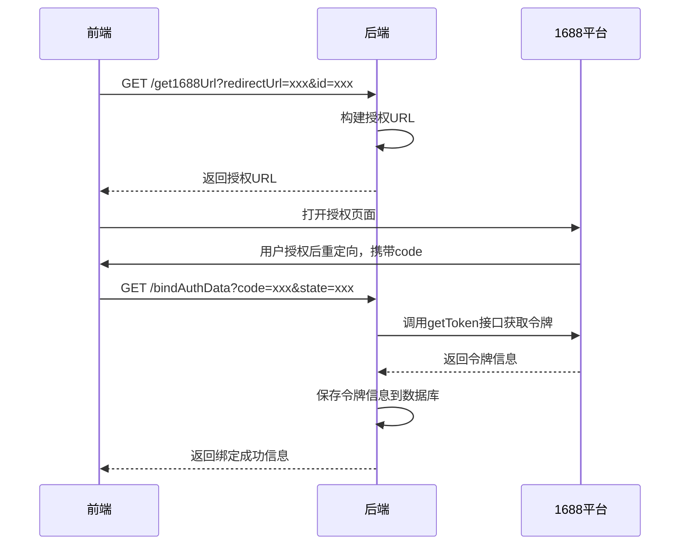
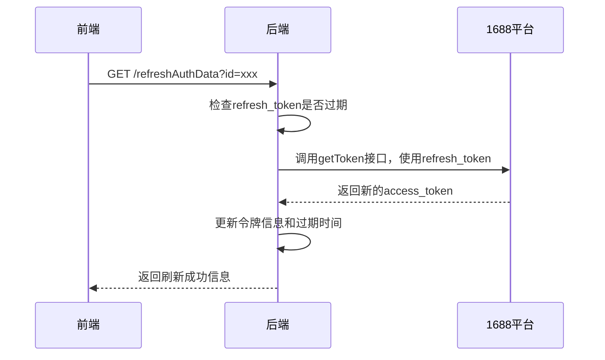
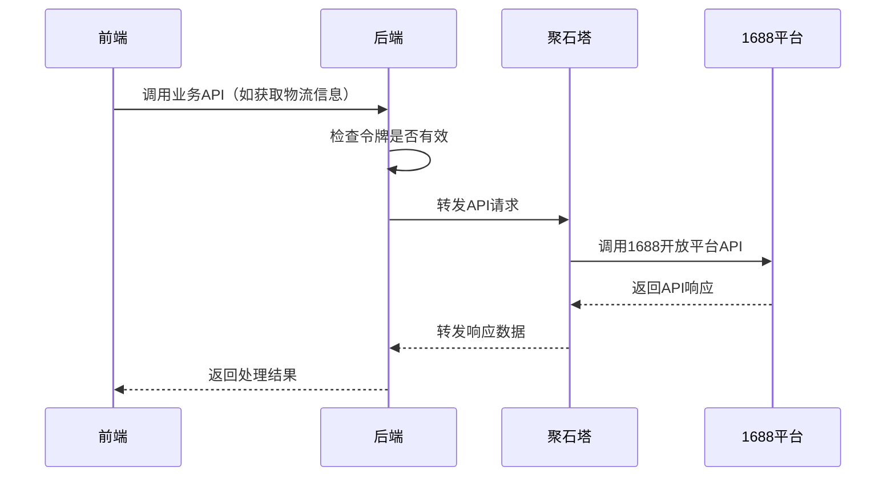

# 1688绑定模块功能解析文档

## 1. 模块架构概述

1688绑定模块采用前后端分离架构，前端使用Vue 3 Composition API实现用户界面和交互逻辑，后端使用Spring Boot实现API接口和业务逻辑。模块通过OAuth2协议与1688开放平台进行交互，实现账号授权和数据获取。

### 1.1 系统架构图

```
┌─────────────┐     ┌─────────────┐     ┌─────────────┐     ┌─────────────┐
│ 前端页面    │────>│ 后端API     │────>│ 聚石塔服务  │────>│ 1688开放平台│
│ (Vue 3)     │<────│ (Spring Boot)│<────│            │<────│             │
└─────────────┘     └─────────────┘     └─────────────┘     └─────────────┘
```

### 1.2 核心组件

- **前端组件**：`wimoor-ui/src/views/erp/purchase/open1688/bind/index.vue` - 1688绑定主组件
- **API服务**：`wimoor-ui/src/api/erp/purchase/open1688/purchasealibabaApi.js` - 前端API调用服务
- **后端控制器**：`AlibabaController.java` - 处理1688相关的HTTP请求
- **服务实现**：`PurchaseAlibabaAuthServiceImpl.java` - 实现1688授权和业务逻辑
- **数据模型**：`PurchaseAlibabaAuth.java` - 1688授权数据实体

## 2. 前端代码结构分析

### 2.1 主组件结构

前端主组件 `index.vue` 包含以下核心部分：

- **模板部分**：
  - 账号列表表格，展示已绑定的1688账号信息
  - 绑定账号弹窗，用于添加或编辑账号信息
  - 操作按钮，包括绑定、延期授权和删除

- **脚本部分**：
  - 响应式数据：账号信息、弹窗状态、表单数据等
  - 生命周期钩子：组件挂载时获取授权列表并处理授权回调
  - 核心方法：
    - `getauthList()`：获取已绑定账号列表
    - `showDialog()`：打开绑定/编辑弹窗
    - `bindAuth()`：触发授权流程
    - `goUrl()`：获取1688授权链接并跳转
    - `removeBind()`：删除已绑定账号
    - `GetRequest()`：处理1688授权回调

### 2.2 API调用服务

`purchasealibabaApi.js` 定义了与后端交互的API方法：

- `getAuthData()`：获取授权账号列表
- `get1688Url()`：获取1688授权链接
- `logicDelete()`：删除授权账号
- `refreshAuthData()`：刷新授权数据
- `bindAuthData()`：绑定授权数据
- `submitname()`：提交账号信息
- `updateName()`：更新账号名称

## 3. 后端代码结构分析

### 3.1 控制器层

`AlibabaController.java` 提供以下API端点：

- `POST /submitname`：提交或更新1688账号信息
- `GET /bindAuthData`：绑定1688授权数据
- `GET /refreshAuthData`：刷新1688授权数据
- `GET /getAuthData`：获取已绑定的1688账号列表
- `GET /delete`：删除并解绑1688账号
- `GET /get1688Url`：获取1688授权链接
- `GET /message`：接收1688平台的消息通知

### 3.2 服务实现层

`PurchaseAlibabaAuthServiceImpl.java` 实现了以下核心功能：

- `saveAction()`：保存或更新1688账号信息
- `bindAuth()`：处理1688授权流程，获取访问令牌
- `refreshAuthToken()`：使用refresh_token刷新访问令牌
- `refreshAuthRefreshToken()`：刷新refresh_token本身
- `getAuthData()`：获取已绑定的账号列表
- `updateAlibaba()`：更新账号状态（删除）
- `callApi()`：调用1688开放平台API
- `checkAuthorityToken()`：检查并刷新授权令牌

### 3.3 数据模型

`PurchaseAlibabaAuth` 实体包含以下核心字段：

- `id`：主键ID
- `shopid`：店铺ID
- `name`：账号名称
- `appkey`：1688应用密钥
- `appsecret`：1688应用密钥
- `accessToken`：访问令牌
- `refreshToken`：刷新令牌
- `accessTokenTimeout`：访问令牌过期时间
- `refreshTokenTimeout`：刷新令牌过期时间
- `aliId`：1688用户ID
- `resourceOwner`：1688账号名称
- `memberId`：1688会员ID
- `isDelete`：删除状态

## 4. 核心功能实现

### 4.1 授权流程实现

1. **前端触发授权**：
   - 用户点击"绑定账号"按钮
   - 填写账号名称和开发者信息（可选）
   - 点击"授权"按钮，调用 `bindAuth()` 方法
   - `bindAuth()` 调用 `getcode()` 获取账号ID
   - `getcode()` 调用后端 `/submitname` 接口创建账号记录
   - 成功后调用 `goUrl()` 获取1688授权链接

2. **1688平台授权**：
   - 前端打开1688授权页面
   - 用户登录1688账号并确认授权
   - 1688平台重定向回系统，并携带授权码

3. **后端处理授权回调**：
   - 前端 `GetRequest()` 方法解析URL参数，获取授权码
   - 调用后端 `/bindAuthData` 接口，传入授权码和状态
   - 后端 `bindAuth()` 方法使用授权码获取访问令牌和刷新令牌
   - 保存令牌信息到数据库

4. **前端更新状态**：
   - 授权成功后，前端显示成功提示
   - 刷新账号列表，显示新绑定的账号

### 4.2 令牌管理实现

1. **令牌获取**：
   - 在 `bindAuth()` 方法中，使用授权码调用1688开放平台的 `/system.oauth2/getToken` 接口
   - 获取 `access_token`、`refresh_token`、`expires_in` 等信息
   - 计算令牌过期时间并保存到数据库

2. **令牌刷新**：
   - 在 `refreshAuthToken()` 方法中，使用 `refresh_token` 调用1688开放平台的 `/system.oauth2/getToken` 接口
   - 获取新的 `access_token` 和过期时间
   - 更新数据库中的令牌信息

3. **令牌检查**：
   - 在 `checkAuthorityToken()` 方法中，检查访问令牌是否过期
   - 若过期，自动调用 `refreshAuthToken()` 刷新令牌

### 4.3 账号管理实现

1. **账号列表**：
   - 前端调用 `getauthList()` 获取已绑定账号列表
   - 后端 `getAuthData()` 方法查询数据库，返回未删除的账号
   - 前端表格展示账号信息，包括名称、状态、到期时间等

2. **账号编辑**：
   - 用户点击编辑图标，打开编辑弹窗
   - 修改账号名称或开发者信息
   - 点击"保存"按钮，调用后端 `/submitname` 接口更新账号信息

3. **账号删除**：
   - 用户点击"删除"按钮
   - 前端调用 `removeBind()` 方法
   - 后端 `updateAlibaba()` 方法将账号标记为删除状态

4. **延期授权**：
   - 用户点击"延期授权"按钮
   - 前端调用 `goUrl()` 方法重新获取授权链接
   - 重复授权流程，获取新的令牌和过期时间

## 5. API调用流程

### 5.1 授权链接获取流程



### 5.2 令牌刷新流程



### 5.3 API调用流程



## 6. 技术要点和难点

### 6.1 OAuth2授权实现

- **技术要点**：实现完整的OAuth2授权流程，包括授权码获取、令牌交换、令牌刷新
- **实现方案**：使用1688开放平台的OAuth2.0协议，通过授权码模式获取令牌
- **难点**：处理授权回调和令牌管理，确保授权流程的安全性和可靠性

### 6.2 令牌生命周期管理

- **技术要点**：管理访问令牌和刷新令牌的生命周期，确保API调用的连续性
- **实现方案**：
  - 记录令牌的过期时间
  - 定期检查并自动刷新令牌
  - 处理令牌过期的异常情况
- **难点**：平衡令牌刷新的频率和系统性能，避免频繁刷新令牌导致的API调用限制

### 6.3 聚石塔服务集成

- **技术要点**：通过聚石塔服务与1688开放平台进行通信
- **实现方案**：使用HTTP客户端调用聚石塔的转发接口，处理API请求和响应
- **难点**：处理聚石塔服务的异常情况，确保API调用的稳定性

### 6.4 多账号管理

- **技术要点**：支持绑定和管理多个1688账号
- **实现方案**：为每个账号创建独立的授权记录，分别管理令牌和状态
- **难点**：确保多账号场景下的令牌管理和API调用的正确性

## 7. 代码优化建议

### 7.1 前端代码优化

1. **错误处理优化**：
   - 当前代码在API调用失败时缺少统一的错误处理机制
   - 建议实现全局错误处理拦截器，统一处理API错误

2. **状态管理优化**：
   - 当前使用本地响应式数据管理状态，对于复杂场景可能不够灵活
   - 建议使用Pinia或Vuex进行状态管理，提高代码可维护性

3. **代码结构优化**：
   - 将授权流程相关的逻辑抽取为独立的composable函数
   - 提高代码的复用性和可读性

### 7.2 后端代码优化

1. **安全性优化**：
   - 当前代码中AppKey和AppSecret直接存储在数据库中
   - 建议对敏感信息进行加密存储，提高安全性

2. **异常处理优化**：
   - 当前代码中异常处理较为简单，缺少详细的错误信息
   - 建议实现统一的异常处理机制，提供更详细的错误信息

3. **性能优化**：
   - 当前代码中存在重复的数据库查询操作
   - 建议使用缓存机制减少数据库查询，提高系统性能

4. **代码结构优化**：
   - 将1688 API调用相关的代码抽取为独立的服务
   - 提高代码的模块化程度和可维护性

### 7.3 架构优化

1. **微服务架构**：
   - 考虑将1688相关的功能抽取为独立的微服务
   - 提高系统的扩展性和可维护性

2. **异步处理**：
   - 对于耗时的API调用，考虑使用异步处理方式
   - 提高系统的响应速度和并发处理能力

3. **监控和告警**：
   - 实现对1688授权状态和API调用的监控
   - 当授权过期或API调用失败时及时告警

## 8. 总结

1688绑定模块是Wimoor系统中实现与1688平台对接的重要功能模块，通过OAuth2协议实现了账号授权和数据获取。模块采用前后端分离架构，前端使用Vue 3实现用户界面，后端使用Spring Boot实现业务逻辑，通过聚石塔服务与1688开放平台进行通信。

模块的核心功能包括账号绑定、授权管理、令牌管理、账号列表展示和账号管理等。通过这些功能，用户可以方便地绑定和管理1688账号，实现与1688平台的无缝对接，为后续的采购操作和物流信息查询提供了基础。

在技术实现上，模块解决了OAuth2授权流程、令牌生命周期管理、多账号管理等技术难点，为系统的稳定运行提供了保障。同时，通过代码优化建议的实施，可以进一步提高模块的性能、安全性和可维护性。
