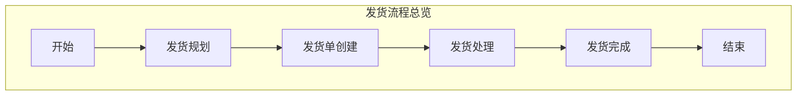
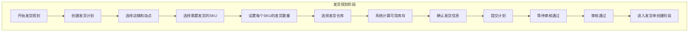
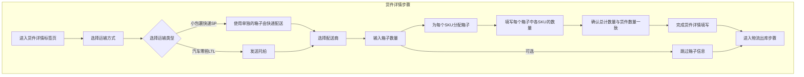
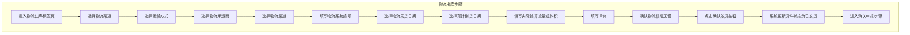
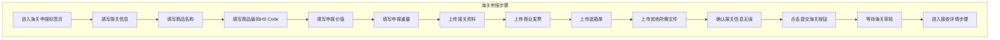
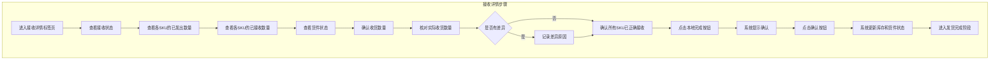
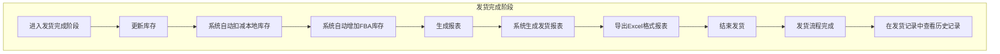
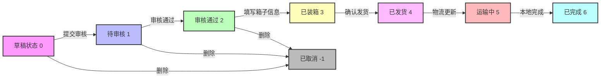

# Wimoor ERP发货流程详细图

## 1. 发货流程总览

## 2. 详细流程图

### 2.1 发货规划阶段

### 2.2 发货单创建阶段

```mermaid
flowchart TD
    subgraph 发货单创建阶段
    B1[开始创建发货单] --> B2[点击创建发货单按钮]
    B2 --> B3[选择已审核通过的发货计划]
    B3 --> B4[填写发货单基本信息]
    B4 --> B5[填写发货单名称]
    B5 --> B6[选择发货地址]
    B6 --> B7[选择收货地址FBA仓库]
    B7 --> B8[添加SKU]
    B8 --> B9[从计划中选择需要发货的SKU]
    B9 --> B10[确认SKU数量和规格]
    B10 --> B11[选择物流方式]
    B11 --> B12[选择运输方式SP或LTL]
    B12 --> B13[选择配送商]
    B13 --> B14[提交审核]
    B14 --> B15[等待审核通过]
    B15 --> B16[审核通过]
    B16 --> B17[进入发货处理阶段]
    end
```

### 2.3 发货处理阶段

#### 2.3.1 货件详情步骤

#### 2.3.2 物流出库步骤

#### 2.3.3 海关申报步骤

#### 2.3.4 接收详情步骤

### 2.4 发货完成阶段

## 3. 货件状态流转图

## 4. 详细流程说明

### 4.1 发货规划阶段

**路径**: `财务` → `平台账目` → `发货规划`

**详细操作步骤**:

1. **创建发货计划**
   - 点击"创建发货计划"按钮
   - 选择目标店铺和站点
   - 选择需要发货的SKU
   - 设置每个SKU的发货数量

2. **选择仓库**
   - 选择发货仓库
   - 系统会自动计算可用库存

3. **提交计划**
   - 确认发货信息无误
   - 点击"提交计划"按钮
   - 等待审核通过

### 4.2 发货单创建阶段

**路径**: `发货` → `发货管理` → `发货单(旧)` 或 `发货单`

**详细操作步骤**:

1. **创建发货单**
   - 点击"创建发货单"按钮
   - 选择已审核通过的发货计划

2. **填写基本信息**
   - 填写发货单名称
   - 选择发货地址
   - 选择收货地址(FBA仓库地址)

3. **添加SKU**
   - 从计划中选择需要发货的SKU
   - 确认SKU数量和规格

4. **选择物流方式**
   - 选择运输方式(小包裹快递SP或汽车零担LTL)
   - 选择配送商

5. **提交审核**
   - 确认所有信息无误
   - 点击"提交审核"按钮
   - 等待审核通过

### 4.3 发货处理阶段

**路径**: `发货` → `发货管理` → `货件处理` → 点击货件编号

#### 4.3.1 货件详情 (Tab 0)

**功能**: 填写箱子信息和运输方式

**详细操作步骤**:

1. **选择运输方式**
   - 小包裹快递(SP): 使用单独的箱子由快递配送
   - 汽车零担(LTL): 发送托拍

2. **选择配送商**
   - 从下拉列表中选择配送商
   - 注: 暂不支持亚马逊合作承运商

3. **填写箱子信息**
   - 输入箱子数量
   - 为每个SKU分配箱子
   - 填写每个箱子中各SKU的数量
   - 确认总计数量与货件数量一致

4. **跳过箱子信息(可选)**
   - 如需跳过箱子信息填写，点击"跳过箱子信息"按钮

#### 4.3.2 物流出库 (Tab 1)

**功能**: 填写物流信息和确认发货

**详细操作步骤**:

1. **选择物流渠道**
   - 选择运输方式
   - 选择物流承运商
   - 选择物流渠道

2. **填写物流信息**
   - 填写物流系统编号
   - 选择物流发货日期
   - 选择预计到货日期
   - 填写实际结算重量/体积
   - 填写单价

3. **确认发货**
   - 确认物流信息无误
   - 点击"确认发货"按钮
   - 系统会更新货件状态为"已发货"

#### 4.3.3 海关申报 (Tab 2)

**功能**: 填写报关信息和上传报关资料

**详细操作步骤**:

1. **填写报关信息**
   - 填写商品名称
   - 填写商品编码(HS Code)
   - 填写申报价值
   - 填写申报重量

2. **上传报关资料**
   - 上传商业发票
   - 上传装箱单
   - 上传其他所需文件

3. **提交海关**
   - 确认报关信息无误
   - 点击"提交海关"按钮
   - 等待海关审核

#### 4.3.4 接收详情 (Tab 3)

**功能**: 查看接收状态和确认收货

**详细操作步骤**:

1. **查看接收状态**
   - 查看各SKU的已发出数量
   - 查看各SKU的已接收数量
   - 查看货件状态(完成/待接收)

2. **确认收货数量**
   - 核对实际收货数量
   - 如有差异，记录差异原因

3. **完成货件**
   - 确认所有SKU已正确接收
   - 点击"本地完成"按钮
   - 系统会提示"该操作会对库存产生影响，请确认是否要执行本地已完成？"
   - 点击"确认"按钮
   - 系统会更新库存和货件状态

### 4.4 发货完成阶段

**详细操作步骤**:

1. **更新库存**
   - 系统会自动扣减本地库存
   - 系统会自动增加FBA库存

2. **生成报表**
   - 系统会生成发货报表
   - 可以导出Excel格式的报表

3. **结束发货**
   - 发货流程完成
   - 可以在"发货记录"中查看历史记录

## 5. 关键操作说明

### 5.1 本地完成

**功能**: 标记货件在本地系统中已完成

**操作时机**: 当货件已经发出并且库存需要更新时

**操作步骤**:
1. 在货件详情页面，点击"本地完成"按钮
2. 系统会提示"该操作会对库存产生影响，请确认是否要执行本地已完成？"
3. 点击"确认"按钮
4. 系统会更新本地库存和货件状态

### 5.2 删除货件

**功能**: 删除本地货件记录

**操作时机**: 当货件创建错误或需要取消时

**操作步骤**:
1. 在货件详情页面，点击"删除货件"按钮
2. 系统会弹出确认对话框
3. 点击"仅删除本地"按钮
4. 系统会删除本地货件记录并还原本地库存

**注意**: 
- 只能删除状态为"草稿"、"待审核"或"审核通过"的货件
- 已发货的货件不能删除

### 5.3 导出报表

**功能**: 导出货件相关报表

**操作步骤**:
1. 在货件列表页面，选择需要导出的货件
2. 点击"导出"按钮
3. 系统会生成Excel格式的报表并自动下载

## 6. 注意事项

1. **库存影响**
   - 创建发货单会减少本地可用库存
   - 完成发货会减少本地实际库存并增加FBA库存
   - 删除货件会还原本地库存

2. **状态流转**
   - 货件状态必须按顺序流转，不能跳过
   - 某些操作只能在特定状态下执行

3. **数据同步**
   - 货件信息会与亚马逊平台同步
   - 同步可能需要一定时间，请耐心等待

4. **权限控制**
   - 不同角色的用户有不同的操作权限
   - 请确保您有相应的权限再执行操作

## 7. 相关文件路径

### 7.1 前端文件

| 文件路径 | 功能描述 |
|---------|----------|
| `wimoor-ui/src/views/erp/ship/ship_plan/index.vue` | 发货规划主页面 |
| `wimoor-ui/src/views/erp/ship/shipment_add/create/index.vue` | 创建发货单页面 |
| `wimoor-ui/src/views/erp/ship/shipment_handing/list/index.vue` | 货件处理列表页面 |
| `wimoor-ui/src/views/erp/ship/shipment_handing/shipstep/index.vue` | 发货流程主页面 |
| `wimoor-ui/src/views/erp/ship/shipment_handing/shipstep/components/two_box.vue` | 货件详情(箱子信息)组件 |
| `wimoor-ui/src/views/erp/ship/shipment_handing/shipstep/components/three_deliver.vue` | 物流出库组件 |
| `wimoor-ui/src/views/erp/ship/shipment_handing/shipstep/components/four_receive.vue` | 接收详情组件 |
| `wimoor-ui/src/views/erp/ship/shipment_handing/shipstep/components/shipment_operator.vue` | 货件操作组件 |
| `wimoor-ui/src/views/erp/ship/ship_plan/components/ship_record.vue` | 发货记录组件 |

### 7.2 后端文件

| 文件路径 | 功能描述 |
|---------|----------|
| `wimoor-amazon/amazon-boot/src/main/java/com/wimoor/amazon/inbound/controller/ShipmentController.java` | 货件控制器 |
| `wimoor-erp/erp-boot/src/main/java/com/wimoor/erp/ship/controller/ShipmentController.java` | 发货单控制器 |
| `wimoor-erp/erp-boot/src/main/java/com/wimoor/erp/ship/service/IShipmentService.java` | 发货单服务接口 |

## 8. 流程图说明

本流程图基于Wimoor ERP前端代码分析生成，使用Mermaid语法创建了详细的发货流程图表。流程图包含以下特点：

1. **分层展示**：将发货流程分为四个主要阶段，每个阶段又细分为多个步骤
2. **详细步骤**：每个步骤都有具体的操作说明和流程方向
3. **状态流转**：单独展示了货件状态的流转过程，清晰展示状态之间的转换关系
4. **视觉区分**：使用不同的颜色和样式区分不同的状态和步骤
5. **详细说明**：每个流程阶段都有详细的文字说明和操作步骤

通过本流程图，您可以清晰地了解Wimoor ERP的完整发货流程，包括从发货规划到发货完成的所有步骤和操作。
