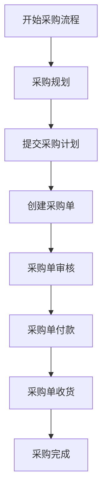
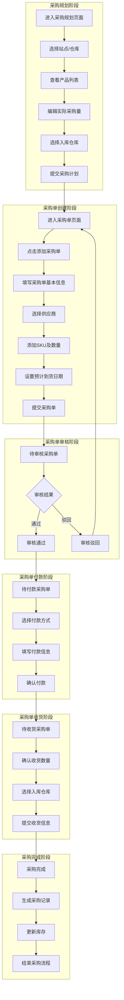
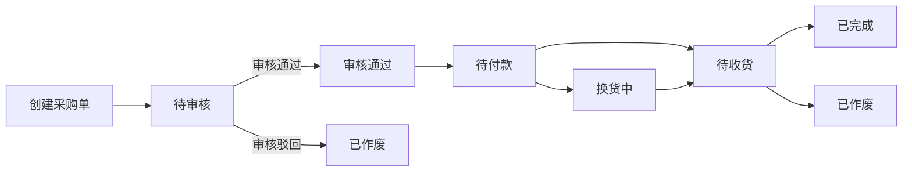

# Wimoor ERP采购流程图

## 采购流程总览

## 详细采购流程图

## 采购单状态流转图

## 详细流程说明

### 1. 采购规划阶段

**功能说明**：根据销售需求和库存情况，制定采购计划。

**操作步骤**：
1. 进入采购规划页面（路径：ERP → 采购 → 采购规划）
2. 选择站点、仓库等筛选条件
3. 查看系统建议的采购量
4. 编辑实际采购量
5. 为每个产品选择入库仓库
6. 提交采购计划

**核心文件**：
- `wimoor-ui/src/views/erp/purchase/plan_amz/index.vue` - 采购规划主页面
- `wimoor-ui/src/views/erp/purchase/plan_amz/plan_submit/index.vue` - 提交采购计划页面

### 2. 采购单创建阶段

**功能说明**：根据采购计划创建采购单，详细记录采购信息。

**操作步骤**：
1. 进入采购单页面（路径：ERP → 采购 → 采购单）
2. 点击"添加采购单"按钮
3. 填写采购单基本信息（采购类型、供应商等）
4. 添加需要采购的SKU及数量
5. 设置预计到货日期
6. 提交采购单

**核心文件**：
- `wimoor-ui/src/views/erp/purchase/orders/index.vue` - 采购单主页面
- `wimoor-ui/src/views/erp/purchase/orders/components/create.vue` - 创建采购单组件

### 3. 采购单审核阶段

**功能说明**：审核采购单的合理性和必要性。

**操作步骤**：
1. 在采购单页面切换到"待审核"标签
2. 查看待审核的采购单
3. 审核采购单（通过或驳回）
4. 审核通过的采购单进入待付款状态
5. 审核驳回的采购单变为已作废状态

**核心文件**：
- `wimoor-ui/src/views/erp/purchase/orders/components/table.vue` - 采购单表格组件

### 4. 采购单付款阶段

**功能说明**：处理采购单的付款事宜。

**操作步骤**：
1. 在采购单页面切换到"待付款"标签
2. 查看待付款的采购单
3. 选择付款方式
4. 填写付款信息
5. 确认付款
6. 付款完成后采购单进入待收货状态

**核心文件**：
- `wimoor-ui/src/views/erp/purchase/orders/components/payment.vue` - 付款组件

### 5. 采购单收货阶段

**功能说明**：处理采购货物的收货事宜。

**操作步骤**：
1. 在采购单页面切换到"待收货"标签
2. 查看待收货的采购单
3. 确认实际收货数量
4. 选择入库仓库
5. 提交收货信息
6. 收货完成后采购单进入已完成状态

**核心文件**：
- `wimoor-ui/src/views/erp/purchase/orders/components/receipt.vue` - 收货组件

### 6. 采购完成阶段

**功能说明**：采购流程的最终阶段，完成采购记录和库存更新。

**操作步骤**：
1. 在采购单页面切换到"已完成"标签
2. 查看已完成的采购单
3. 系统自动生成采购记录
4. 系统自动更新库存
5. 采购流程结束

**核心文件**：
- `wimoor-ui/src/views/erp/purchase/orders/records.vue` - 采购记录页面

## 关键操作说明

### 批量操作
- **批量审核**：同时审核多个采购单
- **批量付款**：同时处理多个采购单的付款
- **批量收货**：同时处理多个采购单的收货
- **批量修改备注**：同时修改多个采购SKU的备注

### 数据导入导出
- **导入付款**：通过Excel文件导入付款信息
- **导出SKU列表**：导出采购SKU的详细信息

### 高级筛选
- 按SKU、订单号、运单号搜索
- 按创建日期、预计到货日期、审核日期筛选
- 按产品标签、产品负责人、产品分类筛选
- 按产品类型（单独产品、组合产品、待组装产品）筛选

## 注意事项

1. **库存影响**：采购单收货后会自动更新库存
2. **状态流转**：采购单状态必须按流程顺序流转
3. **数据同步**：采购数据会与其他模块（如库存、财务）同步
4. **权限控制**：不同角色的用户有不同的操作权限
5. **审核流程**：采购单必须经过审核才能进行后续操作

## 相关文件路径

### 前端文件

| 文件路径 | 功能描述 |
|---------|----------|
| `wimoor-ui/src/views/erp/purchase/plan_amz/index.vue` | 采购规划主页面 |
| `wimoor-ui/src/views/erp/purchase/plan_amz/plan_submit/index.vue` | 提交采购计划页面 |
| `wimoor-ui/src/views/erp/purchase/orders/index.vue` | 采购单主页面 |
| `wimoor-ui/src/views/erp/purchase/orders/components/create.vue` | 创建采购单组件 |
| `wimoor-ui/src/views/erp/purchase/orders/components/table.vue` | 采购单表格组件 |
| `wimoor-ui/src/views/erp/purchase/orders/components/payment.vue` | 付款组件 |
| `wimoor-ui/src/views/erp/purchase/orders/components/receipt.vue` | 收货组件 |
| `wimoor-ui/src/views/erp/purchase/orders/records.vue` | 采购记录页面 |
| `wimoor-ui/src/api/erp/purchase/plan/planApi.js` | 采购规划API调用 |
| `wimoor-ui/src/api/erp/purchase/form/listApi.js` | 采购单API调用 |

### 后端文件

| 文件路径 | 功能描述 |
|---------|----------|
| `wimoor-erp/erp-boot/src/main/java/com/wimoor/erp/purchase/controller/PurchaseFormController.java` | 采购单控制器 |
| `wimoor-erp/erp-boot/src/main/java/com/wimoor/erp/purchase/service/IPurchaseFormService.java` | 采购单服务接口 |
| `wimoor-erp/erp-boot/src/main/java/com/wimoor/erp/purchase/service/impl/PurchaseFormServiceImpl.java` | 采购单服务实现 |
| `wimoor-erp/erp-boot/src/main/java/com/wimoor/erp/purchase/controller/PurchasePlanController.java` | 采购规划控制器 |
| `wimoor-erp/erp-boot/src/main/java/com/wimoor/erp/purchase/service/IPurchasePlanService.java` | 采购规划服务接口 |

## 流程图说明

1. **采购规划**：根据销售数据和库存情况，制定合理的采购计划
2. **采购单创建**：将采购计划转化为具体的采购单
3. **采购单审核**：确保采购的合理性和必要性
4. **采购单付款**：处理采购资金的支付
5. **采购单收货**：确认货物的接收和入库
6. **采购完成**：完成采购流程，更新相关记录和库存

每个阶段都有明确的操作步骤和状态流转，确保采购流程的规范性和可追溯性。系统支持批量操作和数据导入导出，提高采购管理的效率。