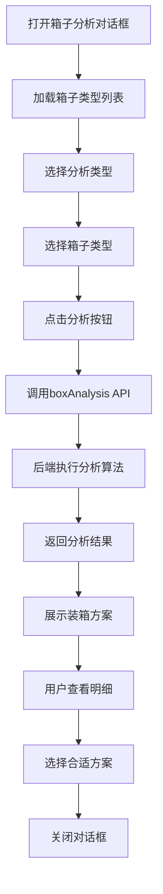

# box_analysis_dialog.vue 详细分析文档

## 1. 组件概述

`box_analysis_dialog.vue` 是一个用于箱子打包分析的对话框组件，主要功能是根据用户选择的分析类型（按重量、体积或质量），分析当前货件计划的最佳装箱方案。该组件是 FBA 发货流程中的重要环节，帮助用户优化装箱策略，提高物流效率。

## 2. 前端组件结构

### 2.1 模板结构

```vue
<template>
  <el-dialog
    v-model="dialogVisible"
    title="箱子分析"
    width="1000px"
    append-to-body
    @close="handleClose"
  >
    <!-- 分析类型选择 -->
    <el-tabs v-model="activeName" @tab-click="handleClick">
      <el-tab-pane label="按重量分析" name="first">...</el-tab-pane>
      <el-tab-pane label="按体积分析" name="second">...</el-tab-pane>
      <el-tab-pane label="按质量分析" name="third">...</el-tab-pane>
    </el-tabs>
    
    <!-- 箱子类型选择 -->
    <el-table v-loading="loading" :data="boxList" style="width: 100%">...</el-table>
    
    <!-- 分析结果展示 -->
    <el-table :data="tableData" style="width: 100%" height="350" v-loading="loading" border>
      <el-table-column prop="boxTypeName" label="箱子类型" width="180" />
      <el-table-column prop="boxNum" label="箱子数量" width="180" />
      <el-table-column prop="totalWeight" label="总重量" width="180" />
      <el-table-column prop="totalVolume" label="总体积" width="180" />
      <el-table-column prop="itemList" label="装箱明细">...</el-table-column>
    </el-table>
  </el-dialog>
</template>
```

### 2.2 核心数据结构

```javascript
// 响应式数据
const dialogVisible = ref(false);
const activeName = ref('first'); // 当前激活的标签页
const boxList = ref([]); // 箱子类型列表
const tableData = ref([]); // 分析结果数据
const loading = ref(false); // 加载状态
const form = ref({ // 分析参数表单
  planid: '', // 计划ID
  boxType: [], // 选择的箱子类型
  mode: '' // 分析模式
});

// 方法
const loadBox = async () => { /* 加载箱子类型 */ };
const handleClick = (tab) => { /* 处理标签页点击 */ };
const handleClose = () => { /* 处理对话框关闭 */ };
const showDialog = (id) => { /* 显示对话框 */ };
const submitForm = async () => { /* 提交分析表单 */ };
```

## 3. API 调用分析

### 3.1 前端 API 调用

| API 方法 | 用途 | 参数 | 来源 |
|---------|------|------|------|
| `shipmenthandlingApi.getBoxUse()` | 获取箱子使用情况 | 无 | [ShipFormController.java:1271](d:\work\wimoor666\wimoor666\wimoor-amazon\amazon-boot\src\main\java\com\wimoor\amazon\inbound\controller\ShipFormController.java:1271) |
| `shipmentplanApi.boxAnalysis(params)` | 分析箱子打包方案 | `{formid, boxType, type}` | [ShipInboundPlanBoxV2Controller.java:211](d:\work\wimoor666\wimoor666\wimoor-amazon\amazon-boot\src\main\java\com\wimoor\amazon\inboundV2\controller\ShipInboundPlanBoxV2Controller.java:211) |

### 3.2 后端控制器实现

#### 3.2.1 getBoxUse 控制器

```java
@ApiOperation(value = "箱子使用情况")
@GetMapping("/getBoxUse")
public Result<List<Map<String,Object>>> getBoxUse(){
    UserInfo user=UserInfoContext.get();
    List<Map<String,Object>> result=shipInboundShipmentService.getBoxNum(user.getCompanyid());
    return Result.success(result);
}
```

#### 3.2.2 boxAnalysis 控制器

```java
@ApiOperation(value = "分析箱子")
@PostMapping("/boxAnalysis")
public Result<?> boxAnalysisAction(@RequestBody BoxAnalysisDTO dto) {
    UserInfo user=UserInfoContext.get();
    if(dto.getType().equals("v1")){
        return Result.success( shipInboundBoxAnalysis1Service.boxAnalysis(user,dto));
    }else if( dto.getType().equals("v2")){
        return Result.success( shipInboundBoxAnalysis2Service.boxAnalysis(user,dto));
    }else  {
        return Result.success( shipInboundBoxAnalysis3Service.boxAnalysis(user,dto));
    }
}
```

## 4. 后端数据模型

### 4.1 核心实体类

#### 4.1.1 ShipInboundPlan

```java
@Data
@ApiModel(value="ShipInboundPlan对象", description="货件计划")
@TableName("t_erp_ship_v2_inboundplan")
public class ShipInboundPlan extends AmazonBaseEntity {
    @ApiModelProperty(value = "计划名称")
    @TableField(value="name")
    private String name;
    
    @ApiModelProperty(value = "计划编码")
    @TableField(value="number")
    private String number;
    
    @ApiModelProperty(value = "发货地址ID")
    @TableField(value="source_address")
    private String sourceAddress;
    
    // 其他字段...
    
    @TableField(exist = false)
    @ApiModelProperty(value = "产品列表")
    private List<ShipInboundItem> planitemlist=new LinkedList<ShipInboundItem>();
}
```

#### 4.1.2 ShipInboundBox

```java
@Data
@EqualsAndHashCode(callSuper = true)
@ApiModel(value="ShipInboundBox对象", description="货件箱子信息")
@TableName("t_erp_ship_v2_inboundbox")
public class ShipInboundBox extends AmazonBaseEntity {
    @ApiModelProperty(value = "计划ID")
    @TableField(value= "formid")
    private String formid;
    
    @ApiModelProperty(value = "分组ID")
    @TableField(value= "packing_group_id")
    private String packingGroupId;
    
    @ApiModelProperty(value = "货件ID")
    @TableField(value= "shipmentid")
    private String shipmentid;
    
    @ApiModelProperty(value = "箱号")
    @TableField(value= "boxnum")
    private Integer boxnum;
    
    // 其他字段...
}
```

#### 4.1.3 ShipInboundItem

```java
@Data
@EqualsAndHashCode(callSuper = true)
@ApiModel(value="ShipInboundItem对象", description="货件项目")
@TableName("t_erp_ship_v2_inbounditem")
public class ShipInboundItem extends BaseEntity {
    // 字段定义...
}
```

## 5. 业务逻辑流程

### 5.1 箱子分析流程

1. **初始化**：用户打开箱子分析对话框，组件加载箱子类型列表
2. **参数选择**：
   - 选择分析类型（按重量、体积或质量）
   - 选择要使用的箱子类型
3. **分析执行**：点击"分析"按钮，组件调用 `shipmentplanApi.boxAnalysis()` 方法
4. **结果展示**：后端返回分析结果，组件在表格中展示最佳装箱方案
5. **用户操作**：用户可以查看装箱明细，选择合适的方案

### 5.2 核心业务逻辑

```javascript
// 提交分析表单
const submitForm = async () => {
  loading.value = true;
  try {
    // 构建分析参数
    let params = {
      formid: form.value.planid,
      boxType: form.value.boxType,
      type: activeName.value === 'first' ? 'v1' : activeName.value === 'second' ? 'v2' : 'v3'
    };
    // 调用分析API
    const { data } = await shipmentplanApi.boxAnalysis(params);
    // 处理分析结果
    tableData.value = data;
  } catch (error) {
    console.log(error);
  } finally {
    loading.value = false;
  }
};
```

## 6. 代码优化建议

### 6.1 前端优化

1. **错误处理增强**：添加更详细的错误处理和用户提示
2. **性能优化**：对于大量数据的分析结果，考虑使用虚拟滚动
3. **用户体验**：添加分析进度条，提升用户体验
4. **代码可读性**：提取重复代码为单独的方法，如参数构建逻辑

### 6.2 后端优化

1. **分析算法优化**：考虑使用更高效的装箱算法，如遗传算法或模拟退火
2. **缓存机制**：添加分析结果缓存，避免重复计算
3. **参数验证**：增强请求参数的验证，确保数据完整性
4. **日志记录**：添加分析过程的详细日志，便于问题排查

## 7. 输入输出示例

### 7.1 输入示例

```javascript
// 分析参数示例
const params = {
  formid: "SP202401010001", // 计划ID
  boxType: ["BOX001", "BOX002"], // 选择的箱子类型
  type: "v1" // 分析类型：v1-按重量，v2-按体积，v3-按质量
};

// 调用API
const { data } = await shipmentplanApi.boxAnalysis(params);
```

### 7.2 输出示例

```javascript
// 分析结果示例
[
  {
    boxTypeName: "标准箱",
    boxNum: 5,
    totalWeight: "45.5kg",
    totalVolume: "0.25m³",
    itemList: [
      {
        sku: "SKU001",
        quantity: 10,
        weight: "2.5kg",
        volume: "0.01m³"
      },
      {
        sku: "SKU002",
        quantity: 5,
        weight: "3.0kg",
        volume: "0.02m³"
      }
    ]
  },
  {
    boxTypeName: "大箱",
    boxNum: 2,
    totalWeight: "48.0kg",
    totalVolume: "0.30m³",
    itemList: [
      {
        sku: "SKU003",
        quantity: 8,
        weight: "3.5kg",
        volume: "0.03m³"
      }
    ]
  }
]
```

## 8. 总结

`box_analysis_dialog.vue` 组件是 FBA 发货流程中的重要工具，通过智能分析算法帮助用户优化装箱策略，提高物流效率。该组件具有以下特点：

1. **多维度分析**：支持按重量、体积和质量三种维度进行分析
2. **灵活配置**：允许用户选择要使用的箱子类型
3. **详细结果**：提供详细的装箱方案和明细
4. **前后端协作**：通过与后端 API 的交互，实现复杂的装箱分析逻辑

该组件的实现展示了 Vue 3 Composition API 的使用方式，以及如何构建一个功能完整的对话框组件。同时，也体现了 FBA 发货流程中装箱分析的重要性，为用户提供了直观、高效的装箱方案选择工具。

## 9. 技术栈

| 类别 | 技术/框架 | 版本 | 用途 |
|------|-----------|------|------|
| 前端 | Vue | 3.x | 前端框架 |
| 前端 | Element Plus | 最新版 | UI 组件库 |
| 前端 | Axios | 最新版 | HTTP 客户端 |
| 后端 | Spring Boot | 最新版 | 后端框架 |
| 后端 | MyBatis Plus | 最新版 | ORM 框架 |
| 后端 | RESTful API | - | 接口设计 |

## 10. 代码参考

### 10.1 前端核心代码

```javascript
// 加载箱子类型
const loadBox = async () => {
  try {
    const { data } = await shipmenthandlingApi.getBoxUse();
    boxList.value = data;
  } catch (error) {
    console.log(error);
  }
};

// 提交分析表单
const submitForm = async () => {
  loading.value = true;
  try {
    let params = {
      formid: form.value.planid,
      boxType: form.value.boxType,
      type: activeName.value === 'first' ? 'v1' : activeName.value === 'second' ? 'v2' : 'v3'
    };
    const { data } = await shipmentplanApi.boxAnalysis(params);
    tableData.value = data;
  } catch (error) {
    console.log(error);
  } finally {
    loading.value = false;
  }
};
```

### 10.2 后端核心代码

```java
// 箱子分析控制器
@ApiOperation(value = "分析箱子")
@PostMapping("/boxAnalysis")
public Result<?> boxAnalysisAction(@RequestBody BoxAnalysisDTO dto) {
    UserInfo user=UserInfoContext.get();
    if(dto.getType().equals("v1")){
        return Result.success( shipInboundBoxAnalysis1Service.boxAnalysis(user,dto));
    }else if( dto.getType().equals("v2")){
        return Result.success( shipInboundBoxAnalysis2Service.boxAnalysis(user,dto));
    }else  {
        return Result.success( shipInboundBoxAnalysis3Service.boxAnalysis(user,dto));
    }
}

// 箱子使用情况控制器
@ApiOperation(value = "箱子使用情况")
@GetMapping("/getBoxUse")
public	Result<List<Map<String,Object>>> getBoxUse(){
    UserInfo user=UserInfoContext.get();
    List<Map<String,Object>> result=shipInboundShipmentService.getBoxNum(user.getCompanyid());
    return Result.success(result);
}
```

## 11. 业务流程图



## 12. 结论

`box_analysis_dialog.vue` 组件是一个功能完整、设计合理的箱子打包分析工具，为 FBA 发货流程提供了重要的装箱优化功能。通过前端与后端的紧密协作，实现了智能的装箱分析逻辑，帮助用户提高物流效率，降低物流成本。

该组件的实现展示了现代前端开发的最佳实践，包括：
- 使用 Vue 3 Composition API 进行状态管理
- 与后端 API 的高效交互
- 响应式 UI 设计
- 良好的用户体验

同时，后端实现也体现了 Spring Boot 框架的优势，包括：
- 清晰的控制器设计
- 灵活的服务层架构
- 高效的数据分析处理

总体而言，`box_analysis_dialog.vue` 组件是一个设计精良、功能完善的业务组件，为 FBA 发货流程提供了重要的技术支持。