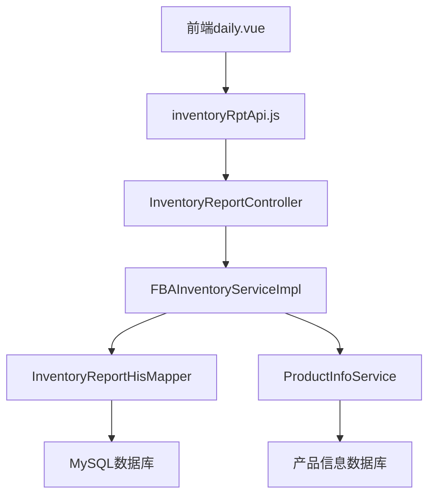

# FBA每日库存模块功能解析文档

## 1. 系统架构

### 1.1 整体架构

FBA每日库存模块采用前后端分离架构，主要包含以下组件：

- **前端组件**：Vue 3 + Element Plus 构建的单页应用
- **后端服务**：Spring Boot 微服务，提供 RESTful API
- **数据库**：MySQL 数据库存储库存数据
- **数据来源**：亚马逊API同步的FBA库存报告

### 1.2 模块依赖关系



## 2. 前端实现

### 2.1 核心文件结构

```
└── src/
    └── views/
        └── amazon/
            └── inventory/
                └── fba/
                    └── daily.vue        # 每日库存主组件
    └── api/
        └── amazon/
            └── inventory/
                └── inventoryRptApi.js   # API接口定义
    └── components/
        └── header/
            ├── group.vue                # 产品组选择组件
            └── datepicker.vue           # 日期选择组件
```

### 2.2 前端核心代码分析

#### 2.2.1 组件模板结构

```vue
<template>
    <div class="main-sty">
        <div class="con-header">
            <!-- 顶部操作栏 -->
            <el-row>
                <el-space>
                    <Group  @change="groupChange" defaultValue="" isproduct="ok"></Group>
                    <Datepicker longtime="ok" ref="datepickers" @changedate="changedate" />
                    <el-input  v-model="queryParams.sku" @input="handleQuery" clearable placeholder="请输入SKU" style="width: 250px;" class="input-with-select" >
                        <template #append>
                            <el-button @click="handleQuery" >
                                <el-icon class="ic-cen font-medium">
                                    <search/>
                                </el-icon>
                            </el-button>
                        </template>
                    </el-input>
                    <el-button type="primary" @click.stop="downloadExcel">导出</el-button>
                </el-space>
            </el-row>
        </div>
        <div class="con-body">
            <!-- 数据表格 -->
            <GlobalTable ref="globalTable"
                show-summary
                :summary-method="getSummaries"  
                :tableData="tableData"  height="calc(100vh - 210px)" @selectionChange='handleSelect' 
                :defaultSort="{ prop: 'sku', order: 'ascending' }"  @loadTable="loadTableData" :stripe="true"  
                style="width: 100%;margin-bottom:16px;">
                <template #field>
                    <!-- 产品信息列 -->
                    <el-table-column label="产品信息" prop="sku"   width="200" fixed='left' sortable="custom" show-overflow-tooltip>
                        <template #default="scope">
                            <div class="flex-center">
                                <el-image v-if="scope.row.image" :src="scope.row.image" class="img-40"  width="40" height="40"  ></el-image>
                                <el-image v-else :src="$require('empty/noimage40.png')"  class="img-40"  width="40" height="40"  ></el-image>
                                <div >
                                    <div>{{scope.row.pname}}</div>
                                    <p class="sku">{{scope.row.sku}} </p>
                                </div>
                            </div>
                        </template>
                    </el-table-column>
                    <!-- 仓库列 -->
                    <el-table-column label="仓库" prop="warehouse" fixed='left' width="120"  sortable="custom" />
                    <!-- 动态日期列 -->
                    <el-table-column :label="item.byday" :prop="item.field" v-for="item in fieldlist" min-width="120" sortable="custom"  />
                </template>
            </GlobalTable>
        </div>
    </div>
</template>
```

#### 2.2.2 核心逻辑实现

```javascript
// 数据初始化
let state = reactive({
    tableData: {records:[],total:0},
    queryParams:{
        sku:"",
    },
    isload:true,
    fieldlist:[],
    summary:{},
})

// 产品组变化处理
function groupChange(obj){
    state.queryParams.groupid=obj.groupid;
    if(obj.marketplaceid=="IEU"){
        state.queryParams.warehouse="EU";
    }else{
        state.queryParams.warehouse=obj.marketplaceid;
    }
    handleQuery();
}

// 日期变化处理
function changedate(dates){
    state.queryParams.fromdate=dates.start;
    state.queryParams.enddate=dates.end;
    if(state.isload==false){
        handleQuery();
    }
}

// 查询处理
function handleQuery(){
    state.isload=false;
    // 获取日期字段列表
    inventoryRptApi.getFBAInvDayDetailField(state.queryParams).then((res)=>{
        state.fieldlist=res.data;
        // 加载表格数据
        globalTable.value.loadTable(state.queryParams);
    });
}

// 加载表格数据
function loadTableData(params){
    inventoryRptApi.getFBAInvDayDetail(params).then(res=>{
        state.tableData.records=res.data.records;
        state.tableData.total=res.data.total;
        // 设置合计数据
        if(params.currentpage==1){
            if(res.data.total>0){
                state.summary=res.data.records[0].summary;
            }else{
                state.summary={};
            }
        }
    })
}

// 合计行计算
function getSummaries({columns,data}){
    var arr = ["合计"];
    columns.forEach((item,index)=>{
        if(index>=2){
            arr[index]=state.summary[item.label];
        }
    })
    return  arr
}

// 导出Excel
function downloadExcel(){
    inventoryRptApi.getFBAInvDayDetailExport(state.queryParams);
}
```

## 3. 后端实现

### 3.1 核心文件结构

```
└── src/
    └── main/
        └── java/
            └── com/
                └── wimoor/
                    └── amazon/
                        └── inventory/
                            ├── controller/
                            │   └── InventoryReportController.java   # 控制器
                            ├── service/
                            │   ├── IFBAInventoryService.java        # 服务接口
                            │   └── impl/
                            │       └── FBAInventoryServiceImpl.java # 服务实现
                            └── mapper/
                                └── InventoryReportHisMapper.java     # 数据访问层
```

### 3.2 后端核心代码分析

#### 3.2.1 控制器层（InventoryReportController.java）

```java
// 获取日期字段列表
@PostMapping(value = "getFBAInvDayDetailField")
public Result<List<Map<String, String>>> getFBAInvDayDetailFieldAction(@RequestBody InvDayDetailDTO query) {
    Map<String, Date> parameter = new HashMap<String, Date>();
    // 处理日期参数，默认最近7天
    // ...
    List<Map<String, String>> fieldlist = iFBAInventoryService.getInvDaySumField(parameter);
    return Result.success(fieldlist);
}

// 获取每日库存数据
@PostMapping(value = "getFBAInvDayDetail")
public Result<IPage<Map<String, Object>>> getFBAInvDayDetailAction(@RequestBody InvDayDetailDTO query) {
    Map<String, Object> parameter = new HashMap<String, Object>();
    // 设置查询参数
    // ...
    IPage<Map<String, Object>> list = iFBAInventoryService.getFBAInvDayDetail(query,parameter);
    // 添加合计数据
    if(query.getCurrentpage()==1) {
        Map<String, Object> summary = iFBAInventoryService.getFBAInvDayDetailTotal(parameter);
        if(list!=null&&list.getRecords().size()>0&&summary!=null) {
            list.getRecords().get(0).put("summary", summary);
        }
    }
    return Result.success(list);
}

// 导出Excel
@PostMapping("getFBAInvDayDetailExport")
public void getFBAInvDayDetailExport(@RequestBody InvDayDetailDTO query, HttpServletResponse response) {
    Map<String, Object> parameter = new HashMap<String, Object>();
    // 设置导出参数
    // ...
    try {
        SXSSFWorkbook workbook = new SXSSFWorkbook();
        response.setContentType("application/force-download");
        response.addHeader("Content-Disposition", "attachment;fileName=FBAInvDayDetail"+System.currentTimeMillis() + ".xlsx");
        ServletOutputStream fOut = response.getOutputStream();
        iFBAInventoryService.downloadFBAInvDayDetail(workbook, parameter);
        workbook.write(fOut);
        workbook.close();
        fOut.flush();
        fOut.close();
    } catch (Exception e) {
        e.printStackTrace();
    }
}
```

#### 3.2.2 服务层（FBAInventoryServiceImpl.java）

```java
// 生成日期字段列表
@Override
public List<Map<String, String>> getInvDaySumField(Map<String, Date> parameter) {
    List<Map<String, String>> list = new LinkedList<Map<String, String>>();
    Calendar calendar = Calendar.getInstance();
    Date endDate = parameter.get("endDate");
    Date beginDate = parameter.get("beginDate");
    calendar.setTime(endDate);
    // 遍历日期范围，生成字段列表
    for (Date step = calendar.getTime(); step.after(beginDate) || step.equals(beginDate); 
         calendar.add(Calendar.DATE, -1), step = calendar.getTime()) {
        String field = GeneralUtil.formatDate(step, GeneralUtil.FMT_YMD);
        Map<String, String> map = new HashMap<String, String>();
        map.put("byday", field);
        map.put("field", "v" + field);
        list.add(map);
    }
    return list;
}

// 获取每日库存数据
@Override
public IPage<Map<String, Object>> getFBAInvDayDetail(InvDayDetailDTO dto, Map<String, Object> parameter) {
    // 处理日期参数
    // ...
    List<Map<String, String>> fieldlist = getInvDaySumField(pmap);
    parameter.put("fieldlist", fieldlist);
    
    // 查询数据库
    List<Map<String, Object>> list = inventoryReportHisMapper.getFBAInvDayDetail(parameter);
    IPage<Map<String, Object>> pagelist = dto.getListPage(list);
    
    // 添加产品信息
    if (pagelist != null && pagelist.getTotal() > 0) {
        // ...
        for (Map<String, Object> pagemap : pagelist.getRecords()) {
            String sku_p = pagemap.get("sku").toString();
            Map<String, Object> product = iProductInfoService.findNameAndPicture(sku_p, marketplaceid, groupid);
            if (product != null) {
                pagemap.put("image", product.get("image"));
                pagemap.put("pname", product.get("name"));
            }
        }
    }
    return pagemap;
}

// 导出Excel实现
@Override
public void downloadFBAInvDayDetail(SXSSFWorkbook workbook, Map<String, Object> parameter) {
    // 处理日期参数
    // ...
    List<Map<String, String>> fieldlist = getInvDaySumField(pmap);
    parameter.put("fieldlist", fieldlist);
    
    // 查询数据
    List<Map<String, Object>> list = inventoryReportHisMapper.getFBAInvDayDetail(parameter);
    
    // 生成Excel
    Map<String, Object> titlemap = new LinkedHashMap<String, Object>();
    titlemap.put("sku", "SKU");
    titlemap.put("warehouse", "仓库");
    titlemap.put("pname", "名称");
    for(Map<String, String> itemfield:fieldlist) {
        titlemap.put(itemfield.get("field").toString(),itemfield.get("byday"));
    }
    
    // 创建Excel工作表和写入数据
    // ...
}
```

#### 3.2.3 数据访问层（SQL实现）

动态生成的SQL示例：

```sql
SELECT 
    sku, 
    warehouse, 
    CASE WHEN byday = '2023-01-01' THEN quantity ELSE 0 END AS v20230101, 
    CASE WHEN byday = '2023-01-02' THEN quantity ELSE 0 END AS v20230102, 
    -- ... 更多日期列
    SUM(quantity) AS total
FROM 
    inventory_report_his
WHERE 
    byday BETWEEN #{beginDate} AND #{endDate}
    AND warehouse = #{warehouse}
    AND sku LIKE #{sku}
GROUP BY 
    sku, warehouse
```

## 4. 数据库设计

### 4.1 核心数据表

#### 4.1.1 inventory_report_his（库存历史表）

| 字段名 | 数据类型 | 描述 |
|--------|----------|------|
| id | BIGINT | 主键ID |
| sku | VARCHAR(50) | 产品SKU |
| warehouse | VARCHAR(20) | 仓库代码 |
| byday | DATE | 统计日期 |
| quantity | INT | 库存数量 |
| shopid | VARCHAR(32) | 店铺ID |
| groupid | VARCHAR(32) | 产品组ID |
| created_at | DATETIME | 创建时间 |
| updated_at | DATETIME | 更新时间 |

### 4.2 数据流程

1. **数据同步**：定时从亚马逊API获取FBA库存报告
2. **数据处理**：解析报告，生成每日库存快照
3. **数据存储**：将快照数据写入inventory_report_his表
4. **数据查询**：前端请求时，动态生成SQL查询数据
5. **数据展示**：前端根据返回结果动态渲染表格

## 5. API接口定义

### 5.1 接口列表

| 接口URL | 请求方法 | 功能描述 |
|---------|----------|----------|
| /api/v1/inventoryRpt/getFBAInvDayDetailField | POST | 获取日期字段列表 |
| /api/v1/inventoryRpt/getFBAInvDayDetail | POST | 获取每日库存数据 |
| /api/v1/inventoryRpt/getFBAInvDayDetailExport | POST | 导出每日库存数据 |

### 5.2 请求参数（InvDayDetailDTO）

| 参数名 | 类型 | 描述 |
|--------|------|------|
| fromdate | String | 开始日期（YYYY-MM-DD） |
| enddate | String | 结束日期（YYYY-MM-DD） |
| groupid | String | 产品组ID |
| warehouse | String | 仓库代码 |
| sku | String | SKU关键词 |
| currentpage | Integer | 当前页码 |
| pagesize | Integer | 每页条数 |

### 5.3 响应格式

```json
{
  "code": 200,
  "msg": "success",
  "data": {
    "records": [
      {
        "sku": "ABC123",
        "warehouse": "US",
        "pname": "产品名称",
        "image": "产品图片URL",
        "v20230101": 100,
        "v20230102": 90,
        // ... 更多日期字段
        "summary": {
          "2023-01-01": 1000,
          "2023-01-02": 900,
          // ... 更多合计值
        }
      }
    ],
    "total": 100,
    "size": 20,
    "current": 1
  }
}
```

## 6. 关键技术点

### 6.1 动态日期列生成

- **前端实现**：通过v-for指令动态渲染日期列
- **后端实现**：根据日期范围生成字段列表，动态构建SQL查询
- **技术优势**：灵活适应不同日期范围查询，减少前端代码冗余

### 6.2 高性能数据处理

- **虚拟滚动**：前端使用GlobalTable组件的虚拟滚动功能，支持处理大量数据
- **动态SQL优化**：后端使用CASE WHEN语句动态生成列，减少数据库压力
- **SXSSFWorkbook**：使用SXSSFWorkbook处理大数据量Excel导出，避免内存溢出

### 6.3 日期范围处理

```java
// 处理日期范围，生成连续日期列表
Calendar calendar = Calendar.getInstance();
calendar.setTime(endDate);
for (Date step = calendar.getTime(); step.after(beginDate) || step.equals(beginDate); 
     calendar.add(Calendar.DATE, -1), step = calendar.getTime()) {
    // 生成日期字段
    // ...
}
```

### 6.4 合计行实现

- **前端实现**：使用Element Plus的summary-method属性自定义合计逻辑
- **后端实现**：单独查询合计数据，添加到第一条记录的summary字段中
- **技术优势**：减少前端计算压力，提高响应速度

## 7. 性能优化

### 7.1 前端优化

1. **虚拟滚动**：避免一次性渲染大量数据，提高表格渲染速度
2. **懒加载**：按需加载数据，减少初始加载时间
3. **防抖处理**：搜索输入添加防抖，减少频繁请求

### 7.2 后端优化

1. **索引优化**：在inventory_report_his表的byday、sku、warehouse字段上建立联合索引
2. **分页查询**：使用MyBatis Plus的分页功能，避免全表扫描
3. **动态SQL**：根据查询条件动态生成SQL，减少不必要的字段查询
4. **连接池优化**：配置合适的数据库连接池参数，提高并发处理能力

### 7.3 数据库优化

1. **分区表**：对inventory_report_his表按日期进行分区，提高查询效率
2. **定期归档**：对历史数据进行归档，减少单表数据量
3. **预计算**：定时预计算常用日期范围的合计数据，提高查询速度

## 8. 最佳实践

### 8.1 代码规范

1. **前端代码**：遵循Vue 3 Composition API规范，组件化开发
2. **后端代码**：遵循Spring Boot最佳实践，分层架构清晰
3. **SQL代码**：使用MyBatis动态SQL，避免硬编码

### 8.2 安全考虑

1. **接口认证**：所有API接口都需要进行身份认证和权限校验
2. **参数校验**：对所有输入参数进行严格校验，防止SQL注入
3. **数据加密**：敏感数据在传输和存储过程中进行加密处理

### 8.3 测试建议

1. **单元测试**：对核心业务逻辑进行单元测试
2. **集成测试**：测试前后端集成和API调用
3. **性能测试**：模拟大量数据场景，测试系统性能
4. **兼容性测试**：测试不同浏览器和设备的兼容性

## 9. 扩展建议

### 9.1 功能扩展

1. **库存趋势图**：添加库存变化趋势图表，直观展示库存变化
2. **库存预警**：根据历史数据设置库存预警阈值，及时提醒
3. **多维度分析**：支持按产品类别、品牌等维度进行库存分析
4. **导出模板定制**：支持自定义导出模板，满足不同需求

### 9.2 技术扩展

1. **缓存机制**：添加Redis缓存，提高查询速度
2. **异步处理**：使用消息队列处理大数据量导出请求
3. **实时数据**：添加WebSocket支持，实现实时库存更新
4. **数据分析**：集成数据分析工具，提供更深入的库存分析

## 10. 总结

FBA每日库存模块是Wimoor系统中重要的库存管理功能，采用了前后端分离架构，具有高性能、高扩展性的特点。通过动态日期列生成、多维度筛选和数据导出等功能，帮助卖家实时掌握库存动态，优化库存管理策略。

该模块的设计和实现遵循了现代软件 engineering 最佳实践，具有良好的可维护性和可扩展性。在未来的发展中，可以进一步扩展功能，提高系统性能，为卖家提供更全面、更深入的库存管理服务。

---

**文档版本**：v1.0
**更新时间**：2026-01-26
**适用系统**：Wimoor 6.0及以上版本