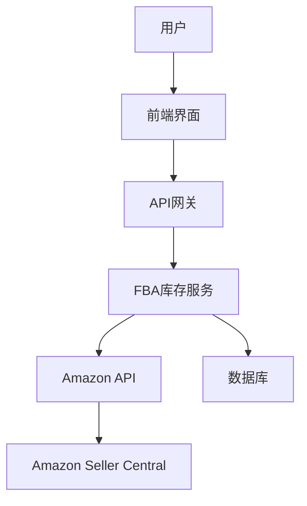
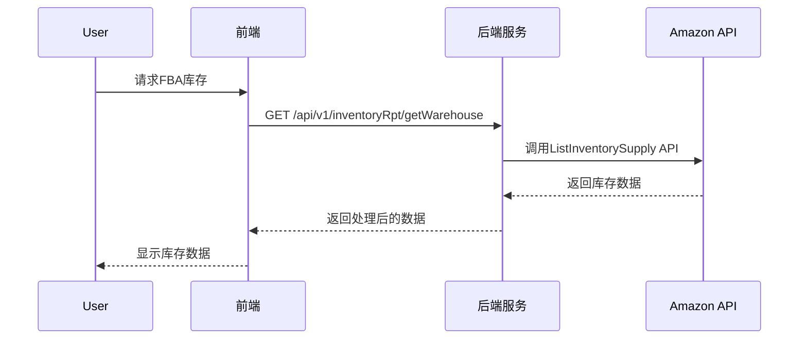

# FBA库存模块功能解析文档

## 1. 模块架构设计

### 1.1 系统架构

FBA库存模块采用前后端分离架构，前端基于Vue 3 + Element Plus开发，后端采用Spring Boot + MyBatis Plus + Amazon API集成。



### 1.2 核心组件

| 组件 | 职责 | 技术实现 |
|------|------|----------|
| 前端界面 | 用户交互 | Vue 3 + Element Plus |
| 后端服务 | 业务逻辑处理 | Spring Boot |
| Amazon API集成 | 数据同步 | AWS SDK for Java |
| 数据库 | 数据存储 | MySQL |

## 2. 技术实现细节

### 2.1 前端实现

#### 2.1.1 核心页面结构

```vue
<template>
  <div class="main-sty">
    <div class="con-header">
      <!-- 店铺选择器 -->
      <Group @change="groupChange" defaultValue="" isproduct="ok"></Group>
      <!-- 搜索框 -->
      <el-input v-model="queryParams.search" @input="handleQuery"></el-input>
      <!-- 导出按钮 -->
      <el-button type="primary" @click.stop="downloadExcel">导出</el-button>
      <!-- 欧洲国家切换 -->
      <el-radio-group v-if="queryParams.marketplaceid=='IEU'" v-model="radiotype" @change="handleQuery">
        <el-radio-button label="all">欧洲</el-radio-button>
        <el-radio-button label="other">欧洲各国</el-radio-button>
      </el-radio-group>
    </div>
    <div class="con-body">
      <!-- 库存表格 -->
      <GlobalTable
        ref="globalTable"
        :tableData="tableData"
        @loadTable="loadTableData"
        :stripe="true"
        height="calc(100vh - 210px)"
      >
        <!-- 列定义 -->
        <el-table-column prop="afnWarehouseQuantity" label="库存" />
        <el-table-column prop="afnFulfillableQuantity" label="可售库存" />
        <!-- 其他库存状态列 -->
      </GlobalTable>
    </div>
  </div>
</template>
```

#### 2.1.2 核心数据加载逻辑

```javascript
async function loadTableData(params) {
  try {
    const res = await inventoryRptApi.getWarehouse(params);
    state.tableData = res.data;
    // 处理欧洲库存按国家显示
    if (params.marketplaceid === 'IEU') {
      state.europeanView = true;
    }
  } catch (error) {
    console.error('加载库存数据失败:', error);
  }
}
```

### 2.2 后端实现

#### 2.2.1 控制器设计

```java
@RestController
@RequestMapping("/api/v1/inventoryRpt")
public class InventoryReportController {
    @Autowired
    private IFBAInventoryService fbaInventoryService;
    
    @PostMapping("/getWarehouse")
    public Result<?> getWarehouse(@RequestBody InventoryQueryDTO dto) {
        // 验证权限
        UserInfo user = UserInfoContext.get();
        // 调用服务层获取数据
        IPage<ProductInventoryVo> page = fbaInventoryService.findFbaInventory(dto);
        return Result.success(page);
    }
    
    @PostMapping("/getFBACountry")
    public Result<?> getFbaCountry(@RequestBody InventoryQueryDTO dto) {
        // 欧洲库存按国家查询逻辑
        if (!"IEU".equals(dto.getMarketplaceid())) {
            return Result.fail("非欧洲市场");
        }
        IPage<Map<String, Object>> page = fbaInventoryService.findEuropeanInventoryByCountry(dto);
        return Result.success(page);
    }
}
```

#### 2.2.2 服务层实现

```java
@Service
public class FBAInventoryServiceImpl implements IFBAInventoryService {
    @Autowired
    private AmazonInventoryClient amazonInventoryClient;
    
    @Override
    public IPage<ProductInventoryVo> findFbaInventory(InventoryQueryDTO dto) {
        // 调用Amazon API获取库存数据
        List<InventoryItem> items = amazonInventoryClient.getInventory(dto);
        // 转换为系统模型
        return convertToPage(items, dto.getPage());
    }
    
    @Override
    public IPage<Map<String, Object>> findEuropeanInventoryByCountry(InventoryQueryDTO dto) {
        // 按国家分组查询逻辑
        Map<String, List<InventoryItem>> countryMap = groupByCountry(dto);
        return convertToCountryPage(countryMap);
    }
}
```

#### 2.2.3 Amazon API集成

```java
@Service
public class AmazonInventoryClient {
    @Autowired
    private AmazonSPAPI amazonSPAPI;
    
    public List<InventoryItem> getInventory(InventoryQueryDTO dto) {
        // 使用AWS SDK调用Amazon FBA Inventory API
        List<InventoryItem> items = new ArrayList<>();
        try {
            // 调用ListInventorySupply API
            InventorySupplyList supplyList = amazonSPAPI.listInventorySupply(dto.getMarketplace());
            items = supplyList.getInventoryItems();
        } catch (ApiException e) {
            log.error("获取FBA库存失败: {}", e.getMessage());
        }
        return items;
    }
}
```

## 3. 数据库设计

### 3.1 核心表结构

#### 3.1.1 库存主表

| 字段 | 类型 | 描述 |
|------|------|------|
| id | BIGINT | 主键 |
| sku | VARCHAR(50) | 商品编码 |
| marketplaceid | VARCHAR(20) | 市场ID |
| afn_warehouse_quantity | INT | 库存总量 |
| afn_fulfillable_quantity | INT | 可售库存 |
| afn_reserved_quantity | INT | 预留库存 |
| afn_inbound_working | INT | 正在发货 |
| afn_inbound_shipped | INT | 待接收 |
| afn_inbound_receiving | INT | 正在接收 |
| afn_unsellable_quantity | INT | 不可售 |
| afn_researching_quantity | INT | 异常 |
| sync_time | DATETIME | 同步时间 |

#### 3.1.2 欧洲库存表

| 字段 | 类型 | 描述 |
|------|------|------|
| id | BIGINT | 主键 |
| sku | VARCHAR(50) | 商品编码 |
| country_code | VARCHAR(10) | 国家代码 |
| inventory_quantity | INT | 库存数量 |
| sync_time | DATETIME | 同步时间 |

### 3.2 数据同步机制



## 4. 权限管理

### 4.1 权限设计

| 权限点 | 描述 |
|--------|------|
| fba_inventory_view | 查看FBA库存数据 |
| european_inventory_country | 欧洲库存按国家显示 |
| inventory_export | 导出库存数据 |

### 4.2 角色定义

| 角色 | 权限 |
|------|------|
| 普通用户 | 查看FBA库存基本数据 |
| 运营经理 | 查看所有库存数据，欧洲库存按国家显示 |
| 管理员 | 所有权限 |

## 5. 性能优化

### 5.1 缓存策略

- 本地缓存：使用Caffeine缓存频繁访问的数据
- Redis缓存：缓存Amazon API响应
- 定时任务：异步同步库存数据

### 5.2 代码优化

#### 5.2.1 前端优化

- 使用虚拟滚动处理大量数据
- 延迟加载非核心数据
- 优化API请求频率

#### 5.2.2 后端优化

- 异步处理：使用CompletableFuture并行调用Amazon API
- 批量处理：减少API请求次数
- 数据库索引：优化查询性能

## 6. 监控与维护

### 6.1 监控指标

- API调用成功率
- 数据同步完整性
- 系统响应时间
- 并发用户数

### 6.2 日志管理

- 访问日志
- API调用日志
- 错误日志

### 6.3 常见问题排查

| 问题 | 排查步骤 |
|------|----------|
| 无法查看欧洲国家库存 | 1. 确认市场是否为IEU<br>2. 检查权限<br>3. 刷新页面重试 |
| 导出失败 | 1. 检查浏览器设置<br>2. 清理缓存 |

## 7. 总结

FBA库存模块是Wimoor系统的核心功能之一，通过与Amazon API深度集成，提供了全面的库存管理功能。该模块支持多维度数据展示，帮助卖家高效管理全球FBA库存，优化库存结构。系统采用前后端分离架构，确保了良好的扩展性和可靠性。

通过合理的权限设计和性能优化，该模块能够满足不同规模卖家的需求，从单一产品到海量SKU的管理。未来将持续优化，提供更智能的库存预测和建议功能。