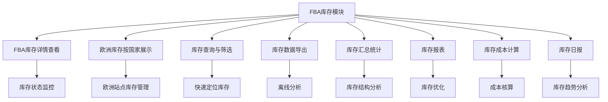

# FBA库存模块详细帮助文档

## 1. 模块介绍

### 1.1 什么是FBA库存模块？

FBA库存模块是 Wimoor 系统中用于管理和监控 Amazon FBA 库存的核心功能模块。该模块位于系统的 Amazon 模块中，主要负责展示和管理 FBA 库存的详细信息，包括库存总量、可售库存、预留库存、正在发货、待接收、正在接收、不可用和异常等状态的库存数据。

### 1.2 模块定位与价值

- **定位**：连接 Amazon FBA 库存数据与用户管理需求的桥梁，是 FBA 库存管理的核心工具
- **价值**：
  - 实时监控 FBA 库存状态和数量变化
  - 支持多维度查看库存数据，包括仓库维度和国家维度
  - 提供丰富的库存报表和导出功能
  - 帮助用户优化库存管理，降低库存成本
  - 支持欧洲地区库存按国家（英国、德国、法国、意大利、西班牙、波兰）分别展示

### 1.3 适用场景

- 查看 FBA 库存的实时状态和数量
- 分析库存结构，了解不同状态库存的分布情况
- 监控库存变化趋势，预测库存需求
- 生成库存报表，用于数据分析和决策
- 导出库存数据，用于离线分析和报告

## 2. 功能概览

### 2.1 主要功能

| 功能 | 描述 | 适用场景 |
|------|------|----------|
| FBA库存详情查看 | 展示FBA库存的详细信息，包括库存总量、可售库存、预留库存等 | 实时监控库存状态 |
| 欧洲库存按国家展示 | 支持欧洲地区库存按国家分别展示 | 欧洲站点库存管理 |
| 库存查询与筛选 | 支持按SKU查询库存，支持按店铺和市场筛选 | 快速定位特定商品库存 |
| 库存数据导出 | 支持导出FBA库存数据到Excel | 离线分析和报告生成 |
| 库存汇总统计 | 自动计算库存汇总数据，包括各类库存的总和 | 库存结构分析 |
| 库存报表 | 提供滞销报表等库存分析报表 | 库存优化和决策支持 |
| 库存成本计算 | 计算FBA库存的成本信息 | 成本核算和利润分析 |
| 库存日报 | 展示FBA库存的每日变化详情 | 库存变化趋势分析 |

### 2.2 功能流程图

## 3. 操作指南

### 3.1 访问模块

1. **登录系统**：使用您的账号密码登录 Wimoor 系统
2. **进入 Amazon 模块**：在左侧导航栏中点击「Amazon」
3. **进入库存管理**：在 Amazon 模块下找到「库存」菜单
4. **选择 FBA 库存**：点击「FBA库存」进入模块页面

### 3.2 FBA库存详情查看

#### 3.2.1 基本操作

1. **选择店铺和市场**：在页面顶部的店铺选择器中选择要查看的店铺和市场
2. **查看库存数据**：系统会自动加载并显示所选店铺和市场的 FBA 库存数据
3. **浏览库存列表**：
   - 查看产品信息（图片、名称、SKU）
   - 查看仓库信息
   - 查看各类库存数据（库存总量、可售库存、预留库存、正在发货、待接收、正在接收、不可用、异常）
4. **查看汇总数据**：在表格底部查看各类库存的汇总数据

#### 3.2.2 欧洲库存按国家展示

1. **选择欧洲市场**：在店铺选择器中选择欧洲市场（如 IEU）
2. **切换到国家视图**：点击页面顶部的「欧洲各国」单选按钮
3. **查看各国库存**：系统会按国家（英国、德国、法国、意大利、西班牙、波兰）分别展示库存数据
4. **切换回欧洲视图**：点击页面顶部的「欧洲」单选按钮，可切换回欧洲整体库存视图

### 3.3 库存查询与筛选

1. **按 SKU 查询**：在搜索框中输入要查询的 SKU，点击搜索按钮
2. **查看搜索结果**：系统会筛选并显示匹配的 SKU 库存数据
3. **清除搜索条件**：点击搜索框右侧的清除按钮，可清除搜索条件，显示全部库存数据

### 3.4 库存数据导出

1. **选择导出范围**：确保已选择要导出的店铺和市场
2. **点击导出按钮**：在页面顶部点击「导出」按钮
3. **等待导出完成**：系统会生成 Excel 文件并自动下载到您的电脑
4. **查看导出文件**：打开下载的 Excel 文件，查看导出的库存数据

### 3.5 库存报表使用

#### 3.5.1 滞销报表

1. **进入滞销报表**：在 FBA 库存模块中找到并点击「滞销报表」选项
2. **设置筛选条件**：选择店铺、市场、时间范围等筛选条件
3. **查看报表数据**：系统会显示滞销库存的详细数据
4. **导出报表**：点击「导出」按钮，将滞销报表导出到 Excel

#### 3.5.2 库存成本报表

1. **进入库存成本报表**：在 FBA 库存模块中找到并点击「库存成本」选项
2. **设置筛选条件**：选择店铺、市场、SKU 等筛选条件
3. **查看成本数据**：系统会显示 FBA 库存的成本信息
4. **导出成本报表**：点击「导出」按钮，将库存成本报表导出到 Excel

### 3.6 库存日报查看

1. **进入库存日报**：在 FBA 库存模块中找到并点击「库存日报」选项
2. **设置时间范围**：选择要查看的日期范围
3. **查看日报数据**：系统会显示所选时间范围内的库存每日变化详情
4. **导出日报数据**：点击「导出」按钮，将库存日报数据导出到 Excel

## 4. 页面导航与界面说明

### 4.1 页面结构

#### 4.1.1 顶部导航栏

- 系统logo和名称
- 用户名和退出按钮
- 消息通知
- 快捷操作按钮

#### 4.1.2 左侧菜单栏

- Amazon 模块入口
- 库存管理菜单
- FBA 库存子菜单
- FBA 库存日报子菜单

#### 4.1.3 主内容区

- 店铺和市场选择器
- 搜索框和搜索按钮
- 导出按钮
- 欧洲/欧洲各国切换按钮
- 库存数据表格
- 库存汇总数据

### 4.2 界面元素说明

#### 4.2.1 店铺和市场选择器

- **功能**：选择要查看的店铺和市场
- **操作**：点击下拉菜单，选择对应的店铺和市场
- **影响**：系统会根据选择的店铺和市场加载相应的库存数据

#### 4.2.2 搜索框

- **功能**：按 SKU 查询库存
- **操作**：在搜索框中输入 SKU，点击搜索按钮
- **影响**：系统会筛选并显示匹配的 SKU 库存数据

#### 4.2.3 导出按钮

- **功能**：导出 FBA 库存数据到 Excel
- **操作**：点击导出按钮
- **影响**：系统会生成 Excel 文件并自动下载

#### 4.2.4 欧洲/欧洲各国切换按钮

- **功能**：切换欧洲库存的展示方式
- **操作**：点击相应的单选按钮
- **影响**：
  - 选择「欧洲」：显示欧洲整体库存数据
  - 选择「欧洲各国」：按国家分别显示库存数据

#### 4.2.5 库存数据表格

- **产品信息列**：显示产品图片、名称和 SKU
- **仓库列**：显示产品所在的仓库
- **库存总量列**：显示 FBA 仓库的总库存数量
- **可售库存列**：显示可用于销售的库存数量
- **预留库存列**：显示已被预留的库存数量
- **正在发货列**：显示正在发货过程中的库存数量
- **待接收列**：显示已发货但尚未被接收的库存数量
- **正在接收列**：显示正在被接收的库存数量
- **不可用列**：显示不可用的库存数量
- **异常列**：显示异常状态的库存数量

### 4.3 导航路径

- 系统首页 → Amazon → 库存 → FBA库存 → FBA库存详情页
- 系统首页 → Amazon → 库存 → FBA库存 → FBA库存日报页
- FBA库存详情页 → 库存导出（点击导出按钮）
- FBA库存详情页 → 欧洲库存按国家展示（切换单选按钮）

## 5. 常见问题与解决方案

### 5.1 操作类问题

#### 5.1.1 无法查看库存数据

**问题现象**：进入 FBA 库存页面后，无法显示库存数据

**可能原因**：
- 未选择店铺和市场
- 所选店铺或市场没有 FBA 库存数据
- 网络连接问题
- 系统权限问题

**解决方案**：
- 确保已正确选择店铺和市场
- 检查所选店铺或市场是否有 FBA 库存
- 检查网络连接是否正常
- 联系管理员确认是否有查看 FBA 库存的权限

#### 5.1.2 库存数据不更新

**问题现象**：系统显示的库存数据与实际 Amazon 后台数据不符

**可能原因**：
- 数据同步延迟
- 系统缓存问题
- Amazon API 限制导致同步失败

**解决方案**：
- 等待一段时间后刷新页面，数据可能正在同步中
- 清除浏览器缓存后重新加载页面
- 检查系统是否有数据同步失败的通知
- 联系技术支持检查数据同步情况

#### 5.1.3 无法导出库存数据

**问题现象**：点击导出按钮后，无法生成或下载 Excel 文件

**可能原因**：
- 浏览器阻止了弹出窗口或下载
- 库存数据量过大，生成文件需要时间
- 系统临时故障

**解决方案**：
- 检查浏览器设置，允许弹出窗口和下载
- 等待一段时间，大文件生成可能需要较长时间
- 刷新页面后重新尝试导出
- 联系技术支持解决系统故障

### 5.2 系统类问题

#### 5.2.1 页面加载缓慢

**问题现象**：FBA 库存页面加载时间过长

**可能原因**：
- 库存数据量过大
- 网络连接问题
- 系统负载过高
- 浏览器性能问题

**解决方案**：
- 检查网络连接，确保网络正常
- 关闭浏览器中不必要的标签页和插件
- 尝试使用其他浏览器访问
- 避开系统高峰期使用
- 联系技术支持优化系统性能

#### 5.2.2 欧洲库存无法按国家显示

**问题现象**：选择欧洲市场后，无法切换到欧洲各国视图

**可能原因**：
- 所选市场不是欧洲市场
- 系统权限问题
- 系统功能故障

**解决方案**：
- 确保选择的是欧洲市场（如 IEU）
- 联系管理员确认是否有欧洲库存按国家显示的权限
- 刷新页面后重新尝试切换
- 联系技术支持解决系统故障

### 5.3 数据类问题

#### 5.3.1 库存数据缺失

**问题现象**：某些 SKU 的库存数据缺失或显示为零

**可能原因**：
- 该 SKU 没有 FBA 库存
- 数据同步不完整
- Amazon API 限制导致部分数据无法获取

**解决方案**：
- 确认该 SKU 是否真的没有 FBA 库存
- 刷新页面，重新加载数据
- 联系技术支持检查数据同步情况
- 直接在 Amazon 后台确认库存数据

#### 5.3.2 库存数据错误

**问题现象**：系统显示的库存数据与实际不符

**可能原因**：
- 数据同步错误
- Amazon API 返回错误数据
- 系统计算错误

**解决方案**：
- 刷新页面，重新加载数据
- 直接在 Amazon 后台确认库存数据
- 联系技术支持检查数据同步和计算逻辑

## 6. 最佳实践

### 6.1 FBA库存管理最佳实践

#### 6.1.1 定期监控库存状态

- **建议频率**：每天至少查看一次核心产品的库存状态
- **关注重点**：可售库存、预留库存、待接收库存
- **操作方法**：使用 FBA 库存详情页面，设置定期提醒

#### 6.1.2 优化库存结构

- **分析维度**：
  - 各类库存占比分析
  - 库存周转率分析
  - 滞销库存分析
- **优化策略**：
  - 减少滞销库存，提高库存周转率
  - 合理安排补货，避免库存积压
  - 优化预留库存管理，减少不必要的预留

#### 6.1.3 利用库存报表进行决策

- **滞销报表**：识别滞销库存，制定清理策略
- **库存成本报表**：分析库存成本，优化采购策略
- **库存日报**：监控库存变化趋势，预测库存需求

### 6.2 操作技巧

#### 6.2.1 快速定位库存

- **使用搜索功能**：按 SKU 快速定位特定商品的库存
- **使用筛选功能**：按店铺和市场筛选库存数据
- **使用排序功能**：点击表格列头对库存数据进行排序

#### 6.2.2 高效导出库存数据

- **选择合适的导出时机**：避开系统高峰期导出大量数据
- **设置合理的筛选条件**：只导出需要的数据，减少文件大小
- **定期备份数据**：定期导出库存数据，用于数据分析和备份

#### 6.2.3 合理使用欧洲库存视图

- **欧洲视图**：查看欧洲整体库存情况，适合宏观分析
- **欧洲各国视图**：查看各国库存分布，适合精细化管理
- **根据需求切换**：根据实际管理需求灵活切换视图

### 6.3 效率提升建议

- **建立库存监控机制**：设置库存预警，及时发现库存异常
- **自动化库存管理**：利用系统的自动同步功能，减少手动操作
- **标准化库存流程**：建立标准化的库存管理流程，提高管理效率
- **培训团队成员**：确保团队成员熟悉 FBA 库存模块的使用
- **持续优化**：根据业务需求和系统反馈，持续优化库存管理流程

## 7. 故障排除

### 7.1 常见错误与解决方法

| 错误信息 | 可能原因 | 解决方法 |
|---------|---------|---------|
| 无法加载库存数据 | 网络问题、权限问题 | 检查网络连接，确认权限 |
| 库存数据不更新 | 数据同步延迟、缓存问题 | 刷新页面，清除缓存 |
| 导出失败 | 浏览器设置、数据量过大 | 检查浏览器设置，减少数据量 |
| 页面加载缓慢 | 数据量过大、系统负载高 | 减少筛选范围，避开高峰期 |
| 欧洲库存无法按国家显示 | 市场选择错误、权限问题 | 确认选择欧洲市场，检查权限 |

### 7.2 问题排查步骤

1. **确认问题现象**：详细描述问题发生的场景和具体表现
2. **检查基本条件**：
   - 网络连接是否正常
   - 操作步骤是否正确
   - 权限设置是否合理
3. **尝试基本解决方法**：
   - 刷新页面
   - 清除浏览器缓存
   - 重新登录系统
   - 检查系统通知
4. **联系技术支持**：
   - 如问题持续存在，联系技术支持
   - 提供详细的问题描述和操作步骤
   - 提供相关的错误信息和截图

### 7.3 技术支持联系方式

- **在线客服**：系统右下角「在线客服」按钮
- **邮件支持**：support@wimoor.com
- **电话支持**：400-123-4567
- **技术文档**：系统内「帮助中心」

## 8. 术语解释

### 8.1 系统术语

| 术语 | 解释 |
|------|------|
| FBA | Fulfillment by Amazon，亚马逊物流服务 |
| SKU | Stock Keeping Unit，库存保有单位，用于标识商品 |
| 库存总量 | FBA 仓库中的总库存数量 |
| 可售库存 | 可以立即销售的库存数量 |
| 预留库存 | 已被预留的库存数量，如已下单但尚未发货的订单占用的库存 |
| 正在发货 | 正在从发货仓库运往亚马逊仓库的库存数量 |
| 待接收 | 已发货但尚未被亚马逊仓库接收的库存数量 |
| 正在接收 | 正在被亚马逊仓库接收和处理的库存数量 |
| 不可用 | 由于各种原因无法销售的库存数量 |
| 异常 | 存在异常情况的库存数量，如破损、丢失等 |

### 8.2 欧洲市场术语

| 术语 | 解释 |
|------|------|
| IEU | 欧洲统一市场代码 |
| GB | 英国市场代码 |
| DE | 德国市场代码 |
| FR | 法国市场代码 |
| IT | 意大利市场代码 |
| ES | 西班牙市场代码 |
| PL | 波兰市场代码 |

### 8.3 报表术语

| 术语 | 解释 |
|------|------|
| 滞销报表 | 展示滞销库存的详细信息，包括滞销天数、数量等 |
| 库存成本报表 | 展示 FBA 库存的成本信息，包括采购成本、运费等 |
| 库存日报 | 展示 FBA 库存的每日变化详情 |
| 库存汇总 | 各类库存的总和数据 |

## 9. 功能亮点与优势

### 9.1 功能亮点

#### 9.1.1 多维度库存展示

- **仓库维度**：按仓库展示库存数据，适合全球库存管理
- **国家维度**：按国家展示库存数据，适合欧洲站点精细化管理
- **状态维度**：按库存状态展示数据，清晰了解库存结构
- **产品维度**：按产品展示库存数据，便于产品级库存管理

#### 9.1.2 实时数据同步

- **自动同步**：系统自动与 Amazon API 同步库存数据
- **数据准确**：确保展示的库存数据与 Amazon 后台保持一致
- **实时更新**：及时反映库存变化情况

#### 9.1.3 丰富的报表功能

- **多种报表类型**：提供滞销报表、库存成本报表、库存日报等多种报表
- **灵活的筛选条件**：支持按店铺、市场、时间范围等条件筛选报表数据
- **Excel 导出**：支持将报表导出到 Excel，便于离线分析

#### 9.1.4 欧洲库存特殊处理

- **欧洲统一视图**：提供欧洲整体库存视图，便于宏观管理
- **欧洲各国视图**：提供按国家分别展示的库存视图，便于精细化管理
- **无缝切换**：支持在两种视图间无缝切换，满足不同管理需求

### 9.2 系统优势

- **操作简便**：界面设计简洁直观，操作流程优化
- **功能全面**：覆盖 FBA 库存管理的所有核心功能
- **数据准确**：与 Amazon API 实时同步，确保数据准确性
- **性能稳定**：系统稳定可靠，支持大量库存数据的处理
- **扩展性强**：模块化设计，易于功能扩展和升级
- **安全可靠**：完善的权限管理和数据安全机制

## 10. 总结与建议

### 10.1 模块价值总结

FBA 库存模块是 Wimoor 系统中一个功能强大、设计精良的模块，通过与 Amazon API 的实时同步，为用户提供了全面、准确的 FBA 库存管理功能。该模块不仅支持多维度的库存展示，还提供了丰富的报表和导出功能，帮助用户实时监控库存状态，优化库存结构，降低库存成本。

### 10.2 使用建议

1. **充分利用多维度展示功能**：根据管理需求灵活切换库存视图
2. **定期监控库存状态**：建立库存监控机制，及时发现库存异常
3. **利用报表进行数据分析**：定期生成和分析库存报表，优化库存管理
4. **合理设置筛选条件**：使用筛选功能快速定位需要的库存数据
5. **定期导出备份数据**：定期导出库存数据，用于离线分析和备份
6. **培训团队成员**：确保团队成员熟悉模块的使用，提高管理效率
7. **持续优化库存管理**：根据报表分析结果，持续优化库存管理策略

### 10.3 未来展望

随着亚马逊 FBA 业务的不断发展，FBA 库存模块也将持续优化和升级，未来可能会增加更多功能，如：

- 库存预测和智能补货建议
- 库存异常自动预警
- 多仓库库存调拨功能
- 更详细的库存成本分析
- 移动端支持，随时随地查看库存
- AI 驱动的库存优化建议

我们将不断倾听用户反馈，持续改进系统功能，为您提供更优质的 FBA 库存管理体验。

## 11. 附录

### 11.1 操作快捷键

| 快捷键 | 功能 |
|--------|------|
| F5 | 刷新页面 |
| Ctrl + F | 页面内搜索 |
| 点击列头 | 对列进行排序 |

### 11.2 相关模块链接

- **FBA 库存日报模块**：查看 FBA 库存的每日变化详情
- **发货计划模块**：创建和管理 FBA 发货计划
- **货件处理模块**：处理和管理 FBA 发货计划中的货件
- **库存计划模块**：制定和管理库存计划

### 11.3 参考文档

- [Amazon FBA 库存管理指南](https://sellercentral.amazon.com/gp/help/external/200141390)
- [Wimoor 系统使用手册](https://docs.wimoor.com)
- [FBA 库存优化最佳实践](https://sellercentral.amazon.com/gp/help/external/201112950)

### 11.4 常见问题解答

**Q: FBA 库存模块的数据多久更新一次？**

A: FBA 库存模块的数据会定期与 Amazon API 同步，具体更新频率取决于系统设置和 Amazon API 限制。一般情况下，数据会在数小时内更新一次，确保展示的库存数据与 Amazon 后台保持一致。

**Q: 如何查看特定 SKU 的库存数据？**

A: 在页面顶部的搜索框中输入 SKU，然后点击搜索按钮，系统会筛选并显示匹配的 SKU 库存数据。

**Q: 欧洲库存按国家显示功能支持哪些国家？**

A: 欧洲库存按国家显示功能支持英国（GB）、德国（DE）、法国（FR）、意大利（IT）、西班牙（ES）和波兰（PL）六个国家。

**Q: 如何导出 FBA 库存数据？**

A: 点击页面顶部的「导出」按钮，系统会生成 Excel 文件并自动下载到您的电脑。

**Q: 库存汇总数据在哪里查看？**

A: 库存汇总数据显示在库存数据表格的底部，包括各类库存的总和数据。

**Q: 系统显示的库存数据与 Amazon 后台不符怎么办？**

A: 首先检查数据是否正在同步中，等待一段时间后刷新页面。如果问题持续存在，可能是数据同步失败或 Amazon API 限制导致，建议联系技术支持解决。