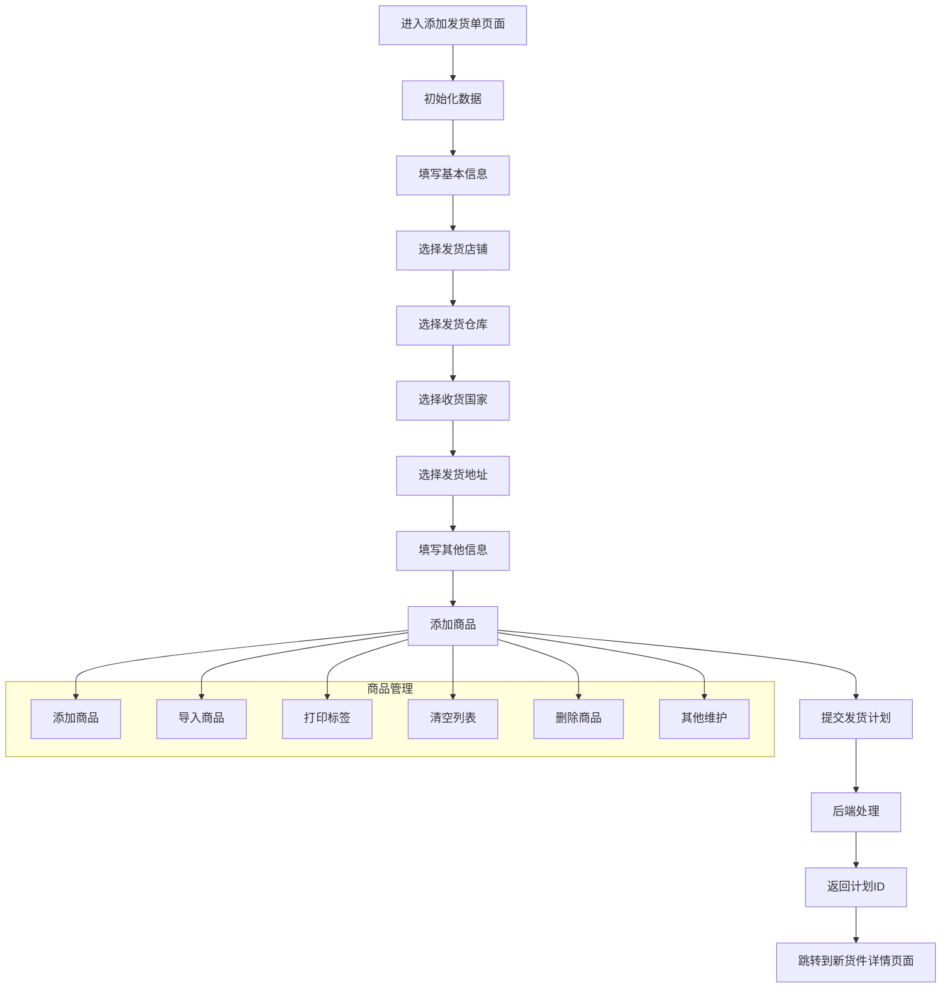

# index.vue 详细分析文档

## 1. 组件概述

`index.vue` 是一个用于创建 FBA 发货单的前端组件，位于 `wimoor666\wimoor-ui\src\views\erp\shipv2\shipment_add\create\index.vue`。该组件是 FBA 发货流程的起点，主要功能是收集发货计划的基本信息，包括发货店铺、仓库、收货国家、发货地址等，并允许用户添加发货商品，最终提交创建发货计划。

## 2. 前端组件结构

### 2.1 模板结构

```vue
<template>
  <div class="add-from el-white-bg">
    <div class="gird-line-head">
      <h3>添加发货单</h3>
      <el-tooltip content="亚马逊错误信息帮助文档">
        <el-button @click="openDoc" class='ic-btn'>
          <help theme="outline" size="16" :strokeWidth="3"/>
        </el-button>
      </el-tooltip>
    </div>
    <Fromlist/>
  </div>
</template>
```

### 2.2 核心组件

`index.vue` 是一个简单的容器组件，实际的表单逻辑在 `Fromlist` 组件中（即 `./components/form.vue`）。`Fromlist` 组件包含了完整的发货单创建表单，包括：

1. **基本信息**：计划编码、发货店铺、发货仓库、收货国家、发货地址、备注、运输方式、物流方式、单据类型
2. **商品列表**：添加商品、导入商品、打印标签、清空列表、商品信息编辑
3. **对话框**：地址编辑对话框、商品选择对话框、导入数据对话框、其它信息设置对话框

### 2.3 核心数据结构

```javascript
// 响应式数据
const state = reactive({
  operatorVisiable: false,
  operatorRow: null,
  selectFBACheck: true,
  totalproducts: 0,
  addrIndex: 3,
  formData: {
    name: "",
    groupid: "",
    warehouseid: "",
    marketplaceid: "",
    transtyle: "SP",
    channel: "",
    remark: "",
    arecase: "0",
    transinfo: { company: "", number: "" },
    sourceAddress: "",
    invtype: 0
  },
  showall: true,
  submitloading: false,
  groupList: [],
  marketList: [],
  warehouseList: [],
  tranlist: [],
  transTypeAllList: [],
  channellist: [],
  inplaceList: [],
  addressData: [],
  productlist: [],
  downloadVisible: false,
  fileList: [],
  logofile: undefined,
  queryData: {
    id: "",
    warehouseid: "",
    marketplaceid: "",
    issplit: "",
    groupid: "",
    shipmentid: ""
  }
});
```

## 3. API 调用分析

### 3.1 前端 API 调用

| API 方法 | 用途 | 参数 | 来源 |
|---------|------|------|------|
| `groupApi.getAmazonGroup()` | 获取店铺列表 | 无 | [AmazonAuthorityController.java:74](d:\work\wimoor666\wimoor666\wimoor-amazon\amazon-boot\src\main\java\com\wimoor\amazon\auth\controller\AmazonAuthorityController.java:74) |
| `marketApi.getMarketByGroup({groupid})` | 获取国家列表 | `{groupid}` | [AmazonAuthorityController.java:106](d:\work\wimoor666\wimoor666\wimoor-amazon\amazon-boot\src\main\java\com\wimoor\amazon\auth\controller\AmazonAuthorityController.java:106) |
| `warehouseApi.getWarehouseUseable()` | 获取仓库列表 | 无 | - |
| `shipaddressApi.getAddressByid({addressid, groupid})` | 获取地址列表 | `{addressid, groupid}` | - |
| `serialnumberApi.getSerialNumber({ftype, isfind})` | 获取序列号 | `{ftype: 'SF', isfind: 'true'}` | - |
| `transportationApi.getTransTypeAll()` | 获取物流类型列表 | 无 | - |
| `shipmentplanApi.saveInboundPlan(formData)` | 保存入库计划 | `formData` | [ShipInboundPlanV2Controller.java:99](d:\work\wimoor666\wimoor666\wimoor-amazon\amazon-boot\src\main\java\com\wimoor\amazon\inboundV2\controller\ShipInboundPlanV2Controller.java:99) |
| `profitParamApi.getInplaceList({country})` | 获取入库地点列表 | `{country: 'US'}` | - |

### 3.2 后端控制器实现

#### 3.2.1 saveInboundPlan 控制器

```java
@ApiOperation(value = "提交发货计划")
@PostMapping("/saveInboundPlan")
@SystemControllerLog("新增")    
@Transactional
public Result<String> saveInboundPlanAction(@ApiParam("发货计划")@RequestBody ShipInboundPlan inplan){
    UserInfo user=UserInfoContext.get();
    inplan.setCreatetime(new Date());
    inplan.setCreator(user.getId());
    inplan.setOperator(user.getId());
    inplan.setOpttime(new Date());
    inplan.setShopid(user.getCompanyid());
    inplan.setAuditstatus(1);
    inplan.setInvstatus(0);
    try {
        inplan.setNumber(serialNumService.readSerialNumber(user.getCompanyid(), "SF"));
    } catch (Exception e) {
        e.printStackTrace();
        try {
            inplan.setNumber(serialNumService.readSerialNumber(user.getCompanyid(), "SF"));
        } catch (Exception e1) {
            e1.printStackTrace();
            throw new BizException("编码获取失败,请联系管理员");
        }
    }
    try {
        if(inplan.getInvtype()==null) {
            inplan.setInvtype(0);
        }
        shipInboundPlanV2Service.saveShipInboundPlan(inplan);
        shipInboundV2ShipmentRecordService.saveRecord(inplan);
        if(StrUtil.isNotBlank(inplan.getBatchnumber()) ) {
            iAmzProductSalesPlanShipItemService.moveBatch(user.getCompanyid(),inplan.getBatchnumber());
        }
        return Result.success(inplan.getId());
    }catch(FeignException e) {
        throw new BizException("提交失败" +e.getMessage());
    }catch(Exception e) {
        throw new BizException("提交失败" +e.getMessage());
    }
}
```

#### 3.2.2 getAmazonGroup 控制器

```java
@ApiOperation(value = "获取店铺")
@GetMapping("/getAmazonGroup")
public Result<List<AmazonGroup>> getAmazonGroupAction() {
    UserInfo userinfo = UserInfoContext.get();
    List<AmazonGroup> result = iAmazonGroupService.getGroupByUser(userinfo);
    return Result.success(result);
}
```

#### 3.2.3 getMarketByGroup 控制器

```java
@ApiOperation(value = "获取站点")
@GetMapping("/getMarketByGroup")
public Result<List<Marketplace>> getMarketByGroupAction(String groupid) {
    List<Marketplace> result = iMarketplaceService.findMarketplaceByGroup(groupid);
    if(StrUtil.isEmptyIfStr(groupid)) {
        return getMarketBindAction();
    }else {
        return Result.success(result);
    }
}
```

## 4. 后端数据模型

### 4.1 核心实体类

#### 4.1.1 ShipInboundPlan

```java
@Data
@EqualsAndHashCode(callSuper = true)
@ApiModel(value="ShipInboundPlan对象", description="货件")
@TableName("t_erp_ship_v2_inboundplan")
public class ShipInboundPlan extends AmazonBaseEntity{
    @ApiModelProperty(value = "计划名称")
    @NotNull(message="名称不能为空")
    @Size(max=200,message="名称不能超过200个字符")
    @TableField(value="name")
    private String name;

    @ApiModelProperty(value = "计划编码")
    @TableField(value="number")
    private String number;

    @ApiModelProperty(value = "发货地址ID")
    @TableField(value="source_address")
    private String sourceAddress;

    @ApiModelProperty(value = "店铺ID")
    @TableField(value="groupid")
    private String groupid;

    @ApiModelProperty(value = "站点ID")
    @TableField(value="marketplaceid")
    private String marketplaceid;
    
    @ApiModelProperty(value = "授权ID")
    @TableField(value="amazonauthid")
    private String amazonauthid;

    @ApiModelProperty(value = "仓库ID")
    @TableField(value="warehouseid")
    private String warehouseid;

    @ApiModelProperty(value = "审核人")
    @TableField(value="auditor")
    private String auditor;

    @ApiModelProperty(value = "审核状态[0：未处理，1：被审核，2：驳回，3：创建，4：取消]")
    @TableField(value="auditstatus")
    private Integer auditstatus;
    
    // 其他字段...
    
    @TableField(exist = false)
    @ApiModelProperty(value = "产品列表")
    private List<ShipInboundItem> planitemlist=new LinkedList<ShipInboundItem>();
}
```

#### 4.1.2 ShipInboundItem

```java
@Data
@EqualsAndHashCode(callSuper = true)
@ApiModel(value="ShipInboundItem对象", description="货件Item")
@TableName("t_erp_ship_v2_inbounditem")
public class ShipInboundItem extends BaseEntity {
    @ApiModelProperty(value = "订单ID【订单填写】")
    @TableField(value="formid")
    private String formid;
    
    @TableField(value="expiration")
    private Date expiration;

    @ApiModelProperty(value = "贴标【AMAZON，SELLER】")
    @TableField(value="label_owner")
    private String labelOwner;

    @ApiModelProperty(value = "manufacturingLotCode")
    @TableField(value="manufacturing_lot_code")
    private String manufacturingLotCode;
    
    @ApiModelProperty(value = "预备信息处理人【AMAZON，SELLER】")
    @TableField(value="prep_owner")
    private String prepOwner;
    
    @ApiModelProperty(value = "平台SKU【订单填写】")
    @TableField(value="sku")
    private String sku;

    @ApiModelProperty(value = "ERP本地SKU【订单填写】")
    @TableField(value="msku")
    private String msku;
    
    @ApiModelProperty(value = "订单数量【订单填写】")
    @TableField(value="quantity")
    private Integer quantity;
    
    @ApiModelProperty(value = "发货量【系统内置】")
    @TableField(value="confirm_quantity")
    private Integer confirmQuantity;

    // 其他字段...
}
```

#### 4.1.3 ShipInboundShipment

```java
@Data
@ApiModel(value="ShipInboundShipment对象", description="货件")
@TableName("t_erp_ship_v2_inboundshipment")
public class ShipInboundShipment {
    @ApiModelProperty(value = "货件ID【系统填写】")
    @TableId(value="shipmentid")
    private String shipmentid;

    @ApiModelProperty(value = "货件ID【系统填写】")
    @TableField(value="shipment_confirmation_id")
    private String shipmentConfirmationId;

    @ApiModelProperty(value = "亚马逊仓库中心代码【系统填写】")
    @TableField(value="destination")
    private String destination;

    @ApiModelProperty(value = "发货地址ID【系统填写】")
    @TableField(value="addressid")
    private String addressid;

    // 其他字段...
}
```

## 5. 业务逻辑流程

### 5.1 初始化流程

1. **组件加载**：`onMounted` 钩子函数触发初始化
2. **初始化查询数据**：`initQueryData()` 从路由参数中获取初始化数据
3. **加载计划名称**：`loadShipName()` 生成计划名称
4. **加载计划编码**：`loadNumber()` 获取序列号作为计划编码
5. **加载店铺列表**：`getGroupData("init")` 获取店铺列表并设置默认值
6. **加载仓库列表**：`getWarehouseData()` 获取仓库列表并设置默认值
7. **加载物流方式**：`getTranList()` 获取物流方式列表
8. **加载入库地点**：`loadInplace()` 获取入库地点列表

### 5.2 表单填写流程

1. **基本信息填写**：
   - 选择发货店铺 → 触发 `groupChange()` → 加载对应市场列表和地址列表
   - 选择发货仓库 → 触发 `warehouseChange()` → 更新仓库信息
   - 选择收货国家 → 触发 `marketChange()` → 更新国家信息并验证 SKU
   - 选择发货地址 → 触发 `radioChange()` → 更新地址信息
   - 填写备注、运输方式、物流方式、单据类型

2. **商品管理**：
   - **添加商品**：点击"添加商品"按钮 → 打开商品选择对话框 → 选择商品 → 触发 `getdata()` → 添加商品到列表
   - **导入商品**：点击"导入"按钮 → 打开导入数据对话框 → 上传文件 → 处理导入数据
   - **打印标签**：点击"打印当前产品标签"按钮 → 打印商品标签
   - **清空列表**：点击"清空列表"按钮 → 清空商品列表
   - **删除商品**：点击商品行的"删除"按钮 → 从列表中移除商品
   - **其他维护**：点击"其它维护"按钮 → 打开其它信息设置对话框 → 设置预备信息处理人、贴标人、保质期

### 5.3 提交流程

1. **准备数据**：
   - 收集表单数据
   - 处理商品列表数据
   - 设置计划项目列表

2. **提交计划**：
   - 点击"提交"按钮 → 触发 `submitPlan()`
   - 显示加载状态
   - 调用 `shipmentplanApi.saveInboundPlan(state.formData)` 提交数据
   - 处理响应：显示成功消息 → 跳转到新货件详情页面

3. **取消操作**：
   - 点击"取消"按钮 → 触发 `cancelPlan()` → 清空商品列表并触发取消事件

## 6. 代码优化建议

### 6.1 前端优化

1. **错误处理增强**：添加更详细的错误处理和用户提示，特别是在 API 调用失败时
2. **性能优化**：对于大量商品的列表，考虑使用虚拟滚动
3. **代码组织**：将复杂的业务逻辑拆分为更小的函数，提高代码可读性
4. **表单验证**：添加更严格的表单验证，确保数据完整性
5. **用户体验**：添加加载状态和进度指示，提升用户体验
6. **代码复用**：提取重复的代码为公共函数或组件

### 6.2 后端优化

1. **事务管理**：确保 `saveInboundPlan` 方法中的事务处理更加健壮
2. **参数验证**：增强请求参数的验证，确保数据完整性
3. **错误处理**：提供更详细的错误信息，便于前端处理
4. **性能优化**：对于频繁查询的数据，考虑添加缓存
5. **日志记录**：添加详细的日志记录，便于问题排查

## 7. 输入输出示例

### 7.1 输入示例

```javascript
// 表单数据示例
const formData = {
  name: "PLN(1/22/2026 14:30)-1",
  number: "SF202601220001",
  groupid: "group1",
  warehouseid: "warehouse1",
  marketplaceid: "US",
  amazonauthid: "auth1",
  sourceAddress: "address1",
  remark: "测试发货计划",
  transtyle: "SP",
  transtype: "trans1",
  invtype: 0,
  planitemlist: [
    {
      sku: "SKU001",
      msku: "MSKU001",
      quantity: 10,
      labelOwner: "SELLER",
      prepOwner: "SELLER",
      materialid: "material1",
      sellersku: "SKU001"
    },
    {
      sku: "SKU002",
      msku: "MSKU002",
      quantity: 5,
      labelOwner: "SELLER",
      prepOwner: "SELLER",
      materialid: "material2",
      sellersku: "SKU002"
    }
  ]
};

// 调用API
const { data } = await shipmentplanApi.saveInboundPlan(formData);
```

### 7.2 输出示例

```javascript
// 成功响应
{
  "code": 0,
  "msg": "",
  "data": "plan123456"
}

// 失败响应
{
  "code": 500,
  "msg": "提交失败：编码获取失败,请联系管理员",
  "data": null
}
```

## 8. 技术栈

| 类别 | 技术/框架 | 版本 | 用途 |
|------|-----------|------|------|
| 前端 | Vue | 3.x | 前端框架 |
| 前端 | Element Plus | 最新版 | UI 组件库 |
| 前端 | Icon Park | 最新版 | 图标库 |
| 前端 | Axios | 最新版 | HTTP 客户端 |
| 后端 | Spring Boot | 最新版 | 后端框架 |
| 后端 | MyBatis Plus | 最新版 | ORM 框架 |
| 后端 | Swagger | 最新版 | API 文档 |
| 数据库 | MySQL | 最新版 | 数据库 |

## 9. 代码参考

### 9.1 前端核心代码

```javascript
// 提交计划
function submitPlan() {
  var itemlist = [];
  state.formData.groupid = state.formData.groupid;
  state.formData.planmarketplaceid = state.queryData.marketplaceid;
  state.formData.planid = state.queryData.planid;
  state.formData.batchnumber = state.queryData.batchnumber;
  state.formData.issplit = state.queryData.issplit;
  state.productlist.forEach(function(item) {
    var row = item;
    row.QuantityShipped = item.quantity;
    if (state.formData.arecasesrequired) {
      row.boxnum = item.boxnum;
    }
    row.materialid = item.id;
    row.sellersku = item.sku;
    row.opttime = null;
    itemlist.push(row);
  });
  state.formData.planitemlist = itemlist;
  state.submitloading = true;
  if (props.isappend) {
    state.submitloading = false;
    emit("change", state);
  } else {
    if (!state.formData.sourceAddress) {
      ElMessage.error('地址信息未选中，请刷新重试！');
      return;
    }
    shipmentplanApi.saveInboundPlan(state.formData).then((res) => {
      ElMessage.success('已提交成功！');
      state.submitloading = false;
      router.push({
        path: '/newshipmentdetails',
        query: {
          id: res.data,
          title: "新货件详情",
          replace: true,
          path: '/newshipmentdetails',
        }
      })
    }).catch(error => {
      state.submitloading = false;
    })
  }
}

// 获取店铺列表
function getGroupData(type) {
  groupApi.getAmazonGroup().then((res) => {
    state.groupList = res.data;
    if (res.data && res.data.length > 0) {
      if (!state.formData.groupid || state.formData.groupid == "") {
        if (type == 'init' && state.queryData.groupid) {
          state.formData.groupid = state.queryData.groupid;
        } else {
          state.formData.groupid = res.data[0].id;
        }
      }
      getMarketData(state.formData.groupid, type);
      loadAddress();
      loadPlanData();
    }
  })
}
```

### 9.2 后端核心代码

```java
// 提交发货计划
@ApiOperation(value = "提交发货计划")
@PostMapping("/saveInboundPlan")
@SystemControllerLog("新增")    
@Transactional
public Result<String> saveInboundPlanAction(@ApiParam("发货计划")@RequestBody ShipInboundPlan inplan){
    UserInfo user=UserInfoContext.get();
    inplan.setCreatetime(new Date());
    inplan.setCreator(user.getId());
    inplan.setOperator(user.getId());
    inplan.setOpttime(new Date());
    inplan.setShopid(user.getCompanyid());
    inplan.setAuditstatus(1);
    inplan.setInvstatus(0);
    try {
        inplan.setNumber(serialNumService.readSerialNumber(user.getCompanyid(), "SF"));
    } catch (Exception e) {
        e.printStackTrace();
        try {
            inplan.setNumber(serialNumService.readSerialNumber(user.getCompanyid(), "SF"));
        } catch (Exception e1) {
            e1.printStackTrace();
            throw new BizException("编码获取失败,请联系管理员");
        }
    }
    try {
        if(inplan.getInvtype()==null) {
            inplan.setInvtype(0);
        }
        shipInboundPlanV2Service.saveShipInboundPlan(inplan);
        shipInboundV2ShipmentRecordService.saveRecord(inplan);
        if(StrUtil.isNotBlank(inplan.getBatchnumber()) ) {
            iAmzProductSalesPlanShipItemService.moveBatch(user.getCompanyid(),inplan.getBatchnumber());
        }
        return Result.success(inplan.getId());
    }catch(FeignException e) {
        throw new BizException("提交失败" +e.getMessage());
    }catch(Exception e) {
        throw new BizException("提交失败" +e.getMessage());
    }
}

// 获取店铺
@ApiOperation(value = "获取店铺")
@GetMapping("/getAmazonGroup")
public Result<List<AmazonGroup>> getAmazonGroupAction() {
    UserInfo userinfo = UserInfoContext.get();
    List<AmazonGroup> result = iAmazonGroupService.getGroupByUser(userinfo);
    return Result.success(result);
}
```

## 10. 业务流程图



## 11. 结论

`index.vue` 是一个功能完整、设计合理的 FBA 发货单创建组件，为用户提供了直观、高效的发货计划创建界面。通过前端与后端的紧密协作，实现了从基本信息填写到商品管理再到计划提交的完整流程。

该组件的实现展示了现代前端开发的最佳实践，包括：
- 使用 Vue 3 Composition API 进行状态管理
- 与后端 API 的高效交互
- 响应式 UI 设计
- 良好的用户体验
- 模块化的代码组织

同时，后端实现也体现了 Spring Boot 框架的优势，包括：
- 清晰的控制器设计
- 灵活的服务层架构
- 高效的数据处理
- 完善的事务管理

总体而言，`index.vue` 组件是一个设计精良、功能完善的业务组件，为 FBA 发货流程提供了重要的起点，帮助用户快速、准确地创建发货计划，提高了物流管理的效率。