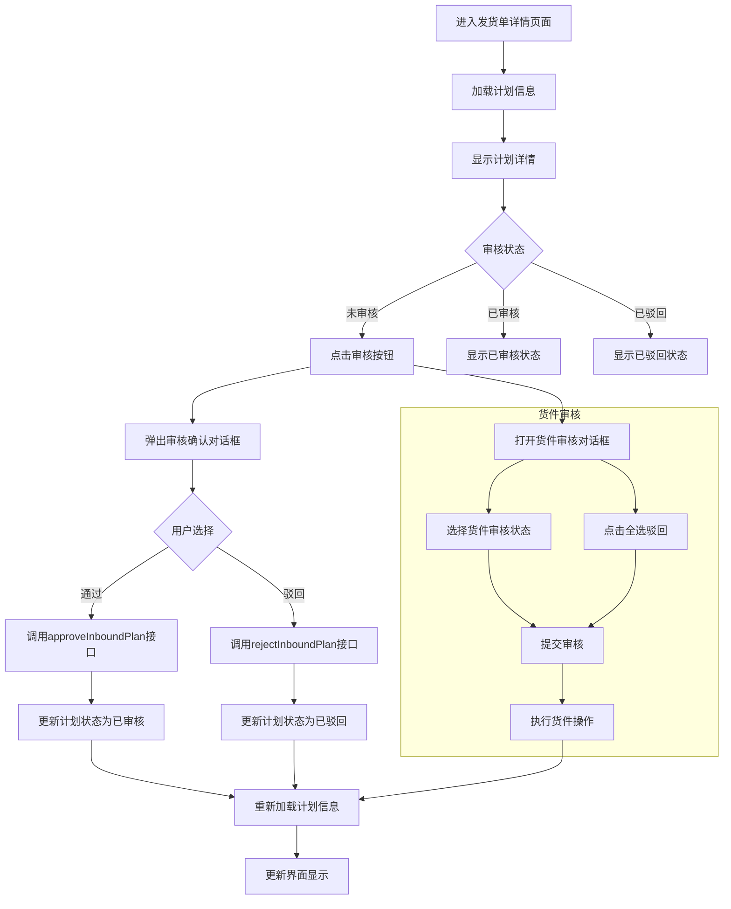

# FBA 发货单审核功能详细帮助文档

## 1. 功能概述

本文档详细介绍 FBA 发货单审核功能的实现，包括前端组件结构、API 调用、后端实现、数据模型和业务逻辑流程。该功能位于 `wimoor666\wimoor-ui\src\views\erp\shipv2\shipment_add\approve\` 目录下，是 FBA 发货流程的审核环节，用于审核和管理发货计划。

## 2. 前端组件结构

### 2.1 组件层级

```
index.vue (核心审核组件)
├── 头部信息区域
│   ├── 计划编码
│   ├── 复制新增按钮
│   ├── 预估配置费
│   └── 操作按钮组 (拆分、关闭、审核/驳回)
├── 主体内容区域
│   ├── 左侧商品列表 (Table 组件)
│   └── 右侧信息列表 (List 组件)
└── 对话框
    ├── 审核对话框 (approveVisible)
    │   ├── 货件列表
    │   ├── 审核选项 (通过/驳回)
    │   └── 全选驳回选项
    └── 拆分对话框 (SplitDialog)
```

### 2.2 核心文件

| 文件路径 | 功能描述 |
|---------|---------|
| `wimoor666\wimoor-ui\src\views\erp\shipv2\shipment_add\approve\index.vue` | 核心审核组件，包含完整的审核功能 |
| `wimoor666\wimoor-ui\src\views\erp\shipv2\shipment_add\approve\components\table.vue` | 商品列表组件 |
| `wimoor666\wimoor-ui\src\views\erp\shipv2\shipment_add\approve\components\list.vue` | 信息列表组件 |
| `wimoor666\wimoor-ui\src\views\erp\shipv2\shipment_add\approve\components\split_dialog.vue` | 拆分对话框组件 |

## 3. API 调用分析

### 3.1 前端 API 调用

| API 方法 | 用途 | 参数 | 来源文件 |
|---------|------|------|----------|
| `shipmentplanApi.getPlanInfo({formid})` | 获取发货计划信息 | `{formid: planid}` | [shipmentplanApi.js] |
| `shipmentplanApi.approveInboundPlan({id})` | 审核通过发货计划 | `{id: plandata.value.id}` | [shipmentplanApi.js] |
| `shipmentplanApi.rejectInboundPlan({id})` | 驳回发货计划 | `{id: plandata.value.id}` | [shipmentplanApi.js] |
| `shipmentplanApi.createShipment({shipmentid})` | 创建货件 | `{shipmentid: item.shipmentId}` | [shipmentplanApi.js] |
| `shipmentplanApi.cancelShipment({shipmentid})` | 取消货件 | `{shipmentid: item.shipmentId}` | [shipmentplanApi.js] |
| `calculateApi.inplacefee(paramlist)` | 计算入库费用 | `paramlist` (包含 SKU、入库地点、尺寸、重量等信息) | [calculateApi.js] |

### 3.2 后端控制器实现

| 控制器方法 | 用途 | 路径 | 来源文件 |
|-----------|------|------|----------|
| `ShipInboundPlanV2Controller.getPlanInfoAction()` | 获取发货计划信息 | `/api/v2/shipInboundPlan/getPlanInfo` | [ShipInboundPlanV2Controller.java](wimoor666\wimoor-amazon\amazon-boot\src\main\java\com\wimoor\amazon\inboundV2\controller\ShipInboundPlanV2Controller.java) |
| `ShipInboundPlanV2Controller.approveInboundPlan()` | 审核通过发货计划 | `/api/v2/shipInboundPlan/approveInboundPlan` | [ShipInboundPlanV2Controller.java](wimoor666\wimoor-amazon\amazon-boot\src\main\java\com\wimoor\amazon\inboundV2\controller\ShipInboundPlanV2Controller.java) |
| `ShipInboundPlanV2Controller.rejectInboundPlan()` | 驳回发货计划 | `/api/v2/shipInboundPlan/rejectInboundPlan` | [ShipInboundPlanV2Controller.java](wimoor666\wimoor-amazon\amazon-boot\src\main\java\com\wimoor\amazon\inboundV2\controller\ShipInboundPlanV2Controller.java) |
| `ShipFormController.createShipmentAction()` | 创建货件 | `/api/v1/shipForm/create` | [ShipFormController.java](wimoor666\wimoor-amazon\amazon-boot\src\main\java\com\wimoor\amazon\inbound\controller\ShipFormController.java) |
| `ShipFormController.cancelShipmentAction()` | 取消货件 | `/api/v1/shipForm/cancelShipment` | [ShipFormController.java](wimoor666\wimoor-amazon\amazon-boot\src\main\java\com\wimoor\amazon\inbound\controller\ShipFormController.java) |

## 4. 后端数据模型

### 4.1 核心实体类

| 实体类 | 描述 | 表名 | 来源文件 |
|-------|------|------|----------|
| `ShipInboundPlan` | 发货计划 | `t_erp_ship_v2_inboundplan` | [ShipInboundPlan.java](wimoor666\wimoor-amazon\amazon-boot\src\main\java\com\wimoor\amazon\inboundV2\pojo\entity\ShipInboundPlan.java) |
| `ShipInboundItem` | 发货计划商品 | `t_erp_ship_v2_inbounditem` | [ShipInboundItem.java](wimoor666\wimoor-amazon\amazon-boot\src\main\java\com\wimoor\amazon\inboundV2\pojo\entity\ShipInboundItem.java) |
| `ShipInboundShipment` | 货件 | `t_erp_ship_v2_inboundshipment` | [ShipInboundShipment.java](wimoor666\wimoor-amazon\amazon-boot\src\main\java\com\wimoor\amazon\inboundV2\pojo\entity\ShipInboundShipment.java) |
| `ShipInboundOperation` | 操作记录 | `t_erp_ship_v2_inboundoperation` | [ShipInboundOperation.java](wimoor666\wimoor-amazon\amazon-boot\src\main\java\com\wimoor\amazon\inboundV2\pojo\entity\ShipInboundOperation.java) |

### 4.2 实体类关系

```
ShipInboundPlan (1) ──── (N) ShipInboundItem
ShipInboundPlan (1) ──── (N) ShipInboundShipment
ShipInboundPlan (1) ──── (N) ShipInboundOperation
```

## 5. 业务逻辑流程

### 5.1 初始化流程

1. **组件加载**：`onMounted` 钩子函数触发 `loadData()`
2. **加载计划信息**：`loadData()` 调用 `shipmentplanApi.getPlanInfo()` 获取计划详情
3. **初始化组件**：
   - 更新 `plandata.value` 存储计划信息
   - 设置 `tableRef.value.planData` 和 `listRef.value.planData`
   - 调用 `summaryTotalPrice(item)` 计算入库费用
   - 调用 `tableRef.value.initData(item)` 初始化商品列表
   - 设置 `listRef.value.remark` 备注信息

### 5.2 审核流程

1. **打开审核对话框**：点击"审核"按钮 → 触发 `approvePlan()`
2. **确认审核操作**：弹出确认对话框，用户选择"通过"或"驳回"
3. **执行审核操作**：
   - 选择"通过" → 调用 `shipmentplanApi.approveInboundPlan()`
   - 选择"驳回" → 调用 `shipmentplanApi.rejectInboundPlan()`
4. **更新状态**：审核操作完成后，调用 `loadData()` 重新加载计划信息，更新界面状态

### 5.3 货件审核流程

1. **打开审核对话框**：在审核对话框中，用户可以为每个货件选择"通过"或"驳回"
2. **全选驳回**：点击"全选驳回"复选框 → 触发 `changeAllCancel()` → 所有货件自动选择"驳回"
3. **提交审核**：点击"确认"按钮 → 触发 `submitplan()`
4. **执行货件操作**：
   - 对于选择"通过"的货件 → 调用 `shipmentplanApi.createShipment()`
   - 对于选择"驳回"的货件 → 调用 `shipmentplanApi.cancelShipment()`
5. **更新状态**：操作完成后，关闭对话框并调用 `loadData()` 重新加载计划信息

### 5.4 其他操作流程

1. **拆分计划**：点击"拆分"按钮 → 触发 `splitHandel()` → 打开拆分对话框
2. **关闭页面**：点击"关闭"按钮 → 触发 `closePage()` → 跳转到新发货单页面
3. **复制计划**：点击"复制"按钮 → 触发 `copyPlan()` → 跳转到添加新版货件页面

## 6. 核心代码分析

### 6.1 前端核心代码

#### 6.1.1 加载计划信息

```javascript
function loadData() {
  if(planid) {
    //重新查询新的plan
    shipmentplanApi.getPlanInfo({"formid":planid}).then((res) => {
      if(res.data) {
        res.data.iserror=false;
        plandata.value=res.data;
        var item=res.data;
        var nowDate=new Date();
        item.nameVis=false;
        item.remarkVis=false;
        if(item.name=='' || item.name==undefined || item.name==null) {
          item.name="FBA"+"("+(nowDate.getMonth()+1)+"/"+(nowDate.getDate())+"/"+nowDate.getFullYear()+" "+nowDate.getHours()+":"+nowDate.getMinutes()+")-"+(index+1)
        }
        if(res.data.auditstatus==3 && item.status==1) {
          res.data.iserror=true;
        }
        
        tableRef.value.planData=res.data;
        summaryTotalPrice(item);
        tableRef.value.initData(item);
        listRef.value.planData=res.data;
        listRef.value.remark=res.data.remark;
        
      }
    });
  }
}
```

#### 6.1.2 审核计划

```javascript
function approvePlan() {
  ElMessageBox.confirm('确认审核该计划?', '警告', {
    distinguishCancelAndClose: true,
    confirmButtonText: '通过',
    cancelButtonText: '驳回',
    type: 'warning',
    center: true,
  })
  .then(() => {
    submitLoading.value=true;
    shipmentplanApi.approveInboundPlan({"id":plandata.value.id}).then(res => {
      ElMessage.success('通过成功');
      submitLoading.value=false;
      loadData();
    }).catch(error => {
      submitLoading.value=false;
      console.log(error);
    });
  })
  .catch((action) => {
    if(action=='cancel') {
      submitLoading.value=true;
      shipmentplanApi.rejectInboundPlan({"id":plandata.value.id}).then(res => {
        ElMessage.success('驳回成功');
        loadData();
        submitLoading.value=false;
      }).catch(error => {
        submitLoading.value=false;
      });
    }
  })
}
```

#### 6.1.3 提交货件审核

```javascript
async function submitplan() {
  confirmloading.value=true;
  for(var i=0;i<shipmentList.value.length;i++) {
    var item=shipmentList.value[i];
    if(item.approve==true) {
      await shipmentplanApi.createShipment({"shipmentid":item.shipmentId}).then(res => {
        ElMessage.success( item.shipmentId+'审核成功！');
      }).catch(error => {
      });
    } else {
      await shipmentplanApi.cancelShipment({"shipmentid":item.shipmentId}).then(res => {
        ElMessage.success(item.shipmentId+'驳回成功！');
      }).catch(error => {
      });
    }
  }
  nextTick(() => {
    confirmloading.value=false;
  })
  nextTick(() => {
    approveVisible.value=false;
  })
  var timer=setTimeout(function() {
    nextTick(() => {
      loadData();
    })
  }, 300);
}
```

### 6.2 后端核心代码

#### 6.2.1 获取计划信息

```java
@ApiOperation(value = "获取货件计划")
@GetMapping("/getPlanInfo")
public Result<ShipPlanVo> getPlanInfoAction(String formid) {
  UserInfo user=UserInfoContext.get();
  try {
    if(StrUtil.isEmptyIfStr(formid)) {
      throw new BizException("计划ID不能为空");
    }
    
    ShipPlanVo vo = shipInboundPlanV2Service.getPlanBaseInfo(formid,user);
    return Result.success(vo);
  } catch(Exception e) {
    e.printStackTrace();
  }
  return Result.success(null);
}
```

#### 6.2.2 审核通过计划

```java
@ApiOperation(value = "审核发货计划")
@GetMapping("/approveInboundPlan")
@SystemControllerLog("审核")    
@Transactional
public Result<String> approveInboundPlan(String id) {
  UserInfo user=UserInfoContext.get();
  ShipInboundPlan inplan=shipInboundPlanV2Service.getById(id);
  try {
    List<ShipInboundItemVo> itemlist = iShipInboundItemService.listByFormid(inplan.getId());
    ShipFormDTO dto=getFormDTO(inplan,itemlist);
    if(inplan.getInvtype()!=2) {
      erpClientOneFeign.outBoundShipInventory(dto);
      inplan.setInvstatus(1);
    }
    for(ShipInboundItemVo item:itemlist) {
      ShipInboundItem itemold = iShipInboundItemService.getById(item.getId());
      itemold.setMsku(item.getMsku());
      iShipInboundItemService.updateById(itemold);
    }
    inplan.setAuditstatus(2);
    inplan.setAuditor(user.getId());
    inplan.setAuditime(new Date());
    inplan.setOpttime(new Date());
    inplan.setOperator(user.getId());
    shipInboundPlanV2Service.updateById(inplan);
    shipInboundV2ShipmentRecordService.saveRecord(inplan);
    return Result.success(inplan.getId());
  } catch(FeignException e) {
    throw new BizException("提交失败" +e.getMessage());
  } catch(BizException e) {
    throw e;
  } catch(Exception e) {
    throw new BizException("提交失败" +e.getMessage());
  }
}
```

#### 6.2.3 驳回计划

```java
@ApiOperation(value = "驳回发货计划")
@GetMapping("/rejectInboundPlan")
@SystemControllerLog("驳回")    
@Transactional
public Result<String> rejectInboundPlan(String id) {
  UserInfo user=UserInfoContext.get();
  ShipInboundPlan inplan=shipInboundPlanV2Service.getById(id);
  inplan.setAuditstatus(11);
  inplan.setAuditime(new Date());
  inplan.setAuditor(user.getId());
  shipInboundPlanV2Service.updateById(inplan);
  shipInboundV2ShipmentRecordService.saveRecord(inplan);
  return Result.success(inplan.getId());
}
```

#### 6.2.4 取消货件

```java
@ApiOperation(value = "驳回虚拟货件")
@GetMapping("/cancelShipment")
public Result<Boolean> cancelShipmentAction(String shipmentid) {
  ShipInboundShipment shipment = shipInboundShipmentService.getById(shipmentid);
  if(shipment!=null) {
    shipment.setStatus(-1);
    ShipInboundPlan plan = shipInboundPlanService.getById(shipment.getInboundplanid());
    if(plan.getAuditstatus()==1) {
      plan.setAuditstatus(2);
      shipInboundPlanService.updateById(plan);
    }
    shipment.setShipmentstatus(ShipmentStatus.CANCELLED.getValue());
    boolean isupdate = shipInboundShipmentService.updateById(shipment);
    if(isupdate) {
      AmazonAuthority auth = amazonAuthorityService.selectByGroupAndMarket(plan.getAmazongroupid(), plan.getMarketplaceid());
      iFulfillmentInboundService.checkCancel(auth,plan,shipment);
    }
    return Result.judge(isupdate);
  } else {
    throw new BizException("找不到对应虚拟货件！");
  }
}
```

## 6. 技术栈

| 类别 | 技术/框架 | 版本 | 用途 |
|------|-----------|------|------|
| 前端 | Vue | 3.x | 前端框架 |
| 前端 | Element Plus | 最新版 | UI 组件库 |
| 前端 | Icon Park | 最新版 | 图标库 |
| 前端 | Axios | 最新版 | HTTP 客户端 |
| 后端 | Spring Boot | 最新版 | 后端框架 |
| 后端 | MyBatis Plus | 最新版 | ORM 框架 |
| 后端 | Swagger | 最新版 | API 文档 |
| 数据库 | MySQL | 最新版 | 数据库 |

## 7. 输入输出示例

### 7.1 输入示例

```javascript
// 获取计划信息请求
const { data } = await shipmentplanApi.getPlanInfo({ formid: "plan123" });

// 审核通过请求
const { data } = await shipmentplanApi.approveInboundPlan({ id: "plan123" });

// 驳回请求
const { data } = await shipmentplanApi.rejectInboundPlan({ id: "plan123" });

// 创建货件请求
const { data } = await shipmentplanApi.createShipment({ shipmentid: "shipment123" });

// 取消货件请求
const { data } = await shipmentplanApi.cancelShipment({ shipmentid: "shipment123" });
```

### 7.2 输出示例

```javascript
// 获取计划信息响应
{
  "code": 0,
  "msg": "",
  "data": {
    "id": "plan123",
    "number": "SF202601220001",
    "name": "FBA(1/22/2026 14:30)-1",
    "groupid": "group1",
    "warehouseid": "warehouse1",
    "marketplaceid": "US",
    "amazonauthid": "auth1",
    "sourceAddress": "address1",
    "remark": "测试发货计划",
    "auditstatus": 1,
    "itemlist": [
      {
        "sku": "SKU001",
        "msku": "MSKU001",
        "quantity": 10,
        "labelOwner": "SELLER",
        "prepOwner": "SELLER"
      }
    ],
    "shipmentList": [
      {
        "shipmentId": "shipment123",
        "name": "货件1",
        "toquantity": 10,
        "weight": 5.5,
        "readweight": 6.0,
        "boxvolume": "0.1",
        "itemprice": 100,
        "addressTo": {
          "countrycode": "US"
        },
        "destinationFulfillmentCenterId": "ABE2"
      }
    ]
  }
}

// 审核通过响应
{
  "code": 0,
  "msg": "",
  "data": "plan123"
}

// 驳回响应
{
  "code": 0,
  "msg": "",
  "data": "plan123"
}
```

## 8. 业务流程图



## 9. 代码优化建议

### 9.1 前端优化

1. **错误处理增强**：添加更详细的错误处理和用户提示，特别是在 API 调用失败时
2. **性能优化**：对于大量货件的列表，考虑使用虚拟滚动
3. **代码组织**：将复杂的业务逻辑拆分为更小的函数，提高代码可读性
4. **表单验证**：添加更严格的表单验证，确保数据完整性
5. **用户体验**：添加加载状态和进度指示，提升用户体验
6. **代码复用**：提取重复的代码为公共函数或组件
7. **内存管理**：清理定时器，避免内存泄漏

### 9.2 后端优化

1. **事务管理**：确保所有数据库操作都在事务中执行，保证数据一致性
2. **参数验证**：增强请求参数的验证，确保数据完整性
3. **错误处理**：提供更详细的错误信息，便于前端处理
4. **性能优化**：对于频繁查询的数据，考虑添加缓存
5. **日志记录**：添加详细的日志记录，便于问题排查
6. **API 设计**：统一 API 接口设计，使用 POST 方法处理包含参数的请求

## 10. 常见问题及解决方案

| 问题 | 原因 | 解决方案 |
|------|------|----------|
| 审核失败 | 后端 API 调用失败 | 检查网络连接，查看控制台错误信息，联系管理员 |
| 货件创建失败 | 货件信息不完整或格式错误 | 检查货件信息，确保所有必填字段都已填写 |
| 入库费用计算错误 | 商品尺寸或重量信息不正确 | 检查商品的尺寸和重量信息，确保数据准确 |
| 页面加载缓慢 | 计划信息过多或网络延迟 | 优化网络连接，考虑分页加载大量数据 |
| 拆分功能失败 | 商品列表为空或格式错误 | 确保商品列表不为空，检查商品数据格式 |

## 11. 结论

FBA 发货单审核功能是 FBA 发货流程中的重要环节，用于审核和管理发货计划。该功能通过前端组件与后端 API 的协作，实现了计划信息的加载、审核状态的管理、货件的创建和取消等核心功能。

该功能的实现展示了现代前端开发的最佳实践，包括：
- 使用 Vue 3 Composition API 进行状态管理
- 与后端 API 的高效交互
- 响应式 UI 设计
- 良好的用户体验
- 模块化的代码组织

同时，后端实现也体现了 Spring Boot 框架的优势，包括：
- 清晰的控制器设计
- 灵活的服务层架构
- 高效的数据处理
- 完善的事务管理

总体而言，FBA 发货单审核功能是一个设计精良、功能完善的业务组件，为 FBA 发货流程提供了重要的审核环节，帮助用户快速、准确地审核发货计划，提高了物流管理的效率。