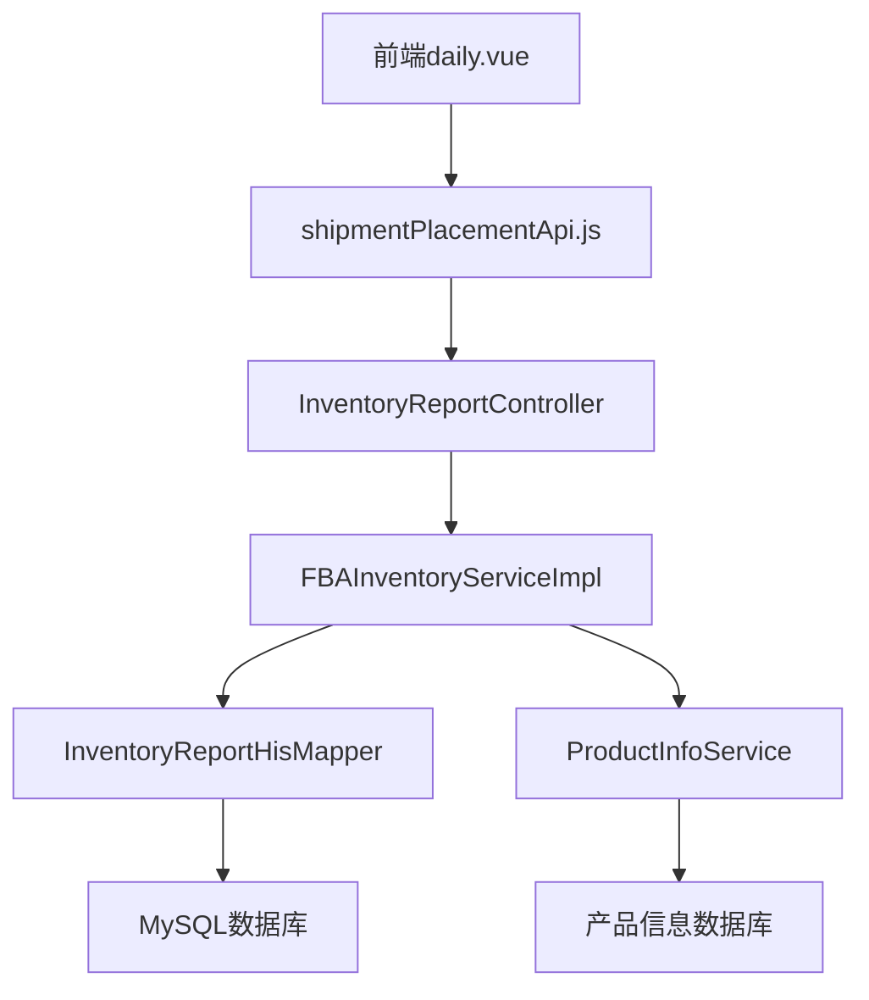

# 发货详情模块功能解析文档

## 1. 系统架构

### 1.1 整体架构

发货详情模块采用前后端分离架构，主要包含以下组件：

- **前端组件**：Vue 3 + Element Plus 构建的单页应用
- **后端服务**：Spring Boot 微服务，提供 RESTful API
- **数据库**：MySQL 数据库存储发货相关数据
- **外部依赖**：亚马逊API用于获取和同步FBA货件信息

### 1.2 模块依赖关系



## 2. 前端实现

### 2.1 核心文件结构

```
└── src/
    └── views/
        └── erp/
            └── shipv2/
                └── shipment_handing/
                    └── shipstep/
                        ├── index.vue                # 发货详情主组件
                        └── components/
                            ├── shipment_info.vue      # 货件信息组件
                            ├── two_box.vue            # 货件详情标签页
                            ├── three_deliver.vue      # 物流出库标签页
                            ├── customs_picking.vue    # 海关申报标签页
                            ├── four_receive.vue       # 接收详情标签页
                            ├── ship_box.vue           # 装箱组件
                            └── ship_box_case.vue      # 箱式装箱组件
    └── api/
        └── erp/
            └── shipv2/
                └── shipmentPlacementApi.js          # API接口定义
```

### 2.2 前端核心代码分析

#### 2.2.1 主组件结构（index.vue）

```vue
<template>
    <el-dialog v-model="detailVisible" title="货件详情" class="ship-detail-dialog" top="3vh" width="85%"  >
        <template #header="{ close, titleId,titleClass  }">
          <div class="my-header">
            <div :id="titleId"  :class="titleClass">
                  <el-tabs
                    v-model="tabActive"
                    type="card"
                    class="demo-tabs"
                    @tab-change="tabchange"
                  >
                    <el-tab-pane label="货件详情" :name="0"></el-tab-pane>
                    <el-tab-pane label="物流出库" :name="1"></el-tab-pane>
                    <el-tab-pane label="海关申报" :name="2"></el-tab-pane>
                    <el-tab-pane label="接收详情" :name="3"></el-tab-pane>
                  </el-tabs>
            </div>
          </div>
        </template>
    <div   v-loading="loading">
          <TwoBox @stepdata="stepChange" ref="twoRef"  @change="stepChange(0)" v-if="tabActive===0" />
          <ThreeDeliver @stepdata="stepChange" ref="threeRef" @change="stepChange(1)" v-if="tabActive===1" />
          <CustomsPicking ref="customsPickingRef" v-if="tabActive===2" ></CustomsPicking>
          <FourReceive ref="fourRef" v-if="tabActive===3"/> 
       <ShipmentInfo ref="shipmentRef" @change="handleShipmentInfo" />
</div>
     <template #footer>
           <el-button @click="detailVisible = false">关闭</el-button>
       </template>
    </el-dialog>
</template>
```

#### 2.2.2 核心逻辑实现

```javascript
// 数据初始化
let state =reactive({
    tabActive:0,
    shipmentData:{},
})

// 显示货件详情
function show(row,mstep){
    localRow.value=row;
    state.tabActive=mstep;
    shipmentid.value=row.shipmentid;
    detailVisible.value=true;
    loading.value=true;
    nextTick(()=>{
        var timer=setTimeout(()=>{
            shipmentRef.value.getBaseInfo(row.shipmentid);
        },200);
    });
}

// 处理货件信息返回
function handleShipmentInfo(data){
    loading.value=false;
    state.shipmentData = data;
    nextTick(()=>{
         handleStep(data);
    });
}

// 切换标签页处理
function tabchange(val){
    handleStep(state.shipmentData);
}

// 根据当前标签页加载对应数据
function handleStep(data){
    nextTick(()=>{
        if(state.tabActive===0){
                twoRef.value.loadOptData(data);
        }else if(state.tabActive===1){
                threeRef.value.loadOptData(data);
        }else if(state.tabActive===2){
                customsPickingRef.value.loadOptData(data);
        }else if(state.tabActive===3){
                fourRef.value.loadOptData(data);
        }
    })
}
```

#### 2.2.3 货件信息组件（shipment_info.vue）

```vue
<template>
    <div class="shipment-info-wrap">
        <el-row class="ship-sty" :gutter="16">
            <el-col :span="8">
                <el-card shadow="never">
                    <div class="ship-title ">
                        <h4>单据信息</h4>
                    </div>
                    <!-- 单据信息内容 -->
                </el-card>
            </el-col>
            <el-col :span="8">
                <el-card shadow="never">
                    <div class="ship-title ">
                        <h4 >运输信息</h4>
                    </div>
                    <!-- 运输信息内容 -->
                </el-card>
            </el-col>
            <el-col :span="8">
                <el-card shadow="never">
                    <div class="ship-title flex-between">
                        <h4 >地址信息</h4>
                        <el-button size="small" @click="handleShowDest" link type="info">添加箱标地址</el-button>
                    </div>
                    <!-- 地址信息内容 -->
                </el-card>
            </el-col>
        </el-row>
    </div>
</template>
```

## 3. 后端实现

### 3.1 核心文件结构

```
└── src/
    └── main/
        └── java/
            └── com/
                └── wimoor/
                    └── erp/
                        └── ship/
                            ├── controller/
                            │   └── ShipAmazonFormController.java   # 控制器
                            ├── service/
                            │   ├── IShipFormService.java          # 服务接口
                            │   └── impl/
                            │       └── ShipFormServiceImpl.java   # 服务实现
                            └── mapper/
                                └── ShipPlanItemMapper.java         # 数据访问层
```

### 3.2 后端核心代码分析

#### 3.2.1 控制器层（ShipAmazonFormController.java）

```java
// 获取配货单
@GetMapping("/quotainfo/{shipmentid}")
public Result<ShipInboundShipmenSummarytVo> quotainfoAction(@PathVariable("shipmentid") String shipmentid) {
    Result<ShipInboundShipmenSummarytVo> result = amazonClientOneFeign.infoAction(shipmentid);
    ShipInboundShipmenSummarytVo itemsum=result.getData();
    // 处理产品图片等信息
    // ...
    ShipInboundShipmenSummarytVo data = iWarehouseShelfInventoryService.formInvAssemblyShelf(itemsum);
    // ...
    return Result.success(data);
}

// 下载配货单
@PostMapping("/downPDFShipForm/{ftype}")
public void downPDFShipFormAction(@PathVariable("ftype") String ftype,
        @RequestBody ShipPrintLabelDTO dto, HttpServletResponse response) {
    // 处理配货单下载逻辑
    // ...
}

// 确认货件
@GetMapping("/createShipment")
@Transactional
public Result<Boolean> createShipmentAction(String shipmentid) {
    // 处理货件确认逻辑
    // ...
}
```

#### 3.2.2 服务层（ShipFormServiceImpl.java）

```java
// 将可售库存转为出库库存
public void fulfillableToOutbound(UserInfo user,ShipFormDTO dto) {
    String warehouseid=dto.getWarehouseid();
    String formid=dto.getFormid();
    String number=dto.getNumber();
    for (int i = 0; i < dto.getList().size(); i++) {
        ShipItemDTO item = dto.getList().get(i);
        int shipqty =item.getQuantity();
        // 处理产品信息
        // ...
        // 检查库存是否足够
        Map<String, Object> map = inventoryService.findInvDetailById(materialid, warehouseid, user.getCompanyid());
        // ...
        // 处理库存不足情况
        if(fulfillable<shipqty) {
            // 处理组装需求
            // ...
        }
        // 执行库存出库操作
        addMaterialFullfillableToOutbound(user, number,formid,warehouseid,materialid ,shipqty);
    }
}

// 库存出库操作
private void addMaterialFullfillableToOutbound(UserInfo user,String number,String formid, String warehouseid, String material, Integer amount) {
    InventoryParameter para = new InventoryParameter();
    para.setAmount(amount);
    para.setFormid(formid);
    para.setMaterial(material);
    EnumByInventory statusinv = EnumByInventory.Ready;
    para.setStatus(statusinv);
    para.setOperator(user.getId());
    para.setOpttime(new Date());
    para.setWarehouse(warehouseid);
    para.setFormtype("outstockform");
    para.setNumber(number);
    para.setShopid(user.getCompanyid());
    inventoryFormAgentService.outStockByRead(para);
}
```

## 4. 数据库设计

### 4.1 核心数据表

#### 4.1.1 erp_shipment（货件表）

| 字段名 | 数据类型 | 描述 |
|--------|----------|------|
| id | BIGINT | 主键ID |
| shipmentid | VARCHAR(50) | 货件ID |
| shipmentConfirmationId | VARCHAR(50) | 货件确认ID |
| name | VARCHAR(255) | 货件名称 |
| referenceid | VARCHAR(50) | 参考ID |
| shipmentstatus | VARCHAR(50) | 货件状态 |
| groupid | VARCHAR(32) | 店铺ID |
| groupname | VARCHAR(255) | 店铺名称 |
| warehouse | VARCHAR(50) | 发货仓库 |
| country | VARCHAR(50) | 收货国家 |
| created_at | DATETIME | 创建时间 |
| updated_at | DATETIME | 更新时间 |

#### 4.1.2 erp_shipment_item（货件商品表）

| 字段名 | 数据类型 | 描述 |
|--------|----------|------|
| id | BIGINT | 主键ID |
| shipmentid | VARCHAR(50) | 货件ID |
| sku | VARCHAR(50) | 产品SKU |
| materialid | VARCHAR(32) | 物料ID |
| quantity | INT | 数量 |
| unitcost | DECIMAL(10,2) | 单位成本 |
| created_at | DATETIME | 创建时间 |
| updated_at | DATETIME | 更新时间 |

### 4.2 数据流程

1. **数据同步**：定时从亚马逊API获取FBA货件信息
2. **数据存储**：将货件信息存储到erp_shipment和erp_shipment_item表
3. **数据查询**：前端请求时，后端从数据库查询货件详情
4. **数据处理**：处理货件信息，包括产品图片、库存信息等
5. **数据返回**：将处理后的数据返回给前端展示

## 5. API接口定义

### 5.1 接口列表

| 接口URL | 请求方法 | 功能描述 |
|---------|----------|----------|
| /api/v1/shipForm/quotainfo/{shipmentid} | GET | 获取配货单详情 |
| /api/v1/shipForm/getFBAInvDayDetailField | POST | 获取日期字段列表 |
| /api/v1/shipForm/downPDFShipForm/{ftype} | POST | 下载配货单 |
| /api/v1/shipForm/createShipment | GET | 确认货件 |
| /api/v1/shipForm/disableShipment | GET | 删除货件 |
| /api/v1/shipForm/updateShipment | POST | 更新货件 |
| /api/v1/shipForm/getQRCode/{shipmentid}/{size} | POST | 获取配货单二维码 |

### 5.2 请求参数

| 参数名 | 类型 | 描述 |
|--------|------|------|
| shipmentid | String | 货件ID |
| ftype | String | 文件类型（detail/simple） |
| fbaShipmentDTO | Object | 货件DTO对象 |
| size | String | 二维码大小 |

### 5.3 响应格式

```json
{
  "code": 200,
  "msg": "success",
  "data": {
    "shipmentAll": {},
    "shipment": {},
    "plan": {},
    "totalBoxSize": 0,
    "fromAddress": {},
    "toAddress": {}
  }
}
```

## 6. 关键技术点

### 6.1 多标签页动态加载

- **前端实现**：使用v-if条件渲染不同标签页内容
- **后端实现**：根据标签页类型返回对应的数据
- **技术优势**：减少初始加载时间，提高页面响应速度

### 6.2 动态标签生成

```java
// 生成动态标签字段
@GetMapping("/getFBAInvDayDetailField")
public Result<List<Map<String, String>>> getFBAInvDayDetailFieldAction(@RequestBody InvDayDetailDTO query) {
    Map<String, Date> parameter = new HashMap<String, Date>();
    // 处理日期参数
    // ...
    List<Map<String, String>> fieldlist = iFBAInventoryService.getInvDaySumField(parameter);
    return Result.success(fieldlist);
}
```

### 6.3 库存状态转换

- **可售库存转出库**：当货件确认后，将可售库存转为出库库存
- **库存不足处理**：当库存不足时，自动生成组装任务
- **事务管理**：确保库存操作的原子性和一致性

### 6.4 标签打印功能

- **支持多种标签类型**：标准标签、2D条形码、托盘标签
- **灵活的打印选项**：支持批量打印和单个打印
- **PDF生成**：使用iTextPDF库生成PDF格式的标签

## 7. 性能优化

### 7.1 前端优化

1. **虚拟滚动**：使用虚拟滚动技术处理大量数据，提高表格渲染速度
2. **懒加载**：按需加载不同标签页的内容，减少初始加载时间
3. **组件缓存**：对频繁使用的组件进行缓存，提高组件复用率
4. **防抖处理**：对搜索等操作添加防抖，减少频繁请求

### 7.2 后端优化

1. **索引优化**：在关键查询字段上建立索引，提高查询效率
2. **分页查询**：使用分页查询，避免一次性返回大量数据
3. **缓存机制**：对频繁访问的数据进行缓存，减少数据库查询
4. **异步处理**：对耗时操作使用异步处理，提高系统响应速度

### 7.3 数据库优化

1. **分表分库**：对大量数据进行分表分库，提高数据库性能
2. **查询优化**：优化SQL查询，减少数据库负载
3. **定期清理**：定期清理过期数据，保持数据库性能

## 8. 扩展建议

### 8.1 功能扩展

1. **实时状态推送**：添加WebSocket支持，实现货件状态实时推送
2. **智能预警**：根据货件状态和时间，添加智能预警功能
3. **数据分析**：添加货件数据分析功能，提供数据可视化报表
4. **多平台支持**：扩展支持其他电商平台的发货管理

### 8.2 技术扩展

1. **微服务架构**：将模块拆分为独立的微服务，提高系统扩展性
2. **容器化部署**：使用Docker容器化部署，提高部署效率
3. **CI/CD集成**：集成持续集成和持续部署，提高开发效率
4. **自动化测试**：添加自动化测试，提高代码质量

## 9. 总结

发货详情模块是Wimoor系统中重要的发货管理功能，采用了前后端分离架构，具有高性能、高扩展性的特点。通过多标签页展示、全面的货件信息和灵活的操作功能，帮助卖家高效管理FBA发货流程。

该模块的设计和实现遵循了现代软件 engineering 最佳实践，具有良好的可维护性和可扩展性。在未来的发展中，可以进一步扩展功能，提高系统性能，为卖家提供更全面、更深入的发货管理服务。

---

**文档版本**：v1.0
**更新时间**：2026-01-26
**适用系统**：Wimoor 6.0及以上版本