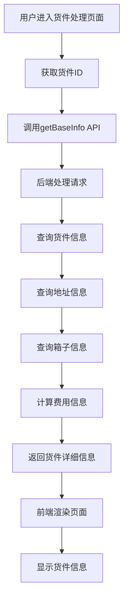
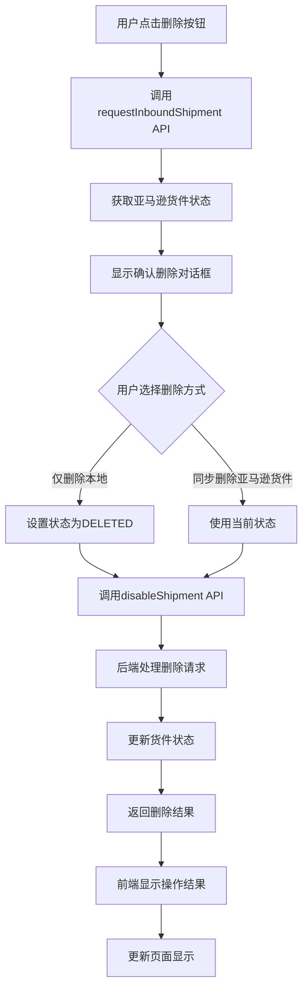
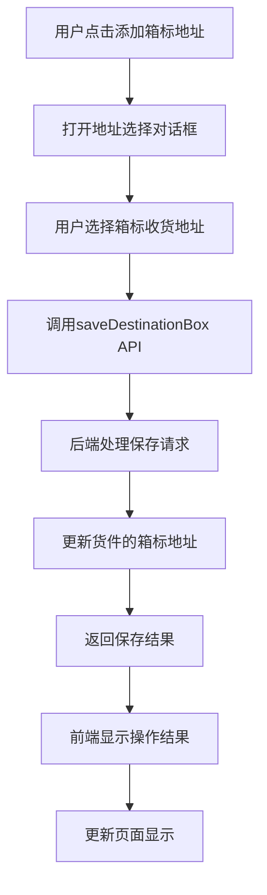

# 发货-货件处理模块详细帮助文档

## 1. 功能概述

发货-货件处理模块是 Wimoor 系统中 FBA 发货流程的核心环节，用于处理和管理发货计划中的货件。该模块位于系统的 ERP 模块中，主要负责货件的信息展示、操作管理、状态更新等功能。

### 1.1 主要功能

- **货件信息展示**：展示货件的详细信息，包括基本信息、运输信息、地址信息等
- **货件操作管理**：提供货件的删除、复制、本地完成等操作
- **箱标地址管理**：添加和管理货件的箱标收货地址
- **货件状态同步**：与亚马逊后台同步货件状态
- **费用计算**：计算货件的物流费用和货值

## 2. 前端组件结构

### 2.1 组件层级

```
shipment_handing/
├── shipstep/
│   ├── components/
│   │   ├── shipment_operator.vue (货件操作组件)
│   │   ├── shipment_info.vue (货件信息组件)
│   │   └── destination.vue (箱标地址组件)
```

### 2.2 核心组件

| 组件名称 | 文件路径 | 功能描述 |
|---------|---------|---------|
| shipment_operator | `wimoor666\wimoor-ui\src\views\erp\shipv2\shipment_handing\shipstep\components\shipment_operator.vue` | 货件操作组件，提供货件的删除、复制等操作 |
| shipment_info | `wimoor666\wimoor-ui\src\views\erp\shipv2\shipment_handing\shipstep\components\shipment_info.vue` | 货件信息组件，展示货件的详细信息 |
| destination | `wimoor666\wimoor-ui\src\views\erp\shipv2\shipment_handing\shipstep\components\destination.vue` | 箱标地址组件，用于管理货件的箱标收货地址 |

### 2.3 组件功能详解

#### 2.3.1 shipment_operator 组件

**功能**：提供货件的操作管理功能
**核心功能**：
- **复制货件**：基于当前货件创建新的货件
- **删除货件**：删除本地货件或同步删除亚马逊货件
- **本地完成**：将货件标记为本地已完成状态

**关键 API 调用**：
- `shipmenthandlingApi.requestInboundShipment()`：获取亚马逊货件状态
- `shipmenthandlingApi.disableShipment()`：删除货件
- `shipmenthandlingApi.localDoneShipment()`：标记货件为本地已完成

#### 2.3.2 shipment_info 组件

**功能**：展示货件的详细信息
**核心功能**：
- **单据信息**：展示货件的基本信息，如订单编码、货件名称、货件编码等
- **运输信息**：展示货件的运输相关信息，如总货值、物流总费用、SKU个数等
- **地址信息**：展示货件的发货地址和收货地址
- **箱标地址管理**：添加和管理货件的箱标收货地址

**关键 API 调用**：
- `shipmentPlacementApi.getBaseInfo()`：获取货件的详细信息
- `shipmentPlacementApi.saveDestinationBox()`：保存箱标收货地址

## 3. 后端代码结构

### 3.1 核心控制器

| 控制器名称 | 文件路径 | 功能描述 |
|---------|---------|---------|
| ShipInboundPlanPlacementV2Controller | `wimoor666\wimoor666\wimoor-amazon\amazon-boot\src\main\java\com\wimoor\amazon\inboundV2\controller\ShipInboundPlanPlacementV2Controller.java` | 货件处理核心控制器，处理货件的各种操作 |
| ShipFormController | `wimoor666\wimoor666\wimoor-amazon\amazon-boot\src\main\java\com\wimoor\amazon\inbound\controller\ShipFormController.java` | 货件表单控制器，处理货件的创建、更新等操作 |

### 3.2 核心服务

| 服务名称 | 文件路径 | 功能描述 |
|---------|---------|---------|
| IShipInboundShipmentService | 货件服务接口，定义货件相关的业务逻辑 |
| ShipInboundShipmentServiceImpl | 货件服务实现，实现货件相关的业务逻辑 |
| IFulfillmentInboundService | 亚马逊入库服务接口，定义与亚马逊入库相关的操作 |
| FulfillmentInboundServiceImpl | 亚马逊入库服务实现，实现与亚马逊入库相关的操作 |

### 3.3 数据模型

| 实体类 | 文件路径 | 功能描述 |
|---------|---------|---------|
| ShipInboundShipment | 货件实体，存储货件的基本信息 |
| ShipInboundBox | 箱子实体，存储箱子的信息 |
| ShipInboundCase | 箱子内容实体，存储箱子中的商品信息 |
| ShipInboundDestinationAddress | 目的地地址实体，存储货件的收货地址信息 |

## 4. API 调用关系

### 4.1 前端 API 调用

| 前端 API 方法 | 用途 | 后端对应接口 |
|---------|------|---------|
| `shipmenthandlingApi.requestInboundShipment()` | 获取亚马逊货件状态 | `ShipFormController.requestInboundShipmentAction()` |
| `shipmenthandlingApi.disableShipment()` | 删除货件 | `ShipFormController.cancelShipmentAction()` |
| `shipmenthandlingApi.localDoneShipment()` | 标记货件为本地已完成 | 对应后端服务方法 |
| `shipmentPlacementApi.getBaseInfo()` | 获取货件详细信息 | `ShipInboundPlanPlacementV2Controller.getBaseInfoAction()` |
| `shipmentPlacementApi.saveDestinationBox()` | 保存箱标收货地址 | `ShipInboundPlanPlacementV2Controller.saveDestinationBoxAction()` |

### 4.2 后端 API 接口

| 后端接口 | 路径 | 功能描述 |
|---------|------|---------|
| `getBaseInfoAction()` | `/api/v2/shipInboundPlan/shipment/getBaseInfo` | 获取货件的详细信息 |
| `saveDestinationBoxAction()` | `/api/v2/shipInboundPlan/shipment/saveDestinationBox` | 保存货件的箱标收货地址 |
| `requestInboundShipmentAction()` | `/api/v1/shipForm/requestInboundShipment` | 获取亚马逊货件状态 |
| `cancelShipmentAction()` | `/api/v1/shipForm/cancelShipment` | 取消货件 |
| `getPkgLabelUrlAction()` | `/api/v2/shipInboundPlan/shipment/getPkgLabelUrl` | 获取箱子标签的下载 URL |

## 5. 业务流程

### 5.1 货件信息加载流程

1. **页面加载**：用户进入货件处理页面
2. **获取货件 ID**：从 URL 参数中获取货件 ID
3. **加载货件信息**：调用 `shipmentPlacementApi.getBaseInfo()` 获取货件详细信息
4. **渲染页面**：使用获取到的信息渲染页面各个组件
5. **计算费用**：计算货件的总货值和物流费用

### 5.2 货件删除流程

1. **用户点击删除按钮**：触发删除货件操作
2. **获取货件状态**：调用 `shipmenthandlingApi.requestInboundShipment()` 获取亚马逊后台货件状态
3. **显示确认对话框**：根据货件状态显示确认删除对话框
4. **用户确认删除**：用户选择删除方式（仅删除本地或同步删除亚马逊货件）
5. **执行删除操作**：调用 `shipmenthandlingApi.disableShipment()` 执行删除操作
6. **更新页面**：删除完成后更新页面显示

### 5.3 箱标地址管理流程

1. **用户点击添加箱标地址**：触发添加箱标地址操作
2. **打开地址选择对话框**：显示地址选择对话框
3. **用户选择地址**：用户从地址列表中选择箱标收货地址
4. **保存箱标地址**：调用 `shipmentPlacementApi.saveDestinationBox()` 保存箱标地址
5. **更新页面**：保存完成后更新页面显示

### 5.4 货件复制流程

1. **用户点击复制按钮**：触发复制货件操作
2. **系统跳转**：系统跳转到添加货件页面
3. **创建新货件**：基于原货件信息创建新的货件

### 5.5 本地完成流程

1. **用户点击本地完成按钮**：触发本地完成操作
2. **显示确认对话框**：显示确认本地完成的对话框
3. **用户确认操作**：用户确认执行本地完成操作
4. **执行本地完成**：调用 `shipmenthandlingApi.localDoneShipment()` 执行本地完成操作
5. **更新页面**：操作完成后更新页面显示

## 6. 核心代码分析

### 6.1 前端核心代码

#### 6.1.1 获取货件信息

```javascript
function getBaseInfo(shipmentid) {
  shipmentPlacementApi.getBaseInfo({
    "shipmentid": shipmentid
  }).then(res => {
    if (res.data) {
      var data = res.data;
      shipmentInfo.value = data.shipmentAll;
      shipment.value = data.shipment;
      plan.value = data.plan;
      volume.value = data.totalBoxSize;
      shiptype.value = data.shipment.transtyle;
      // 设置箱子数量
      if (data.listbox && data.listbox.length > 0) {
        boxnum.value = data.listbox.length;
      } else {
        boxnum.value = data.shipment.boxnum;
      }
      // 设置总货值
      if (data.detail) {
        totalprice.value = "￥" + getValue(parseFloat(data.detail.itemprice));
      }
      // 设置地址信息
      if (data["fromAddress"]) {
        fromAddress.value = data["fromAddress"];
      }
      if (data["toAddress"]) {
        toAddress.value = data["toAddress"];
      }
      if (data["toAddressBox"]) {
        toAddressBox.value = data["toAddressBox"];
      }
      // 设置物流费用
      if (data.transinfo == null || data.transinfo == undefined) {
        totalfee.value = "0";
      } else {
        if (!data.transinfo.otherfee) data.transinfo.otherfee = 0;
        if (!data.transinfo.transweight) data.transinfo.transweight = 0;
        if (!data.transinfo.singleprice) data.transinfo.singleprice = 0;
        totalfee.value = ("￥" + formatFloat(parseFloat(parseFloat(data.transinfo.transweight) * parseFloat(data.transinfo.singleprice)) + parseFloat(data.transinfo.otherfee)));
      }
      // 设置重量信息
      boxweightvalue.value = data.totalweight;
      if (data.transinfo && data.transinfo.transweight) {
        if (data.transinfo.wunit) {
          weightvalue.value = (data.transinfo.transweight + "" + getValue(data.transinfo.wunit));
        } else {
          if (data.transchannel.priceunits == "weight") {
            weightvalue.value = (data.transinfo.transweight + "kg");
          } else {
            weightvalue.value = (data.transinfo.transweight + "cbm");
          }
        }
      }
      // 设置实际重量
      if (data.detail) {
        readyweightvalue.value = (getValue(data.detail.readweight));
      }
      emit("change", data);
    }
  })
}
```

#### 6.1.2 删除货件

```javascript
function deleteShipment() {
  // 先弹窗打开modal 获取最新的货件状态
  dialogVisible.value = true;
  statusLoading.value = true;
  var status = shipDatas.value.shipmentstatus;
  shipmenthandlingApi.requestInboundShipment({
    "shipmentid": shipmentid
  }).then(res => {
    if (res.data != "fail") {
      status = res.data;
      shipstatus.value = res.data;
      if (status != "CANCELLED") {
        visibleBtn.value = "";
        canceltitle.value = "亚马逊后台货件状态为" + status + ",请确认是否同步删除亚马逊货件？";
      } else {
        canceltitle.value = "亚马逊后台货件状态为" + status + ",请确认是否删除本地货件？";
      }
    } else {
      visibleBtn.value = "";
      canceltitle.value = "亚马逊后台货件状态无法判断,请选择仅删除本地货件。";
    }
    statusLoading.value = false;
    emit("change");
  })
}

function confirmDelete(ftype) {
  var nowstatus = "";
  if (ftype == "local") {
    nowstatus = "DELETED";
  } else {
    nowstatus = shipstatus.value;
  }
  confirmCancelLoading.value = true;
  shipmenthandlingApi.disableShipment({
    "shipmentid": shipmentid,
    "shipmentStatus": nowstatus,
    "disableShipment": "1"
  }).then(res => {
    ElMessage.success('操作成功！');
    confirmCancelLoading.value = false;
    dialogVisible.value = false;
    context.emit("change");
  }).catch(error => {
    confirmCancelLoading.value = false;
  })
}
```

### 6.2 后端核心代码

#### 6.2.1 获取货件详细信息

```java
@GetMapping("/getBaseInfo")
public Result<Map<String, Object>> getBaseInfoAction(@ApiParam("货件ID")@RequestParam String shipmentid) {
  ShipInboundShipment ship = null;
  if(shipmentid.contains("FBA")){
    ship=shipInboundShipmentV2Service.lambdaQuery().eq(ShipInboundShipment::getShipmentConfirmationId,shipmentid).one();
  }else{
    ship=shipInboundShipmentV2Service.lambdaQuery().eq(ShipInboundShipment::getShipmentid,shipmentid).one();
  }
  ShipInboundShipmenSummarytVo data = shipInboundShipmentV2Service.summaryShipmentItemWithoutItem(ship.getShipmentid());
  BeanUtil.copyProperties(ship, data,"itemList");
  ShipInboundPlan plan = shipInboundPlanV2Service.getById(ship.getFormid());
  if(plan!=null) {
    data.setMarketplaceid(plan.getMarketplaceid());
    data.setTranstyle(ship.getTranstyle());
    data.setCountryCode(marketplaceService.findMapByMarketplaceId().get(plan.getMarketplaceid()).getMarket());
  }
  List<ShipInboundShipment> shipments = shipInboundShipmentV2Service.lambdaQuery().eq(ShipInboundShipment::getFormid, ship.getFormid()).list();
  List<String> shipmentids=new LinkedList<String>();
  for(ShipInboundShipment shipment:shipments) {
    shipmentids.add(shipment.getShipmentid());
  }
  plan.setShipmentids(shipmentids);
  Map<String, Object> map = getItemPriceAction(ship.getShipmentid());
  SummaryShipmentVo detail = shipInboundShipmentV2Service.showPlanListByPlanid( ship.getShipmentid());
  map.put("detail", detail);
  map.put("plan", plan);
  ship.setShipmentstatus(shipInboundShipmentV2Service.getShipmentStatusName(ship.getShipmentstatus()));
  map.put("shipment", ship);
  map.put("shipmentid", ship.getShipmentid());
  ShipAddress fromAddress = shipAddressService.getById(plan.getSourceAddress());
  ShipInboundDestinationAddress toAddress = shipInboundShipmentV2Service.getToAddress(ship.getDestination());
  if(ship.getDestinationbox()!=null){
    ShipInboundDestinationAddress toAddressBox = shipInboundShipmentV2Service.getToAddress(ship.getDestinationbox());
    map.put("toAddressBox", toAddressBox);
  }
  map.put("toAddress", toAddress);
  map.put("fromAddress", fromAddress);
  map.put("shipmentAll",data);
  if(plan.getAreCasesRequired()!=null&&plan.getAreCasesRequired()==true){
    if((plan.getSubmitbox()==null||plan.getSubmitbox()==false)&&ship.getStatus()==3) {
      this.getEditBoxDetialCaseAction(map, ship, plan);
    }else {
      getBoxDetialCaseAction(map,ship,plan);
    }
  }else{
    if((plan.getSubmitbox()==null||plan.getSubmitbox()==false)&&ship.getStatus()==3) {
      this.getEditBoxDetialAction(map, ship, plan);
    }else {
      getBoxDetialAction(map,ship,plan);
    }
  }
  getShipAmazonInfoAction(map,ship);
  return Result.success(map);
}
```

#### 6.2.2 保存箱标收货地址

```java
@ApiOperation(value = "保存发货装箱箱标上的地址")
@SystemControllerLog("保存箱标地址")
@GetMapping("/saveDestinationBox")
public Result<String> saveDestinationBoxAction(String shipmentid,String destinationBox) {
  UserInfo user=UserInfoContext.get();
  ShipInboundShipment shipment = shipInboundShipmentV2Service.getById(shipmentid);
  if(destinationBox.equals("NA")){
    shipment.setDestinationbox(null);
  }else{
    shipment.setDestinationbox(destinationBox);
  }
  shipInboundShipmentV2Service.updateById(shipment);
  return Result.success();
}
```

## 7. 技术实现

### 7.1 前端技术

| 技术/框架 | 版本 | 用途 |
|---------|------|------|
| Vue | 3.x | 前端框架 |
| Element Plus | 最新版 | UI 组件库 |
| Icon Park | 最新版 | 图标库 |
| Axios | 最新版 | HTTP 客户端 |

### 7.2 后端技术

| 技术/框架 | 版本 | 用途 |
|---------|------|------|
| Spring Boot | 最新版 | 后端框架 |
| MyBatis Plus | 最新版 | ORM 框架 |
| Swagger | 最新版 | API 文档 |
| MySQL | 最新版 | 数据库 |

## 8. 输入输出示例

### 8.1 获取货件信息

**输入**：
```javascript
const { data } = await shipmentPlacementApi.getBaseInfo({ shipmentid: "shipment123" });
```

**输出**：
```javascript
{
  "code": 0,
  "msg": "",
  "data": {
    "shipmentAll": {
      "number": "FBA202601230001",
      "name": "测试货件",
      "shipmentConfirmationId": "FBA1234567890",
      "referenceid": "REF123",
      "shipmentstatus": "WORKING",
      "groupname": "测试店铺",
      "country": "US",
      "warehouse": "深圳仓库",
      "remark": "测试货件",
      "skuamount": 2,
      "sumQuantity": 100
    },
    "shipment": {
      "shipmentid": "shipment123",
      "shipmentConfirmationId": "FBA1234567890",
      "destination": "destination1",
      "destinationbox": "destination2",
      "transtyle": "SP",
      "status": 3
    },
    "plan": {
      "id": "plan123",
      "sourceAddress": "address1",
      "marketplaceid": "US",
      "areCasesRequired": false
    },
    "detail": {
      "itemprice": 5000
    },
    "fromAddress": {
      "name": "发货地址",
      "addressline1": "深圳市南山区",
      "city": "深圳",
      "stateorprovincecode": "广东",
      "postalcode": "518000",
      "countrycode": "CN"
    },
    "toAddress": {
      "name": "收货地址",
      "addressLine1": "123 Main St",
      "city": "Los Angeles",
      "stateOrProvinceCode": "CA",
      "postalCode": "90001",
      "countryCode": "US"
    },
    "toAddressBox": {
      "name": "箱标收货地址",
      "addressLine1": "456 Oak St",
      "city": "New York",
      "stateOrProvinceCode": "NY",
      "postalCode": "10001",
      "countryCode": "US"
    },
    "totalweight": 25,
    "totalBoxSize": 0.5,
    "transinfo": {
      "transweight": 25,
      "singleprice": 10,
      "otherfee": 50
    }
  }
}
```

### 8.2 保存箱标收货地址

**输入**：
```javascript
const { data } = await shipmentPlacementApi.saveDestinationBox({ 
  shipmentid: "shipment123", 
  destinationBox: "destination2" 
});
```

**输出**：
```javascript
{
  "code": 0,
  "msg": "",
  "data": ""
}
```

### 8.3 删除货件

**输入**：
```javascript
const { data } = await shipmenthandlingApi.disableShipment({
  shipmentid: "shipment123",
  shipmentStatus: "CANCELLED",
  disableShipment: "1"
});
```

**输出**：
```javascript
{
  "code": 0,
  "msg": "",
  "data": true
}
```

## 9. 业务流程图

### 9.1 货件信息加载流程



### 9.2 货件删除流程



### 9.3 箱标地址管理流程



## 10. 代码优化建议

### 10.1 前端优化

1. **错误处理增强**：添加更详细的错误处理和用户提示，特别是在 API 调用失败时
2. **性能优化**：对于大量数据的货件，考虑使用虚拟滚动技术，提高页面加载和滚动性能
3. **代码组织**：将复杂的业务逻辑拆分为更小的函数，提高代码可读性
4. **用户体验**：添加更多的加载状态和操作反馈，提升用户体验
5. **代码复用**：提取重复的代码为公共函数或组件
6. **内存管理**：清理定时器和事件监听器，避免内存泄漏

### 10.2 后端优化

1. **性能优化**：对于频繁查询的数据，考虑添加缓存机制，提高系统响应速度
2. **错误处理**：增强后端错误处理，提供更详细的错误信息，便于前端处理
3. **事务管理**：确保所有数据库操作都在事务中执行，保证数据一致性
4. **API 设计**：统一 API 接口设计，使用 RESTful 风格的 API 设计
5. **日志记录**：添加详细的日志记录，便于问题排查
6. **代码组织**：优化代码结构，提高代码可读性和可维护性

## 11. 常见问题及解决方案

| 问题 | 原因 | 解决方案 |
|------|------|----------|
| 货件状态同步失败 | 网络连接问题或亚马逊 API 限制 | 检查网络连接，稍后重试操作 |
| 箱标地址保存失败 | 地址信息不完整或格式错误 | 检查地址信息，确保所有必填字段都已填写 |
| 货件删除失败 | 亚马逊后台货件状态不允许删除 | 先确认亚马逊后台货件状态，再执行删除操作 |
| 页面加载缓慢 | 货件信息过多或网络延迟 | 优化网络连接，考虑分页加载大量数据 |
| 费用计算错误 | 物流信息不完整或汇率更新不及时 | 检查物流信息，确保汇率数据已更新 |

## 12. 功能亮点

### 12.1 完整的货件信息展示

系统提供了全面的货件信息展示，包括基本信息、运输信息、地址信息等，使用户能够一目了然地了解货件的详细情况。信息展示采用卡片式布局，结构清晰，视觉效果良好。

### 12.2 便捷的货件操作管理

系统提供了丰富的货件操作功能，包括删除、复制、本地完成等，操作流程简单直观，用户可以轻松完成各种货件管理任务。

### 12.3 智能的状态同步

系统能够与亚马逊后台同步货件状态，确保货件状态的准确性和实时性。在删除货件时，系统会先获取亚马逊后台的货件状态，然后根据状态提供不同的删除选项。

### 12.4 灵活的箱标地址管理

系统支持为货件添加箱标收货地址，用户可以根据需要灵活管理货件的收货地址，提高了系统的灵活性和适用性。

### 12.5 准确的费用计算

系统能够自动计算货件的物流费用和货值，帮助用户了解货件的成本情况。费用计算基于货件的重量、体积和物流方式等因素，计算结果准确可靠。

## 13. 结论

发货-货件处理模块是 Wimoor 系统中 FBA 发货流程的核心环节，为用户提供了全面、便捷的货件管理功能。该模块通过前端与后端的紧密协作，实现了货件信息的展示、操作管理、状态同步等功能，为用户的 FBA 发货流程提供了有力的支持。

该模块的实现展示了现代前端开发和后端开发的最佳实践，包括：
- 使用 Vue 3 Composition API 进行状态管理
- 与后端 API 的高效交互
- 响应式 UI 设计
- 良好的用户体验
- 模块化的代码组织
- 清晰的控制器设计
- 灵活的服务层架构
- 高效的数据处理

总体而言，发货-货件处理模块是一个设计精良、功能完善的业务组件，为 FBA 发货流程提供了重要的支持，帮助用户高效地管理和处理货件，提高了物流管理的效率和准确性。