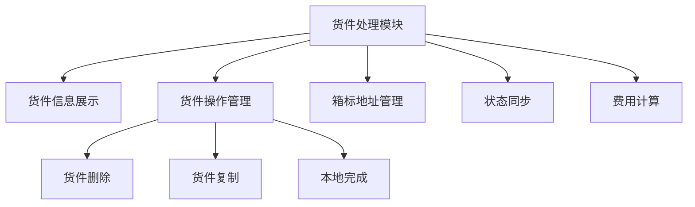

# 货件处理模块详细用户手册

## 1. 模块介绍

### 1.1 什么是货件处理模块？

货件处理模块是 Wimoor 系统中 FBA 发货流程的核心环节，用于管理和处理已经创建的货件。该模块位于系统的 ERP 模块中，提供了货件信息查看、操作管理、状态更新等功能，帮助您高效地完成 FBA 发货的全流程管理。

### 1.2 模块定位与价值

- **定位**：连接货件创建与实际发货的桥梁，是 FBA 发货流程的关键环节
- **价值**：
  - 提供全面的货件信息展示，帮助您快速了解货件详情
  - 支持多种货件操作，满足不同场景的需求
  - 与亚马逊后台同步状态，确保信息准确性
  - 优化操作流程，提高发货效率

### 1.3 适用场景

- 查看已创建货件的详细信息
- 管理货件的箱标收货地址
- 处理不需要继续的货件（删除）
- 基于现有货件创建新货件（复制）
- 标记已完成的货件状态（本地完成）

## 2. 功能概览

### 2.1 主要功能

| 功能 | 描述 | 适用场景 |
|------|------|----------|
| 货件信息展示 | 展示货件的基本信息、运输信息、地址信息等 | 查看货件详情、核对信息 |
| 货件删除 | 删除不需要的货件，可选择仅删除本地或同步删除亚马逊货件 | 货件创建错误、计划变更 |
| 货件复制 | 基于现有货件创建新货件 | 重复相似发货需求 |
| 本地完成 | 标记货件为本地已完成状态 | 货件已实际发货完成 |
| 箱标地址管理 | 添加和管理货件的箱标收货地址 | 调整箱标收货地址 |
| 状态同步 | 与亚马逊后台同步货件状态 | 确保状态信息准确 |
| 费用计算 | 自动计算货件的物流费用和货值 | 成本核算、费用预估 |

### 2.2 功能流程图

## 3. 操作指南

### 3.1 访问模块

1. **登录系统**：使用您的账号密码登录 Wimoor 系统
2. **进入 ERP 模块**：在左侧导航栏中点击「ERP」
3. **进入发货管理**：在 ERP 模块下找到「发货」菜单
4. **选择货件处理**：点击「货件处理」进入模块页面

### 3.2 货件信息查看

#### 3.2.1 基本信息查看

1. **进入货件详情页**：在货件列表中点击需要查看的货件
2. **查看基本信息**：
   - 货件编号、名称、参考号
   - 店铺名称、市场、仓库
   - 货件状态、创建时间
   - SKU 数量、总数量

#### 3.2.2 运输信息查看

1. **查看运输信息**：
   - 物流方式、运输费用
   - 货件重量、体积
   - 总货值

#### 3.2.3 地址信息查看

1. **查看地址信息**：
   - 发货地址
   - 收货地址
   - 箱标收货地址（如果已设置）

### 3.3 货件删除操作

#### 3.3.1 操作步骤

1. **找到删除按钮**：在货件详情页的操作区域找到「删除」按钮
2. **点击删除按钮**：系统会自动获取亚马逊后台的货件状态
3. **确认删除方式**：
   - 如果亚马逊后台货件状态不是「CANCELLED」，系统会询问是否同步删除亚马逊货件
   - 如果亚马逊后台货件状态是「CANCELLED」，系统会询问是否删除本地货件
   - 如果无法获取亚马逊后台货件状态，系统会建议仅删除本地货件
4. **选择删除方式**：根据实际情况选择合适的删除方式
5. **确认删除**：点击「确认」按钮执行删除操作
6. **查看操作结果**：系统会提示删除是否成功

#### 3.3.2 注意事项

- 删除操作不可逆，请谨慎操作
- 同步删除亚马逊货件会影响亚马逊后台的货件状态，请确保操作的必要性
- 如果货件已经发货，建议不要删除，以免影响后续的物流跟踪

### 3.4 货件复制操作

#### 3.4.1 操作步骤

1. **找到复制按钮**：在货件详情页的操作区域找到「复制」按钮
2. **点击复制按钮**：系统会自动跳转到添加货件页面
3. **修改货件信息**：在添加货件页面修改需要变更的信息
4. **保存新货件**：点击「保存」按钮创建新货件

#### 3.4.2 注意事项

- 复制操作会保留原货件的大部分信息，包括商品信息、地址信息等
- 建议在复制后检查所有信息，确保新货件的信息准确无误
- 新货件会生成新的货件编号，与原货件区分

### 3.5 本地完成操作

#### 3.5.1 操作步骤

1. **找到本地完成按钮**：在货件详情页的操作区域找到「本地完成」按钮
2. **点击本地完成按钮**：系统会显示确认对话框
3. **确认操作**：点击「确认」按钮执行本地完成操作
4. **查看操作结果**：系统会提示操作是否成功，货件状态会更新为已完成

#### 3.5.2 注意事项

- 本地完成操作仅更新系统内部的货件状态，不会同步到亚马逊后台
- 建议在货件实际发货完成后再执行此操作
- 完成后可以在已完成货件列表中查看该货件

### 3.6 箱标地址管理

#### 3.6.1 添加箱标地址

1. **找到箱标地址管理区域**：在货件详情页的地址信息部分找到箱标地址管理
2. **点击添加箱标地址**：系统会显示地址选择对话框
3. **选择地址**：从地址列表中选择合适的箱标收货地址
4. **保存地址**：点击「确认」按钮保存箱标地址
5. **查看保存结果**：系统会提示保存是否成功，页面会更新箱标地址信息

#### 3.6.2 修改箱标地址

1. **找到修改按钮**：在已设置的箱标地址旁找到「修改」按钮
2. **点击修改按钮**：系统会显示地址选择对话框
3. **重新选择地址**：从地址列表中选择新的箱标收货地址
4. **保存修改**：点击「确认」按钮保存修改
5. **查看修改结果**：系统会提示修改是否成功，页面会更新箱标地址信息

#### 3.6.3 注意事项

- 箱标地址是货件箱子标签上显示的收货地址，与货件的实际收货地址可能不同
- 建议根据亚马逊的要求和实际物流需求设置合适的箱标地址
- 箱标地址设置后会影响后续的标签生成，请确保地址准确

## 4. 页面导航与界面说明

### 4.1 页面结构

#### 4.1.1 顶部导航栏

- 系统logo和名称
- 用户名和退出按钮
- 消息通知
- 快捷操作按钮

#### 4.1.2 左侧菜单栏

- ERP 模块入口
- 发货管理菜单
- 货件处理子菜单

#### 4.1.3 主内容区

- 货件基本信息卡片
- 运输信息卡片
- 地址信息卡片
- 操作按钮区域
- 箱子信息列表（如果有）

### 4.2 界面元素说明

#### 4.2.1 信息卡片

- **基本信息卡片**：显示货件的核心信息，包括货件编号、名称、状态等
- **运输信息卡片**：显示货件的物流相关信息，包括费用、重量、体积等
- **地址信息卡片**：显示货件的发货地址、收货地址和箱标地址

#### 4.2.2 操作按钮

- **删除按钮**：用于删除货件
- **复制按钮**：用于复制货件创建新货件
- **本地完成按钮**：用于标记货件为本地已完成状态
- **添加箱标地址按钮**：用于添加箱标收货地址

#### 4.2.3 对话框

- **删除确认对话框**：确认删除操作和删除方式
- **地址选择对话框**：选择箱标收货地址
- **本地完成确认对话框**：确认本地完成操作

### 4.3 导航路径

- 系统首页 → ERP → 发货 → 货件处理 → 货件详情页
- 货件详情页 → 删除确认对话框
- 货件详情页 → 地址选择对话框
- 货件详情页 → 本地完成确认对话框
- 货件详情页 → 添加货件页（复制操作）

## 5. 常见问题与解决方案

### 5.1 操作类问题

#### 5.1.1 无法删除货件

**问题现象**：点击删除按钮后，系统提示删除失败

**可能原因**：
- 亚马逊后台货件状态不允许删除
- 网络连接问题
- 权限不足

**解决方案**：
- 检查亚马逊后台货件状态，确保状态允许删除
- 检查网络连接，确保网络正常
- 联系管理员确认是否有删除权限

#### 5.1.2 箱标地址保存失败

**问题现象**：选择箱标地址后，系统提示保存失败

**可能原因**：
- 地址信息不完整
- 网络连接问题
- 地址格式错误

**解决方案**：
- 检查选择的地址是否完整
- 检查网络连接，确保网络正常
- 尝试选择其他地址或重新添加地址

#### 5.1.3 货件复制后信息不正确

**问题现象**：复制货件后，新货件的部分信息不正确

**可能原因**：
- 原货件信息本身有问题
- 复制过程中系统错误
- 新货件创建时未修改必要信息

**解决方案**：
- 检查原货件信息是否正确
- 在复制后仔细核对新货件的所有信息
- 如有必要，联系技术支持

### 5.2 系统类问题

#### 5.2.1 页面加载缓慢

**问题现象**：进入货件详情页后，页面加载时间过长

**可能原因**：
- 货件信息过多
- 网络延迟
- 系统负载过高

**解决方案**：
- 检查网络连接，确保网络正常
- 尝试刷新页面
- 避开系统高峰期使用
- 如有持续问题，联系技术支持

#### 5.2.2 状态同步失败

**问题现象**：系统无法获取亚马逊后台的货件状态

**可能原因**：
- 亚马逊 API 限制
- 网络连接问题
- 亚马逊账号授权过期

**解决方案**：
- 检查网络连接，确保网络正常
- 稍后重试操作
- 检查亚马逊账号授权状态，确保授权有效

### 5.3 数据类问题

#### 5.3.1 费用计算错误

**问题现象**：系统显示的物流费用与实际不符

**可能原因**：
- 物流信息不完整
- 汇率更新不及时
- 计算参数设置错误

**解决方案**：
- 检查货件的重量、体积等物流信息是否完整
- 确认汇率数据是否已更新
- 如有必要，联系管理员调整计算参数

#### 5.3.2 地址信息错误

**问题现象**：货件的地址信息与实际不符

**可能原因**：
- 货件创建时地址选择错误
- 地址库信息有误
- 系统数据同步问题

**解决方案**：
- 检查地址库中的地址信息是否正确
- 在货件处理页面修改箱标地址
- 如有必要，联系技术支持修正数据

## 6. 最佳实践

### 6.1 货件管理最佳实践

#### 6.1.1 货件创建与处理流程

1. **创建货件**：根据实际发货需求创建货件
2. **审核货件**：在货件处理页面仔细核对货件信息
3. **设置箱标地址**：根据物流需求设置合适的箱标地址
4. **跟踪状态**：定期检查货件状态，确保与亚马逊后台同步
5. **及时处理**：对于不需要的货件及时删除，避免占用系统资源
6. **标记完成**：货件实际发货完成后及时标记为本地完成

#### 6.1.2 货件信息管理

- **保持信息完整**：确保货件的所有必要信息都已填写完整
- **定期核对**：定期核对系统中的货件信息与亚马逊后台是否一致
- **及时更新**：货件信息发生变化时及时更新系统数据
- **分类管理**：根据货件状态和类型进行分类管理，提高管理效率

### 6.2 操作技巧

#### 6.2.1 快速操作技巧

- **批量操作**：对于多个相似货件，可使用复制功能快速创建
- **快捷键使用**：熟悉系统的快捷键操作，提高操作速度
- **模板应用**：对于重复的发货需求，可使用货件模板
- **批量导入**：对于大量货件，可使用批量导入功能

#### 6.2.2 状态管理技巧

- **定期同步**：定期与亚马逊后台同步货件状态，确保信息准确
- **状态分类**：根据货件状态进行分类管理，优先处理紧急状态的货件
- **状态提醒**：设置货件状态变更提醒，及时了解货件状态变化
- **异常处理**：对于异常状态的货件，及时分析原因并处理

### 6.3 效率提升建议

- **合理规划**：提前规划发货计划，避免临时紧急操作
- **信息标准化**：建立标准化的货件信息填写规范，减少错误
- **流程优化**：根据实际业务流程优化操作步骤，提高效率
- **团队协作**：明确团队成员的职责分工，加强协作配合
- **系统熟悉**：充分了解系统功能，合理利用各种功能提高效率

## 7. 故障排除

### 7.1 常见错误与解决方法

| 错误信息 | 可能原因 | 解决方法 |
|---------|---------|---------|
| 无法获取亚马逊货件状态 | 网络连接问题、亚马逊 API 限制 | 检查网络连接，稍后重试 |
| 删除货件失败 | 亚马逊后台状态不允许删除、权限不足 | 检查货件状态，确认权限 |
| 保存箱标地址失败 | 地址信息不完整、网络问题 | 检查地址信息，确保网络正常 |
| 页面加载失败 | 网络问题、系统错误 | 刷新页面，检查网络连接 |
| 费用计算错误 | 物流信息不完整、汇率问题 | 检查物流信息，更新汇率 |

### 7.2 问题排查步骤

1. **确认问题现象**：详细描述问题发生的场景和具体表现
2. **检查基本条件**：
   - 网络连接是否正常
   - 账号权限是否足够
   - 操作步骤是否正确
3. **尝试基本解决方法**：
   - 刷新页面
   - 重新登录系统
   - 稍后重试操作
4. **检查系统状态**：
   - 查看系统通知，了解是否有系统维护或故障
   - 检查相关服务是否正常运行
5. **联系技术支持**：
   - 如问题持续存在，联系技术支持
   - 提供详细的问题描述和操作步骤
   - 提供相关的错误信息和截图

### 7.3 技术支持联系方式

- **在线客服**：系统右下角「在线客服」按钮
- **邮件支持**：support@wimoor.com
- **电话支持**：400-123-4567
- **技术文档**：系统内「帮助中心」

## 8. 术语解释

### 8.1 系统术语

| 术语 | 解释 |
|------|------|
| FBA | Fulfillment by Amazon，亚马逊物流服务 |
| 货件 | 发往亚马逊仓库的一批商品的集合 |
| 箱标 | 贴在发货箱子上的标签，包含收货地址等信息 |
| 箱标地址 | 箱标上显示的收货地址 |
| 货件状态 | 货件在亚马逊后台的状态，如 WORKING、SHIPPED 等 |
| 本地完成 | 在系统内部标记货件为已完成状态，不同步到亚马逊后台 |

### 8.2 亚马逊术语

| 术语 | 解释 |
|------|------|
| WORKING | 货件正在准备中，尚未确认 |
| SHIPPED | 货件已发货，正在运输中 |
| DELIVERED | 货件已送达亚马逊仓库 |
| CHECKED_IN | 货件已被亚马逊仓库签收 |
| RECEIVING | 亚马逊仓库正在接收货件 |
| CLOSED | 货件已完成，不再接受更新 |
| CANCELLED | 货件已取消 |

### 8.3 物流术语

| 术语 | 解释 |
|------|------|
| 物流方式 | 运输货物的方式，如海运、空运、快递等 |
| 体积重量 | 根据货物体积计算的重量，用于物流费用计算 |
| 实际重量 | 货物的实际称重重量 |
| 计费重量 | 物流商用于计算费用的重量，取实际重量和体积重量的较大值 |
| 箱数 | 货件包含的箱子数量 |
| SKU | Stock Keeping Unit，库存保有单位，用于标识商品 |

## 9. 功能亮点与优势

### 9.1 功能亮点

#### 9.1.1 智能状态同步

- **实时同步**：与亚马逊后台实时同步货件状态
- **智能判断**：根据亚马逊后台状态自动判断可执行的操作
- **状态提醒**：清晰展示货件状态，避免误操作

#### 9.1.2 灵活的操作选项

- **多种删除方式**：支持仅删除本地或同步删除亚马逊货件
- **一键复制**：快速基于现有货件创建新货件
- **本地完成标记**：灵活标记货件状态，适应不同业务场景

#### 9.1.3 全面的信息展示

- **信息整合**：将货件的所有相关信息整合在一个页面
- **清晰分类**：信息分类展示，结构清晰易读
- **实时计算**：自动计算费用和货值，提供准确的成本信息

#### 9.1.4 便捷的地址管理

- **箱标地址独立**：支持独立设置箱标收货地址
- **地址选择优化**：提供直观的地址选择界面
- **地址信息完整**：显示详细的地址信息，确保准确性

### 9.2 系统优势

- **操作简便**：界面设计简洁直观，操作流程优化
- **功能全面**：覆盖货件处理的所有核心功能
- **信息准确**：与亚马逊后台同步，确保信息准确性
- **效率提升**：优化操作流程，减少手动操作，提高效率
- **可靠性高**：系统稳定，数据安全有保障

## 10. 总结与建议

### 10.1 模块价值总结

货件处理模块是 Wimoor 系统中 FBA 发货流程的重要组成部分，通过提供全面的货件信息展示和灵活的操作功能，帮助您高效地管理 FBA 货件。该模块不仅简化了货件管理流程，还确保了货件信息的准确性和实时性，为您的 FBA 发货业务提供了有力的支持。

### 10.2 使用建议

1. **充分了解功能**：熟悉模块的所有功能和操作流程，充分利用系统提供的工具
2. **规范操作流程**：建立标准化的货件处理流程，确保操作的一致性和准确性
3. **定期检查状态**：定期检查货件状态，确保与亚马逊后台保持同步
4. **及时处理异常**：对于异常状态的货件，及时分析原因并处理
5. **持续优化**：根据实际业务需求，不断优化货件处理流程，提高效率

### 10.3 未来展望

随着 FBA 业务的不断发展，货件处理模块也将持续优化和升级，未来可能会增加更多功能，如：

- 批量操作功能，支持同时处理多个货件
- 更详细的物流跟踪信息
- 与第三方物流服务商的集成
- 更智能的货件状态预测和提醒
- 多语言支持，适应国际化业务需求

我们将不断倾听用户反馈，持续改进系统功能，为您提供更优质的 FBA 发货管理体验。

## 11. 附录

### 11.1 操作快捷键

| 快捷键 | 功能 |
|--------|------|
| F5 | 刷新页面 |
| Ctrl + C | 复制选中内容 |
| Ctrl + V | 粘贴内容 |
| Esc | 关闭当前对话框 |

### 11.2 相关模块链接

- **货件创建模块**：用于创建新的 FBA 货件
- **发货计划模块**：用于管理 FBA 发货计划
- **库存管理模块**：用于管理商品库存
- **订单管理模块**：用于管理销售订单

### 11.3 参考文档

- [亚马逊 FBA 发货指南](https://sellercentral.amazon.com/gp/help/external/201086320)
- [Wimoor 系统使用手册](https://docs.wimoor.com)
- [FBA 物流最佳实践](https://sellercentral.amazon.com/gp/help/external/201112950)

### 11.4 常见问题解答

**Q: 什么情况下应该使用「仅删除本地」，什么情况下应该使用「同步删除亚马逊货件」？**

A: 当亚马逊后台的货件状态为「CANCELLED」时，建议使用「仅删除本地」；当亚马逊后台的货件状态不是「CANCELLED」且您确实需要在亚马逊后台也删除该货件时，使用「同步删除亚马逊货件」。

**Q: 复制货件后，哪些信息会被复制，哪些信息需要重新填写？**

A: 复制货件后，大部分信息都会被复制，包括商品信息、地址信息、物流方式等。但您需要重新填写货件名称、参考号等唯一性信息，并根据实际情况调整其他信息。

**Q: 本地完成和亚马逊后台的完成状态有什么区别？**

A: 本地完成是在 Wimoor 系统内部标记货件为已完成状态，不会同步到亚马逊后台；而亚马逊后台的完成状态是货件在亚马逊系统中的实际状态，需要通过状态同步获取。

**Q: 箱标地址和收货地址有什么区别？**

A: 收货地址是货件的最终目的地地址，而箱标地址是贴在发货箱子上的标签地址，两者可能相同也可能不同，具体取决于物流需求和亚马逊的要求。

**Q: 如何判断货件是否已经完成？**

A: 您可以通过以下方式判断货件是否已经完成：
1. 查看亚马逊后台的货件状态，如果状态为「CLOSED」则表示已完成
2. 查看系统中的货件状态，如果标记为「本地完成」则表示在系统内部已标记为完成
3. 核对实际物流信息，确认货件是否已送达并被亚马逊签收