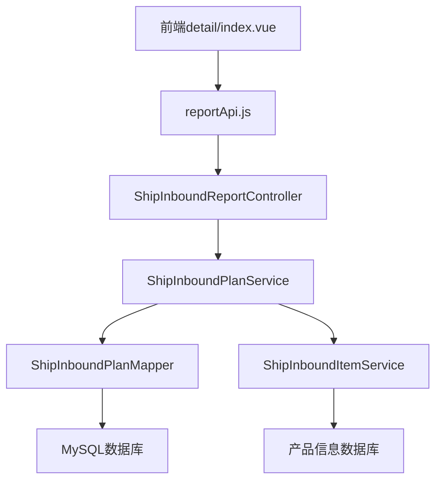
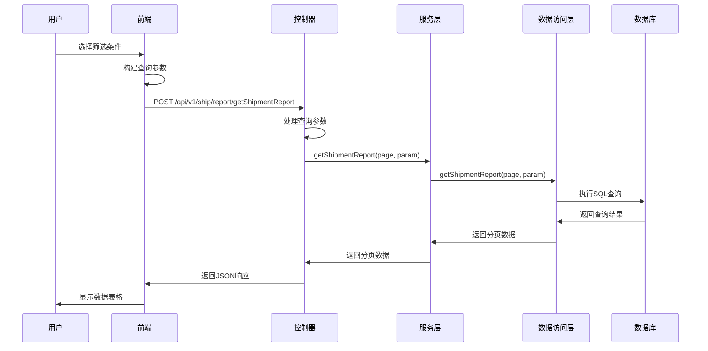
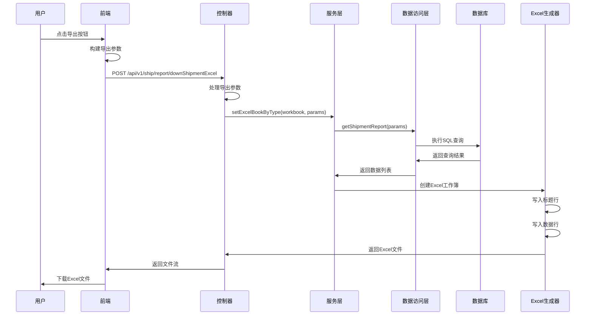

# 发货详情报表模块功能解析文档

## 1. 系统架构

### 1.1 整体架构

发货详情报表模块采用前后端分离架构，主要包含以下组件：

- **前端组件**：Vue 3 + Element Plus 构建的单页应用
- **后端服务**：Spring Boot 微服务，提供 RESTful API
- **数据库**：MySQL 数据库存储发货相关数据
- **外部依赖**：亚马逊API用于获取和同步FBA货件信息

### 1.2 模块依赖关系



## 2. 前端实现

### 2.1 核心文件结构

```
wimoor-ui/src/views/amazon/report/ship/detail/
├── index.vue                    # 主页面组件
├── components/                  # 子组件目录
└── ...

wimoor-ui/src/api/amazon/inbound/
├── reportApi.js                 # 报表API接口
└── reportV2Api.js               # 报表V2 API接口
```

### 2.2 核心组件分析

#### 2.2.1 主页面组件（index.vue）

**文件路径**：`wimoor-ui/src/views/amazon/report/ship/detail/index.vue`

**主要功能**：
- 提供两种数据视图：按货件汇总和按SKU汇总
- 支持多维度筛选和数据导出
- 实时显示数据统计信息

**核心代码结构**：

```vue
<template>
  <div class="main-sty">
    <!-- 标签页切换 -->
    <el-tabs v-model="selecttype" @tab-change="handleQuery">
      <el-tab-pane label="按货件汇总" name="shipment" key="shipment"></el-tab-pane>
      <el-tab-pane label="按SKU汇总" name="sku" key="sku"></el-tab-pane>
    </el-tabs>

    <!-- 筛选条件区 -->
    <el-row>
      <div class="con-header">
        <el-space>
          <Group @change="changeGroup" />
          <el-select v-model="queryParam.datetype">
            <el-option value="createdate" label="创建日期"></el-option>
            <el-option value="deliverydate" label="发货日期"></el-option>
          </el-select>
          <Datepicker longtime="ok" @changedate="changedate" />
          <Warehouse @changeware="getWarehouse" defaultValue="all" />
          <el-input v-model="queryParam.search" placeholder="请输入货件编码" />
          <el-popover v-model:visible="moreSearchVisible">
            <!-- 高级筛选 -->
          </el-popover>
        </el-space>
      </div>
    </el-row>

    <!-- 按货件汇总表格 -->
    <el-row v-if="selecttype=='shipment'">
      <GlobalTable ref="globalTable" :tableData="tableData" @loadTable="loadTableData">
        <!-- 表格列定义 -->
      </GlobalTable>
    </el-row>

    <!-- 按SKU汇总表格 -->
    <el-row v-else>
      <GlobalTable ref="skuglobalTable" :tableData="skutableData" @loadTable="skuloadTableData">
        <!-- 表格列定义 -->
      </GlobalTable>
    </el-row>
  </div>
</template>
```

**状态管理**：

```javascript
let state = reactive({
  queryParam: {
    search: "",
    marketplaceid: "",
    datetype: "createdate",
    companyid: "",
    hasexceptionnum: "all"
  },
  skusummary: null,
  isload: true,
  tableData: { records: [], total: 0 },
  skutableData: { records: [], total: 0 },
  companylist: [],
  channellist: [],
  moreSearchVisible: false,
  selecttype: "shipment"
});
```

**核心方法**：

1. **handleQuery()** - 处理查询请求

```javascript
function handleQuery() {
  nextTick(() => {
    if (state.selecttype == "shipment") {
      var timer = setTimeout(function() {
        globalTable.value.loadTable(state.queryParam);
        clearTimeout(timer);
      }, 500);
    } else {
      var timer = setTimeout(function() {
        skuglobalTable.value.loadTable(state.queryParam);
        clearTimeout(timer);
      }, 500);
    }
  });
}
```

2. **loadTableData()** - 加载货件汇总数据

```javascript
function loadTableData(params) {
  reportApi.getShipmentReport(params).then((res) => {
    state.isload = false;
    state.tableData.records = res.data.records;
    state.tableData.total = res.data.total;
  });
}
```

3. **skuloadTableData()** - 加载SKU汇总数据

```javascript
function skuloadTableData(params) {
  reportApi.getShipmentDetailReport(params).then((res) => {
    state.isload = false;
    state.skutableData.records = res.data.records;
    if (params.currentpage == 1) {
      state.skusummary = res.data && res.data.records && res.data.records.length > 0 
        ? res.data.records[0].summary 
        : null;
    }
    state.skutableData.total = res.data.total;
  });
}
```

4. **downloadList()** - 导出数据

```javascript
function downloadList(ftype) {
  if (ftype == "shiptask") {
    findProcessHandle({
      "fromdate": state.queryParam.fromdate,
      "enddate": state.queryParam.enddate
    });
  } else if (ftype == "shipqty") {
    inventoryRptApi.downloadOutstockformOut({
      "fromdate": state.queryParam.fromdate,
      "enddate": state.queryParam.enddate
    });
  } else {
    state.queryParam.downloadType = ftype;
    reportApi.downShipmentExcel(state.queryParam, () => {
      state.downLoading = false;
    });
  }
}
```

### 2.3 API接口层

**文件路径**：`wimoor-ui/src/api/amazon/inbound/reportApi.js`

**核心接口**：

```javascript
// 获取货件汇总报表
function getShipmentReport(data) {
  return request.post('/amazon/api/v1/ship/report/getShipmentReport', data);
}

// 获取SKU明细报表
function getShipmentDetailReport(data) {
  return request.post('/amazon/api/v1/ship/report/getShipmentDetailReport', data);
}

// 导出货件报表
function downShipmentExcel(data, callback) {
  return request({
    url: "/amazon/api/v1/ship/report/downShipmentExcel",
    responseType: "blob",
    data: data,
    method: 'post'
  }).then(res => {
    downloadhandler.downloadSuccess(res, "shipmentReport.xlsx");
    if (callback) {
      callback();
    }
  }).catch(e => {
    downloadhandler.downloadFail(e);
    if (callback) {
      callback();
    }
  });
}
```

## 3. 后端实现

### 3.1 控制器层

#### 3.1.1 ShipInboundReportController

**文件路径**：`wimoor-amazon/amazon-boot/src/main/java/com/wimoor/amazon/inbound/controller/ShipInboundReportController.java`

**主要功能**：提供发货报表相关的RESTful API接口

**核心接口**：

1. **getShipmentReport()** - 获取货件汇总报表

```java
@PostMapping(value = "/getShipmentReport")
public Result<IPage<Map<String, Object>>> getShipmentReport(@RequestBody ShipInboundShipmenSummaryDTO dto) {
  Map<String, Object> param = new HashMap<String, Object>();
  UserInfo user = UserInfoContext.get();
  param.put("shopid", user.getCompanyid());
  
  // 处理marketplaceid
  String marketplaceid = dto.getMarketplaceid();
  if (StrUtil.isEmpty(marketplaceid)) {
    marketplaceid = null;
  }
  param.put("marketplaceid", marketplaceid);
  
  // 处理groupid
  String groupid = dto.getGroupid();
  if (StrUtil.isEmpty(groupid)) {
    groupid = null;
  }
  param.put("groupid", groupid);
  
  // 处理搜索条件
  String search = dto.getSearch();
  if (StrUtil.isNotEmpty(search)) {
    param.put("search", search.trim() + "%");
  } else {
    param.put("search", null);
  }
  
  // 处理日期类型
  String datetype = dto.getDatetype();
  param.put("datetype", datetype);
  
  // 处理日期范围
  String fromDate = dto.getFromdate();
  SimpleDateFormat sdf = new SimpleDateFormat("yyyy-MM-dd");
  if (StrUtil.isNotEmpty(fromDate)) {
    param.put("fromDate", fromDate.trim());
  } else {
    Calendar cal = Calendar.getInstance();
    cal.add(Calendar.DAY_OF_MONTH, -7);
    fromDate = GeneralUtil.formatDate(cal.getTime(), sdf);
    param.put("fromDate", fromDate);
  }
  
  String toDate = dto.getEnddate();
  if (StrUtil.isNotEmpty(toDate)) {
    param.put("endDate", toDate.trim().substring(0, 10) + " 23:59:59");
  } else {
    toDate = GeneralUtil.formatDate(new Date(), sdf);
    param.put("endDate", toDate + " 23:59:59");
  }
  
  // 处理仓库
  String warehouseid = dto.getWarehouseid();
  if (StrUtil.isEmpty(warehouseid) || "all".equals(warehouseid)) {
    warehouseid = null;
  }
  param.put("warehouseid", warehouseid);
  
  // 处理承运商
  String company = dto.getCompany();
  if (StrUtil.isEmpty(company)) {
    param.put("company", null);
  } else {
    param.put("company", company + "%");
  }
  
  String companyid = dto.getCompanyid();
  if (StrUtil.isEmpty(companyid)) {
    param.put("companyid", null);
  } else {
    param.put("companyid", companyid);
  }
  
  // 处理接收异常
  String iserror = dto.getHasexceptionnum();
  if (StrUtil.isEmpty(iserror) || "all".equals(iserror)) {
    iserror = null;
  }
  param.put("iserror", iserror);
  
  // 调用服务层获取数据
  IPage<Map<String, Object>> pagelist = shipInboundPlanService.getShipmentReport(dto.getPage(), param);
  return Result.success(pagelist);
}
```

2. **getShipmentDetailReport()** - 获取SKU明细报表

```java
@PostMapping(value = "/getShipmentDetailReport")
public Result<IPage<Map<String, Object>>> getShipmentDetailReport(@RequestBody ShipInboundShipmenSummaryDTO dto, HttpServletResponse response) {
  Map<String, Object> param = new HashMap<String, Object>();
  UserInfo user = UserInfoContext.get();
  String shopid = user.getCompanyid();
  param.put("shopid", shopid);
  
  String marketplaceid = dto.getMarketplaceid();
  if (StrUtil.isEmpty(marketplaceid)) {
    marketplaceid = null;
  }
  param.put("marketplaceid", marketplaceid);
  
  String groupid = dto.getGroupid();
  if (StrUtil.isEmpty(groupid)) {
    groupid = null;
  }
  param.put("groupid", groupid);
  
  String search = dto.getSearch();
  if (StrUtil.isNotEmpty(search)) {
    param.put("search", search.trim() + "%");
  } else {
    param.put("search", null);
  }
  
  String datetype = dto.getDatetype();
  param.put("datetype", datetype);
  
  String fromDate = dto.getFromdate();
  SimpleDateFormat sdf = new SimpleDateFormat("yyyy-MM-dd");
  if (StrUtil.isNotEmpty(fromDate)) {
    param.put("fromDate", fromDate.trim());
  } else {
    Calendar cal = Calendar.getInstance();
    cal.add(Calendar.DAY_OF_MONTH, -7);
    fromDate = GeneralUtil.formatDate(cal.getTime(), sdf);
    param.put("fromDate", fromDate);
  }
  
  String toDate = dto.getEnddate();
  if (StrUtil.isNotEmpty(toDate)) {
    param.put("endDate", toDate.trim().substring(0, 10) + " 23:59:59");
  } else {
    toDate = GeneralUtil.formatDate(new Date(), sdf);
    param.put("endDate", toDate + " 23:59:59");
  }
  
  String warehouseid = dto.getWarehouseid();
  if (StrUtil.isEmpty(warehouseid) || "all".equals(warehouseid)) {
    warehouseid = null;
  }
  param.put("warehouseid", warehouseid);
  
  String company = dto.getCompany();
  if (StrUtil.isEmpty(company)) {
    param.put("company", null);
  } else {
    param.put("company", company + "%");
  }
  
  String iserror = dto.getHasexceptionnum();
  if (StrUtil.isEmpty(iserror) || "all".equals(iserror)) {
    iserror = null;
  }
  param.put("iserror", iserror);
  
  IPage<Map<String, Object>> pagelist = shipInboundPlanService.getShipmentDetailReport(dto.getPage(), param);
  return Result.success(pagelist);
}
```

3. **downShipmentExcel()** - 导出货件报表

```java
@PostMapping(value = "/downShipmentExcel")
public void downShipmentExcelAction(@RequestBody ShipInboundShipmenSummaryDTO dto, HttpServletResponse response) {
  try {
    // 创建新的Excel工作薄
    SXSSFWorkbook workbook = new SXSSFWorkbook();
    response.setContentType("application/force-download");
    response.addHeader("Content-Disposition", "attachment;fileName=Shipmenttemplate.xlsx");
    ServletOutputStream fOut = response.getOutputStream();
    
    UserInfo user = UserInfoContext.get();
    String shopid = user.getCompanyid();
    
    // 构建查询参数
    Map<String, Object> params = new HashMap<String, Object>();
    String marketplaceid = dto.getMarketplaceid();
    String datetype = dto.getDatetype();
    params.put("datetype", datetype);
    
    if (StrUtil.isEmpty(marketplaceid)) {
      marketplaceid = null;
    }
    params.put("marketplaceid", marketplaceid);
    
    String groupid = dto.getGroupid();
    if (StrUtil.isEmpty(groupid)) {
      groupid = null;
    }
    params.put("groupid", groupid);
    
    String search = dto.getSearch();
    if (StrUtil.isNotEmpty(search)) {
      params.put("search", search.trim() + "%");
    } else {
      params.put("search", null);
    }
    
    String fromDate = dto.getFromdate();
    SimpleDateFormat sdf = new SimpleDateFormat("yyyy-MM-dd");
    if (StrUtil.isNotEmpty(fromDate)) {
      params.put("fromDate", fromDate.trim());
    } else {
      Calendar cal = Calendar.getInstance();
      cal.add(Calendar.DAY_OF_MONTH, -7);
      fromDate = GeneralUtil.formatDate(cal.getTime(), sdf);
      params.put("fromDate", fromDate);
    }
    
    String toDate = dto.getEnddate();
    if (StrUtil.isNotEmpty(toDate)) {
      params.put("endDate", toDate.trim().substring(0, 10) + " 23:59:59");
    } else {
      toDate = GeneralUtil.formatDate(new Date(), sdf);
      params.put("endDate", toDate + " 23:59:59");
    }
    
    params.put("shopid", shopid);
    params.put("ftype", dto.getDownloadType());
    
    // 调用服务层生成Excel
    shipInboundPlanService.setExcelBookByType(workbook, params);
    workbook.write(fOut);
    workbook.close();
    fOut.flush();
    fOut.close();
  } catch (Exception e) {
    e.printStackTrace();
  }
}
```

### 3.2 服务层

#### 3.2.1 ShipInboundPlanServiceImpl

**文件路径**：`wimoor-amazon/amazon-boot/src/main/java/com/wimoor/amazon/inbound/service/impl/ShipInboundPlanServiceImpl.java`

**主要功能**：实现发货报表的业务逻辑

**核心方法**：

1. **getShipmentReport()** - 获取货件汇总数据

```java
public IPage<Map<String, Object>> getShipmentReport(Page<?> page, Map<String, Object> param) {
  return this.baseMapper.getShipmentReport(page, param);
}
```

2. **getShipmentDetailReport()** - 获取SKU明细数据

```java
public IPage<Map<String, Object>> getShipmentDetailReport(Page<Object> page, Map<String, Object> param) {
  IPage<Map<String, Object>> result = this.baseMapper.getShipmentDetailReport(page, param);
  if (result != null && result.getRecords().size() > 0 && page.getCurrent() == 1) {
    Map<String, Object> summary = this.baseMapper.getShipmentDetailReportTotal(param);
    Map<String, Object> map = result.getRecords().get(0);
    map.put("summary", summary);
  }
  return result;
}
```

3. **setExcelBookByType()** - 生成Excel文件

```java
public void setExcelBookByType(SXSSFWorkbook workbook, Map<String, Object> params) {
  String type = params.get("ftype").toString();
  
  // 货件发货明细
  if ("shipment".equals(type)) {
    Map<String, Object> titlemap = new LinkedHashMap<String, Object>();
    titlemap.put("ShipmentId", "货件编码");
    titlemap.put("groupname", "发货店铺");
    titlemap.put("market", "收货站点");
    titlemap.put("center", "配送中心");
    titlemap.put("warehouse", "发货仓库");
    titlemap.put("createdate", "创建日期");
    titlemap.put("shiped_date", "发货日期");
    titlemap.put("arrivalTime", "预计到货日期");
    titlemap.put("start_receive_date", "开始接受日期");
    titlemap.put("status6date", "完成日期");
    titlemap.put("company", "承运商");
    titlemap.put("transtype", "运输方式");
    titlemap.put("channame", "发货渠道");
    titlemap.put("qtyshipped", "发货数量");
    titlemap.put("qtyreceived", "到货数量");
    titlemap.put("price", "运输费用");
    titlemap.put("otherfee", "其它费用");
    titlemap.put("totalprice", "物流费用统计");
    titlemap.put("transweight", "实际计费重量");
    titlemap.put("weightkg", "预估发货重量");
    titlemap.put("boxweight", "装箱实际重量(kg)");
    titlemap.put("boxvolume", "装箱材积重量");
    titlemap.put("wunit", "重量单位");
    titlemap.put("shipmentstatus", "状态");
    
    List<Map<String, Object>> list = this.baseMapper.getShipmentReport(params);
    Sheet sheet = workbook.createSheet("sheet1");
    
    // 创建标题行
    Row trow = sheet.createRow(0);
    Object[] titlearray = titlemap.keySet().toArray();
    for (int i = 0; i < titlearray.length; i++) {
      Cell cell = trow.createCell(i);
      Object value = titlemap.get(titlearray[i].toString());
      cell.setCellValue(value.toString());
    }
    
    // 填充数据行
    for (int i = 0; i < list.size(); i++) {
      Row row = sheet.createRow(i + 1);
      Map<String, Object> map = list.get(i);
      for (int j = 0; j < titlearray.length; j++) {
        Cell cell = row.createCell(j);
        Object value = map.get(titlearray[j].toString());
        if (value != null) {
          cell.setCellValue(value.toString());
        }
      }
    }
  }
  // 其他类型的导出...
}
```

### 3.3 数据访问层

#### 3.3.1 ShipInboundPlanMapper

**文件路径**：`wimoor-amazon/amazon-boot/src/main/java/com/wimoor/amazon/inbound/mapper/ShipInboundPlanMapper.java`

**核心方法**：

```java
// 获取货件汇总报表（分页）
IPage<Map<String, Object>> getShipmentReport(Page<?> page, @Param("param")Map<String, Object> param);

// 获取货件汇总报表（全部）
List<Map<String, Object>> getShipmentReport(@Param("param")Map<String, Object> param);

// 获取SKU明细报表（分页）
IPage<Map<String, Object>> getShipmentDetailReport(Page<?> page, @Param("param")Map<String, Object> param);

// 获取SKU明细报表（全部）
List<Map<String, Object>> getShipmentDetailReport(@Param("param")Map<String, Object> param);

// 获取SKU明细报表统计
Map<String, Object> getShipmentDetailReportTotal(Map<String, Object> param);
```

#### 3.3.2 ShipInboundPlanMapper.xml

**文件路径**：`wimoor-amazon/amazon-boot/src/main/resources/mapper/inbound/ShipInboundPlanMapper.xml`

**核心SQL查询**：

1. **getShipmentDetailReport** - 获取SKU明细报表

```xml
<select id="getShipmentDetailReport" parameterType="java.util.Map" resultType="java.util.Map">
  select item.SellerSKU sku, ship.ShipmentId, inp.number, g.name groupname,
         w.name warehouse, mkp.market, ship.shiped_date,
         trans.arrivalTime, item.QuantityShipped, item.QuantityReceived, inp.createdate,
         ship.DestinationFulfillmentCenterId center, detail.channame,
         case when stat.`status`='WORKING' and ship.status>=5 then '已删除' else stat.name end shipmentstatus,
         ifnull(item.QuantityReceived,0) sumrec, ship.status,
         status0date, status1date, status2date, status3date, status4date, status5date, status6date
  from t_erp_ship_inbounditem item
  left join t_erp_ship_inboundshipment ship on ship.ShipmentId = item.ShipmentId
  left join t_erp_ship_inboundtrans trans on trans.shipmentid = ship.ShipmentId
  left join t_erp_ship_transdetail detail on detail.id = trans.channel
  left join t_erp_ship_transcompany cop on cop.id = detail.company
  left join t_erp_ship_status stat on stat.`status` = ship.ShipmentStatus
  left join t_erp_ship_inboundplan inp on inp.id = item.inboundplanid
  left join t_marketplace mkp on mkp.marketplaceId = inp.marketplaceid
  left join t_amazon_group g on g.id = inp.amazongroupid
  left join t_erp_warehouse w on w.id = inp.warehouseid
  where inp.shopid = #{param.shopid,jdbcType=CHAR}
    and ship.status > 1
  <if test="param.endDate != null">
    <if test="param.datetype == 'createdate'">
      and inp.createdate &gt;= #{param.fromDate,jdbcType=TIMESTAMP}
      and inp.createdate &lt;= #{param.endDate,jdbcType=TIMESTAMP}
    </if>
    <if test="param.datetype == 'deliverydate'">
      and ship.shiped_date &gt;= #{param.fromDate,jdbcType=TIMESTAMP}
      and ship.shiped_date &lt;= #{param.endDate,jdbcType=TIMESTAMP}
    </if>
  </if>
  <if test="param.groupid != null">
    and inp.amazongroupid = #{param.groupid,jdbcType=CHAR}
  </if>
  <if test="param.marketplaceid != null">
    and inp.marketplaceid = #{param.marketplaceid,jdbcType=CHAR}
  </if>
  <if test="param.search != null">
    and (item.SellerSKU like #{param.search,jdbcType=CHAR} 
         or ship.ShipmentId like #{param.search,jdbcType=CHAR} 
         or inp.number like #{param.search,jdbcType=CHAR})
  </if>
  <if test="param.company != null">
    and cop.name like #{param.company,jdbcType=CHAR}
  </if>
  <if test="param.warehouseid != null">
    and w.id = #{param.warehouseid,jdbcType=CHAR}
  </if>
  <if test="param.iserror != null">
    <if test="param.iserror == 'true'">
      and item.QuantityReceived != item.QuantityShipped
    </if>
    <if test="param.iserror == 'false'">
      and item.QuantityReceived = item.QuantityShipped
    </if>
  </if>
</select>
```

2. **getShipmentReport** - 获取货件汇总报表

```xml
<select id="getShipmentReport" parameterType="java.util.Map" resultType="java.util.Map">
  select ship.ShipmentId,
         max(g.name) groupname,
         max(mkp.market) market,
         max(ship.DestinationFulfillmentCenterId) center,
         max(w.name) warehouse,
         max(inp.createdate) createdate,
         max(ship.shiped_date) shiped_date,
         max(trans.arrivalTime) arrivalTime,
         max(status6date) status6date,
         max(company.name) company,
         max(detail.channame) channame,
         count(item.SellerSKU) skunum,
         max(inp.number) number,
         sum(item.QuantityShipped) qtyshipped,
         sum(item.QuantityReceived) qtyreceived,
         max(trans.otherfee) otherfee,
         max(trans.singleprice * trans.transweight) price,
         max(trans.transweight) transweight,
         max(ship.weightkg) weightkg,
         max(ship.boxweight) boxweight,
         max(ship.boxvolume) boxvolume,
         max(ship.wunit) wunit,
         max(stat.name) shipmentstatus,
         max(trans.transtype) transtype,
         max(ship.start_receive_date) start_receive_date
  from t_erp_ship_inbounditem item
  left join t_erp_ship_inboundshipment ship on ship.ShipmentId = item.ShipmentId
  left join t_erp_ship_inboundtrans trans on trans.shipmentid = ship.ShipmentId
  left join t_erp_ship_transdetail detail on detail.id = trans.channel
  left join t_erp_ship_transcompany company on company.id = detail.company
  left join t_erp_ship_status stat on stat.`status` = ship.ShipmentStatus
  left join t_erp_ship_inboundplan inp on inp.id = item.inboundplanid
  left join t_marketplace mkp on mkp.marketplaceId = inp.marketplaceid
  left join t_amazon_group g on g.id = inp.amazongroupid
  left join t_erp_warehouse w on w.id = inp.warehouseid
  where inp.shopid = #{param.shopid,jdbcType=CHAR}
    and ship.status > 1
  <if test="param.endDate != null">
    <if test="param.datetype == 'createdate'">
      and inp.createdate &gt;= #{param.fromDate,jdbcType=TIMESTAMP}
      and inp.createdate &lt;= #{param.endDate,jdbcType=TIMESTAMP}
    </if>
    <if test="param.datetype == 'deliverydate'">
      and ship.shiped_date &gt;= #{param.fromDate,jdbcType=TIMESTAMP}
      and ship.shiped_date &lt;= #{param.endDate,jdbcType=TIMESTAMP}
    </if>
  </if>
  <if test="param.groupid != null">
    and inp.amazongroupid = #{param.groupid,jdbcType=CHAR}
  </if>
  <if test="param.marketplaceid != null">
    and inp.marketplaceid = #{param.marketplaceid,jdbcType=CHAR}
  </if>
  <if test="param.search != null">
    and (ship.ShipmentId like #{param.search,jdbcType=CHAR} 
         or inp.number like #{param.search,jdbcType=CHAR})
  </if>
  <if test="param.company != null">
    and company.name like #{param.company,jdbcType=CHAR}
  </if>
  <if test="param.companyid != null">
    and company.id = #{param.companyid,jdbcType=CHAR}
  </if>
  <if test="param.warehouseid != null">
    and w.id = #{param.warehouseid,jdbcType=CHAR}
  </if>
  <if test="param.iserror != null">
    <if test="param.iserror == 'true'">
      and sum(item.QuantityReceived) != sum(item.QuantityShipped)
    </if>
    <if test="param.iserror == 'false'">
      and sum(item.QuantityReceived) = sum(item.QuantityShipped)
    </if>
  </if>
  group by ship.ShipmentId
</select>
```

## 4. 数据库设计

### 4.1 核心表结构

#### 4.1.1 t_erp_ship_inboundshipment（货件表）

| 字段名 | 类型 | 说明 |
|--------|------|------|
| ShipmentId | varchar | 货件ID（主键） |
| inboundplanid | varchar | 发货计划ID |
| DestinationFulfillmentCenterId | varchar | 目标配送中心ID |
| ShipmentStatus | varchar | 货件状态 |
| shiped_date | datetime | 发货日期 |
| status6date | datetime | 完成日期 |
| weightkg | decimal | 预估发货重量 |
| boxweight | decimal | 装箱实际重量 |
| boxvolume | decimal | 装箱材积重量 |
| wunit | varchar | 重量单位 |
| status | int | 状态码 |
| start_receive_date | datetime | 开始接收日期 |

#### 4.1.2 t_erp_ship_inbounditem（货件明细表）

| 字段名 | 类型 | 说明 |
|--------|------|------|
| id | varchar | 主键ID |
| ShipmentId | varchar | 货件ID |
| inboundplanid | varchar | 发货计划ID |
| SellerSKU | varchar | 产品SKU |
| QuantityShipped | int | 发货数量 |
| QuantityReceived | int | 接收数量 |

#### 4.1.3 t_erp_ship_inboundtrans（货件运输表）

| 字段名 | 类型 | 说明 |
|--------|------|------|
| shipmentid | varchar | 货件ID |
| channel | varchar | 渠道ID |
| arrivalTime | datetime | 预计到货时间 |
| otherfee | decimal | 其它费用 |
| singleprice | decimal | 单价 |
| transweight | decimal | 运输重量 |
| transtype | varchar | 运输方式 |

#### 4.1.4 t_erp_ship_transdetail（运输详情表）

| 字段名 | 类型 | 说明 |
|--------|------|------|
| id | varchar | 主键ID |
| company | varchar | 承运商ID |
| channame | varchar | 渠道名称 |

#### 4.1.5 t_erp_ship_transcompany（承运商表）

| 字段名 | 类型 | 说明 |
|--------|------|------|
| id | varchar | 承运商ID（主键） |
| name | varchar | 承运商名称 |

#### 4.1.6 t_erp_ship_inboundplan（发货计划表）

| 字段名 | 类型 | 说明 |
|--------|------|------|
| id | varchar | 发货计划ID（主键） |
| number | varchar | 内部编号 |
| amazongroupid | varchar | 店铺ID |
| marketplaceid | varchar | 市场ID |
| warehouseid | varchar | 仓库ID |
| createdate | datetime | 创建日期 |

#### 4.1.7 t_amazon_group（店铺表）

| 字段名 | 类型 | 说明 |
|--------|------|------|
| id | varchar | 店铺ID（主键） |
| name | varchar | 店铺名称 |

#### 4.1.8 t_marketplace（市场表）

| 字段名 | 类型 | 说明 |
|--------|------|------|
| marketplaceId | varchar | 市场ID（主键） |
| market | varchar | 市场名称 |

#### 4.1.9 t_erp_warehouse（仓库表）

| 字段名 | 类型 | 说明 |
|--------|------|------|
| id | varchar | 仓库ID（主键） |
| name | varchar | 仓库名称 |

#### 4.1.10 t_erp_ship_status（货件状态表）

| 字段名 | 类型 | 说明 |
|--------|------|------|
| status | varchar | 状态码（主键） |
| name | varchar | 状态名称 |

## 5. 业务流程

### 5.1 数据查询流程



### 5.2 数据导出流程



## 6. API接口文档

### 6.1 获取货件汇总报表

**接口地址**：`POST /api/v1/ship/report/getShipmentReport`

**请求参数**：

```json
{
  "currentpage": 1,
  "pagesize": 20,
  "groupid": "店铺ID",
  "marketplaceid": "市场ID",
  "search": "货件编码",
  "datetype": "createdate",
  "fromdate": "2026-01-01",
  "enddate": "2026-01-31",
  "warehouseid": "仓库ID",
  "company": "承运商名称",
  "companyid": "承运商ID",
  "hasexceptionnum": "all"
}
```

**响应参数**：

```json
{
  "code": 200,
  "msg": "success",
  "data": {
    "records": [
      {
        "ShipmentId": "FBA123456789",
        "groupname": "美国店铺",
        "market": "US",
        "center": "SBD1",
        "warehouse": "深圳仓库",
        "createdate": "2026-01-01 10:00:00",
        "shiped_date": "2026-01-05 15:00:00",
        "arrivalTime": "2026-01-15 00:00:00",
        "start_receive_date": "2026-01-14 10:00:00",
        "status6date": "2026-01-20 16:00:00",
        "company": "DHL",
        "channame": "空运",
        "qtyshipped": 1000,
        "qtyreceived": 998,
        "price": 500.00,
        "otherfee": 50.00,
        "totalprice": 550.00,
        "transweight": 500.5,
        "weightkg": 502.0,
        "boxweight": 501.0,
        "boxvolume": 503.0,
        "wunit": "kg",
        "shipmentstatus": "已接收",
        "transtype": "AIR"
      }
    ],
    "total": 100,
    "size": 20,
    "current": 1,
    "pages": 5
  }
}
```

### 6.2 获取SKU明细报表

**接口地址**：`POST /api/v1/ship/report/getShipmentDetailReport`

**请求参数**：

```json
{
  "currentpage": 1,
  "pagesize": 20,
  "groupid": "店铺ID",
  "marketplaceid": "市场ID",
  "search": "SKU或货件编码",
  "datetype": "createdate",
  "fromdate": "2026-01-01",
  "enddate": "2026-01-31",
  "warehouseid": "仓库ID",
  "company": "承运商名称",
  "hasexceptionnum": "all"
}
```

**响应参数**：

```json
{
  "code": 200,
  "msg": "success",
  "data": {
    "records": [
      {
        "sku": "SKU001",
        "ShipmentId": "FBA123456789",
        "number": "SF20260101001",
        "groupname": "美国店铺",
        "warehouse": "深圳仓库",
        "market": "US",
        "shiped_date": "2026-01-05 15:00:00",
        "arrivalTime": "2026-01-15 00:00:00",
        "QuantityShipped": 100,
        "QuantityReceived": 98,
        "createdate": "2026-01-01 10:00:00",
        "center": "SBD1",
        "channame": "空运",
        "shipmentstatus": "已接收",
        "summary": {
          "QuantityShipped": 1000,
          "QuantityReceived": 998
        }
      }
    ],
    "total": 500,
    "size": 20,
    "current": 1,
    "pages": 25
  }
}
```

### 6.3 导出货件报表

**接口地址**：`POST /api/v1/ship/report/downShipmentExcel`

**请求参数**：

```json
{
  "groupid": "店铺ID",
  "marketplaceid": "市场ID",
  "search": "货件编码",
  "datetype": "createdate",
  "fromdate": "2026-01-01",
  "enddate": "2026-01-31",
  "warehouseid": "仓库ID",
  "company": "承运商名称",
  "downloadType": "shipment"
}
```

**响应**：Excel文件流

**downloadType参数说明**：
- `shipment`：货件汇总报表
- `other`：含子SKU的SKU明细报表
- `shipqty`：发货数量简约版
- `shiptask`：发货处理任务量

## 7. 性能优化

### 7.1 数据库优化

1. **索引优化**：
   - 在`t_erp_ship_inboundshipment`表的`ShipmentId`字段上建立索引
   - 在`t_erp_ship_inbounditem`表的`ShipmentId`和`SellerSKU`字段上建立复合索引
   - 在`t_erp_ship_inboundplan`表的`shopid`、`amazongroupid`、`marketplaceid`字段上建立索引

2. **查询优化**：
   - 使用LEFT JOIN避免数据丢失
   - 使用MAX、SUM等聚合函数减少数据传输量
   - 使用分页查询避免一次性加载大量数据

### 7.2 前端优化

1. **延迟加载**：
   - 使用setTimeout延迟查询请求，避免频繁调用
   - 使用nextTick确保DOM更新后再执行操作

2. **分页加载**：
   - 使用分页组件减少单次加载的数据量
   - 支持自定义每页显示条数

3. **缓存优化**：
   - 缓存筛选条件，避免重复查询
   - 使用computed属性优化计算性能

### 7.3 后端优化

1. **异步处理**：
   - 使用SXSSFWorkbook流式处理大数据量导出
   - 使用异步任务处理耗时操作

2. **参数验证**：
   - 使用StrUtil工具类进行空值判断
   - 设置合理的默认值

## 8. 扩展功能

### 8.1 自定义列显示

用户可以根据需要自定义表格显示的列，提高数据查看的灵活性。

### 8.2 多格式导出

支持多种导出格式，满足不同的业务需求：
- 普通导出：包含所有字段的完整数据
- 含子SKU：包含子SKU信息的详细版本
- 发货数量简约版：只包含发货数量相关信息的简化版本
- 发货处理任务量：包含发货处理任务量的统计数据

### 8.3 数据统计

在按SKU汇总视图下，自动汇总总发货数量和总接收数量，方便用户快速了解整体情况。

## 9. 注意事项

### 9.1 数据同步

- 货件数据通过亚马逊API同步，可能存在延迟
- 建议定期刷新数据以获取最新信息

### 9.2 权限控制

- 用户只能查看自己公司的数据
- 店铺和市场权限通过用户信息自动过滤

### 9.3 性能考虑

- 避免选择过大的日期范围
- 使用精确的筛选条件减少数据量
- 大数据量导出可能需要较长时间

### 9.4 异常处理

- 接收异常的货件需要特别关注
- 建议定期检查并处理接收异常

## 10. 故障排查

### 10.1 数据不显示

**可能原因**：
- 筛选条件设置不正确
- 数据同步延迟
- 权限不足

**解决方法**：
- 检查筛选条件
- 刷新页面
- 联系管理员检查权限

### 10.2 导出失败

**可能原因**：
- 数据量过大
- 网络问题
- 服务器异常

**解决方法**：
- 缩小日期范围
- 检查网络连接
- 联系技术支持

### 10.3 性能问题

**可能原因**：
- 数据量过大
- 查询条件不优化
- 数据库索引缺失

**解决方法**：
- 使用分页查询
- 优化筛选条件
- 添加数据库索引

---

**文档版本**：v1.0  
**最后更新**：2026-01-26  
**适用系统**：Wimoor FBA发货管理系统