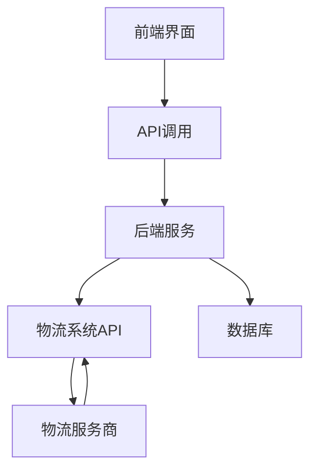
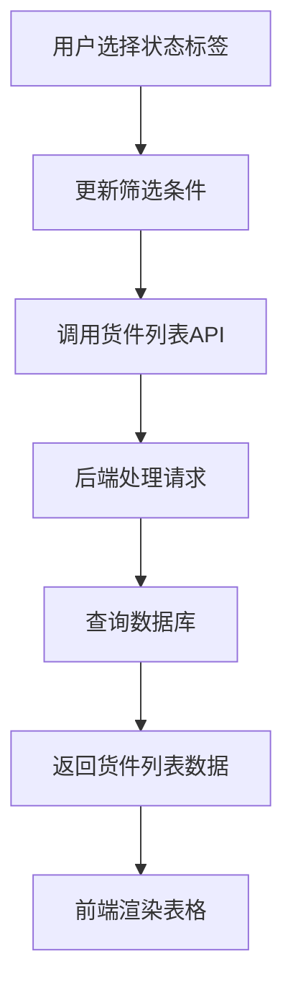
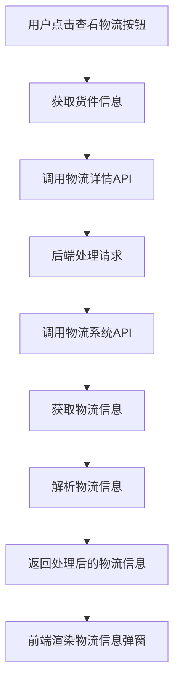
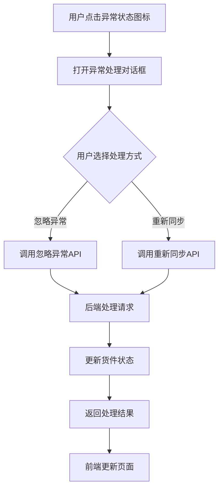

# 货件跟踪模块功能解析文档

## 1. 模块架构概述

货件跟踪模块是 Wimoor 系统中用于管理和跟踪 FBA 货件整个生命周期的重要功能模块。该模块采用前后端分离架构，前端使用 Vue 3 + Element Plus 开发，后端采用 Java + MyBatis Plus 开发，支持多物流系统集成。

### 1.1 系统架构



### 1.2 核心组件

| 组件 | 职责 | 技术实现 |
|------|------|----------|
| 货件列表页面 | 展示和管理货件列表 | Vue 3 + Element Plus |
| 货件表格组件 | 展示货件详细信息 | Vue 3 + Element Plus |
| 物流信息弹窗 | 展示物流详情和轨迹 | Vue 3 + Element Plus |
| 后端服务 | 处理业务逻辑和数据 | Java + Spring Boot |
| 物流系统集成 | 与外部物流系统交互 | RESTful API |
| 数据库 | 存储货件和物流信息 | MySQL |

## 2. 前端代码分析

### 2.1 核心页面结构

#### 2.1.1 货件处理列表页面 (`index.vue`)

- **主要功能**：
  - 提供货件状态标签栏，支持按状态筛选货件
  - 集成筛选和搜索功能
  - 管理表格组件和头部组件的交互

- **关键代码分析**：
  - 状态标签切换逻辑：通过 `activeName` 变量控制当前选中的状态标签，根据不同标签设置不同的 `orderStatus` 值
  - 数据传递：通过 `getdata` 方法接收头部组件的筛选条件，通过 `tableRef.value.getshipmentData(obj)` 传递给表格组件
  - 标签点击事件：通过 `handleClick` 方法处理标签切换事件，更新筛选条件并重新加载数据

```javascript
// 状态标签切换逻辑
function handleClick(){
    if(activeName.value=="0"){
        obj.orderStatus = ""
        obj.hasexceptionnum=null;
    }else if(activeName.value=="1"){
        obj.orderStatus = 7
        obj.hasexceptionnum=null;
    }else if(activeName.value=="2"){
        obj.orderStatus = 5
        obj.hasexceptionnum=null;
    }else if(activeName.value=="3"){
        obj.orderStatus = 55
        obj.hasexceptionnum=null;
    }else if(activeName.value=="4"){
        obj.orderStatus = 6
        obj.hasexceptionnum=null;
    }else if(activeName.value=="5"){
        obj.orderStatus = 0
        obj.hasexceptionnum=null;
    }else if(activeName.value=="6"){
        obj.hasexceptionnum='ok';
        obj.orderStatus = 6
    }
    tableRef.value.getshipmentData(obj);
    headerRef.value.statusChange(obj);
}
```

#### 2.1.2 货件表格组件 (`table.vue`)

- **主要功能**：
  - 展示货件详细信息，包括货件编码、店铺、配送中心、创建日期等
  - 提供物流信息查看、跟踪发货、异常处理等操作
  - 支持表格排序和筛选

- **关键代码分析**：
  - 数据加载：通过 `loadtableData` 方法加载货件数据，构建请求参数并调用后端 API
  - 物流信息查看：通过 `showTransInfoDailog` 方法打开物流信息弹窗，传递货件相关参数
  - 跟踪发货：通过 `shipmentfollow` 方法跳转到货件跟踪页面
  - 异常处理：通过 `refreshShipmentDialog` 和 `ignoreShipmentWarn` 方法处理异常货件

```javascript
// 加载货件数据
function loadtableData(params){
    params.groupid = parmashead.value.store;
    params.marketplaceid =parmashead.value.country;
    params.warehouseid =parmashead.value.warehouse;
    params.fbacenter=parmashead.value.fbacenter;
    if(parmashead.value.start!==undefined){
        params.fromdate = parmashead.value.start;
        params.enddate =parmashead.value.end;
    }else{
        const end = new Date()
        const start = new Date()
        start.setTime(start.getTime() - 3600 * 1000 * 24 * 7)
        params.fromdate =dateFormat(start);
        params.enddate =dateFormat(end);
    }
    params.auditstatus = parmashead.value.orderStatus;
    if(parmashead.value.seachtype!==undefined){
        params.searchtype =parmashead.value.seachtype;
    }else{
        params.searchtype ="sku";
    }
    params.search = parmashead.value.searchwords;
    params.company =parmashead.value.company;
    params.channel= parmashead.value.channel;
    params.transtype =parmashead.value.transtype;
    params.checkdown=parmashead.value.checkdown;
    params.checkinv=parmashead.value.checkinv;
    params.areCasesRequired=parmashead.value.areCasesRequired;
    params.hasexceptionnum=parmashead.value.hasexceptionnum;
    params.hasreferenceid=parmashead.value.hasreferenceid;
    var tagtypes=["primary","success","info","warning","danger"];
    shipmenthandlingApi.getshipList(params).then((res)=>{
        var indexv=0;
        res.data.records.forEach(itemv=>{
            if(oldcheckinv[itemv.checkinv]==undefined){
                indexv=(indexv+1)%5;
                itemv.tagtype=tagtypes[indexv];
                oldcheckinv[itemv.checkinv]=indexv;
            }else{
                itemv.tagtype=tagtypes[oldcheckinv[itemv.checkinv]];
            }
        });
        tableData.records = res.data.records;
        tableData.total =res.data.total;
    })
}
```

#### 2.1.3 物流信息弹窗 (`transinfo.vue`)

- **主要功能**：
  - 支持多种物流系统（ZH和ZM）
  - 展示货件基本信息、收件人和发件人地址
  - 以时间线形式展示物流轨迹
  - 展示货箱详情表格

- **关键代码分析**：
  - 物流数据加载：通过 `loadTransDetialInfo` 方法加载物流详细信息，根据物流系统类型调用不同的处理方法
  - ZH物流系统处理：通过 `loadZhApiDetail` 方法处理ZH物流系统的数据
  - ZM物流系统处理：通过 `loadZmApiDetail` 方法处理ZM物流系统的数据

```javascript
// 加载物流详细信息
function loadTransDetialInfo(companyid,shipmentid,ordernum){
    var html="";
    loading.value=true;
    shipment.value="";
    zmData.value="";
    transportationApi.shipTransDetial({"companyid": companyid,"shipmentid":shipmentid,"ordernum":ordernum}).then(res=>{
        loading.value=false;
        if(res && res.data.ftype=="ZH"){
            systemType.value=res.data.ftype;
            loadZhApiDetail(res.data,companyid,shipmentid);
        }
        if(res && res.data.ftype=="ZM"){
            systemType.value=res.data.ftype;
            loadZmApiDetail(res.data);
        }
    })
    dialogTransVisible.value=true;
}
```

### 2.2 前端 API 调用

#### 2.2.1 货件数据 API

- **`shipmenthandlingApi.getshipList(params)`**：获取货件列表数据
  - **参数**：筛选条件，包括店铺、国家、仓库、日期、状态等
  - **返回值**：货件列表数据，包括货件编码、状态、物流信息等

#### 2.2.2 物流信息 API

- **`transportationApi.shipTransDetial(params)`**：获取物流详细信息
  - **参数**：公司ID、货件ID、订单号
  - **返回值**：物流详细信息，包括服务类型、运费、轨迹等

#### 2.2.3 货件操作 API

- **`shipmentApi.refreshShipmentRec(params)`**：刷新货件接收状态
  - **参数**：货件ID
  - **返回值**：同步结果

- **`shipmentApi.ignoreShipment(params)`**：忽略货件异常
  - **参数**：货件ID
  - **返回值**：忽略结果

### 2.3 前端状态管理

- **组件状态**：使用 Vue 3 的 `ref` 和 `reactive` 管理组件内部状态
- **数据传递**：通过 props 和 emit 实现组件间数据传递
- **路由跳转**：使用 Vue Router 实现页面跳转

## 3. 后端代码分析

### 3.1 核心实体

#### 3.1.1 货件实体 (`Shipment.java`)

- **主要属性**：
  - 买家ID、货件名称、目的地
  - 重量、体积、状态
  - 货箱列表、商品列表

- **关联关系**：
  - 一对多：一个货件包含多个货箱
  - 一对多：一个货件包含多个商品

### 3.2 核心服务

#### 3.2.1 货件服务

- **主要功能**：
  - 货件数据的增删改查
  - 货件状态的管理和更新
  - 货件与物流系统的交互

#### 3.2.2 物流服务

- **主要功能**：
  - 与外部物流系统的API交互
  - 物流信息的获取和解析
  - 物流轨迹的处理和存储

### 3.3 后端 API 接口

#### 3.3.1 货件列表接口

- **路径**：`/api/erp/ship/shipmenthandling/getshipList`
- **方法**：GET
- **参数**：筛选条件，包括店铺、国家、仓库、日期、状态等
- **返回值**：货件列表数据，包括货件编码、状态、物流信息等

#### 3.3.2 物流详细信息接口

- **路径**：`/api/erp/ship/transportation/shipTransDetial`
- **方法**：GET
- **参数**：公司ID、货件ID、订单号
- **返回值**：物流详细信息，包括服务类型、运费、轨迹等

#### 3.3.3 货件状态同步接口

- **路径**：`/api/erp/ship/shipment/refreshShipmentRec`
- **方法**：GET
- **参数**：货件ID
- **返回值**：同步结果

## 4. 物流系统集成

### 4.1 支持的物流系统

- **ZH物流系统**：
  - 提供详细的物流信息，包括服务类型、运费、状态等
  - 支持货箱详情的查看
  - 以时间线形式展示完整的物流轨迹

- **ZM物流系统**：
  - 提供运单号码和物流轨迹
  - 以时间线形式展示物流状态变更

### 4.2 物流系统 API 集成

#### 4.2.1 API 调用流程

1. 前端调用后端物流信息接口
2. 后端根据物流系统类型调用相应的外部 API
3. 外部物流系统返回物流信息
4. 后端解析和处理物流信息
5. 后端返回处理后的物流信息给前端
6. 前端以统一的格式展示物流信息

#### 4.2.2 数据格式处理

- **ZH物流系统数据格式**：
  ```json
  {
    "service_name": "快递服务",
    "shipment_id": "123456",
    "client_reference": "REF789",
    "charge_amount": "100.00",
    "status": "运输中",
    "parcel_count": "2",
    "sumqty": "10",
    "sumprice": "500.00",
    "to_address": {
      "name": "收件人",
      "address_1": "地址1",
      "city_1": "城市",
      "postcode": "100000",
      "country": "CN"
    },
    "from_address": {
      "name": "发件人",
      "address_1": "地址1",
      "city_1": "城市",
      "postcode": "200000",
      "country": "CN"
    },
    "traces": [
      {
        "time": 1674567890,
        "info": "货件已发出"
      },
      {
        "time": 1674567900,
        "info": "货件在运输中"
      }
    ],
    "parcels": [
      {
        "number": "P123",
        "ext_number": "EP123",
        "client_weight": "5.0",
        "client_length": "30",
        "client_width": "20",
        "client_height": "10",
        "carrier_code": "SF",
        "tracking_number": "SF1234567890",
        "chargeable_weight": "5.0",
        "actual_weight": "4.8",
        "chargeable_length": "30",
        "chargeable_width": "20",
        "chargeable_height": "10",
        "picking_time": 1674567890,
        "declarations": [
          {
            "sku": "SKU123",
            "name_zh": "商品名称",
            "name_en": "Product Name",
            "unit_value": "50.00",
            "qty": "2",
            "material": "材质",
            "usage": "用途",
            "brand": "品牌",
            "size": "型号",
            "sale_url": "https://example.com",
            "weight": "1.0",
            "hscode": "12345678"
          }
        ]
      }
    ]
  }
  ```

- **ZM物流系统数据格式**：
  ```json
  {
    "jobno": "ZM1234567890",
    "podInfoDTOList": [
      {
        "scanTime": "2026-01-23 10:00:00",
        "remark": "货件已发出"
      },
      {
        "scanTime": "2026-01-23 14:00:00",
        "remark": "货件在运输中"
      }
    ]
  }
  ```

## 5. 业务流程分析

### 5.1 货件状态管理流程



### 5.2 物流信息查看流程



### 5.3 异常货件处理流程



## 6. 技术实现亮点

### 6.1 前端技术亮点

- **Vue 3 Composition API**：使用 Vue 3 的 Composition API 进行状态管理和逻辑组织，代码结构清晰
- **Element Plus**：使用 Element Plus 组件库构建界面，样式统一美观
- **响应式设计**：页面布局响应式，适配不同屏幕尺寸
- **组件化开发**：将页面拆分为多个组件，提高代码复用性和可维护性
- **时间线展示**：使用 Element Plus 的时间线组件展示物流轨迹，清晰直观
- **表格功能**：使用自定义表格组件，支持排序、筛选、分页等功能

### 6.2 后端技术亮点

- **Spring Boot**：使用 Spring Boot 框架，简化后端开发
- **MyBatis Plus**：使用 MyBatis Plus 进行数据库操作，提高开发效率
- **RESTful API**：设计 RESTful API 接口，规范后端接口设计
- **多物流系统集成**：支持多种物流系统的 API 集成，统一数据格式
- **数据缓存**：使用缓存技术提高系统响应速度
- **异常处理**：完善的异常处理机制，提高系统稳定性

### 6.3 系统集成亮点

- **多物流系统支持**：集成了 ZH 和 ZM 等多种物流系统，统一展示物流信息
- **无缝切换**：在不同物流系统间无缝切换查看物流信息
- **适配不同 API**：自动适配不同物流系统的 API 格式和数据结构
- **实时数据**：实时获取和展示物流信息，确保数据准确性
- **统一界面**：不同物流系统的信息以统一的界面展示，提高用户体验

## 7. 代码优化建议

### 7.1 前端优化建议

1. **性能优化**：
   - 使用虚拟滚动技术处理大量货件数据，提高页面加载和滚动性能
   - 实现数据缓存，减少重复 API 调用
   - 优化组件渲染，避免不必要的重渲染

2. **代码组织**：
   - 将复杂的业务逻辑拆分为更小的函数，提高代码可读性
   - 使用 Pinia 或 Vuex 进行状态管理，简化组件间数据传递
   - 提取重复的代码为公共函数或组件

3. **用户体验**：
   - 添加更多的加载状态和操作反馈，提升用户体验
   - 实现物流状态变更的实时通知
   - 优化表单验证和错误提示

### 7.2 后端优化建议

1. **性能优化**：
   - 使用缓存机制缓存频繁查询的物流信息，提高系统响应速度
   - 优化数据库查询，使用索引提高查询效率
   - 实现异步处理，提高系统并发能力

2. **代码组织**：
   - 优化代码结构，提高代码可读性和可维护性
   - 使用设计模式，如策略模式处理不同物流系统的 API 调用
   - 提取重复的代码为公共服务或工具类

3. **系统稳定性**：
   - 增强错误处理，提供更详细的错误信息
   - 实现熔断机制，避免物流系统 API 故障影响整个系统
   - 添加日志记录，便于问题排查

### 7.3 架构优化建议

1. **微服务架构**：
   - 考虑将物流服务拆分为独立的微服务，提高系统的可扩展性和可维护性
   - 使用服务发现和负载均衡，提高系统的可靠性

2. **API 网关**：
   - 引入 API 网关，统一管理和保护后端 API
   - 实现请求限流和熔断，提高系统的稳定性

3. **数据存储**：
   - 考虑使用 NoSQL 数据库存储物流轨迹等半结构化数据
   - 实现数据分片，提高数据库的处理能力

## 8. 功能扩展建议

### 8.1 功能扩展

1. **移动端支持**：
   - 开发移动端应用或响应式网页，支持在手机上查看物流信息
   - 实现物流状态变更的推送通知

2. **更多物流系统集成**：
   - 集成更多的物流系统，如 FedEx、UPS、DHL 等
   - 提供物流系统 API 配置的可视化界面

3. **数据分析功能**：
   - 实现物流数据的统计和分析，如运输时间、异常率等
   - 提供数据可视化图表，帮助用户分析物流性能

4. **智能预警**：
   - 基于历史数据和规则，实现物流异常的智能预警
   - 提供预警通知和处理建议

5. **多语言支持**：
   - 实现多语言界面，支持国际化业务需求
   - 支持不同国家和地区的物流规则和格式

### 8.2 技术扩展

1. **使用 WebSocket**：
   - 实现实时物流状态更新，无需手动刷新页面
   - 提供更及时的物流轨迹变更通知

2. **使用 AI 技术**：
   - 利用 AI 技术分析物流数据，预测可能的延误和异常
   - 提供智能的物流路径优化建议

3. **区块链技术**：
   - 考虑使用区块链技术存储物流信息，提高数据的安全性和可追溯性
   - 实现物流过程的透明化和不可篡改

## 9. 总结

货件跟踪模块是 Wimoor 系统中一个功能完善、技术先进的模块，通过前后端的紧密配合，为用户提供了全面、实时的货件跟踪服务。该模块具有以下特点：

1. **功能全面**：支持货件状态管理、物流信息查看、物流轨迹跟踪、多物流系统集成等功能
2. **技术先进**：采用 Vue 3 + Element Plus 前端技术和 Java + Spring Boot 后端技术
3. **用户友好**：界面设计简洁直观，操作流程优化，物流信息展示清晰
4. **系统稳定**：完善的错误处理和异常管理机制，确保系统稳定运行
5. **扩展性强**：模块化设计，易于功能扩展和技术升级

通过不断优化和升级，货件跟踪模块将为用户提供更优质的 FBA 货件管理体验，帮助用户更高效地管理和跟踪货件的整个生命周期。