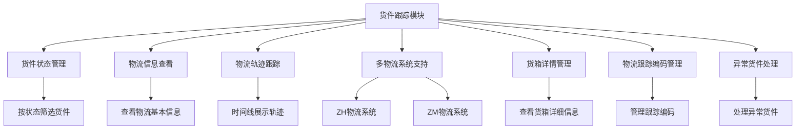

# 货件跟踪模块详细帮助文档

## 1. 模块介绍

### 1.1 什么是货件跟踪模块？

货件跟踪模块是 Wimoor 系统中用于管理和跟踪 FBA 货件整个生命周期的重要功能模块。该模块位于系统的 ERP 模块中，提供了货件状态管理、物流信息跟踪、多物流系统集成等功能，帮助您实时监控货件的运输情况，确保货件安全准时到达目的地。

### 1.2 模块定位与价值

- **定位**：连接货件处理与实际物流运输的桥梁，是 FBA 发货流程的关键监控环节
- **价值**：
  - 实时监控货件的物流状态和运输轨迹
  - 提供多物流系统的集成支持
  - 直观展示货件的物流信息和时间线
  - 帮助及时发现和解决物流异常问题
  - 提高货件管理的透明度和可控性

### 1.3 适用场景

- 查看货件的实时物流状态
- 跟踪货件的详细运输轨迹
- 管理货件的物流跟踪编码
- 处理货件的物流异常情况
- 分析货件的运输时间和效率

## 2. 功能概览

### 2.1 主要功能

| 功能 | 描述 | 适用场景 |
|------|------|----------|
| 货件状态管理 | 支持按货件状态分类查看（全部、处理中、已发货、正在接收、已完成、已取消、异常单据） | 快速筛选不同状态的货件 |
| 物流信息查看 | 查看货件的详细物流信息，包括服务类型、运费、状态等 | 了解货件的物流详情 |
| 物流轨迹跟踪 | 以时间线形式展示货件的完整运输轨迹 | 跟踪货件的实时位置和状态变化 |
| 多物流系统支持 | 集成多种物流系统（ZH和ZM），统一展示物流信息 | 处理不同物流服务商的货件 |
| 货箱详情管理 | 查看货件中每个货箱的详细信息，包括重量、尺寸、承运快递等 | 了解货箱的具体情况 |
| 物流跟踪编码管理 | 查看和处理货件的物流跟踪编码 | 确保跟踪编码的准确性 |
| 异常货件处理 | 识别和处理异常状态的货件 | 及时解决物流问题 |

### 2.2 功能流程图

## 3. 操作指南

### 3.1 访问模块

1. **登录系统**：使用您的账号密码登录 Wimoor 系统
2. **进入 ERP 模块**：在左侧导航栏中点击「ERP」
3. **进入发货管理**：在 ERP 模块下找到「发货」菜单
4. **选择货件处理**：点击「货件处理」进入模块页面
5. **查看货件列表**：在货件处理页面查看货件列表

### 3.2 货件状态筛选

1. **选择状态标签**：在货件处理页面顶部，点击相应的状态标签（全部货件、处理中、已发货、正在接收、已完成、已取消、异常单据）
2. **查看筛选结果**：系统会自动筛选并显示对应状态的货件列表
3. **组合筛选**：可以结合其他筛选条件（如店铺、国家、仓库、日期等）进行更精确的筛选

### 3.3 物流信息查看

1. **找到目标货件**：在货件列表中找到需要查看物流信息的货件
2. **点击「查看物流」按钮**：在货件的「发货渠道」列中，点击「查看物流」按钮
3. **查看物流详情**：系统会弹出物流信息弹窗，展示货件的详细物流信息
4. **查看物流轨迹**：在物流信息弹窗中，查看以时间线形式展示的完整物流轨迹
5. **查看货箱详情**：在物流信息弹窗中，查看货件中每个货箱的详细信息

### 3.4 物流跟踪编码管理

1. **找到目标货件**：在货件列表中找到需要管理跟踪编码的货件
2. **查看跟踪编码状态**：在货件的「货件编码/货件名称」列中，查看跟踪编码的状态图标
   - 蓝色图标：物流跟踪编码待处理
   - 橙色图标：物流跟踪编码已处理
   - 红色图标：物流跟踪编码处理失败
3. **点击跟踪编码图标**：可以查看跟踪编码的详细信息
4. **点击「跟踪发货」按钮**：在货件的「操作」列中，点击「跟踪发货」按钮，进入货件跟踪页面进行更详细的管理

### 3.5 异常货件处理

1. **识别异常货件**：在货件列表中，状态列会显示异常货件的标识
2. **查看异常详情**：点击异常货件的状态图标，查看异常详情
3. **处理异常**：
   - 点击货件状态旁的红色圆形关闭图标，弹出异常处理对话框
   - 选择「忽略异常」或「重新同步」
   - 系统会根据您的选择处理异常情况

## 4. 页面导航与界面说明

### 4.1 页面结构

#### 4.1.1 顶部导航栏

- 系统logo和名称
- 用户名和退出按钮
- 消息通知
- 快捷操作按钮

#### 4.1.2 左侧菜单栏

- ERP 模块入口
- 发货管理菜单
- 货件处理子菜单

#### 4.1.3 主内容区

- 状态标签栏（全部货件、处理中、已发货、正在接收、已完成、已取消、异常单据）
- 筛选条件区域（店铺、国家、仓库、日期等）
- 货件列表表格
- 物流信息弹窗
- 异常处理对话框

### 4.2 界面元素说明

#### 4.2.1 状态标签栏

- **全部货件**：显示所有状态的货件
- **处理中**：显示状态为处理中的货件
- **已发货**：显示状态为已发货的货件
- **正在接收**：显示状态为正在接收的货件
- **已完成**：显示状态为已完成的货件
- **已取消**：显示状态为已取消的货件
- **异常单据**：显示有异常的货件

#### 4.2.2 货件列表表格

- **货件编码/货件名称**：显示货件编码、内部编码、跟踪编码状态和货件名称
- **店铺/发货仓库**：显示店铺名称和发货仓库
- **配送中心**：显示配送中心国家、代码和到货日期
- **创建日期**：显示货件创建日期和发货日期
- **SKU个数**：显示货件中的SKU数量
- **实际配货数量**：显示实际配货数量和拟发货数量
- **发货渠道**：显示物流公司和渠道名称，以及「查看物流」按钮
- **状态**：显示货件状态和状态变更日期
- **备注**：显示货件备注信息
- **操作**：显示「跟踪发货」按钮

#### 4.2.3 物流信息弹窗

- **ZH物流系统**：
  - 货件基本信息（服务类型、客户订单号、运费、状态等）
  - 收件人和发件人详细地址
  - 物流轨迹时间线
  - 货箱详情表格（货箱号、重量、尺寸、承运快递等）
- **ZM物流系统**：
  - 运单号码
  - 物流轨迹时间线

### 4.3 导航路径

- 系统首页 → ERP → 发货 → 货件处理 → 货件列表
- 货件列表 → 物流信息弹窗（点击「查看物流」按钮）
- 货件列表 → 异常处理对话框（点击异常状态图标）
- 货件列表 → 货件跟踪页面（点击「跟踪发货」按钮）

## 5. 常见问题与解决方案

### 5.1 操作类问题

#### 5.1.1 无法查看物流信息

**问题现象**：点击「查看物流」按钮后，系统无法显示物流信息

**可能原因**：
- 物流跟踪编码未填写或不正确
- 物流系统API调用失败
- 网络连接问题

**解决方案**：
- 检查货件的跟踪编码是否正确填写
- 确认网络连接是否正常
- 稍后重试操作
- 联系物流公司确认货件状态

#### 5.1.2 物流轨迹信息不完整

**问题现象**：物流轨迹时间线显示的信息不完整或不及时

**可能原因**：
- 物流公司尚未更新最新的物流信息
- 物流系统API数据同步延迟
- 物流信息传输异常

**解决方案**：
- 稍后再次查看，物流公司可能需要时间更新信息
- 点击「重新同步」按钮，手动同步最新的物流信息
- 联系物流公司查询最新的货件状态

#### 5.1.3 跟踪编码处理失败

**问题现象**：货件的跟踪编码状态显示为「处理失败」

**可能原因**：
- 跟踪编码格式不正确
- 物流公司系统无法识别该跟踪编码
- 网络连接问题导致同步失败

**解决方案**：
- 检查跟踪编码是否正确填写
- 确认所选物流公司是否支持该类型的跟踪编码
- 点击「重新同步」按钮，尝试重新处理跟踪编码
- 联系物流公司确认跟踪编码的有效性

### 5.2 系统类问题

#### 5.2.1 页面加载缓慢

**问题现象**：货件列表页面加载时间过长

**可能原因**：
- 货件数量过多
- 网络延迟
- 系统负载过高
- 物流信息同步耗时较长

**解决方案**：
- 使用筛选条件减少显示的货件数量
- 检查网络连接，确保网络正常
- 避开系统高峰期使用
- 如有持续问题，联系技术支持

#### 5.2.2 物流系统切换失败

**问题现象**：无法在不同物流系统间正常切换查看物流信息

**可能原因**：
- 物流系统API配置问题
- 网络连接问题
- 系统兼容性问题

**解决方案**：
- 刷新页面后重试
- 检查网络连接，确保网络正常
- 联系技术支持检查物流系统API配置

### 5.3 数据类问题

#### 5.3.1 物流信息与实际不符

**问题现象**：系统显示的物流信息与实际物流状态不符

**可能原因**：
- 物流信息同步延迟
- 物流公司系统数据错误
- 系统缓存问题

**解决方案**：
- 点击「重新同步」按钮，获取最新的物流信息
- 联系物流公司确认实际货件状态
- 清除浏览器缓存后重新查看

#### 5.3.2 货件状态更新不及时

**问题现象**：货件的状态更新不及时，与实际状态不符

**可能原因**：
- 状态同步机制延迟
- 网络连接问题
- 亚马逊API限制

**解决方案**：
- 点击货件状态旁的刷新图标，手动同步最新状态
- 稍后再次查看，系统可能需要时间同步状态
- 检查网络连接，确保网络正常

## 6. 最佳实践

### 6.1 货件跟踪最佳实践

#### 6.1.1 货件跟踪流程

1. **定期检查**：定期检查货件的物流状态和轨迹
2. **及时处理异常**：发现异常情况及时处理，避免问题扩大
3. **记录关键节点**：记录货件的关键物流节点和时间
4. **分析物流数据**：分析货件的运输时间和效率，优化物流方案
5. **维护跟踪编码**：确保所有货件都有正确的跟踪编码

#### 6.1.2 物流异常处理

1. **及时发现**：通过系统的异常单据筛选和状态标识，及时发现异常货件
2. **分析原因**：查看物流轨迹和详情，分析异常原因
3. **采取措施**：根据异常原因采取相应的解决措施
4. **跟踪进展**：持续跟踪异常处理的进展情况
5. **记录总结**：记录异常情况和解决方法，为以后的类似问题提供参考

### 6.2 操作技巧

#### 6.2.1 快速筛选货件

- **使用状态标签**：利用顶部的状态标签快速筛选不同状态的货件
- **组合筛选条件**：结合店铺、国家、仓库、日期等筛选条件，精确定位目标货件
- **使用搜索功能**：通过货件编码、SKU、参考号等关键词搜索特定货件
- **点击列头排序**：点击表格列头对货件进行排序，方便查看

#### 6.2.2 高效查看物流信息

- **批量查看**：对于多个货件，可批量查看其物流信息
- **关注关键节点**：重点关注货件的发货、到达、签收等关键节点
- **对比分析**：对比不同货件的物流时间和效率，优化物流方案
- **设置提醒**：对于重要货件，设置物流状态变更提醒

### 6.3 效率提升建议

- **建立标准流程**：建立货件跟踪的标准操作流程，确保操作一致性
- **使用模板**：对于频繁发往同一目的地的货件，使用物流模板提高效率
- **团队协作**：明确团队成员在货件跟踪中的职责分工
- **系统熟悉**：充分了解系统功能，合理利用各种筛选和排序功能
- **持续优化**：根据实际业务需求，不断优化货件跟踪流程

## 7. 故障排除

### 7.1 常见错误与解决方法

| 错误信息 | 可能原因 | 解决方法 |
|---------|---------|---------|
| 无法获取物流信息 | 跟踪编码错误、物流系统API失败 | 检查跟踪编码，稍后重试 |
| 物流轨迹不完整 | 物流公司未更新、同步延迟 | 稍后查看，重新同步 |
| 跟踪编码处理失败 | 编码格式错误、物流系统不支持 | 检查编码格式，联系物流公司 |
| 页面加载失败 | 网络问题、系统错误 | 刷新页面，检查网络连接 |
| 状态同步失败 | 亚马逊API限制、网络问题 | 稍后重试，检查网络连接 |

### 7.2 问题排查步骤

1. **确认问题现象**：详细描述问题发生的场景和具体表现
2. **检查基本条件**：
   - 网络连接是否正常
   - 操作步骤是否正确
   - 货件信息是否完整
3. **尝试基本解决方法**：
   - 刷新页面
   - 重新登录系统
   - 稍后重试操作
   - 检查相关信息是否正确
4. **检查系统状态**：
   - 查看系统通知，了解是否有系统维护或故障
   - 检查物流系统API状态
5. **联系技术支持**：
   - 如问题持续存在，联系技术支持
   - 提供详细的问题描述和操作步骤
   - 提供相关的错误信息和截图

### 7.3 技术支持联系方式

- **在线客服**：系统右下角「在线客服」按钮
- **邮件支持**：support@wimoor.com
- **电话支持**：400-123-4567
- **技术文档**：系统内「帮助中心」

## 8. 术语解释

### 8.1 系统术语

| 术语 | 解释 |
|------|------|
| FBA | Fulfillment by Amazon，亚马逊物流服务 |
| 货件 | 发往亚马逊仓库的一批商品的集合 |
| 跟踪编码 | 物流公司分配的用于跟踪货件的唯一编码 |
| 物流轨迹 | 货件在运输过程中的位置和状态变化记录 |
| 货箱 | 货件中的单个包装单位 |
| 配送中心 | 亚马逊的仓库或物流中心 |
| 异常单据 | 存在物流异常情况的货件 |

### 8.2 物流术语

| 术语 | 解释 |
|------|------|
| 服务类型 | 物流公司提供的具体服务种类 |
| 运费 | 货件运输的费用 |
| 承运快递 | 负责运输货件的快递公司 |
| 到货日期 | 货件预计到达目的地的日期 |
| 实际重量 | 货件的实际称重重量 |
| 材积重量 | 根据货件体积计算的重量 |
| 物流状态 | 货件在运输过程中的当前状态 |

### 8.3 状态术语

| 术语 | 解释 |
|------|------|
| 处理中 | 货件正在处理过程中 |
| 已发货 | 货件已从发货仓库发出 |
| 正在接收 | 货件正在被亚马逊仓库接收 |
| 已完成 | 货件已成功送达并完成处理 |
| 已取消 | 货件已被取消 |
| 异常单据 | 货件存在异常情况 |

## 9. 功能亮点与优势

### 9.1 功能亮点

#### 9.1.1 多物流系统集成

- **支持多种物流系统**：集成了ZH和ZM等多种物流系统
- **统一界面展示**：不同物流系统的信息以统一的界面展示
- **无缝切换**：在不同物流系统间无缝切换查看物流信息
- **适配不同API**：自动适配不同物流系统的API格式和数据结构

#### 9.1.2 直观的物流轨迹展示

- **时间线形式**：以时间线形式展示物流轨迹，清晰直观
- **详细信息**：每条轨迹包含时间、地点和状态描述
- **实时更新**：显示最新的物流状态和位置信息
- **关键节点标记**：突出显示货件的关键物流节点

#### 9.1.3 全面的货件信息管理

- **货件基本信息**：展示货件的核心信息，如服务类型、运费、状态等
- **地址信息**：详细显示收件人和发件人地址
- **货箱详情**：提供每个货箱的详细信息，包括重量、尺寸、承运快递等
- **状态变更记录**：记录货件状态的变更历史和时间

#### 9.1.4 智能的异常处理

- **异常识别**：自动识别和标记异常货件
- **异常处理选项**：提供忽略异常或重新同步的选项
- **异常原因分析**：帮助分析异常原因和解决方法
- **异常统计**：统计和分析异常货件的数量和类型

### 9.2 系统优势

- **操作简便**：界面设计简洁直观，操作流程优化
- **功能全面**：覆盖货件跟踪的所有核心功能
- **信息准确**：与物流系统实时同步，确保信息准确性
- **多系统集成**：支持多种物流系统，提高系统适用性
- **实时监控**：实时监控货件状态，及时发现问题
- **数据可视化**：以图表和时间线形式展示数据，提高可读性
- **可靠性高**：系统稳定，数据安全有保障

## 10. 总结与建议

### 10.1 模块价值总结

货件跟踪模块是 Wimoor 系统中 FBA 发货流程的重要组成部分，通过提供实时的物流状态监控、多物流系统集成、直观的物流轨迹展示等功能，帮助您全面掌握货件的运输情况。该模块不仅提高了货件管理的透明度和可控性，还能帮助您及时发现和解决物流异常问题，确保货件安全准时到达目的地。

### 10.2 使用建议

1. **充分利用筛选功能**：使用状态标签和筛选条件，快速定位目标货件
2. **定期检查物流状态**：定期检查货件的物流状态和轨迹，确保货件正常运输
3. **及时处理异常**：发现异常情况及时处理，避免问题扩大
4. **维护跟踪编码**：确保所有货件都有正确的跟踪编码，便于物流跟踪
5. **分析物流数据**：分析货件的运输时间和效率，优化物流方案
6. **建立标准流程**：建立货件跟踪的标准操作流程，确保操作一致性
7. **培训团队成员**：培训团队成员熟悉货件跟踪模块的使用，提高操作效率

### 10.3 未来展望

随着跨境电商和物流行业的不断发展，货件跟踪模块也将持续优化和升级，未来可能会增加更多功能，如：

- 更多物流系统的集成支持
- 物流状态预测和异常预警
- 物流数据分析和报表功能
- 移动端实时推送物流状态变更
- 与供应链管理系统的深度集成
- 智能物流路径优化建议

我们将不断倾听用户反馈，持续改进系统功能，为您提供更优质的货件跟踪管理体验。

## 11. 附录

### 11.1 操作快捷键

| 快捷键 | 功能 |
|--------|------|
| F5 | 刷新页面 |
| Ctrl + F | 页面内搜索 |
| 点击列头 | 对列进行排序 |

### 11.2 相关模块链接

- **货件处理模块**：用于管理货件的基本信息和操作
- **发货计划模块**：用于创建和管理发货计划
- **库存管理模块**：用于管理商品库存
- **订单管理模块**：用于管理销售订单

### 11.3 参考文档

- [亚马逊 FBA 发货指南](https://sellercentral.amazon.com/gp/help/external/201086320)
- [Wimoor 系统使用手册](https://docs.wimoor.com)
- [国际物流跟踪最佳实践](https://www.logisticsmgmt.com/article/international_shipping_best_practices)

### 11.4 常见问题解答

**Q: 为什么有些货件无法查看物流信息？**

A: 可能的原因包括：物流跟踪编码未填写或不正确、物流系统API调用失败、网络连接问题。请检查货件的跟踪编码是否正确填写，确认网络连接是否正常，稍后重试操作。

**Q: 物流轨迹信息多久更新一次？**

A: 物流轨迹信息的更新频率取决于物流公司的数据更新速度和系统的同步机制。一般情况下，系统会实时获取物流公司的最新数据，但可能存在一定的延迟。

**Q: 如何处理物流跟踪编码处理失败的情况？**

A: 首先检查跟踪编码是否正确填写，确认所选物流公司是否支持该类型的跟踪编码。然后点击「重新同步」按钮，尝试重新处理跟踪编码。如果问题持续存在，联系物流公司确认跟踪编码的有效性。

**Q: 多物流系统集成有什么优势？**

A: 多物流系统集成的优势包括：统一界面展示不同物流系统的信息，简化操作流程；提高系统的适用性，支持更多的物流服务商；无缝切换不同物流系统，提高工作效率；自动适配不同API格式，减少人工干预。

**Q: 如何识别和处理异常货件？**

A: 系统会自动识别和标记异常货件，在货件列表中可以通过状态列查看异常货件。点击异常货件状态旁的红色圆形关闭图标，弹出异常处理对话框，选择「忽略异常」或「重新同步」。对于严重的异常情况，建议联系物流公司进行处理。