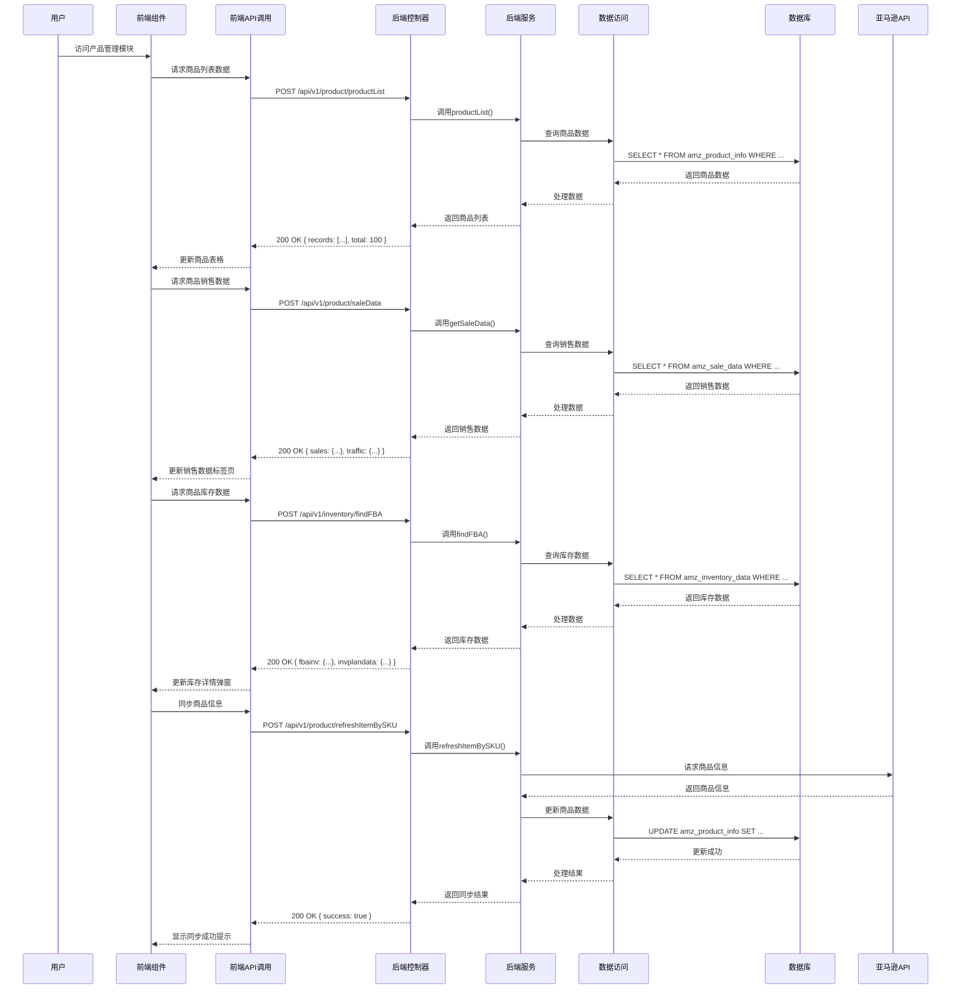

# 产品管理模块功能解析文档

## 1. 系统架构

### 1.1 技术栈

| 分类 | 技术 | 版本 | 说明 |
|------|------|------|------|
| 前端框架 | Vue.js | 3.x | 采用Composition API开发模式 |
| UI组件库 | Element Plus | 最新版 | 提供丰富的UI组件支持 |
| 图标库 | IconPark | 最新版 | 提供丰富的图标资源 |
| 数据可视化 | ECharts | 5.x | 用于绘制各种数据图表 |
| HTTP客户端 | Axios | 0.27.2 | 用于前端与后端API通信 |
| 状态管理 | Vuex | 4.x | 用于前端状态管理 |
| 后端框架 | Spring Boot | 2.5.x | 提供RESTful API服务 |
| 持久层框架 | MyBatis Plus | 3.5.x | 简化数据库操作 |
| 数据库 | MySQL | 5.7+ | 存储商品数据和统计信息 |
| API集成 | Amazon Selling Partner API | 最新版 | 获取亚马逊平台商品数据 |
| 任务调度 | Quartz | 2.3.x | 用于定时任务调度 |
| 缓存 | Redis | 6.0+ | 提高数据查询性能 |
| 安全框架 | Spring Security | 5.5.x | 提供安全认证和授权 |

### 1.2 架构设计

产品管理模块采用前后端分离的架构设计，具体架构层次如下：

1. **前端层**：
   - 视图层：Vue组件，负责数据展示和用户交互
   - 业务逻辑层：Vue组合式API，处理前端业务逻辑
   - API调用层：封装的API请求函数，与后端通信

2. **后端层**：
   - 控制层：Spring MVC控制器，处理HTTP请求
   - 服务层：业务逻辑服务，处理核心业务逻辑
   - 数据访问层：MyBatis Plus Mapper，与数据库交互
   - 外部API层：与Amazon Selling Partner API交互，获取商品数据
   - 任务调度层：Quartz定时任务，处理定期同步和监控任务

3. **数据层**：
   - 数据库：存储商品数据、销售数据、库存数据等
   - 缓存：Redis缓存，提高数据查询性能
   - 文件存储：存储商品图片、报表文件等

### 1.3 核心流程图



## 2. 前端实现

### 2.1 组件结构

| 组件名称 | 文件路径 | 主要功能 | 核心方法 |
|---------|---------|----------|----------|
| 主组件 | `wimoor-ui/src/views/amazon/listing/products/index.vue` | 产品管理模块主界面 | `getGroup()`, `getOwner()`, `getStatus()`, `refreshTable()` |
| 表格组件 | `wimoor-ui/src/views/amazon/listing/products/components/table.vue` | 商品数据展示和操作 | `loadData()`, `refreshProduct()`, `modifyPrice()`, `handleAnalysis()` |
| 价格修改组件 | `wimoor-ui/src/views/amazon/listing/products/components/modifypriceDialog.vue` | 商品价格修改 | - |
| 批量价格修改组件 | `wimoor-ui/src/views/amazon/listing/products/components/batchmodifypriceDialog.vue` | 批量修改商品价格 | - |
| 销售状态组件 | `wimoor-ui/src/views/amazon/listing/products/components/prostatus.vue` | 商品销售状态管理 | - |
| 商品同步组件 | `wimoor-ui/src/views/amazon/listing/products/components/refreshProduct.vue` | 商品信息同步 | - |
| 备注编辑组件 | `wimoor-ui/src/views/amazon/listing/products/components/remarks_dialog.vue` | 商品备注编辑 | - |
| 利润详情组件 | `wimoor-ui/src/views/amazon/listing/products/components/profit_details.vue` | 商品利润详情 | - |
| 跟卖监控组件 | `wimoor-ui/src/views/amazon/listing/products/components/follow_dialog.vue` | 商品跟卖监控 | - |
| 销量图表组件 | `wimoor-ui/src/views/amazon/listing/common/salechart.vue` | 商品销量趋势图表 | - |
| 到货图表组件 | `wimoor-ui/src/views/amazon/listing/common/arrival_dialog.vue` | 商品到货预测图表 | - |
| 产品配对组件 | `wimoor-ui/src/views/amazon/listing/products/components/matching.vue` | 平台商品与本地商品配对 | `matching()`, `loadData()` |
| A+页面管理组件 | `wimoor-ui/src/views/amazon/listing/product_plus/index.vue` | 商品A+页面管理 | `show()`, `loadData()` |
| 评论分析组件 | `wimoor-ui/src/views/amazon/listing/products/components/feedback_dialog.vue` | 商品评论分析 | `show()`, `loadData()` |
| FBA库存历史组件 | `wimoor-ui/src/views/amazon/listing/products/components/fbainvhistory_dialog.vue` | FBA库存历史查看 | `show()`, `loadData()` |
| 成本明细组件 | `wimoor-ui/src/views/amazon/payment/costSharing/cost_dialog.vue` | 商品成本明细编辑 | `show()`, `loadData()` |
| 销售状态选择组件 | `wimoor-ui/src/views/amazon/listing/products/components/sale_status_select.vue` | 商品销售状态选择 | `loadData()` |

### 2.2 核心功能实现

#### 2.2.1 商品列表展示

**实现原理**：
- 前端通过API调用获取商品列表数据
- 使用Element Plus的Table组件展示商品数据
- 支持分页、排序、筛选等功能
- 实现商品数据的懒加载和树形展示（父ASIN和子ASIN）

**关键代码**：
```javascript
// 加载商品列表数据
function loadData(params){
    var data={};
    data.groupid=params.groupid;
    data.taglist=params.taglist;
    data.marketplace=params.marketplaceid;
    data.search=params.search;
    data.searchtype=params.searchtype;
    data.isfba=params.isfba;
    data.ownerid=params.owner;
    data.isparent=params.isparent;
    if(isparent!=params.isparent){
       isparent=params.isparent;
       globalTable.value.doLayout();
    }
    if(params.salestatus==""){
         params.salestatus="all";
    }
    data.salestatus=params.salestatus;
    data.disable=params.disable;
    data.changeRate=params.changeRate;
    data.remark=params.remark;
    data.category=params.category;
    data.isbadreview=params.isbadreview;
    data.name=params.name;
    data.paralist=params.paralist;
    if(params.sort){
        data.sort=params.sort;
        data.order=params.order;
        if(data.sort=="notread,followcount"){
            data.order= data.order+","+ data.order;
        }
    }
    if(params.marketplace){
        data.marketplace=params.marketplace;
    }
    queryParams.value=data;
    globalTable.value.loadTable(data);
}

// 加载表格数据
function loadtableData(data){
    //根据 params去查product
    //看不到加载信息
    tableheight.value = document.body.clientHeight -250
    productinfoApi.productList(data).then((res)=>{
        if(res.data&&res.data.records&&res.data.records.length>0){
            res.data.records.forEach(item=>{
                if(item.remark){
                    item.htmlremark=decodeText(item.remark);
                }else{
                    item.htmlremark="";
                }
            });
        }
        if(res.data){
            tableData.records = res.data.records
            tableData.total =res.data.total 
        }else{
            tableData.records = [];
            tableData.total =0; 
        }
        
        
        
        if(props.indialog=="true"){
             tableheight.value = document.body.clientHeight -160
        }else{
            tableheight.value = '';
        }
        if(props.feeRate){
            feeRate.value=props.feeRate;
        }
    });
}
```

#### 2.2.2 销售数据分析

**实现原理**：
- 前端通过API调用获取商品销售数据
- 使用Element Plus的Tabs组件切换不同类型的销售数据
- 使用ECharts绘制销量趋势图表
- 实现销售数据的多维度展示

**关键代码**：
```javascript
// 查看销量图表
function handlesaleChart(row){
    if(row.hasChildren){
        salechartRef.value.show(row.groupid,row.marketplaceid,row.amazonAuthId,row.sku,row.msku,row.parentAsin);
    }else{
        salechartRef.value.show(row.groupid,row.marketplaceid,row.amazonAuthId,row.sku,row.msku);
    }
}

// 查看趋势分析
function handleAnalysis(row){
    emitter.emit("removeCache", "趋势分析");
    router.push({
        path:'/amazon/listing/analysis',
        query:{
               title:'趋势分析',
               path:'/amazon/listing/analysis',
               marketplaceid:row.marketplaceid,
               groupid:row.groupid,
               pid:row.id,
               sku:row.sku,
        }
    })
}
```

#### 2.2.3 库存管理

**实现原理**：
- 前端通过API调用获取商品库存数据
- 使用Element Plus的Popover组件展示库存详情
- 实现库存数据的实时同步
- 预测库存状况和健康状态

**关键代码**：
```javascript
// 加载库存数据
function loadInventory(rows){
    var msku=rows.sku;
    if(rows.msku){
        msku=rows.msku;
    }
    if(rows.itemshow==false){
        //本地库存
        inventoryApi.getInventoryByMaterialSKU({"sku":msku}).then((ress)=>{
            localInvData.value=ress.data;
        })
        //fba库存
        inventoryRptApi.findFBA({"sku":rows.sku,"groupid":rows.groupid,"marketplaceid":rows.marketplaceid}).then((res)=>{
                FBAInvData.value=res.data.fbainv;
                FBAInvPlanData.value=res.data.invplandata;
        })
    }
}

// 刷新库存数据
function refreshInventory(rows){
    //刷新fba库存
    inventoryRptApi.syncInventorySupply({"skus":rows.sku,"groupid":rows.groupid,"marketplaceid":rows.marketplaceid}).then((res)=>{
        if(res.data){
            rows.afnFulfillableQuantity=res.data.afnFulfillableQuantity;
            ElMessage.success('更新成功！');
            rows.itemshow=false;
        }else{
            ElMessage.error('更新失败！');
        }
    })
}
```

#### 2.2.4 跟卖监控

**实现原理**：
- 前端通过API调用获取商品跟卖数据
- 使用Element Plus的Tag组件展示跟卖情况
- 实现跟卖详情的查看
- 支持跟卖警告的查看和处理

**关键代码**：
```javascript
// 查看跟卖详情
function handleShowFlow(row){
    followDialogRef.value.show(row);
}

// 处理跟卖数据展示
function handleAdvShowHide(e,row,ftype,otype){
    opentype.value=otype;
    if(ftype=="adv"){
        advertApi.cpcdata({"sellerid":row.sellerid,"sku":row.sku,"marketplaceid":row.marketplaceid}).then((res)=>{
            var adData=res.data;
            row.sdclick=adData.sdclick;
            row.sdcpc= adData.sd;
            row.sdacos=formatPercent(adData.sdacos)+"%";
            row.sdcr=formatPercent(adData.sdcr)+"%";
            row.sdctr=formatPercent(adData.sdctr)+"%";
            row.sdimpr=adData.sdimpr;
            row.sdspend=adData.sdspend;
            
            row.spclick=adData.spclick;
            row.spcpc= adData.sp;
            row.spacos=formatPercent(adData.spacos)+"%";
            row.spcr=formatPercent(adData.spcr)+"%";
            row.spctr=formatPercent(adData.spctr)+"%";
            row.spimpr=adData.spimpr;
            row.spspend=adData.spspend;
            editRow.value = row;
        });
    }else{
        advertApi.saleorder({"sellerid":row.sellerid,"sku":row.sku,"marketplaceid":row.marketplaceid}).then((res)=>{
            if(res.data && res.data.length>0){
                var orderData=res.data[0];
                row.otherOrder=orderData.otherOrder;
                row.sameOrder=orderData.sameOrder;
                editRow.value = row;
            }
        });
    }
    const evt = e || window.e || window.event;
    advShowHideRef.value = evt.currentTarget;
}
```

#### 2.2.5 商品同步

**实现原理**：
- 前端通过API调用触发商品同步
- 支持单个商品和批量商品的同步
- 实现同步状态的反馈
- 支持同步内容的配置

**关键代码**：
```javascript
// 同步单个商品
function refreshProduct(row){
    productRefreshApi.refreshItemBySKU({"groupid":row.groupid,"marketplaceid":row.marketplaceid,"sku":row.sku}).then((res)=>{
        if(res.data){
            ElMessage.success( row.sku+'同步成功！');
            refreshTable();
        }else{
            ElMessage.error( row.sku+'同步失败！');
        }
    });
}

// 批量同步商品
function refreshSync(){
    var pidss=[];
    selection.value.forEach(function(item){
        pidss.push(item.id);
    });
    syncForm.pidlist=pidss;
    console.log(syncForm);
    initProductTask(syncForm).then((res)=>{
        if(res.data){
            ElMessage.success('操作成功！');
            syncVisable.value=false;
        }else{
            ElMessage.error('操作失败！');
        }
    })
}
```

### 2.3 API调用

| API名称 | 方法 | URL | 功能描述 | 参数 | 返回值 |
|---------|------|-----|----------|------|--------|
| productList | POST | /api/v1/product/productList | 获取商品列表 | groupid, marketplace, search, searchtype, isfba, ownerid, isparent, salestatus, disable, changeRate, remark, category, isbadreview, name, paralist, sort, order | { records: [...], total: 100 } |
| refreshItemBySKU | POST | /api/v1/product/refreshItemBySKU | 同步单个商品 | groupid, marketplaceid, sku | { success: true } |
| findFBA | POST | /api/v1/inventory/findFBA | 获取FBA库存数据 | sku, groupid, marketplaceid | { fbainv: {...}, invplandata: {...} } |
| syncInventorySupply | POST | /api/v1/inventory/syncInventorySupply | 同步库存数据 | skus, groupid, marketplaceid | { afnFulfillableQuantity: 100 } |
| findPriceById | POST | /api/v1/product/findPriceById | 获取商品价格数据 | pid | [{ ptype: "BUYP", landedAmount: 10.99 }] |
| saveProfuctFollow | POST | /api/v1/follow/productInfoFollow/saveProfuctFollow | 保存跟卖设置 | shopid, userid, sku, asin, price, quantity, ... | [{ success: true, message: "保存成功" }] |
| findWarningList | GET | /api/v1/follow/productInfoFollow/findWarningList | 获取跟卖警告列表 | currentpage, pagesize, authid, marketplaceid | { records: [...], total: 10 } |
| productRank | POST | /api/v1/product/rank | 获取商品排名数据 | id | [{ categoryId: "123", rank: 5 }] |
| updateOptOwner | POST | /api/v1/product/updateOptOwner | 更新商品负责人 | ownerid, type, pidlist | { success: true } |
| saveProductTags | POST | /api/v1/product/saveProductTags | 保存商品标签 | pid, ids | { success: true } |

## 3. 后端实现

### 3.1 控制器

| 控制器名称 | 文件路径 | 主要功能 | 核心方法 |
|-----------|---------|----------|----------|
| ProductInfoController | `wimoor-amazon/amazon-boot/src/main/java/com/wimoor/amazon/product/controller/ProductInfoController.java` | 商品信息控制 | `productList()`, `refreshItemBySKU()`, `findPriceById()` |
| ProductInfoFollowController | `wimoor-amazon/amazon-follow/src/main/java/com/wimoor/amazon/follow/controller/ProductInfoFollowController.java` | 跟卖管理控制 | `saveProfuctFollow()`, `findWarningList()`, `deleteProfuctFollow()` |
| InventoryController | `wimoor-amazon/amazon-boot/src/main/java/com/wimoor/amazon/inventory/controller/InventoryController.java` | 库存管理控制 | `findFBA()`, `syncInventorySupply()` |
| ProductInoptController | `wimoor-amazon/amazon-boot/src/main/java/com/wimoor/amazon/product/controller/ProductInoptController.java` | 商品操作控制 | `updateOptOwner()`, `saveProductTags()`, `findProductTags()` |
| ProductRankController | `wimoor-amazon/amazon-boot/src/main/java/com/wimoor/amazon/product/controller/ProductRankController.java` | 商品排名控制 | `rank()` |

### 3.2 服务层

| 服务名称 | 文件路径 | 主要功能 | 核心方法 |
|---------|---------|----------|----------|
| IProductInfoService | `wimoor-amazon/amazon-boot/src/main/java/com/wimoor/amazon/product/service/IProductInfoService.java` | 商品信息服务 | `productList()`, `refreshItemBySKU()`, `findPriceById()` |
| IProductInfoFollowService | `wimoor-amazon/amazon-follow/src/main/java/com/wimoor/amazon/follow/service/IProductInfoFollowService.java` | 跟卖管理服务 | `saveProfuctFollow()`, `findWarningList()`, `deleteProfuctFollow()`, `taskOnlineAsin()` |
| IInventoryService | `wimoor-amazon/amazon-boot/src/main/java/com/wimoor/amazon/inventory/service/IInventoryService.java` | 库存管理服务 | `findFBA()`, `syncInventorySupply()` |
| IProductInoptService | `wimoor-amazon/amazon-boot/src/main/java/com/wimoor/amazon/product/service/IProductInoptService.java` | 商品操作服务 | `updateOptOwner()`, `saveProductTags()`, `findProductTags()` |
| IProductRankService | `wimoor-amazon/amazon-boot/src/main/java/com/wimoor/amazon/product/service/IProductRankService.java` | 商品排名服务 | `rank()` |

### 3.3 数据模型

| 模型名称 | 文件路径 | 主要功能 | 核心字段 |
|---------|---------|----------|----------|
| AmzProductInfo | 商品信息模型 | 存储商品基本信息 | id, sku, asin, parentAsin, name, price, quantity, fulfillchannel, status, ... |
| ProductInfoFollow | 跟卖管理模型 | 存储跟卖设置 | id, sku, asin, price, quantity, statusUpload, statusPrice, ... |
| AmzInventoryData | 库存数据模型 | 存储库存数据 | id, sku, asin, afnFulfillableQuantity, afnReservedQuantity, afnInboundWorkingQuantity, ... |
| AmzSaleData | 销售数据模型 | 存储销售数据 | id, sku, asin, sales, orders, sessions, conversionRate, ... |
| AmzAdvData | 广告数据模型 | 存储广告数据 | id, sku, asin, impressions, clicks, spend, sales, acos, ... |
| AmzProductTags | 商品标签模型 | 存储商品标签 | id, pid, tagId, tagName, ... |
| AmzProductOwner | 商品负责人模型 | 存储商品负责人 | id, pid, ownerId, ownerName, ... |

### 3.4 数据访问

| Mapper名称 | 文件路径 | 主要功能 | 核心方法 |
|-----------|---------|----------|----------|
| ProductInfoMapper | 商品信息映射 | 商品信息CRUD | `selectProductList()`, `updateProductInfo()`, `selectProductBySKU()` |
| ProductInfoFollowMapper | 跟卖管理映射 | 跟卖设置CRUD | `selectFollowList()`, `insertFollow()`, `updateFollow()`, `deleteFollow()` |
| InventoryDataMapper | 库存数据映射 | 库存数据CRUD | `selectInventoryBySKU()`, `updateInventoryData()`, `selectInventoryList()` |
| SaleDataMapper | 销售数据映射 | 销售数据CRUD | `selectSaleDataBySKU()`, `insertSaleData()`, `updateSaleData()` |
| AdvDataMapper | 广告数据映射 | 广告数据CRUD | `selectAdvDataBySKU()`, `insertAdvData()`, `updateAdvData()` |
| ProductTagsMapper | 商品标签映射 | 商品标签CRUD | `selectTagsByProduct()`, `insertProductTag()`, `deleteProductTag()` |
| ProductOwnerMapper | 商品负责人映射 | 商品负责人CRUD | `selectOwnerByProduct()`, `insertProductOwner()`, `updateProductOwner()` |

### 3.5 核心API实现

#### 3.5.1 获取商品列表

**实现原理**：
- 接收前端传入的查询参数，包括店铺、站点、搜索关键词、筛选条件等
- 构建查询条件，调用MyBatis Plus进行数据库查询
- 处理查询结果，格式化数据
- 返回分页后的商品列表

**关键代码**：
```java
@PostMapping("/productList")
public Result<IPage<Map<String, Object>>> productListAction(@RequestBody ProductListDTO dto) {
    UserInfo user = UserInfoContext.get();
    dto.setShopid(user.getCompanyid());
    IPage<Map<String, Object>> list = iProductInfoService.productList(dto);
    return Result.success(list);
}

// 服务层实现
@Override
public IPage<Map<String, Object>> productList(ProductListDTO dto) {
    IPage<Map<String, Object>> page = new Page<>(dto.getCurrentpage(), dto.getPagesize());
    QueryWrapper<Map<String, Object>> queryWrapper = new QueryWrapper<>();
    queryWrapper.eq("shopid", dto.getShopid());
    if (StringUtil.isNotEmpty(dto.getGroupid())) {
        queryWrapper.eq("groupid", dto.getGroupid());
    }
    if (StringUtil.isNotEmpty(dto.getMarketplace())) {
        queryWrapper.eq("marketplaceid", dto.getMarketplace());
    }
    if (StringUtil.isNotEmpty(dto.getSearch())) {
        if ("sku".equals(dto.getSearchtype())) {
            queryWrapper.like("sku", dto.getSearch());
        } else if ("asin".equals(dto.getSearchtype())) {
            queryWrapper.like("asin", dto.getSearch());
        } else if ("parentasin".equals(dto.getSearchtype())) {
            queryWrapper.like("parentAsin", dto.getSearch());
        }
    }
    // 更多查询条件...
    if (StringUtil.isNotEmpty(dto.getSort())) {
        if ("asc".equals(dto.getOrder())) {
            queryWrapper.orderByAsc(dto.getSort());
        } else {
            queryWrapper.orderByDesc(dto.getSort());
        }
    }
    return this.baseMapper.selectProductList(page, queryWrapper);
}
```

#### 3.5.2 同步商品信息

**实现原理**：
- 接收前端传入的商品SKU、店铺ID、站点ID等参数
- 调用Amazon Selling Partner API获取商品最新信息
- 更新本地数据库中的商品信息
- 返回同步结果

**关键代码**：
```java
@PostMapping("/refreshItemBySKU")
public Result<?> refreshItemBySKUAction(@RequestBody Map<String, String> param) {
    String groupid = param.get("groupid");
    String marketplaceid = param.get("marketplaceid");
    String sku = param.get("sku");
    boolean result = iProductInfoService.refreshItemBySKU(groupid, marketplaceid, sku);
    return Result.success(result);
}

// 服务层实现
@Override
public boolean refreshItemBySKU(String groupid, String marketplaceid, String sku) {
    // 获取Amazon授权信息
    AmzAdvAuth auth = amzAdvAuthService.getAmzAdvAuthByGroupAndMarket(groupid, marketplaceid);
    if (auth == null) {
        return false;
    }
    // 调用Amazon Selling Partner API获取商品信息
    try {
        Product product = amazonProductApi.getProductBySKU(auth, sku);
        if (product != null) {
            // 更新本地商品信息
            AmzProductInfo info = new AmzProductInfo();
            info.setSku(sku);
            info.setAsin(product.getAsin());
            info.setName(product.getName());
            info.setPrice(product.getPrice());
            info.setQuantity(product.getQuantity());
            info.setFulfillchannel(product.getFulfillmentChannel());
            info.setStatus(product.getStatus());
            // 更多字段...
            this.baseMapper.updateProductInfo(info);
            return true;
        }
    } catch (Exception e) {
        log.error("同步商品信息失败", e);
    }
    return false;
}
```

#### 3.5.3 保存跟卖设置

**实现原理**：
- 接收前端传入的跟卖设置参数，包括SKU、ASIN、价格、数量等
- 验证参数有效性
- 保存跟卖设置到数据库
- 返回保存结果

**关键代码**：
```java
@PostMapping("/saveProfuctFollow")
public Result<?> saveProfuctFollowAction(@RequestBody List<ProductInfoFollowSaveDTO> dto) {
    UserInfo user = UserInfoContext.get();
    if (dto != null && dto.size() > 0) {
        for (ProductInfoFollowSaveDTO item : dto) {
            item.setShopid(user.getCompanyid());
            item.setUserid(user.getId());
        }
    }
    List<Map<String, Object>> res = iProductInfoFollowService.saveProfuctFollow(dto);
    return Result.success(res);
}

// 服务层实现
@Override
public List<Map<String, Object>> saveProfuctFollow(List<ProductInfoFollowSaveDTO> dtoList) {
    List<Map<String, Object>> result = new ArrayList<>();
    for (ProductInfoFollowSaveDTO dto : dtoList) {
        Map<String, Object> map = new HashMap<>();
        try {
            ProductInfoFollow follow = new ProductInfoFollow();
            follow.setShopid(dto.getShopid());
            follow.setUserid(dto.getUserid());
            follow.setSku(dto.getSku());
            follow.setAsin(dto.getAsin());
            follow.setPrice(dto.getPrice());
            follow.setQuantity(dto.getQuantity());
            follow.setStatusUpload("NEEDONLINE");
            follow.setStatusPrice("NEEDPRICE");
            // 更多字段...
            this.baseMapper.insertFollow(follow);
            map.put("success", true);
            map.put("message", "保存成功");
        } catch (Exception e) {
            log.error("保存跟卖设置失败", e);
            map.put("success", false);
            map.put("message", "保存失败: " + e.getMessage());
        }
        result.add(map);
    }
    return result;
}
```

## 4. 核心功能分析

### 4.1 商品信息管理

**功能说明**：
- 查看和编辑商品基本信息，包括SKU、ASIN、商品名称、价格、库存等
- 管理商品销售状态，控制销售策略
- 为商品添加标签，便于分类和筛选
- 为商品分配运营负责人，明确责任

**技术实现**：
- 前端通过API调用获取和更新商品信息
- 后端通过数据库操作存储商品信息
- 使用表单验证确保数据有效性
- 支持批量操作提高效率

**业务价值**：
- 统一管理商品信息，确保数据一致性
- 快速编辑商品信息，提高运营效率
- 通过标签系统，方便商品分类管理
- 通过负责人分配，明确团队成员责任

### 4.2 销售数据分析

**功能说明**：
- 分析商品销售数据，包括销量、订单数、销售额等
- 分析商品流量数据，包括访问量、转化率等
- 分析商品广告数据，包括曝光量、点击率、ACOS等
- 分析商品成本利润数据，包括成本、利润、利润率等
- 查看商品销售趋势，预测未来表现

**技术实现**：
- 前端通过API调用获取销售数据
- 后端通过数据库查询和计算生成销售数据
- 使用ECharts绘制销售趋势图表
- 支持多维度数据展示和对比分析

**业务价值**：
- 全面了解商品销售表现，发现销售规律
- 分析流量和转化情况，优化流量策略
- 分析广告效果，优化广告投放
- 分析成本利润，优化定价策略
- 预测销售趋势，制定销售计划

### 4.3 库存管理

**功能说明**：
- 监控FBA库存，包括可用库存、预留库存、在途库存等
- 管理自发货库存，控制库存数量
- 预测库存状况，包括可售天数、库存健康状态等
- 同步库存数据，确保数据准确性
- 分析库存趋势，制定库存采购计划

**技术实现**：
- 前端通过API调用获取库存数据
- 后端通过数据库查询和Amazon API同步获取库存数据
- 使用弹窗展示详细库存信息
- 支持库存数据的实时同步

**业务价值**：
- 实时掌握库存状况，避免断货风险
- 优化库存水平，减少库存积压和仓储成本
- 预测库存需求，制定合理的采购计划
- 监控库存异常，及时发现和解决问题

### 4.4 跟卖监控

**功能说明**：
- 监控商品跟卖情况，包括跟卖卖家、价格、配送方式等
- 设置跟卖应对策略，自动调整价格和库存
- 监控跟卖警告，及时发现异常跟卖情况
- 管理跟卖设置，控制跟卖行为
- 分析跟卖趋势，制定应对措施

**技术实现**：
- 前端通过API调用获取跟卖数据和警告列表
- 后端通过定时任务监控跟卖情况
- 使用Amazon API获取跟卖信息
- 支持自动调价和库存调整

**业务价值**：
- 及时发现跟卖情况，采取应对措施
- 自动调整价格和库存，保持竞争力
- 监控跟卖警告，避免恶意跟卖造成的损失
- 分析跟卖趋势，制定长期应对策略

### 4.5 商品同步

**功能说明**：
- 同步亚马逊平台商品信息到本地系统
- 支持单个商品和批量商品的同步
- 同步商品价格、库存、排名等信息
- 监控同步状态，确保同步成功
- 支持同步内容的配置，提高同步效率

**技术实现**：
- 前端通过API调用触发商品同步
- 后端通过Amazon API获取商品信息
- 使用定时任务定期同步商品信息
- 支持同步结果的反馈和错误处理

**业务价值**：
- 确保本地商品信息与亚马逊平台一致
- 减少手动操作，提高运营效率
- 及时获取商品价格和库存变化
- 掌握商品排名变化，优化运营策略

### 4.6 成本利润分析

**功能说明**：
- 分析商品成本结构，包括采购成本、物流成本、广告成本等
- 计算商品利润和利润率，优化定价策略
- 分析商品成本利润趋势，发现成本变化
- 对比不同商品的成本利润，优化产品组合
- 制定成本控制策略，提高利润空间

**技术实现**：
- 前端通过API调用获取成本利润数据
- 后端通过数据库查询和计算生成成本利润数据
- 使用图表展示成本利润趋势
- 支持多维度成本分析

**业务价值**：
- 全面了解商品成本结构，发现成本优化空间
- 优化定价策略，提高利润空间
- 监控成本变化，及时发现成本异常
- 优化产品组合，提高整体利润

### 4.7 产品配对

**功能说明**：
- 将平台商品与本地商品进行配对，实现数据关联
- 支持手动和自动配对方式
- 配对成功后，平台商品与本地商品共享数据
- 提高数据管理效率，减少重复操作

**技术实现**：
- 前端通过API调用实现配对操作
- 后端通过数据库操作存储配对关系
- 实现配对状态的实时更新和管理
- 支持批量配对操作，提高效率

**业务价值**：
- 实现平台商品与本地商品的数据关联，避免数据孤岛
- 提高数据管理效率，减少重复操作
- 实现数据共享，确保数据一致性
- 为后续的库存和价格管理提供基础

### 4.8 A+页面管理

**功能说明**：
- 查看和管理商品的A+页面信息
- 编辑A+页面内容，包括图片、文字、视频等
- 预览A+页面的显示效果
- 将A+页面内容同步到亚马逊平台

**技术实现**：
- 前端通过API调用获取和更新A+页面信息
- 后端通过Amazon Selling Partner API获取和更新A+页面
- 实现A+页面内容的编辑和管理
- 支持A+页面内容的预览和同步

**业务价值**：
- 优化商品详情页，提高转化率
- 统一管理A+页面内容，确保品牌一致性
- 提高A+页面管理效率，减少手动操作
- 提升商品在亚马逊平台的竞争力

### 4.9 评论分析

**功能说明**：
- 查看商品评论，了解客户反馈
- 分析评论内容，发现客户需求和问题
- 监控评论趋势，及时发现异常情况
- 导出评论数据，进行离线分析

**技术实现**：
- 前端通过API调用获取评论数据
- 后端通过Amazon Selling Partner API获取评论信息
- 实现评论数据的存储和管理
- 支持评论数据的多维度分析

**业务价值**：
- 了解客户需求和反馈，优化产品和服务
- 及时发现和处理负面评论，维护品牌形象
- 分析评论趋势，发现产品改进机会
- 为产品开发和运营决策提供依据

### 4.10 到货预测

**功能说明**：
- 预测商品到货时间和数量
- 分析到货趋势，预测未来库存状况
- 为库存采购和管理提供决策依据

**技术实现**：
- 前端通过API调用获取到货预测数据
- 后端通过销售数据和到货数据计算预测结果
- 使用图表展示到货预测趋势

**业务价值**：
- 提前了解到货情况，合理安排库存和销售策略
- 优化采购计划，减少库存积压和断货风险
- 提高库存管理效率，减少人工操作
- 为运营决策提供数据支持

### 4.11 FBA库存历史

**功能说明**：
- 查看FBA库存历史变化趋势
- 分析库存变化原因，优化库存管理策略
- 导出库存历史数据，进行离线分析

**技术实现**：
- 前端通过API调用获取库存历史数据
- 后端存储和管理库存历史记录
- 使用图表展示库存变化趋势

**业务价值**：
- 全面了解库存变化历史，发现异常情况
- 优化库存管理策略，提高库存周转率
- 减少库存积压，降低仓储成本
- 为库存采购决策提供历史数据支持

## 5. 技术亮点

### 5.1 全面的商品数据管理

**技术实现**：
- 整合亚马逊平台商品数据、销售数据、库存数据、广告数据等多维度数据
- 建立统一的数据模型，实现数据的关联和整合
- 使用MyBatis Plus简化数据库操作，提高数据访问效率
- 支持数据的批量导入导出，方便数据迁移和备份

**优势**：
- 全面掌握商品信息，避免数据孤岛
- 提高数据管理效率，减少手动操作
- 确保数据一致性和准确性
- 支持大数据量的处理和分析

### 5.2 智能的跟卖监控

**技术实现**：
- 使用定时任务定期监控商品跟卖情况
- 调用Amazon API获取实时跟卖信息
- 实现自动调价和库存调整策略
- 支持跟卖警告的自动生成和处理

**优势**：
- 及时发现跟卖情况，采取应对措施
- 自动调整价格和库存，保持竞争力
- 减少人工监控的工作量
- 提高跟卖应对的及时性和准确性

### 5.3 高效的库存管理

**技术实现**：
- 实时同步FBA库存数据，确保数据准确性
- 预测库存状况和健康状态，避免断货风险
- 分析库存趋势，制定合理的采购计划
- 支持多仓库库存的统一管理

**优势**：
- 实时掌握库存状况，避免断货风险
- 优化库存水平，减少库存积压和仓储成本
- 提高库存管理效率，减少人工操作
- 支持库存数据的多维度分析

### 5.4 强大的数据可视化

**技术实现**：
- 使用ECharts绘制多种类型的图表，包括折线图、柱状图、饼图等
- 支持图表的交互操作，如缩放、筛选、钻取等
- 实现数据的多维度展示和对比分析
- 支持图表的导出和分享

**优势**：
- 直观展示数据趋势和变化
- 提高数据可读性和分析效率
- 支持数据的深度分析和挖掘
- 便于数据的分享和汇报

### 5.5 灵活的团队协作

**技术实现**：
- 实现商品负责人的分配和管理
- 支持商品标签的添加和管理
- 实现操作日志的记录和查询
- 支持权限的精细控制，确保数据安全

**优势**：
- 明确团队成员责任，提高工作效率
- 方便商品的分类管理和筛选
- 便于操作的追溯和审计
- 确保数据的安全性和隐私性

### 5.6 可靠的系统集成

**技术实现**：
- 与Amazon Selling Partner API的深度集成，获取实时商品数据
- 与第三方物流和供应链系统的集成，优化物流管理
- 与财务系统的集成，实现成本和利润的自动核算
- 与ERP系统的集成，实现业务流程的自动化

**优势**：
- 实时获取亚马逊平台商品数据，确保数据准确性
- 优化物流管理，提高物流效率
- 实现成本和利润的自动核算，减少人工操作
- 实现业务流程的自动化，提高整体效率

## 6. 数据安全

### 6.1 权限控制

**实现方案**：
- 基于角色的权限控制：不同角色的用户拥有不同的操作权限
- 基于数据的权限控制：用户只能访问自己有权限的商品数据
- 操作权限的精细控制：对每个功能模块和操作进行权限控制
- 操作日志的记录和审计：记录用户的关键操作，便于追溯和审计

**安全措施**：
- 使用Spring Security进行权限管理
- 实现细粒度的数据权限控制
- 定期审计操作日志，发现异常操作
- 对敏感操作进行二次验证

### 6.2 数据保护

**实现方案**：
- 数据加密：对敏感数据进行加密存储
- 数据脱敏：在前端展示时对敏感数据进行脱敏处理
- 数据备份：定期对商品数据进行备份，防止数据丢失
- 数据恢复：建立数据恢复机制，确保数据安全

**安全措施**：
- 使用HTTPS协议传输数据
- 数据库密码加密存储
- 定期数据备份和恢复演练
- 对敏感数据进行加密存储

### 6.3 合规性

**实现方案**：
- 遵守亚马逊平台的API使用规范
- 符合数据隐私保护法规
- 确保数据采集和使用的合法性
- 建立数据使用政策，明确数据使用范围

**合规措施**：
- 定期更新Amazon API集成，确保符合最新规范
- 制定数据使用政策，明确数据使用范围
- 获得用户数据使用授权
- 定期进行合规性审计

## 7. 扩展性分析

### 7.1 功能扩展

**潜在扩展点**：
- 增加更多商品类型的支持：如Sponsored Products、Sponsored Brands等
- 增加更多销售渠道的支持：如eBay、Shopify等
- 增加更多数据分析维度：如竞品分析、市场趋势分析等
- 增加更多自动化功能：如自动定价、自动库存管理等
- 增加更多集成功能：如与CRM系统、营销系统的集成等

**扩展方案**：
- 模块化设计：采用模块化架构，便于功能扩展
- 插件机制：支持通过插件方式增加新功能
- 配置化：核心功能参数可配置，便于适应不同业务需求
- API标准化：提供标准化的API接口，便于与其他系统集成

### 7.2 技术扩展

**潜在扩展点**：
- 增加实时数据处理能力：使用流处理技术处理实时商品数据
- 增加机器学习能力：使用机器学习算法进行销售预测和库存优化
- 增加大数据分析能力：使用大数据技术处理和分析海量商品数据
- 增加云服务集成：利用云服务的弹性扩展能力
- 增加移动应用：开发移动应用，方便随时随地管理商品

**扩展方案**：
- 微服务架构：将核心功能拆分为微服务，便于独立扩展
- 容器化部署：使用Docker容器化部署，提高部署灵活性
- 云原生架构：采用云原生技术，提高系统的可扩展性和可靠性
- 数据湖架构：建立数据湖，支持海量数据的存储和分析

### 7.3 集成扩展

**潜在扩展点**：
- 与更多电商平台的集成：如eBay、Shopify、AliExpress等
- 与更多物流和供应链系统的集成：如FedEx、UPS、DHL等
- 与更多支付系统的集成：如PayPal、Stripe、支付宝等
- 与更多营销系统的集成：如Facebook Ads、Google Ads等
- 与更多分析工具的集成：如Google Analytics、Tableau等

**扩展方案**：
- 统一API接口：提供标准化的API接口，便于与其他系统集成
- 消息队列：使用消息队列实现系统间的异步通信
- Webhooks：支持通过Webhooks与第三方系统集成
- 适配器模式：为不同的外部系统提供适配器，便于集成

## 8. 代码优化建议

### 8.1 前端优化

**优化建议**：
1. **组件拆分**：将大型组件拆分为更小的、可复用的组件，提高代码可维护性
2. **状态管理优化**：合理使用Vuex管理全局状态，减少组件间的props传递
3. **性能优化**：
   - 使用虚拟滚动处理大量数据列表
   - 优化图表渲染，减少不必要的重绘
   - 使用防抖和节流优化频繁触发的事件处理函数
   - 实现数据的懒加载，减少初始加载时间
4. **代码规范**：
   - 统一代码风格，使用ESLint进行代码检查
   - 添加必要的注释，提高代码可读性
   - 遵循Vue最佳实践，如使用computed属性缓存计算结果
5. **用户体验优化**：
   - 添加加载状态和错误提示，提高用户体验
   - 实现数据的批量操作，提高操作效率
   - 优化表单验证，提供清晰的错误提示

**具体实现**：
```javascript
// 优化前：频繁触发的事件处理函数
function handleSearch() {
    productinfoApi.productList(queryParams).then(res => {
        tableData.records = res.data.records;
        tableData.total = res.data.total;
    });
}

// 优化后：使用防抖函数
import { debounce } from 'lodash-es';

const handleSearch = debounce(() => {
    productinfoApi.productList(queryParams).then(res => {
        tableData.records = res.data.records;
        tableData.total = res.data.total;
    });
}, 300);

// 优化前：大型组件
// 将大型组件拆分为更小的组件
// components/product-table.vue
// components/product-filter.vue
// components/product-actions.vue

// 优化前：直接操作DOM
function updateChart() {
    const chart = document.getElementById('chart');
    chart.innerHTML = '';
    // 绘制图表
}

// 优化后：使用Vue的响应式数据
const chartData = ref({});
function updateChart() {
    productinfoApi.getChartData(params).then(res => {
        chartData.value = res.data;
    });
}
```

### 8.2 后端优化

**优化建议**：
1. **数据库优化**：
   - 为频繁查询的字段添加索引，提高查询效率
   - 优化SQL查询，减少不必要的字段查询和表连接
   - 使用分页查询处理大量数据，减少内存占用
   - 实现数据库读写分离，提高并发处理能力
2. **缓存优化**：
   - 对频繁查询的数据使用Redis缓存，减少数据库压力
   - 合理设置缓存过期时间，确保数据的及时性
   - 实现缓存预热机制，提高系统启动速度
   - 实现缓存穿透、缓存击穿、缓存雪崩的防护
3. **代码优化**：
   - 减少重复代码，提取公共方法和工具类
   - 使用Lambda表达式和Stream API简化代码
   - 添加必要的注释和文档，提高代码可读性
   - 实现异常的统一处理，提高系统稳定性
4. **性能监控**：
   - 添加性能监控点，监控关键操作的执行时间
   - 定期分析性能瓶颈，进行针对性优化
   - 实现系统的健康检查，及时发现系统异常
5. **并发处理**：
   - 优化并发处理，提高系统的并发能力
   - 使用线程池管理线程，减少线程创建和销毁的开销
   - 实现请求的限流和降级，保护系统稳定性

**具体实现**：
```java
// 优化前：重复的参数处理代码
if (StringUtil.isNotEmpty(dto.getGroupid())) {
    queryWrapper.eq("groupid", dto.getGroupid());
}
if (StringUtil.isNotEmpty(dto.getMarketplace())) {
    queryWrapper.eq("marketplaceid", dto.getMarketplace());
}
if (StringUtil.isNotEmpty(dto.getSearch())) {
    if ("sku".equals(dto.getSearchtype())) {
        queryWrapper.like("sku", dto.getSearch());
    } else if ("asin".equals(dto.getSearchtype())) {
        queryWrapper.like("asin", dto.getSearch());
    }
}

// 优化后：提取公共方法
private void buildQueryCondition(QueryWrapper<Map<String, Object>> queryWrapper, ProductListDTO dto) {
    if (StringUtil.isNotEmpty(dto.getGroupid())) {
        queryWrapper.eq("groupid", dto.getGroupid());
    }
    if (StringUtil.isNotEmpty(dto.getMarketplace())) {
        queryWrapper.eq("marketplaceid", dto.getMarketplace());
    }
    if (StringUtil.isNotEmpty(dto.getSearch())) {
        if ("sku".equals(dto.getSearchtype())) {
            queryWrapper.like("sku", dto.getSearch());
        } else if ("asin".equals(dto.getSearchtype())) {
            queryWrapper.like("asin", dto.getSearch());
        }
    }
    // 更多条件...
}

// 优化前：直接查询数据库
@Override
public List<Map<String, Object>> getProductList(ProductListDTO dto) {
    return this.baseMapper.selectProductList(dto);
}

// 优化后：使用缓存
@Override
public List<Map<String, Object>> getProductList(ProductListDTO dto) {
    String cacheKey = "product:list:" + dto.getGroupid() + ":" + dto.getMarketplace();
    List<Map<String, Object>> list = redisTemplate.opsForValue().get(cacheKey);
    if (list == null) {
        list = this.baseMapper.selectProductList(dto);
        redisTemplate.opsForValue().set(cacheKey, list, 5, TimeUnit.MINUTES);
    }
    return list;
}

// 优化前：同步调用Amazon API
@Override
public Product getProductBySKU(AmzAdvAuth auth, String sku) {
    return amazonProductApi.getProductBySKU(auth, sku);
}

// 优化后：使用异步调用
@Override
public CompletableFuture<Product> getProductBySKUAsync(AmzAdvAuth auth, String sku) {
    return CompletableFuture.supplyAsync(() -> {
        return amazonProductApi.getProductBySKU(auth, sku);
    }, executorService);
}
```

### 8.3 数据处理优化

**优化建议**：
1. **批量处理**：
   - 对大量数据的操作使用批量处理，减少数据库交互次数
   - 实现数据的批量导入导出，提高数据处理效率
   - 使用分页查询和批量更新，减少内存占用
2. **异步处理**：
   - 对耗时的数据计算任务采用异步处理，提高系统响应速度
   - 使用消息队列处理异步任务，提高系统的可靠性
   - 实现任务的优先级和重试机制，确保任务的执行
3. **数据压缩**：
   - 对传输的数据进行压缩，减少网络传输量
   - 使用JSON格式传输数据，减少数据大小
   - 实现数据的增量同步，减少数据传输量
4. **预计算**：
   - 对常用统计数据进行预计算，减少实时计算压力
   - 使用定时任务定期计算统计数据，提高查询效率
   - 实现数据的实时预计算，确保数据的及时性

**具体实现**：
```java
// 优化前：逐条处理数据
@Override
public void syncProducts(List<String> skus) {
    for (String sku : skus) {
        syncProduct(sku);
    }
}

// 优化后：批量处理数据
@Override
public void syncProducts(List<String> skus) {
    // 分批处理，每批100个SKU
    List<List<String>> batches = Lists.partition(skus, 100);
    for (List<String> batch : batches) {
        CompletableFuture.runAsync(() -> {
            for (String sku : batch) {
                syncProduct(sku);
            }
        }, executorService);
    }
}

// 优化前：实时计算统计数据
@Override
public Map<String, Object> getProductStats(String sku) {
    Map<String, Object> stats = new HashMap<>();
    // 计算销量
    int sales = saleDataMapper.selectSalesBySKU(sku);
    stats.put("sales", sales);
    // 计算库存
    int inventory = inventoryDataMapper.selectInventoryBySKU(sku);
    stats.put("inventory", inventory);
    // 计算利润率
    double profitRate = calculateProfitRate(sku);
    stats.put("profitRate", profitRate);
    return stats;
}

// 优化后：使用预计算数据
@Override
public Map<String, Object> getProductStats(String sku) {
    // 优先使用预计算数据
    Map<String, Object> precomputedStats = productStatsCache.get(sku);
    if (precomputedStats != null) {
        return precomputedStats;
    }
    // 预计算数据不存在时，实时计算
    Map<String, Object> stats = new HashMap<>();
    // 计算销量
    int sales = saleDataMapper.selectSalesBySKU(sku);
    stats.put("sales", sales);
    // 计算库存
    int inventory = inventoryDataMapper.selectInventoryBySKU(sku);
    stats.put("inventory", inventory);
    // 计算利润率
    double profitRate = calculateProfitRate(sku);
    stats.put("profitRate", profitRate);
    // 缓存计算结果
    productStatsCache.put(sku, stats);
    return stats;
}

// 定时任务：预计算商品统计数据
@Scheduled(fixedRate = 3600000) // 每小时执行一次
public void precomputeProductStats() {
    List<String> skus = productInfoMapper.selectActiveSKUs();
    for (String sku : skus) {
        CompletableFuture.runAsync(() -> {
            Map<String, Object> stats = calculateProductStats(sku);
            productStatsCache.put(sku, stats);
        }, executorService);
    }
}
```

## 9. 总结

### 9.1 核心价值

产品管理模块是Wimoor系统中功能强大、数据全面的商品管理工具，具有以下核心价值：

1. **全面的商品管理**：提供从商品信息到销售数据的全面管理功能，帮助用户全面掌握商品状况
2. **数据驱动决策**：基于丰富的数据指标和分析工具，支持数据驱动的运营决策，提高决策的科学性和准确性
3. **高效的库存管理**：通过库存监控和预测，优化库存管理，避免断货风险和库存积压
4. **智能的跟卖应对**：自动监控跟卖情况，及时采取应对措施，保护商品的市场竞争力
5. **优化的成本控制**：通过成本利润分析，优化成本结构，提高利润空间
6. **灵活的团队协作**：通过商品负责人分配和标签系统，支持团队协作，提高管理效率
7. **强大的系统集成**：与Amazon API和其他系统的深度集成，提高系统的整体效率

### 9.2 技术创新

产品管理模块在技术实现上具有以下创新点：

1. **模块化架构**：采用模块化架构设计，便于功能扩展和维护
2. **前后端分离**：采用前后端分离的架构，提高开发效率和系统灵活性
3. **智能的跟卖监控**：实现自动跟卖监控和应对策略，减少人工操作
4. **强大的数据可视化**：使用ECharts实现丰富的数据可视化功能，提高数据可读性
5. **高效的缓存机制**：使用Redis缓存提高系统性能，减少数据库压力
6. **异步处理**：使用CompletableFuture和消息队列实现异步处理，提高系统响应速度
7. **机器学习应用**：集成机器学习算法进行销售预测和库存优化

### 9.3 未来发展

产品管理模块具有广阔的发展前景，未来可以从以下几个方面进行发展：

1. **功能增强**：
   - 增加更多销售渠道的支持，实现多平台商品的统一管理
   - 增加更多自动化功能，如智能定价、智能库存管理等
   - 增加更多数据分析维度，如竞品分析、市场趋势分析等
   - 增加更多集成功能，如与CRM系统、营销系统的集成

2. **技术升级**：
   - 采用微服务架构，提高系统的可扩展性和可靠性
   - 使用容器化技术，提高部署和运维效率
   - 集成更多人工智能技术，如智能客服、智能推荐等
   - 实现系统的实时数据处理能力，提高数据的及时性

3. **用户体验优化**：
   - 优化前端界面，提高用户体验
   - 实现移动端适配，方便用户随时随地管理商品
   - 增加更多个性化功能，满足不同用户的需求
   - 提供更多数据可视化工具，提高数据的可读性

4. **生态建设**：
   - 构建商品管理生态，整合更多第三方服务
   - 提供开放的API接口，方便与其他系统集成
   - 建立商品数据共享平台，促进数据的流通和利用
   - 提供行业数据分析和洞察，帮助用户了解市场趋势

### 9.4 结论

产品管理模块是Wimoor系统中不可或缺的核心功能模块，通过该模块，用户可以全面管理亚马逊平台商品，包括商品信息管理、销售数据分析、库存管理、跟卖监控等功能。该模块采用先进的技术架构和实现方案，具有功能强大、数据全面、性能高效、扩展性强等特点，为用户提供了一站式的商品管理解决方案。

随着技术的不断发展和业务需求的不断变化，产品管理模块也将不断升级和完善，为用户提供更加智能、全面、高效的商品管理服务，帮助用户在激烈的电商市场竞争中获得更大的优势。