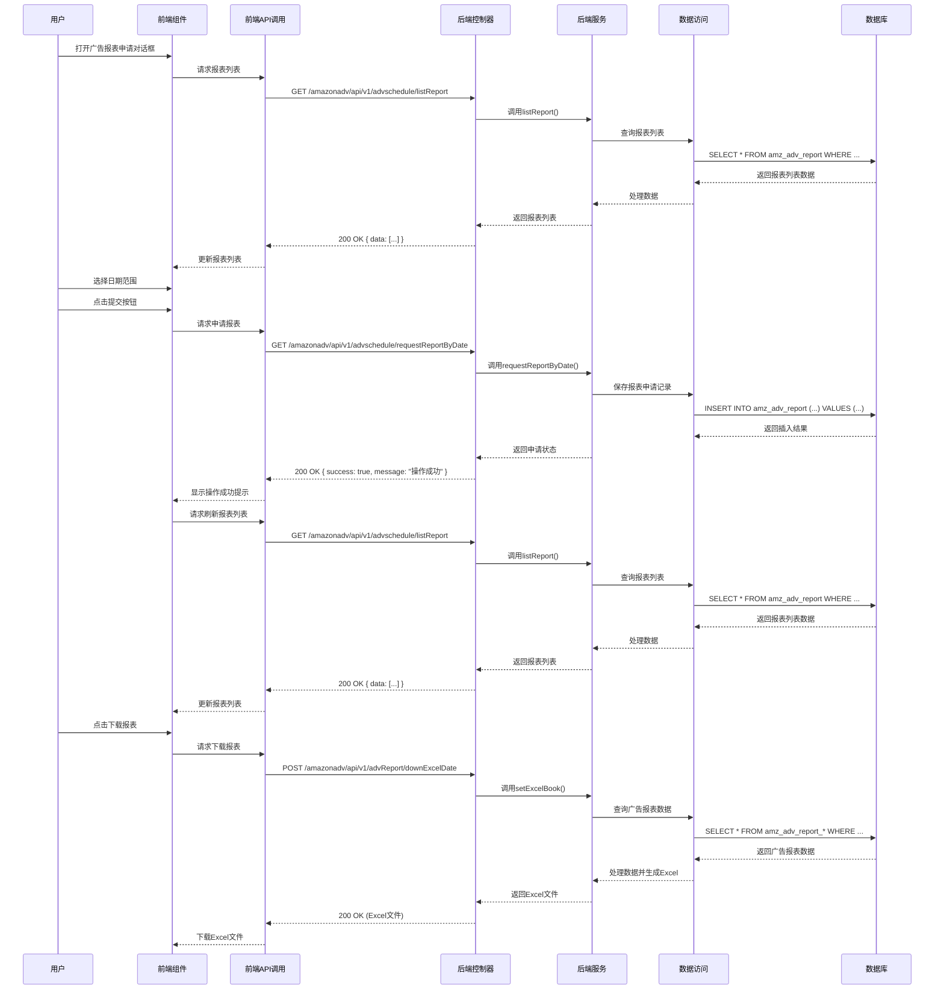

# 广告报表下载功能解析文档

## 1. 系统架构

### 1.1 技术栈

| 分类 | 技术 | 版本 | 说明 |
|------|------|------|------|
| 前端框架 | Vue.js | 3.x | 采用Composition API开发模式 |
| UI组件库 | Element Plus | 最新版 | 提供丰富的UI组件支持 |
| 图标库 | Icon Park | 最新版 | 提供丰富的图标资源 |
| HTTP客户端 | Axios | 0.27.2 | 用于前端与后端API通信 |
| 后端框架 | Spring Boot | 2.5.x | 提供RESTful API服务 |
| 数据访问 | MyBatis | 3.5.x | 简化数据库操作 |
| 数据库 | MySQL | 5.7+ | 存储广告报表数据和相关信息 |
| 缓存 | Redis | 6.0+ | 提高数据查询性能 |
| 安全框架 | Spring Security | 5.5.x | 提供安全认证和授权 |

### 1.2 架构设计

广告报表下载模块采用前后端分离的架构设计，具体架构层次如下：

1. **前端层**：
   - 视图层：Vue组件，负责数据展示和用户交互
   - 业务逻辑层：Vue组合式API，处理前端业务逻辑
   - API调用层：封装的API请求函数，与后端通信

2. **后端层**：
   - 控制层：Spring MVC控制器，处理HTTP请求
   - 服务层：业务逻辑服务，处理核心业务逻辑
   - 数据访问层：MyBatis Mapper，与数据库交互

3. **数据层**：
   - 数据库：存储广告报表数据、广告活动数据、关键词数据等
   - 缓存：Redis缓存，提高数据查询性能

### 1.3 核心流程图



## 2. 前端实现

### 2.1 组件结构

| 组件名称 | 文件路径 | 主要功能 | 核心方法 |
|---------|---------|----------|----------|
| 广告报表对话框 | `wimoor-ui/src/views/amazon/storeAuth/components/advReport.vue` | 广告报表申请和查询 | `submitForm()`, `handleQuery()` |
| 日期选择器组件 | `wimoor-ui/src/components/header/datepicker.vue` | 日期范围选择 | - |

### 2.2 核心功能实现

#### 2.2.1 报表申请功能

**实现原理**：
- 前端通过对话框形式展示报表申请界面
- 用户选择日期范围后，点击提交按钮申请报表
- 前端调用后端API提交报表申请
- 后端在后台处理报表申请，生成报表

**关键代码**：
```javascript
function submitForm(){
    state.submitloading=true;
    authAdvApi.requestReportByDate({"authid":state.authid,"start":state.fromDate,"end":state.endDate}).then(res=>{
        ElMessage.success("操作成功");
        state.submitloading=false;
        handleQuery();
    }).catch(e=>{
        state.submitloading=false;
    })
}
```

#### 2.2.2 报表列表查询

**实现原理**：
- 前端打开对话框时，自动查询报表列表
- 用户提交报表申请后，自动刷新报表列表
- 报表列表按操作时间降序排序，最新的申请记录显示在最上方

**关键代码**：
```javascript
function handleQuery(){
    authAdvApi.listReport({"authid":state.authid}).then(res=>{
        state.tableData=res.data;
    })
}

function show(auth){
    state.authid=auth;
    state.dialogVisible=true;
    handleQuery();
}
```

#### 2.2.3 日期选择功能

**实现原理**：
- 前端使用日期选择器组件，允许用户选择报表的开始和结束日期
- 日期选择器支持快捷选择和手动输入
- 选择日期后，自动更新前端状态

**关键代码**：
```javascript
function changedate(dates){
    state.fromDate=dates.start;
    state.endDate=dates.end;
}
```

### 2.3 API调用

| API名称 | 方法 | URL | 功能描述 | 参数 | 返回值 |
|---------|------|-----|----------|------|--------|
| requestReportByDate | GET | /amazonadv/api/v1/advschedule/requestReportByDate | 申请广告报表 | authid, start, end | { success: true, message: "操作成功" } |
| listReport | GET | /amazonadv/api/v1/advschedule/listReport | 查询报表列表 | authid | { data: [...] } |
| downExcelDate | POST | /amazonadv/api/v1/advReport/downExcelDate | 下载报表Excel | groupid, marketplaceid, reporttype, campaigntype, fromDate, endDate, dateType | Excel文件 |
| getsumproduct | POST | /amazonadv/api/v1/advReport/getsumproduct | 获取产品汇总数据 | begin, end, type, groupid, profileid, currency | { summary: {...}, ordersummary: {...}, chartdata: {...} } |

## 3. 后端实现

### 3.1 控制器

| 控制器名称 | 文件路径 | 主要功能 | 核心方法 |
|-----------|---------|----------|----------|
| AdvertReportController | `wimoor-amazon-adv/amazon-adv-boot/src/main/java/com/wimoor/amazon/adv/controller/AdvertReportController.java` | 广告报表管理 | `downExcelDateAction()`, `getsumproductAction()` |
| SchedulingConfigController | `wimoor-amazon-adv/amazon-adv-boot/src/main/java/com/wimoor/amazon/adv/controller/SchedulingConfigController.java` | 广告报表调度 | `requestReportByDate()`, `listReport()` |

**关键代码**：
```java
@PostMapping("/downExcelDate")
public String downExcelDateAction(@RequestBody QueryForDownload dto,HttpServletResponse response){
    Map<String, Object> param = new HashMap<String, Object>();
    String groupid = dto.getGroupid();
    String marketplaceid = dto.getMarketplaceid();
    String reporttype = dto.getReporttype();
    String campaigntype = dto.getCampaigntype();
    String fromDatestr = dto.getFromDate();
    String endDatestr = dto.getEndDate();
    String dateType = dto.getDateType().toLowerCase();
    if(fromDatestr != null && endDatestr != null) {
        fromDatestr = fromDatestr.replaceAll("/", "-").trim();
        endDatestr = endDatestr.replaceAll("/", "-").trim();
        param.put("fromDate", fromDatestr);
        param.put("endDate", endDatestr);
    }
    if (!StringUtil.isEmpty(groupid) || !StringUtil.isEmpty(marketplaceid)||!StringUtil.isEmpty(dto.getProfileid())) {
        Map<String, Object> maplist = amzAdvAuthService.getProfileByGroupAndmarkplace(groupid, marketplaceid,dto.getProfileid());
        param.put("reporttype", reporttype);
        param.put("campaigntype", campaigntype);
        param.put("dateType", dateType);
        param.put("profileid", maplist.get("id"));
        param.put("currency", maplist.get("currency"));
        param.put("marketplacename", maplist.get("region"));
        param.put("groupname", maplist.get("groupname"));
    }
    SXSSFWorkbook workbook = null;
    ServletOutputStream fOut = null;
    try {
        workbook = amzAdvReportService.setExcelBook(param);
    }catch(BaseException e) {
        throw new BizException("没有可下载的数据");
    }
    try {
        response.setHeader("Set-Cookie", "fileDownload=true; path=/");
        response.setContentType("application/force-download");// 设置强制下载不打开
        response.addHeader("Content-Disposition", "attachment;fileName="+campaigntype+" "+reporttype+" report.xlsx");// 设置文件名
        fOut = response.getOutputStream();
        workbook.write(fOut);
    } catch (Exception e) {
        e.printStackTrace();
    }finally {
        if(fOut != null) {
            try {
                fOut.flush();
                fOut.close();
                if(workbook != null) {
                    workbook.close();
                }
            } catch (IOException e) {
                e.printStackTrace();
            }
        }
    }
    return null;
}
```

### 3.2 服务层

| 服务名称 | 文件路径 | 主要功能 | 核心方法 |
|---------|---------|----------|----------|
| IAmzAdvReportService | `wimoor-amazon-adv/amazon-adv-boot/src/main/java/com/wimoor/amazon/adv/report/service/IAmzAdvReportService.java` | 广告报表服务 | `setExcelBook()` |
| IAmzAdvSumProductAdsService | `wimoor-amazon-adv/amazon-adv-boot/src/main/java/com/wimoor/amazon/adv/report/service/IAmzAdvSumProductAdsService.java` | 广告产品汇总服务 | `getSumProduct()`, `getMonthSumProduct()` |

**关键代码**：
```java
public SXSSFWorkbook setExcelBook(Map<String, Object> param) {
    SXSSFWorkbook workbook = new SXSSFWorkbook();
    List<Map<String, Object>> maplist = getDate(param);

    String campaigntype = param.get("campaigntype").toString();
    String groupname = param.get("groupname").toString();
    String region  = param.get("marketplacename").toString();
    String currency = param.get("currency").toString();
    if (maplist != null && maplist.size() > 0) {
        Sheet sheet = workbook.createSheet("sheet1");
        // 在索引0的位置创建行（最顶端的行）
        Row trow = sheet.createRow(0);
        // Set set = list.get(0).entrySet();
        Map<String, Object> linkmap = maplist.get(0);
        Object[] titlearray = linkmap.keySet().toArray();
        // Object[] titlearray = list.get(0).keySet().toArray();
        Cell cell = trow.createCell(0); // 在索引0的位置创建单元格(左上端)
        cell.setCellValue("campaigntype");
        cell = trow.createCell(1); // 在索引1的位置创建单元格(左上端)
        cell.setCellValue("groupname");
        cell = trow.createCell(2); // 在索引2的位置创建单元格(左上端)
        cell.setCellValue("region");
        cell = trow.createCell(3); // 在索引3的位置创建单元格(左上端)
        cell.setCellValue("currency");
        for (int i = 0; i < titlearray.length; i++) {
            cell = trow.createCell(i+4); // 在索引0的位置创建单元格(左上端)
            Object value = titlearray[i].toString();
            cell.setCellValue(value.toString());
        }
        for (int i = 0; i < maplist.size(); i++) {
            Row row = sheet.createRow(i + 1);
            Map<String, Object> map = maplist.get(i);
            cell = row.createCell(0); // 在索引0的位置创建单元格(左上端)
            cell.setCellValue(campaigntype);
            cell = row.createCell(1); // 在索引1的位置创建单元格(左上端)
            cell.setCellValue(groupname);
            cell = row.createCell(2); // 在索引2的位置创建单元格(左上端)
            cell.setCellValue(region);
            cell = row.createCell(3); // 在索引3的位置创建单元格(左上端)
            cell.setCellValue(currency);
            for (int j = 0; j < titlearray.length; j++) {
                cell = row.createCell(j+4); // 在索引0的位置创建单元格(左上端)
                Object value = map.get(titlearray[j].toString());
                if (value != null && StringUtil.isNotEmpty(value.toString())) {
                    if(AdvUtils.isNumeric(value.toString()) || GeneralUtil.isDouble(value.toString())) {
                        if("Click Thru Rate (CTR)".equals(titlearray[j].toString())  
                                || "Total Advertising Cost of Sales (ACoS)".equals(titlearray[j].toString())
                                || "7 Day Conversion Rate".equals(titlearray[j].toString())
                                || "14 Day Conversion Rate".equals(titlearray[j].toString())) {
                            if(Double.parseDouble(value.toString()) == 0) {
                                cell.setCellValue("");
                            }else {
                                BigDecimal bnumber = new BigDecimal(value.toString()).multiply(new BigDecimal("100"));
                                double number = bnumber.setScale(4, RoundingMode.HALF_UP).doubleValue();
                                cell.setCellValue(number + "%");
                            }
                        }else {
                            cell.setCellValue(GeneralUtil.formatterNum(value));
                        }
                    }else {
                        cell.setCellValue(value.toString());
                    }
                }
            }
        }
    } else {
        throw new BaseException("没有数据可导出！");
    }
    return workbook;
}
```

### 3.3 数据模型

| 模型名称 | 文件路径 | 主要功能 | 核心字段 |
|---------|---------|----------|----------|
| QueryForDownload | `wimoor-amazon-adv/amazon-adv-boot/src/main/java/com/wimoor/amazon/adv/controller/pojo/dto/QueryForDownload.java` | 报表下载查询DTO | groupid, marketplaceid, reporttype, campaigntype, fromDate, endDate, dateType |
| QueryForSumProductDTO | `wimoor-amazon-adv/amazon-adv-boot/src/main/java/com/wimoor/amazon/adv/controller/pojo/dto/QueryForSumProductDTO.java` | 产品汇总查询DTO | begin, end, type, groupid, profileid, currency |
| AmzAdvReportCampaigns | `wimoor-amazon-adv/amazon-adv-boot/src/main/java/com/wimoor/amazon/adv/sp/pojo/AmzAdvReportCampaigns.java` | 广告活动报表 | profileid, campaignid, campaignname, bydate, impressions, clicks, cost, sales |
| AmzAdvReportKeywords | `wimoor-amazon-adv/amazon-adv-boot/src/main/java/com/wimoor/amazon/adv/sp/pojo/AmzAdvReportKeywords.java` | 关键词报表 | profileid, campaignid, adgroupid, keywordid, keyword, bydate, impressions, clicks, cost, sales |

### 3.4 数据访问

| Mapper名称 | 文件路径 | 主要功能 | 核心方法 |
|-----------|---------|----------|----------|
| AmzAdvReportCampaignsMapper | `wimoor-amazon-adv/amazon-adv-boot/src/main/java/com/wimoor/amazon/adv/sp/dao/AmzAdvReportCampaignsMapper.java` | 广告活动报表Mapper | `getCampaigns()` |
| AmzAdvReportKeywordsMapper | `wimoor-amazon-adv/amazon-adv-boot/src/main/java/com/wimoor/amazon/adv/sp/dao/AmzAdvReportKeywordsMapper.java` | 关键词报表Mapper | `getKeywords()` |
| AmzAdvReportProductAdsMapper | `wimoor-amazon-adv/amazon-adv-boot/src/main/java/com/wimoor/amazon/adv/sp/dao/AmzAdvReportProductAdsMapper.java` | 产品广告报表Mapper | `getProductAds()` |
| AmzAdvReportAsinsMapper | `wimoor-amazon-adv/amazon-adv-boot/src/main/java/com/wimoor/amazon/adv/sp/dao/AmzAdvReportAsinsMapper.java` | 产品ASIN报表Mapper | `getAsins()` |

**关键代码**：
```java
public List<Map<String, Object>> getDate(Map<String, Object> param) {
    String reporttype = param.get("reporttype").toString();
    String campaigntype = param.get("campaigntype").toString();
    List<Map<String, Object>> list =null;
    if (DownloadReport.Sponsored_Products.equals(campaigntype)) {
        if (DownloadReport.Campaign.equals(reporttype)) {
            list= amzAdvReportCompaignsMapper.getCampaigns(param);
        } else if (DownloadReport.Campaign_placement.equals(reporttype)) {
            list = amzAdvReportCompaignsPlaceMapper.getCampaignsPlace(param);
        } else if (DownloadReport.Keyword.equals(reporttype)) {
            list = amzAdvReportKeywordsMapper.getKeywords(param);
        } else if (DownloadReport.Keyword_query.equals(reporttype)) {
            list = amzAdvReportKeywordsQueryMapper.getKeywordsQuery(param);
        } else if (DownloadReport.productAd.equals(reporttype)) { 
            list = amzAdvReportProductAdsMapper.getProductAds(param);
        } else if (DownloadReport.Asins.equals(reporttype)) { 
            list = amzAdvReportAsinsMapper.getAsins(param);
        } else if (DownloadReport.Target.equals(reporttype)) {
            list = amzAdvProductTargeMapper.getTargetReport(param);
        } else if (DownloadReport.Target_query.equals(reporttype)) {
            list = amzAdvReportTargetQueryMapper.getTargetQueryReport(param);
        }
    }else if(DownloadReport.Sponsored_Display.equals(campaigntype)){
        if (DownloadReport.Campaign.equals(reporttype)) {
            list= amzAdvReportCampaignsSDMapper.getCampaigns(param);
        }  else if (DownloadReport.Target.equals(reporttype)) {
            list = amzAdvProductTargeSDMapper.getTargetReport(param);
        } else if (DownloadReport.productAd.equals(reporttype)) {
            list = amzAdvReportProductAdsSDMapper.getProductAds(param);
        } else if (DownloadReport.Asins.equals(reporttype)) {
            list = amzAdvReportAsinsSDMapper.getAsins(param);
        }
    } else {
        if (DownloadReport.Campaign.equals(reporttype)) {
            list = amzAdvReportCampaignsHsaMapper.getCampaignsHsa(param);
        } else if (DownloadReport.Campaign_placement.equals(reporttype)) {
            list = amzAdvReportCampaignsPlaceHsaMapper.getCampaignsPlaceHsa(param);
        } else if(DownloadReport.Keyword_query.equals(reporttype)) {
            list = amzAdvReportKeywordsQueryHsaMapper.getKeywordsQueryHsa(param);
        } else if (DownloadReport.Keyword.equals(reporttype)) {
            list = amzAdvReportKeywordsHsaMapper.getKeywordsHsa(param);
        } else if (DownloadReport.Target.equals(reporttype)) {
            list = amzAdvReportProductTargeHsaMapper.getTargetHsaReport(param);
        }
    }
    return list;
}
```

## 4. 核心功能分析

### 4.1 广告报表申请

**功能说明**：
- 根据用户选择的日期范围，申请广告报表
- 支持Sponsored Products、Sponsored Brands、Sponsored Display等多种广告类型
- 申请后，系统会在后台处理报表生成

**技术实现**：
- 前端通过API调用后端的`requestReportByDate`方法
- 后端接收请求后，创建报表申请记录
- 系统后台调度任务定期处理报表申请，调用亚马逊API获取报表数据
- 报表生成完成后，更新报表状态为已完成

**业务价值**：
- 自动化报表申请流程，减少手动操作
- 确保报表数据的完整性和准确性
- 支持批量报表申请，提高工作效率

### 4.2 报表状态查询

**功能说明**：
- 查询广告报表的申请状态和处理进度
- 支持按操作时间排序，查看最新的报表申请记录
- 显示报表的详细信息，如区域-国家、报表类型、日期范围等

**技术实现**：
- 前端通过API调用后端的`listReport`方法
- 后端查询数据库中的报表申请记录
- 前端将查询结果以表格形式展示
- 支持实时刷新报表状态

**业务价值**：
- 实时了解报表处理进度
- 方便追踪报表申请历史
- 及时发现报表处理异常

### 4.3 多维度报表下载

**功能说明**：
- 支持多种类型的广告报表下载，如广告活动报表、关键词报表、产品广告报表等
- 支持多种广告类型的报表下载
- 报表以Excel格式下载，包含详细的广告数据

**技术实现**：
- 前端通过API调用后端的`downExcelDate`方法
- 后端根据查询参数，调用相应的Mapper查询数据
- 使用SXSSFWorkbook生成Excel文件
- 设置响应头，使浏览器下载Excel文件

**业务价值**：
- 提供详细的广告数据，支持深度分析
- 支持Excel格式，方便用户进行进一步分析
- 多维度报表，满足不同分析需求

### 4.4 产品汇总分析

**功能说明**：
- 汇总分析产品的广告表现
- 支持按天、按月汇总数据
- 提供产品广告效果的概览

**技术实现**：
- 前端通过API调用后端的`getsumproduct`方法
- 后端查询产品广告数据，进行汇总计算
- 返回汇总结果，包括产品销售数据、广告花费数据等

**业务价值**：
- 快速了解产品广告效果
- 支持产品广告策略调整
- 提供数据支持，辅助产品推广决策

## 5. 技术亮点

### 5.1 高效的报表生成

**技术实现**：
- 使用SXSSFWorkbook生成Excel报表，支持大数据量导出
- 采用流式写入方式，减少内存占用
- 优化SQL查询，提高数据查询效率

**优势**：
- 支持导出大量广告数据，不会因为数据量过大而导致内存溢出
- 报表生成速度快，提高用户体验
- 减少系统资源消耗，提高系统稳定性

### 5.2 多维度数据整合

**技术实现**：
- 整合多种类型的广告报表数据，如广告活动、关键词、产品等
- 支持多种广告类型的数据整合
- 提供统一的数据访问接口

**优势**：
- 提供全面的广告数据分析视角
- 支持跨维度数据对比分析
- 减少数据冗余，提高数据一致性

### 5.3 灵活的报表查询

**技术实现**：
- 支持多种查询条件组合，如时间范围、广告类型、报表类型等
- 支持按不同维度排序和筛选
- 提供自定义查询参数

**优势**：
- 满足不同用户的报表查询需求
- 提高报表查询的灵活性和准确性
- 支持复杂的报表分析场景

### 5.4 实时数据处理

**技术实现**：
- 使用后台调度任务，实时处理报表申请
- 定期同步亚马逊广告数据
- 支持报表状态的实时更新

**优势**：
- 确保报表数据的及时性
- 减少用户等待时间
- 提高系统响应速度

### 5.5 数据安全与权限控制

**技术实现**：
- 基于Spring Security的权限控制
- 数据访问权限验证
- 敏感数据加密存储

**优势**：
- 保护用户广告数据的安全性
- 确保数据访问的合法性
- 符合数据隐私保护要求

## 6. 数据安全

### 6.1 权限控制

**实现方案**：
- 基于Spring Security的权限控制体系
- 实现基于用户角色的访问控制
- 对敏感操作进行权限验证

**安全措施**：
- 验证用户身份和权限
- 限制数据访问范围，确保用户只能访问自己的广告数据
- 记录关键操作日志，便于审计

### 6.2 数据保护

**实现方案**：
- 使用HTTPS协议传输数据
- 对敏感数据进行加密存储
- 实现数据访问审计

**安全措施**：
- 防止数据传输过程中的窃听和篡改
- 保护敏感信息不被未授权访问
- 确保数据的完整性和可靠性

### 6.3 合规性

**实现方案**：
- 遵守亚马逊API使用规范
- 实现数据隐私保护
- 确保数据处理的合法性

**合规措施**：
- 定期进行安全审计和合规检查
- 建立数据处理规范和流程
- 确保系统符合相关法规要求

## 7. 扩展性分析

### 7.1 功能扩展

**潜在扩展点**：
- 增加自动化报表生成功能，定期自动生成报表并发送邮件
- 增加报表数据可视化功能，提供图表展示
- 增加报表数据对比功能，支持不同时期数据对比
- 增加报表数据预测功能，基于历史数据预测未来趋势

**扩展方案**：
- 模块化设计：采用模块化架构，便于功能扩展
- API标准化：提供标准化的API接口，便于与其他系统集成
- 插件机制：支持通过插件方式增加新功能

### 7.2 技术扩展

**潜在扩展点**：
- 增加实时数据处理能力：使用流处理技术处理实时广告数据
- 增加机器学习能力：使用机器学习算法进行广告效果预测和优化
- 增加大数据分析能力：使用大数据技术处理和分析海量广告数据
- 增加移动应用：开发移动应用，方便随时随地查看广告报表

**扩展方案**：
- 微服务架构：将核心功能拆分为微服务，便于独立扩展
- 容器化部署：使用Docker容器化部署，提高部署灵活性
- 云原生架构：采用云原生技术，提高系统的可扩展性和可靠性

### 7.3 集成扩展

**潜在扩展点**：
- 与亚马逊广告API的深度集成：支持更多亚马逊广告功能
- 与其他电商平台的集成：支持eBay、Shopify等其他电商平台的广告报表
- 与BI工具的集成：支持与Power BI、Tableau等BI工具集成
- 与ERP系统的集成：实现广告数据与ERP系统的无缝对接

**扩展方案**：
- 统一API接口：提供标准化的API接口，便于与其他系统集成
- 消息队列：使用消息队列实现系统间的异步通信
- Webhooks：支持通过Webhooks与第三方系统集成

## 8. 代码优化建议

### 8.1 前端优化

**优化建议**：
1. **组件拆分**：将大型组件拆分为更小的、可复用的组件，提高代码可维护性
2. **状态管理优化**：合理使用Vue的响应式系统，减少不必要的状态更新
3. **性能优化**：
   - 使用虚拟滚动处理大量数据列表
   - 优化图表渲染，减少不必要的重绘
   - 使用防抖和节流优化频繁触发的事件处理函数
   - 实现数据的懒加载，减少初始加载时间
4. **代码规范**：
   - 统一代码风格，使用ESLint进行代码检查
   - 添加必要的注释，提高代码可读性
   - 遵循Vue最佳实践，如使用computed属性缓存计算结果
5. **用户体验优化**：
   - 添加加载状态和错误提示，提高用户体验
   - 实现数据的批量操作，提高操作效率
   - 优化表单验证，提供清晰的错误提示

**具体实现**：
```javascript
// 优化前：频繁触发的事件处理函数
function handleQuery() {
    authAdvApi.listReport({"authid":state.authid}).then(res=>{
        state.tableData=res.data;
    })
}

// 优化后：使用防抖函数
import { debounce } from 'lodash-es';

const handleQuery = debounce(() => {
    authAdvApi.listReport({"authid":state.authid}).then(res=>{
        state.tableData=res.data;
    })
}, 300);

// 优化前：直接操作DOM
function submitForm(){
    state.submitloading=true;
    authAdvApi.requestReportByDate({"authid":state.authid,"start":state.fromDate,"end":state.endDate}).then(res=>{
        ElMessage.success("操作成功");
        state.submitloading=false;
        handleQuery();
    }).catch(e=>{
        state.submitloading=false;
    })
}

// 优化后：使用async/await
async function submitForm(){
    try {
        state.submitloading=true;
        await authAdvApi.requestReportByDate({"authid":state.authid,"start":state.fromDate,"end":state.endDate});
        ElMessage.success("操作成功");
        await handleQuery();
    } catch (e) {
        ElMessage.error("操作失败：" + e.message);
    } finally {
        state.submitloading=false;
    }
}
```

### 8.2 后端优化

**优化建议**：
1. **数据库优化**：
   - 为频繁查询的字段添加索引，提高查询效率
   - 优化SQL查询，减少不必要的字段查询和表连接
   - 使用分页查询处理大量数据，减少内存占用
   - 实现数据库读写分离，提高并发处理能力
2. **缓存优化**：
   - 对频繁查询的数据使用Redis缓存，减少数据库压力
   - 合理设置缓存过期时间，确保数据的及时性
   - 实现缓存预热机制，提高系统启动速度
   - 实现缓存穿透、缓存击穿、缓存雪崩的防护
3. **代码优化**：
   - 减少重复代码，提取公共方法和工具类
   - 使用Lambda表达式和Stream API简化代码
   - 添加必要的注释和文档，提高代码可读性
   - 实现异常的统一处理，提高系统稳定性
4. **性能监控**：
   - 添加性能监控点，监控关键操作的执行时间
   - 定期分析性能瓶颈，进行针对性优化
   - 实现系统的健康检查，及时发现系统异常
5. **并发处理**：
   - 优化并发处理，提高系统的并发能力
   - 使用线程池管理线程，减少线程创建和销毁的开销
   - 实现请求的限流和降级，保护系统稳定性

**具体实现**：
```java
// 优化前：重复的参数处理代码
@PostMapping("/downExcelDate")
public String downExcelDateAction(@RequestBody QueryForDownload dto,HttpServletResponse response){
    Map<String, Object> param = new HashMap<String, Object>();
    String groupid = dto.getGroupid();
    String marketplaceid = dto.getMarketplaceid();
    String reporttype = dto.getReporttype();
    String campaigntype = dto.getCampaigntype();
    String fromDatestr = dto.getFromDate();
    String endDatestr = dto.getEndDate();
    String dateType = dto.getDateType().toLowerCase();
    if(fromDatestr != null && endDatestr != null) {
        fromDatestr = fromDatestr.replaceAll("/", "-").trim();
        endDatestr = endDatestr.replaceAll("/", "-").trim();
        param.put("fromDate", fromDatestr);
        param.put("endDate", endDatestr);
    }
    // 其他参数处理...
}

// 优化后：提取公共方法
@PostMapping("/downExcelDate")
public String downExcelDateAction(@RequestBody QueryForDownload dto,HttpServletResponse response){
    Map<String, Object> param = buildQueryParam(dto);
    // 后续处理...
}

private Map<String, Object> buildQueryParam(QueryForDownload dto) {
    Map<String, Object> param = new HashMap<String, Object>();
    String groupid = dto.getGroupid();
    String marketplaceid = dto.getMarketplaceid();
    String reporttype = dto.getReporttype();
    String campaigntype = dto.getCampaigntype();
    String fromDatestr = dto.getFromDate();
    String endDatestr = dto.getEndDate();
    String dateType = dto.getDateType().toLowerCase();
    if(fromDatestr != null && endDatestr != null) {
        fromDatestr = fromDatestr.replaceAll("/", "-").trim();
        endDatestr = endDatestr.replaceAll("/", "-").trim();
        param.put("fromDate", fromDatestr);
        param.put("endDate", endDatestr);
    }
    // 其他参数处理...
    return param;
}

// 优化前：同步处理报表生成
@PostMapping("/downExcelDate")
public String downExcelDateAction(@RequestBody QueryForDownload dto,HttpServletResponse response){
    // 同步处理报表生成
    SXSSFWorkbook workbook = amzAdvReportService.setExcelBook(param);
    // 后续处理...
}

// 优化后：异步处理报表生成
@PostMapping("/downExcelDate")
public CompletableFuture<String> downExcelDateAction(@RequestBody QueryForDownload dto,HttpServletResponse response){
    return CompletableFuture.supplyAsync(() -> {
        try {
            Map<String, Object> param = buildQueryParam(dto);
            SXSSFWorkbook workbook = amzAdvReportService.setExcelBook(param);
            // 处理Excel下载
            return "success";
        } catch (Exception e) {
            throw new RuntimeException(e);
        }
    }, executorService);
}
```

### 8.3 数据处理优化

**优化建议**：
1. **批量处理**：
   - 对大量数据的操作使用批量处理，减少数据库交互次数
   - 实现数据的批量导入导出，提高数据处理效率
   - 使用分页查询和批量更新，减少内存占用
2. **异步处理**：
   - 对耗时的数据计算任务采用异步处理，提高系统响应速度
   - 使用消息队列处理异步任务，提高系统的可靠性
   - 实现任务的优先级和重试机制，确保任务的执行
3. **数据压缩**：
   - 对传输的数据进行压缩，减少网络传输量
   - 使用JSON格式传输数据，减少数据大小
   - 实现数据的增量同步，减少数据传输量
4. **预计算**：
   - 对常用统计数据进行预计算，减少实时计算压力
   - 使用定时任务定期计算统计数据，提高查询效率
   - 实现数据的实时预计算，确保数据的及时性

**具体实现**：
```java
// 优化前：逐条处理数据
public List<Map<String, Object>> getDate(Map<String, Object> param) {
    String reporttype = param.get("reporttype").toString();
    String campaigntype = param.get("campaigntype").toString();
    List<Map<String, Object>> list =null;
    if (DownloadReport.Sponsored_Products.equals(campaigntype)) {
        if (DownloadReport.Campaign.equals(reporttype)) {
            list= amzAdvReportCompaignsMapper.getCampaigns(param);
        } else if (DownloadReport.Campaign_placement.equals(reporttype)) {
            list = amzAdvReportCompaignsPlaceMapper.getCampaignsPlace(param);
        }
        // 其他报表类型...
    }
    // 其他广告类型...
    return list;
}

// 优化后：使用策略模式和批量处理
public List<Map<String, Object>> getDate(Map<String, Object> param) {
    String reporttype = param.get("reporttype").toString();
    String campaigntype = param.get("campaigntype").toString();
    
    // 使用策略模式获取对应的报表数据
    ReportDataStrategy strategy = reportDataStrategyFactory.getStrategy(campaigntype, reporttype);
    return strategy.getReportData(param);
}

// 策略接口
public interface ReportDataStrategy {
    List<Map<String, Object>> getReportData(Map<String, Object> param);
}

// 具体策略实现
public class SponsoredProductsCampaignStrategy implements ReportDataStrategy {
    @Override
    public List<Map<String, Object>> getReportData(Map<String, Object> param) {
        return amzAdvReportCompaignsMapper.getCampaigns(param);
    }
}
```

## 9. 总结

### 9.1 核心价值

广告报表下载模块是Wimoor系统中功能强大、数据全面的广告管理工具，具有以下核心价值：

1. **数据驱动决策**：基于详细的广告数据，做出更准确的广告决策
2. **优化广告效果**：通过分析报表数据，找出广告优化的机会
3. **提高运营效率**：自动化的报表申请和下载流程，节省手动操作时间
4. **全面的数据分析**：支持多种报表类型和广告类型，提供全面的数据分析视角
5. **历史数据追踪**：通过定期下载报表，建立广告数据历史库，追踪广告效果的变化趋势
6. **多维度数据整合**：整合采购、库存、组装、发货等多维度数据，提供全面的数据视角
7. **高效的报表生成**：使用SXSSFWorkbook生成Excel报表，支持大数据量导出
8. **灵活的报表查询**：支持多种查询条件组合，满足不同分析需求

### 9.2 技术创新

广告报表下载模块在技术实现上具有以下创新点：

1. **高效的数据查询**：使用MyBatis的动态SQL和索引优化，提高大数据量查询效率
2. **丰富的数据展示**：使用Excel和前端表格，实现灵活、直观的数据展示
3. **异步报表生成**：使用多线程异步生成报表，提高系统响应速度
4. **多维度数据整合**：整合采购、库存、组装、发货等多维度数据，提供全面的数据视角
5. **前后端分离架构**：采用前后端分离的架构设计，提高开发效率和系统灵活性
6. **微服务集成**：与其他微服务的集成，实现数据的共享和协同

### 9.3 未来发展

广告报表下载模块具有广阔的发展前景，未来可以从以下几个方面进行发展：

1. **功能增强**：
   - 增加自动化报表生成功能，定期自动生成报表并发送邮件
   - 增加报表数据可视化功能，提供图表展示
   - 增加报表数据对比功能，支持不同时期数据对比
   - 增加报表数据预测功能，基于历史数据预测未来趋势

2. **技术升级**：
   - 采用微服务架构，提高系统的可扩展性和可靠性
   - 使用容器化技术，提高部署和运维效率
   - 集成更多人工智能技术，如智能广告效果预测、智能关键词推荐等
   - 实现系统的实时数据处理能力，提高数据的及时性

3. **用户体验优化**：
   - 优化前端界面，提高用户体验
   - 实现移动端适配，方便用户随时随地查看广告报表
   - 增加更多个性化功能，满足不同用户的需求
   - 提供更多数据可视化工具，提高数据的可读性

4. **生态建设**：
   - 构建广告管理生态，整合更多第三方服务
   - 提供开放的API接口，方便与其他系统集成
   - 建立广告数据共享平台，促进数据的流通和利用
   - 提供行业数据分析和洞察，帮助用户了解广告趋势

### 9.4 结论

广告报表下载模块是Wimoor系统中不可或缺的核心功能模块，通过该模块，用户可以方便地申请、查询和下载亚马逊广告报表，全面了解广告效果，优化广告策略，提高广告ROI。

模块采用先进的技术架构和实现方案，具有功能强大、数据全面、性能高效、扩展性强等特点，为用户提供了一站式的广告报表管理解决方案。

随着技术的不断发展和业务需求的不断变化，广告报表下载模块也将不断升级和完善，为用户提供更加智能、全面、高效的广告报表管理服务，帮助用户在激烈的市场竞争中获得更大的优势。