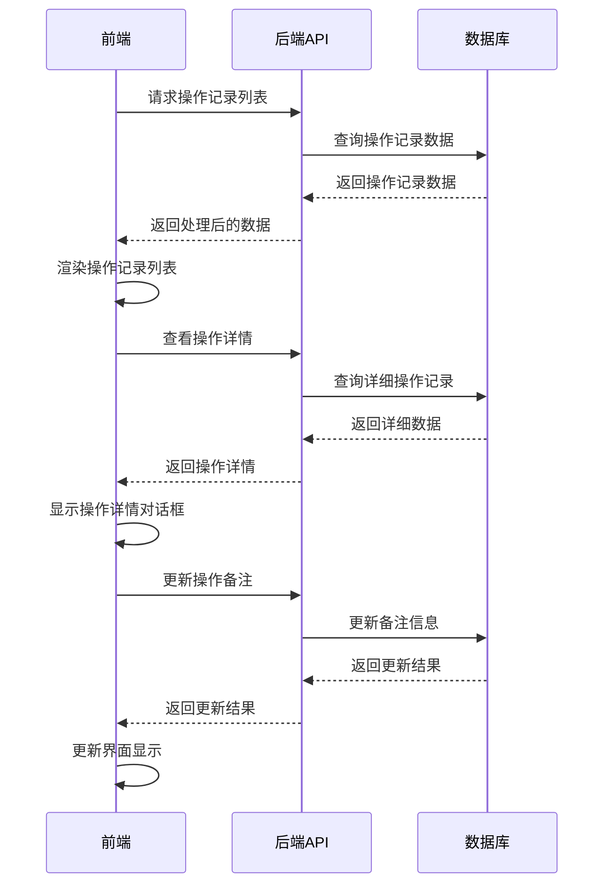

# 广告操作记录功能解析文档

## 1. 系统架构

广告操作记录模块采用前后端分离架构，基于Vue 3前端框架和Spring Boot后端框架实现，记录所有广告相关操作的历史记录，为用户提供完整的操作审计追踪功能。

### 1.1 技术栈

| 分类 | 技术 | 版本 | 用途 |
|------|------|------|------|
| 前端框架 | Vue | 3.x | 构建用户界面，使用Composition API |
| 前端UI库 | Element Plus | 最新版 | 提供组件库和样式 |
| HTTP客户端 | Axios | 最新版 | 与后端API通信 |
| 状态管理 | Vuex | 4.x | 管理全局状态 |
| 后端框架 | Spring Boot | 2.x | 构建RESTful API |
| ORM框架 | MyBatis Plus | 最新版 | 数据库操作 |
| 数据库 | MySQL | 5.7+ | 存储操作记录数据 |

### 1.2 架构分层

#### 前端架构
- **表现层**：Vue组件，负责用户界面渲染和交互
- **业务逻辑层**：Vue组合式API，处理业务逻辑
- **数据通信层**：Axios，与后端API通信

#### 后端架构
- **控制层**：Controller，处理HTTP请求和响应
- **服务层**：Service，实现业务逻辑
- **数据访问层**：Mapper，与数据库交互

### 1.3 核心流程图



## 2. 前端实现

### 2.1 主组件结构

广告操作记录模块的主组件是 `index.vue`，位于 `d:\work\wimoor666\wimoor666\wimoor-ui\src\views\amazon\advertisement\operation_record\index.vue`，主要包含以下部分：

- **筛选区域**：包含店铺/站点选择、日期选择和搜索框
- **操作记录列表**：使用GlobalTable组件展示操作记录
- **详情对话框**：显示操作的详细信息
- **备注编辑对话框**：用于编辑操作备注

### 2.2 核心功能实现

#### 2.2.1 数据加载与展示

```javascript
function loadTableData(param){
    operationApi.getOperateLogList(param).then(res=>{
        if(res.data.records&&res.data.records.length>0){
            res.data.records.forEach((item,index)=>{
                if(item.remark){
                     item.htmlremark=decodeText(item.remark);
                 }else{
                     item.htmlremark="--"
                 }
                item.opt=hisTypeFormatter(item.beanclasz,item,index);
            })
        }
        state.tableData.records =  res.data.records;
        state.tableData.total = res.data.total;
    })
}
```

#### 2.2.2 操作类型格式化

```javascript
function hisTypeFormatter(value, row, index) {
    var html = "";
    var type = "";
    if (row.beforeobject) {
        type = "更改";
    } else {
        type = "新增";
    }
    if ("AmzAdvCampaigns" == value||"AmzAdvCampaignsSD" == value||"AmzAdvCampaignsHsa" == value) {
        html = type + "广告活动";
    } else if ("AmzAdvAdgroups" == value||"AmzAdvAdgroupsSD" == value||"AmzAdvAdgroupsHsa" == value) {
        html = type + "广告组";
    } else if ("AmzAdvProductads" == value||"AmzAdvProductadsSD" == value) {
        html = type + "商品广告";
    } else if ("AmzAdvAds" == value) {
        html = type + "广告";
    } else if ("AmzAdvKeywords" == value||"AmzAdvKeywordsHsa" == value) {
        html = type + "关键词";
    } else if ("AmzAdvKeywordsNegativa" == value||"AmzAdvKeywordsNegativaHsa" == value) {
        html = type + "否定关键词";
    } else if ("AmzAdvProductTarge" == value||"AmzAdvProductTargeSD" == value||"AmzAdvProductTargeHsa" == value) {
        html = type + "商品投放";
    } else if ("AmzAdvProductTargeNegativa" == value||"AmzAdvProductTargeNegativaSD" == value||"AmzAdvProductTargeNegativaHsa" == value) {
        html = type + "否定商品投放";
    }
    return html;
}
```

#### 2.2.3 查看操作详情

```javascript
function showOperateDetailModel(row){
    detailDialogRef.value.show(row);
}
```

#### 2.2.4 编辑备注

```javascript
function editRemarks(row){
    remarksRef.value.show(row);
}

function remarkConfirm(item){
    if(item.remark){
        item.htmlremark=decodeText(item.remark);
    }else{
        item.htmlremark="--"
    }
}
```

### 2.3 API调用

前端通过封装的API模块与后端通信：

```javascript
// operationApi.js
export default {
    getOperateLogList,      // 获取操作记录列表
    updateOperateLogRemark, // 更新操作记录备注
};
```

## 3. 后端实现

### 3.1 控制器

#### 广告操作记录控制器

`AdvertOperateLogManagerController.java` 负责处理广告操作记录相关的API请求：

```java
@RestController 
@RequestMapping("/api/v1/advOperateLogManager") 
public class AdvertOperateLogManagerController {
    
    @Resource
    AdminClientOneFeignManager adminClientOneFeignManager;
    
    @Resource
    IAmzAdvOperateLogService amzAdvOperateLogService;
    
    // 获取操作记录列表
    @PostMapping("/getOperateLogList")
    public Result<PageList<Map<String,Object>>> getOperateLogListAction(@RequestBody OperationLogQuery dto) {
        // 实现逻辑
    }
    
    // 更新操作记录备注
    @GetMapping("/updateOperateLogRemark")
    public Result<?> updateOperateLogRemarkAction(String id, String remark) {
        // 实现逻辑
    }
}
```

### 3.2 服务层

#### 广告操作记录服务

`AmzAdvOperateLogServiceImpl.java` 实现了广告操作记录的核心业务逻辑：

```java
@Service("amzAdvOperateLogService")
public class AmzAdvOperateLogServiceImpl extends BaseService<AmzAdvOperateLog> implements IAmzAdvOperateLogService{
    
    @Resource
    AmzAdvOperateLogMapper amzAdvOperateLogMapper;
    
    // 保存操作记录
    public void saveOperateLog(String beanClasz, String userId, BigInteger profileId, Object afterObject, Object beforeObject) {
        // 实现逻辑：根据不同的操作对象类型，保存操作记录
    }
    
    // 批量保存操作记录
    public void saveBatchOperateLog(String beanClasz, String userId, BigInteger profileId, Map<BigInteger, List<Object>> map, Map<BigInteger, List<Object>> oldmap) {
        // 实现逻辑：批量保存操作记录
    }
    
    // 获取操作记录列表
    public PageList<Map<String,Object>> getOperateLogList(Map<String, Object> map, PageBounds pageBounds){
        // 实现逻辑：查询操作记录
    }
    
    // 更新操作记录备注
    public int updateOperateLogRemark(String id, String remark) {
        // 实现逻辑：更新备注信息
    }
}
```

### 3.3 数据模型

#### 广告操作记录模型

```java
public class AmzAdvOperateLog {
    private String id;
    private BigInteger profileid;
    private String campaignid;
    private String adgroupid;
    private String beanclasz;
    private String beforeobject;
    private String afterobject;
    private String operator;
    private Date opttime;
    private String remark;
    // getter和setter方法...
}
```

### 3.4 数据访问层

#### 广告操作记录Mapper

```java
public interface AmzAdvOperateLogMapper extends BaseMapper<AmzAdvOperateLog> {
    List<Map<String, Object>> getOperateLogList(Map<String, Object> map, PageBounds pageBounds);
}
```

## 4. 核心功能分析

### 4.1 操作记录查询

#### 功能描述
- 根据店铺、站点、日期范围和搜索关键词查询操作记录
- 支持分页查询，默认按操作时间倒序排列

#### 实现逻辑
1. 前端设置筛选条件，发送查询请求
2. 后端接收请求，构建查询参数
3. 后端调用服务层查询操作记录
4. 后端查询数据库获取操作记录数据
5. 后端处理数据，添加操作人员信息
6. 后端返回处理后的数据给前端
7. 前端渲染操作记录列表

#### 关键代码

前端查询操作记录：
```javascript
function loadTableData(param){
    operationApi.getOperateLogList(param).then(res=>{
        if(res.data.records&&res.data.records.length>0){
            res.data.records.forEach((item,index)=>{
                if(item.remark){
                     item.htmlremark=decodeText(item.remark);
                 }else{
                     item.htmlremark="--"
                 }
                item.opt=hisTypeFormatter(item.beanclasz,item,index);
            })
        }
        state.tableData.records =  res.data.records;
        state.tableData.total = res.data.total;
    })
}
```

后端处理查询请求：
```java
@Override
public PageList<Map<String,Object>> getOperateLogList(Map<String, Object> map, PageBounds pageBounds){
    return amzAdvOperateLogMapper.getOperateLogList(map, pageBounds);
}
```

### 4.2 操作详情查看

#### 功能描述
- 查看操作的详细信息，包括操作前后的配置变更
- 显示操作类型、操作人员、操作时间等信息

#### 实现逻辑
1. 前端点击操作记录的日志链接
2. 前端打开详情对话框，传递操作记录数据
3. 详情对话框显示操作的详细信息
4. 前端渲染操作前后的配置对比

#### 关键代码

前端查看详情：
```javascript
function showOperateDetailModel(row){
    detailDialogRef.value.show(row);
}
```

### 4.3 备注编辑

#### 功能描述
- 编辑操作记录的备注信息
- 保存备注到数据库

#### 实现逻辑
1. 前端点击备注编辑图标
2. 前端打开备注编辑对话框
3. 用户输入备注内容
4. 前端发送更新备注请求
5. 后端接收请求，更新备注信息
6. 后端返回更新结果
7. 前端更新界面显示

#### 关键代码

前端编辑备注：
```javascript
function editRemarks(row){
    remarksRef.value.show(row);
}

function remarkConfirm(item){
    if(item.remark){
        item.htmlremark=decodeText(item.remark);
    }else{
        item.htmlremark="--"
    }
}
```

后端更新备注：
```java
@Override
public int updateOperateLogRemark(String id, String remark) {
    AmzAdvOperateLog operateLog = amzAdvOperateLogMapper.selectByPrimaryKey(id);
    operateLog.setRemark(remark);
    return this.updateNotNull(operateLog);
}
```

### 4.4 操作记录保存

#### 功能描述
- 自动保存广告相关操作的记录
- 支持单个操作和批量操作的记录

#### 实现逻辑
1. 广告相关操作执行时，调用保存操作记录方法
2. 服务层根据操作类型和对象，构建操作记录
3. 服务层将操作记录保存到数据库
4. 数据库存储操作记录数据

#### 关键代码

保存单个操作记录：
```java
public void saveOperateLog(String beanClasz, String userId, BigInteger profileId, Object afterObject, Object beforeObject) {
    if("AmzAdvCampaigns".equals(beanClasz)) {
        AmzAdvCampaigns campaign = (AmzAdvCampaigns) afterObject;
        AmzAdvCampaigns oldCampaign = (AmzAdvCampaigns) beforeObject;
        AmzAdvOperateLog operateLog = new AmzAdvOperateLog();
        operateLog.setCampaignid(campaign.getCampaignid());
        operateLog.setProfileid(profileId);
        operateLog.setOperator(userId);
        operateLog.setOpttime(new Date());
        operateLog.setBeanclasz("AmzAdvCampaigns");
        String campaignjson = GeneralUtil.toJSON(campaign);
        String oldCampaignjson = GeneralUtil.toJSON(oldCampaign);
        operateLog.setAfterobject(campaignjson);
        operateLog.setBeforeobject(oldCampaignjson);
        amzAdvOperateLogMapper.insert(operateLog);
    }
    // 其他操作类型的处理...
}
```

批量保存操作记录：
```java
public void saveBatchOperateLog(String beanClasz, String userId, BigInteger profileId, Map<BigInteger, List<Object>> map, Map<BigInteger, List<Object>> oldmap) {
    List<AmzAdvOperateLog> operateLogList = new ArrayList<AmzAdvOperateLog>();
    // 构建批量操作记录
    // 批量插入数据库
    amzAdvOperateLogMapper.insertList(operateLogList);
}
```

## 5. 技术亮点

### 5.1 完整的操作记录

- **全类型覆盖**：支持所有广告相关操作的记录，包括广告活动、广告组、商品广告、关键词、定向等
- **详细变更记录**：记录操作前后的完整配置变更，便于对比分析
- **批量操作支持**：支持批量操作的记录，确保操作记录的完整性

### 5.2 高效的数据查询

- **分页查询**：采用分页查询机制，提高大数据量下的查询性能
- **多条件筛选**：支持店铺、站点、日期范围和关键词搜索等多维度筛选
- **关联数据处理**：自动关联操作人员信息，显示用户名称而非用户ID

### 5.3 友好的用户界面

- **直观的操作类型显示**：将技术操作类型转换为友好的中文描述
- **详细的操作详情**：提供弹出对话框显示详细操作信息
- **便捷的备注编辑**：支持直接编辑操作备注，添加说明信息

### 5.4 安全可靠

- **权限控制**：基于用户权限控制操作记录的访问
- **数据加密**：操作记录数据加密存储
- **数据完整性**：确保所有操作都有对应的记录，不允许删除操作记录

## 6. 数据安全

### 6.1 权限控制

- **基于角色的权限控制**：不同角色拥有不同的操作记录访问权限
- **店铺级权限**：用户只能查看有权限的店铺的操作记录
- **操作审计**：系统记录所有访问操作记录的行为

### 6.2 数据保护

- **数据加密**：操作记录数据加密存储
- **数据备份**：定期备份操作记录数据，确保数据安全
- **防篡改**：操作记录一旦创建，不允许删除，只能添加备注

### 6.3 合规性

- **操作留痕**：满足企业内部合规要求，提供操作证据
- **审计追踪**：支持完整的操作审计追踪
- **数据留存**：默认存储1年的操作记录，满足合规要求

## 7. 扩展性分析

### 7.1 功能扩展

- **导出功能**：可扩展支持导出操作记录为Excel、CSV等格式
- **高级筛选**：可扩展支持更复杂的筛选条件，如操作类型、操作对象等
- **操作统计**：可扩展支持操作统计分析，如操作频率、操作类型分布等
- **通知机制**：可扩展支持重要操作的通知机制

### 7.2 技术扩展

- **微服务架构**：可扩展为微服务架构，提高系统可靠性和可扩展性
- **缓存机制**：可添加缓存机制，提高查询性能
- **搜索优化**：可集成全文搜索引擎，提高搜索性能

### 7.3 集成扩展

- **与其他模块集成**：可与广告管理、权限管理等模块深度集成
- **第三方审计工具集成**：可集成第三方审计工具，满足更严格的合规要求

## 8. 代码优化建议

### 8.1 前端优化

1. **组件拆分**：将详情对话框和备注编辑对话框拆分为独立的组件，提高代码可维护性
2. **状态管理**：使用Pinia替代Vuex，简化状态管理
3. **API请求优化**：使用请求缓存和防抖节流，减少API调用
4. **代码分割**：使用动态导入实现代码分割，减少初始加载时间
5. **性能优化**：对于大量操作记录，使用虚拟滚动技术，提高渲染性能

### 8.2 后端优化

1. **缓存策略**：添加缓存机制，缓存频繁访问的操作记录数据
2. **数据库优化**：优化数据库查询，添加适当的索引
3. **批量操作**：优化批量保存操作记录的性能
4. **API设计**：优化API设计，提供更灵活的查询参数
5. **错误处理**：完善错误处理机制，提高系统可靠性

### 8.3 数据库优化

1. **索引优化**：为操作记录表添加适当的索引，提高查询性能
2. **分区策略**：对于大量操作记录，考虑使用数据库分区策略
3. **数据归档**：实现操作记录的自动归档机制，提高查询性能
4. **查询优化**：优化复杂查询语句，减少查询时间

## 9. 总结

广告操作记录模块是Wimoor系统中一个重要的审计工具，它通过详细记录所有广告相关操作，为用户提供了完整的操作审计追踪功能。该模块采用前后端分离架构，使用Vue 3和Spring Boot等现代技术栈，实现了操作记录的查询、查看、备注编辑等功能。

### 9.1 核心价值

- **操作审计**：详细记录所有广告操作，便于审计和追溯
- **变更追踪**：追踪广告配置的变更历史，了解配置演变过程
- **责任明确**：记录操作人员信息，明确操作责任
- **问题排查**：当广告效果出现异常时，可通过操作记录排查原因
- **合规管理**：满足企业内部合规要求，提供操作证据

### 9.2 技术创新

- **全类型操作记录**：支持所有广告相关操作的记录，覆盖完整的广告管理流程
- **详细变更对比**：记录操作前后的完整配置变更，便于对比分析
- **批量操作支持**：支持批量操作的记录，确保操作记录的完整性
- **友好的用户界面**：将技术操作类型转换为友好的中文描述，提高用户体验

### 9.3 未来发展

- **智能分析**：集成AI技术，分析操作记录，提供优化建议
- **预测性分析**：基于历史操作记录，预测可能的问题
- **自动化审计**：实现自动化的操作审计，减少人工检查
- **多平台支持**：扩展支持其他电商平台的操作记录
- **实时通知**：重要操作实时通知相关人员

广告操作记录模块的设计和实现体现了现代软件架构的最佳实践，为用户提供了专业、可靠的操作审计解决方案。通过不断的技术创新和功能扩展，该模块将继续为用户创造更大的价值。