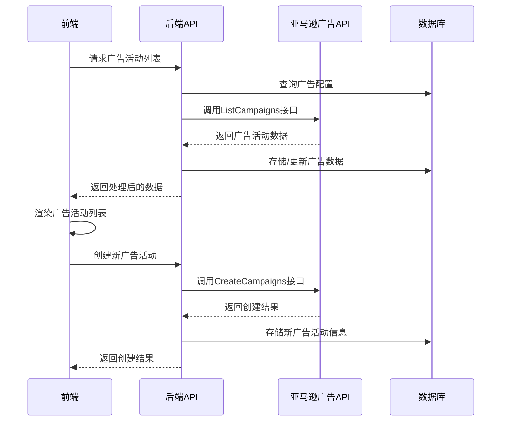

# 广告管理模块功能解析文档

## 1. 系统架构

广告管理模块采用前后端分离架构，基于Vue 3前端框架和Spring Boot后端框架实现，集成亚马逊广告API，提供完整的广告管理功能。

### 1.1 技术栈

| 分类 | 技术 | 版本 | 用途 |
|------|------|------|------|
| 前端框架 | Vue | 3.x | 构建用户界面，使用Composition API |
| 前端UI库 | Element Plus | 最新版 | 提供组件库和样式 |
| 数据可视化 | ECharts | 最新版 | 展示广告数据图表 |
| HTTP客户端 | Axios | 最新版 | 与后端API通信 |
| 状态管理 | Vuex | 4.x | 管理全局状态 |
| 后端框架 | Spring Boot | 2.x | 构建RESTful API |
| ORM框架 | MyBatis Plus | 最新版 | 数据库操作 |
| 亚马逊API | Amazon Advertising API | 最新版 | 与亚马逊广告平台交互 |
| 数据库 | MySQL | 5.7+ | 存储广告数据和配置 |

### 1.2 架构分层

#### 前端架构
- **表现层**：Vue组件，负责用户界面渲染和交互
- **业务逻辑层**：Vue组合式API，处理业务逻辑
- **数据通信层**：Axios，与后端API通信
- **状态管理**：Vuex，管理全局状态和共享数据

#### 后端架构
- **控制层**：Controller，处理HTTP请求和响应
- **服务层**：Service，实现业务逻辑
- **数据访问层**：Mapper，与数据库交互
- **亚马逊API层**：集成亚马逊广告API，处理广告操作

### 1.3 核心流程图



## 2. 前端实现

### 2.1 主组件结构

广告管理模块的主组件是 `index.vue`，采用左右分栏布局：

- **左侧广告树**：展示广告账户、广告活动、广告组的层级结构
- **右侧操作区域**：包含面包屑导航、标签页导航、数据表格和操作按钮

### 2.2 组件分类

根据广告类型，前端组件分为三大类：

#### SP广告组件 (Sponsored Products)
- `listCampaigns.vue`：广告活动管理
- `listAdgroups.vue`：广告组管理
- `listProductAds.vue`：商品广告管理
- `listKeywords.vue`：关键词管理
- `listNegativaKeywords.vue`：否定关键词管理
- `listTarget.vue`：商品定向管理
- `listNegativaTarget.vue`：否定定向管理
- `listPurchaseProductAds.vue`：商品购买数据

#### SB广告组件 (Sponsored Brands)
- `listCampaigns.vue`：广告活动管理
- `listAdgroups.vue`：广告组管理
- `listProductAds.vue`：品牌广告管理
- `listKeywords.vue`：关键词管理
- `listNegativaKeywords.vue`：否定关键词管理
- `listTarget.vue`：定向管理
- `listPurchaseProductAds.vue`：商品购买数据

#### SD广告组件 (Sponsored Display)
- `listCampaigns.vue`：广告活动管理
- `listAdgroups.vue`：广告组管理
- `listProductAds.vue`：商品广告管理
- `listTarget.vue`：定向管理
- `listNegativaTarget.vue`：否定定向管理
- `listPurchaseProductAds.vue`：商品购买数据

### 2.3 核心功能实现

#### 2.3.1 广告树结构

广告树组件 `ad_tree.vue` 实现了广告账户、广告活动、广告组的层级展示：

```javascript
// 核心逻辑：构建广告树数据结构
function buildAdTree(data) {
  // 构建账户节点
  // 构建广告活动节点
  // 构建广告组节点
  return treeData;
}

// 节点点击事件
function handleNodeClick(data) {
  // 发送数据到父组件
  emit('change', data);
}
```

#### 2.3.2 标签页管理

根据广告类型和操作对象，动态生成标签页：

```javascript
// 标签页数据
const tabsDataValue = [
  {name: '广告活动', value: 'adcams', count: ''},
  {name: '广告组', value: 'adgroups', count: ''},
  {name: '商品', value: 'ProductAds', count: ''},
  {name: '关键词', value: 'adkey', count: ''},
  // 其他标签页...
];

// 根据广告类型过滤标签页
function getTabs(filterTabs) {
  var list = [];
  state.tabsDataValue.forEach(item => {
    if(filterTabs.includes(item.value)) {
      // 特殊处理SB广告的"广告"标签
      if(item.value == "ProductAds" && state.queryParams.campaignType == "SB") {
        item.name = "广告";
      }
      list.push(item);
    }
  });
  return list;
}
```

#### 2.3.3 数据加载与展示

根据当前选择的标签页和广告类型，加载对应数据：

```javascript
function handleQuery() {
  state.queryParams.ftype = state.activeName;
  var activeName = state.activeName;
  if(state.queryParams.profileid) {
    nextTick(() => {
      if(state.queryParams.campaignType == "SP") {
        if(activeName == 'adcams') {
          spListCampaignsRef.value.show(state.queryParams);
        }
        // 其他标签页...
      }
      // SB和SD广告类型的处理...
    });
  }
}
```

### 2.4 API调用

前端通过封装的API模块与后端通信：

#### 广告管理API

```javascript
// advertApi.js
export default {
  loadProfile,          // 加载广告配置文件
  addSerchHistory,      // 添加搜索历史
  getSerchHistory,      // 获取搜索历史
  deleteSerchHistory,   // 删除搜索历史
  loadCampaignsNotArchived, // 加载未归档的广告活动
  findPortfoliosForProfileId, // 查找广告组合
  getallsumtype,        // 获取所有汇总类型
  saleorder,            // 销售订单数据
  cpcdata,              // CPC数据
};
```

#### 广告活动API

```javascript
// advCampaignApi.js
export default {
  getCampaignList,      // 获取广告活动列表
  getCampaignSummary,   // 获取广告活动汇总
  getCampaignChart,     // 获取广告活动图表数据
  // 其他方法...
};
```

## 3. 后端实现

### 3.1 控制器

#### 广告活动控制器

`AdvertCampaignManagerController.java` 负责处理广告活动相关的API请求：

```java
@Api(tags = "广告活动接口")
@RestController 
@RequestMapping("/api/v1/advCampaignManager") 
public class AdvertCampaignManagerController {
    
    @Resource
    IAmzAdvCampaignService amzAdvCampaignService;
    
    @Resource 
    IAmzAdvCampaignsSDService amzAdvCampaignsSDService;
    
    @Resource
    IAmzAdvCampaignHsaService amzAdvCampaignHsaService;
    
    // 获取广告活动列表
    @PostMapping("/getCampaignList")
    public Result<List<Map<String, Object>>> getCampaignListAction(@RequestBody QueryForList query) {
        // 实现逻辑
    }
    
    // 创建广告活动
    @PostMapping("/createCampaign")
    public Result<Map<String, Object>> createCampaignAction(@RequestBody JSONObject param) {
        // 实现逻辑
    }
    
    // 更新广告活动
    @PostMapping("/updateCampaign")
    public Result<Map<String, Object>> updateCampaignAction(@RequestBody JSONObject param) {
        // 实现逻辑
    }
    
    // 其他方法...
}
```

#### 广告组控制器

`AdvertAdgroupManagerController.java` 负责处理广告组相关的API请求：

```java
@Api(tags = "广告组接口")
@RestController 
@RequestMapping("/api/v1/advAdgroupManager") 
public class AdvertAdgroupManagerController {
    
    @Resource
    IAmzAdvAdGroupService amzAdvAdGroupService;
    
    @Resource 
    IAmzAdvAdgroupsSDService amzAdvAdgroupsSDService;
    
    @Resource
    IAmzAdvAdgroupsHsaService amzAdvAdgroupsHsaService;
    
    // 获取广告组列表
    @PostMapping("/getAdgroupList")
    public Result<List<Map<String, Object>>> getAdgroupListAction(@RequestBody QueryForList query) {
        // 实现逻辑
    }
    
    // 创建广告组
    @PostMapping("/createAdgroup")
    public Result<Map<String, Object>> createAdgroupAction(@RequestBody JSONObject param) {
        // 实现逻辑
    }
    
    // 其他方法...
}
```

### 3.2 服务层

#### 广告活动服务

`AmzAdvCampaignServiceImpl.java` 实现了广告活动的核心业务逻辑：

```java
@Service
public class AmzAdvCampaignServiceImpl implements IAmzAdvCampaignService {
    
    @Autowired
    AmzAdvCampaignsMapper amzAdvCampaignsMapper;
    
    @Autowired
    IAmzAdvAuthService amzAdvAuthService;
    
    // 创建广告活动
    @Override
    public Map<String, Object> amzCreateCampaigns(AmzAdvProfile profile, List<AmzAdvCampaigns> campaigns) {
        // 实现逻辑：调用亚马逊API创建广告活动
    }
    
    // 更新广告活动
    @Override
    public Map<String, Object> amzUpdateSpCampaigns(AmzAdvProfile profile, List<AmzAdvCampaigns> campaigns) {
        // 实现逻辑：调用亚马逊API更新广告活动
    }
    
    // 获取广告活动图表数据
    @Override
    public Map<String, Object> getCampaignChart(AmzAdvProfile profile, Map<String, Object> param) {
        // 实现逻辑：生成图表数据
    }
    
    // 其他方法...
}
```

#### 广告组服务

`AmzAdvAdGroupServiceImpl.java` 实现了广告组的核心业务逻辑：

```java
@Service
public class AmzAdvAdGroupServiceImpl implements IAmzAdvAdGroupService {
    
    @Autowired
    AmzAdvAdgroupsMapper amzAdvAdgroupsMapper;
    
    @Autowired
    IAmzAdvAuthService amzAdvAuthService;
    
    // 创建广告组
    @Override
    public Map<String, Object> amzCreateAdGroups(AmzAdvProfile profile, List<AmzAdvAdgroups> adgroups) {
        // 实现逻辑：调用亚马逊API创建广告组
    }
    
    // 更新广告组
    @Override
    public Map<String, Object> amzUpdateAdGroups(AmzAdvProfile profile, List<AmzAdvAdgroups> adgroups) {
        // 实现逻辑：调用亚马逊API更新广告组
    }
    
    // 其他方法...
}
```

### 3.3 数据模型

#### 广告活动模型

```java
public class AmzAdvCampaigns {
    private String campaignId;
    private String campaignName;
    private String campaignType;
    private String targetingType;
    private BigDecimal dailyBudget;
    private String state;
    private String startDate;
    private String endDate;
    private String biddingStrategy;
    // 其他字段...
    // getter和setter方法...
}
```

#### 广告组模型

```java
public class AmzAdvAdgroups {
    private String adGroupId;
    private String campaignId;
    private String name;
    private BigDecimal defaultBid;
    private String state;
    // 其他字段...
    // getter和setter方法...
}
```

### 3.4 亚马逊API集成

后端通过封装的客户端与亚马逊广告API交互：

```java
public class AmazonAdvertisingAPIClient {
    
    private String accessToken;
    private String endpoint;
    private String profileId;
    
    // 调用ListCampaigns接口
    public List<Campaign> listCampaigns() {
        // 实现逻辑：构建请求，发送到亚马逊API，处理响应
    }
    
    // 调用CreateCampaigns接口
    public List<CampaignResponse> createCampaigns(List<Campaign> campaigns) {
        // 实现逻辑：构建请求，发送到亚马逊API，处理响应
    }
    
    // 其他API方法...
}
```

## 4. 核心功能分析

### 4.1 广告活动管理

#### 功能描述
- 创建、编辑、暂停、启用、删除广告活动
- 设置广告活动预算、开始/结束日期、出价策略
- 查看广告活动性能数据

#### 实现逻辑
1. 前端发送创建广告活动请求
2. 后端接收请求，验证参数
3. 后端调用亚马逊API创建广告活动
4. 后端存储广告活动信息到数据库
5. 后端返回创建结果给前端
6. 前端更新界面，显示新广告活动

#### 关键代码

前端创建广告活动：
```javascript
function createCampaign() {
  // 验证表单
  // 构建请求参数
  advCampaignApi.createCampaign(params).then(res => {
    if(res.code == 200) {
      ElMessage.success('创建成功');
      // 刷新广告活动列表
    } else {
      ElMessage.error('创建失败：' + res.msg);
    }
  });
}
```

后端处理创建请求：
```java
@Override
public Map<String, Object> amzCreateCampaigns(AmzAdvProfile profile, List<AmzAdvCampaigns> campaigns) {
  // 构建亚马逊API请求
  // 调用API
  // 处理响应
  // 存储数据
  // 返回结果
}
```

### 4.2 广告组管理

#### 功能描述
- 创建、编辑、暂停、启用、删除广告组
- 设置广告组名称、默认出价
- 查看广告组性能数据

#### 实现逻辑
1. 前端选择广告活动，点击"创建广告组"
2. 前端填写广告组信息，提交表单
3. 后端接收请求，验证参数
4. 后端调用亚马逊API创建广告组
5. 后端存储广告组信息到数据库
6. 后端返回创建结果给前端
7. 前端更新界面，显示新广告组

### 4.3 商品广告管理

#### 功能描述
- 添加、编辑、暂停、启用商品广告
- 设置商品广告出价
- 查看商品广告性能数据
- 批量操作商品广告

#### 实现逻辑
1. 前端选择广告组，点击"添加商品"
2. 前端选择要推广的商品，设置出价
3. 后端接收请求，验证参数
4. 后端调用亚马逊API创建商品广告
5. 后端存储商品广告信息到数据库
6. 后端返回创建结果给前端
7. 前端更新界面，显示新商品广告

### 4.4 关键词管理

#### 功能描述
- 添加、编辑、删除关键词
- 设置关键词匹配类型和出价
- 查看关键词性能数据
- 批量操作关键词

#### 实现逻辑
1. 前端选择广告组，点击"添加关键词"
2. 前端输入关键词，设置匹配类型和出价
3. 后端接收请求，验证参数
4. 后端调用亚马逊API创建关键词
5. 后端存储关键词信息到数据库
6. 后端返回创建结果给前端
7. 前端更新界面，显示新关键词

### 4.5 定向管理

#### 功能描述
- 添加、编辑、删除商品定向
- 设置定向出价
- 查看定向性能数据
- 管理否定定向

#### 实现逻辑
1. 前端选择广告组，点击"添加定向"
2. 前端选择定向类型，设置定向条件和出价
3. 后端接收请求，验证参数
4. 后端调用亚马逊API创建定向
5. 后端存储定向信息到数据库
6. 后端返回创建结果给前端
7. 前端更新界面，显示新定向

### 4.6 数据报表与分析

#### 功能描述
- 查看广告活动、广告组、商品广告、关键词的性能数据
- 生成趋势图表
- 分析ACOS、ROAS、CTR等关键指标
- 导出报表数据

#### 实现逻辑
1. 前端选择时间范围和数据类型
2. 前端发送数据请求
3. 后端接收请求，查询数据库
4. 后端处理数据，计算指标
5. 后端返回处理后的数据
6. 前端使用ECharts渲染图表
7. 前端展示数据表格

## 5. 技术亮点

### 5.1 组件化设计

- **模块化结构**：按广告类型和功能模块拆分组件，提高代码复用性和可维护性
- **动态组件加载**：根据广告类型和标签页动态加载对应组件
- **统一数据接口**：不同广告类型的组件使用统一的数据接口，简化代码

### 5.2 批量操作优化

- **批量创建**：支持批量创建广告活动、广告组、关键词等
- **批量修改**：支持批量修改出价、预算、状态等
- **异步处理**：批量操作采用异步处理，避免阻塞界面
- **错误处理**：完善的错误处理机制，确保批量操作的可靠性

### 5.3 数据可视化

- **多维度图表**：支持趋势图、对比图、分布图等多种图表类型
- **实时数据**：展示实时广告数据，帮助用户快速决策
- **数据钻取**：支持从广告活动到广告组到商品广告的数据钻取
- **自定义报表**：支持自定义报表维度和指标

### 5.4 智能优化

- **出价建议**：基于历史数据和竞争情况，提供智能出价建议
- **预算优化**：根据广告表现，推荐预算分配方案
- **关键词推荐**：基于搜索词数据，推荐高潜力关键词
- **定向优化**：分析定向效果，推荐优化方案

### 5.5 性能优化

- **缓存机制**：缓存频繁访问的数据，减少API调用
- **懒加载**：采用懒加载方式加载组件和数据
- **分页处理**：大数据集采用分页处理，提高加载速度
- **请求合并**：合并多个相关请求，减少网络开销

## 6. 数据安全

### 6.1 权限控制

- **基于角色的权限控制**：不同角色拥有不同的操作权限
- **店铺级权限**：用户只能操作有权限的店铺的广告
- **操作日志**：记录所有广告操作，便于审计

### 6.2 数据加密

- **API密钥加密**：亚马逊API密钥加密存储
- **传输加密**：使用HTTPS加密传输数据
- **敏感数据保护**：敏感数据加密存储

### 6.3 防滥用措施

- **请求频率限制**：限制API请求频率，防止滥用
- **批量操作限制**：限制批量操作的数量，避免系统过载
- **异常检测**：检测异常操作，及时预警

## 7. 扩展性分析

### 7.1 模块扩展

- **新广告类型支持**：系统设计支持轻松添加新的广告类型
- **新功能模块**：模块化设计便于添加新的功能模块
- **第三方集成**：预留接口，支持集成第三方广告工具

### 7.2 技术扩展

- **微服务架构**：可扩展为微服务架构，提高系统可靠性和可扩展性
- **容器化部署**：支持Docker容器化部署，便于水平扩展
- **云服务集成**：可集成AWS、阿里云等云服务

### 7.3 功能扩展

- **AI智能优化**：集成AI算法，提供更智能的广告优化建议
- **多平台支持**：扩展支持其他电商平台的广告管理
- **自动化规则**：支持设置自动化规则，实现广告的自动管理

## 8. 代码优化建议

### 8.1 前端优化

1. **组件拆分**：将大型组件进一步拆分为更小的、可复用的组件
2. **状态管理优化**：使用Pinia替代Vuex，简化状态管理
3. **API请求优化**：使用请求缓存和防抖节流，减少API调用
4. **代码分割**：使用动态导入实现代码分割，减少初始加载时间
5. **类型定义**：使用TypeScript，提高代码类型安全性

### 8.2 后端优化

1. **缓存策略**：优化缓存策略，减少数据库查询和API调用
2. **异步处理**：使用消息队列处理耗时操作，提高系统响应速度
3. **数据库优化**：优化数据库查询，添加适当的索引
4. **API设计**：优化API设计，减少冗余接口
5. **错误处理**：完善错误处理机制，提高系统可靠性

### 8.3 性能优化

1. **前端性能**：优化前端渲染性能，减少重绘和回流
2. **后端性能**：优化后端代码，提高处理速度
3. **数据库性能**：优化数据库结构和查询，提高数据访问速度
4. **网络性能**：优化网络传输，减少数据传输量
5. **系统架构**：优化系统架构，提高整体性能

## 9. 总结

广告管理模块是Wimoor系统中一个功能强大、设计合理的核心模块，它通过集成亚马逊广告API，为用户提供了完整的广告管理功能。该模块采用前后端分离架构，使用Vue 3和Spring Boot等现代技术栈，实现了广告活动、广告组、商品广告、关键词、定向等的全生命周期管理。

### 9.1 核心价值

- **提高效率**：批量操作和自动化功能，大大提高广告管理效率
- **数据驱动**：丰富的数据报表和分析工具，支持数据驱动决策
- **智能优化**：智能出价建议和预算优化，提升广告效果
- **全类型支持**：支持SP、SB、SD三种广告类型，满足不同推广需求
- **安全可靠**：完善的权限控制和数据安全措施，确保广告操作安全

### 9.2 技术创新

- **组件化设计**：模块化、组件化的前端架构，提高代码可维护性
- **动态组件加载**：根据广告类型和功能动态加载组件，灵活适应不同需求
- **实时数据可视化**：实时展示广告数据，帮助用户快速决策
- **智能算法集成**：集成智能算法，提供优化建议
- **高性能架构**：优化的系统架构，确保在大量广告数据下的性能

### 9.3 未来发展

- **AI深度集成**：进一步集成AI技术，提供更智能的广告优化
- **多平台支持**：扩展支持其他电商平台的广告管理
- **自动化运营**：实现更高级的自动化规则，减少人工操作
- **预测分析**：基于历史数据，预测广告效果，提供前瞻性建议
- **生态系统**：构建广告管理生态系统，集成更多第三方工具

广告管理模块的设计和实现体现了现代软件架构的最佳实践，为用户提供了专业、高效、智能的广告管理解决方案。通过不断的技术创新和功能扩展，该模块将继续为用户创造更大的价值。