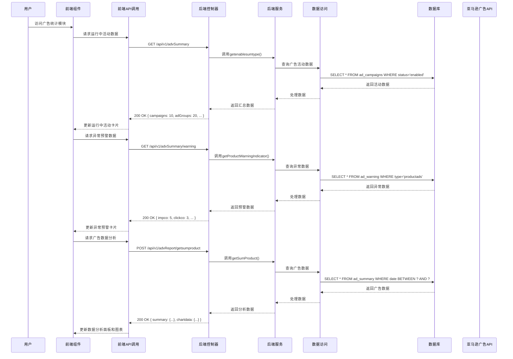

# 广告统计模块功能解析文档

## 1. 系统架构

### 1.1 技术栈

| 分类 | 技术 | 版本 | 说明 |
|------|------|------|------|
| 前端框架 | Vue.js | 3.x | 采用Composition API开发模式 |
| UI组件库 | Element Plus | 最新版 | 提供丰富的UI组件支持 |
| 数据可视化 | ECharts | 5.x | 用于绘制各种数据图表 |
| HTTP客户端 | Axios | 0.27.2 | 用于前端与后端API通信 |
| 状态管理 | Vuex | 4.x | 用于前端状态管理 |
| 后端框架 | Spring Boot | 2.5.x | 提供RESTful API服务 |
| 持久层框架 | MyBatis Plus | 3.5.x | 简化数据库操作 |
| 数据库 | MySQL | 5.7+ | 存储广告数据和统计信息 |
| API集成 | Amazon Advertising API | 最新版 | 获取亚马逊广告数据 |

### 1.2 架构设计

广告统计模块采用前后端分离的架构设计，具体架构层次如下：

1. **前端层**：
   - 视图层：Vue组件，负责数据展示和用户交互
   - 业务逻辑层：Vue组合式API，处理前端业务逻辑
   - API调用层：封装的API请求函数，与后端通信

2. **后端层**：
   - 控制层：Spring MVC控制器，处理HTTP请求
   - 服务层：业务逻辑服务，处理核心业务逻辑
   - 数据访问层：MyBatis Plus Mapper，与数据库交互
   - 外部API层：与Amazon Advertising API交互，获取广告数据

3. **数据层**：
   - 数据库：存储广告数据和统计信息
   - 缓存：可选，提高数据查询性能

### 1.3 核心流程图



## 2. 前端实现

### 2.1 组件结构

| 组件名称 | 文件路径 | 主要功能 | 核心方法 |
|---------|---------|----------|----------|
| 主组件 | `wimoor-ui/src/views/amazon/advertisement/overview/index.vue` | 广告统计模块主界面 | `loadWaringData()`, `loadWaringDataDetail()` |
| 广告统计组件 | `wimoor-ui/src/views/amazon/advertisement/overview/components/adStatistics.vue` | 广告数据分析和报表 | `loadSummaryChartData()`, `loadMonthSummaryData()`, `refreshChart()` |
| 漏斗分析组件 | `wimoor-ui/src/views/amazon/advertisement/overview/components/adFunnel.vue` | 广告转化漏斗分析 | - |
| ROAS排名组件 | `wimoor-ui/src/views/amazon/advertisement/overview/components/roasRank.vue` | 广告投入产出比排名 | - |
| 指标详情组件 | `wimoor-ui/src/views/amazon/advertisement/overview/components/indicator_detail.vue` | 异常指标详情 | - |
| 指标设置组件 | `wimoor-ui/src/views/amazon/advertisement/overview/components/indicator.vue` | 预警指标设置 | - |

### 2.2 核心功能实现

#### 2.2.1 运行中活动统计

**实现原理**：
- 通过调用`summaryApi.getenablesumtype()`获取当前运行中的广告活动、广告组、商品广告和关键词数量
- 数据返回后更新到`typedata`对象中，通过模板渲染到对应的数据卡片

**关键代码**：
```javascript
// 加载运行中活动数据
onMounted(()=>{
    summaryApi.getenablesumtype().then(res=>{
        state.typedata=res.data;
    });
    loadWaringData();
})
```

#### 2.2.2 异常数据预警

**实现原理**：
- 支持切换「商品广告」和「关键词」两种预警类型
- 支持选择「昨日变动」、「连续变动」、「同期变动」三种预警维度
- 通过调用`summaryApi.getProductWarningIndicator()`或`summaryApi.getKeywordsWarningIndicator()`获取异常预警数据
- 点击异常指标可查看详细信息，调用`loadWaringDataDetail()`方法

**关键代码**：
```javascript
// 加载预警数据
function loadWaringData(){
    var param={ftype:state.waringType};
    if(state.wardatatype=="productads"){
        summaryApi.getProductWarningIndicator(param).then(res=>{
            state.waringData=res.data;
        });
    }else{
        summaryApi.getKeywordsWarningIndicator(param).then(res=>{
            state.waringData=res.data;
        });
    }
}

// 查看预警详情
function loadWaringDataDetail(ftype){
    indicatorDetailRef.value.show(ftype,state.waringType,state.wardatatype);
}
```

#### 2.2.3 广告数据分析

**实现原理**：
- 支持选择时间范围、广告组和币种
- 提供「广告数据分析」和「广告报表统计」两个标签页
- 「广告数据分析」标签页通过ECharts绘制趋势图表，支持多指标叠加显示
- 「广告报表统计」标签页以表格形式展示月度数据统计
- 通过调用`summaryApi.getsumproduct()`获取图表数据，调用`summaryApi.getmonthsum()`获取月度报表数据

**关键代码**：
```javascript
// 加载图表数据
function loadSummaryChartData(){
    summaryApi.getsumproduct(state.queryParams).then(res=>{
        state.summaryData=res.data.summary;
        state.chartData=res.data.chartdata;
        var data=res.data.summary;
        data.ordersummary=res.data.ordersummary;
        state.summaryData.acosas = isNanPvalue(parseFloat(data.cost), data.ordersummary);
        state.summaryData.cpc = isNanvalue(parseFloat(data.cost),parseFloat( data.clicks));
        state.summaryData.roi = isNanvalue(parseFloat(data.attributedSales), parseFloat(data.cost));
        if(state.queryParams.currency=="USD"){
            state.adList.forEach(item=>{
                if(item.prefix=='￥'){
                    item.prefix='$';
                }
            })
        }else{
            state.adList.forEach(item=>{
                if(item.prefix=='$'){
                    item.prefix='￥';
                }
            })
        }
        refreshChart();
    })
}

// 加载月度报表数据
function loadMonthSummaryData() {
    summaryApi.getmonthsum(state.queryParams).then(res=>{ 
        state.monthData=res.data;
        if(state.queryParams.currency=="USD"){
            state.rows.forEach(item=>{
                if(item.prefix=='￥'){
                    item.prefix='$';
                }
            })
        }else{
            state.rows.forEach(item=>{
                if(item.prefix=='$'){
                    item.prefix='￥';
                }
            })
        }
    });
}

// 刷新图表
function refreshChart() {
    var chartdata=state.chartData;
    if (chartdata != null) {
        var labels = null;
        var color = [];
        var legends = [];
        var series = [];
        state.adList.forEach(row=>{
            var type = row.field;
            if (row.active&&chartdata[type]) {
                labels = chartdata[type]["listLabel"];
                legends.push(row.name);
                color.push(row.color);
                var datas = {};
                datas.name = row.name;
                if (type == "cr" || type == "ctr" || type == "acos") {
                    datas.type = "line";
                    datas.yAxisIndex = 1;
                    datas.symbol = 'emptycircle';
                    datas.smooth = true;
                    datas.symbolSize = 3;
                    datas.itemStyle = {
                        normal : {
                            lineStyle : {
                                width : 2
                            }
                        }
                    }
                } else {
                    datas.type = "bar";
                    datas.barGap = "0%";
                    datas.boundaryGap = "0%";
                    datas.barMaxWidth = 32, datas.itemStyle = {
                        normal : {
                            barBorderRadius : [ 4, 4, 0, 0 ]
                        }
                    }
                }
                datas.data = chartdata[type].listData;
                series.push(datas);
            }
        });
        if (labels != null) {
            lineChart(legends, labels, series, color);
        } else {
            document.getElementById("mychart").innerHTML="<div style='padding-top:10%' clas='font-extraSmall'>暂无数据</div>";
        }
    } else {
        document.getElementById("mychart").innerHTML="<div style='padding-top:10%' clas='font-extraSmall'>暂无数据</div>";
    }
}
```

#### 2.2.4 漏斗分析

**实现原理**：
- 通过调用相关API获取广告转化漏斗数据
- 使用ECharts绘制漏斗图，展示从曝光到转化的完整转化路径
- 分析各阶段的转化率，识别转化瓶颈

#### 2.2.5 ROAS排名

**实现原理**：
- 通过调用相关API获取广告ROAS数据
- 使用表格或图表展示ROAS排名
- 识别高效广告和低效广告，为优化决策提供依据

### 2.3 API调用

| API名称 | 方法 | URL | 功能描述 | 参数 | 返回值 |
|---------|------|-----|----------|------|--------|
| getenablesumtype | GET | /api/v1/advSummary | 获取运行中活动数据 | 无 | { campaigns: 10, adGroups: 20, ads: 30, targets: 40 } |
| getProductWarningIndicator | GET | /api/v1/advSummary/warning | 获取商品广告异常预警数据 | ftype: "co"/"sequent"/"yesterday" | { impco: 5, clickco: 3, crco: 2, acosco: 4 } |
| getKeywordsWarningIndicator | GET | /api/v1/advSummary/warning | 获取关键词异常预警数据 | ftype: "co"/"sequent"/"yesterday" | { impco: 2, clickco: 1, crco: 0, acosco: 3 } |
| getsumproduct | POST | /api/v1/advReport/getsumproduct | 获取广告数据分析数据 | begin: "2023-01-01", end: "2023-01-31", groupid: "1", profileid: "2", currency: "USD" | { summary: {...}, chartdata: {...}, ordersummary: 1000 } |
| getmonthsum | POST | /api/v1/advReport/getmonthsum | 获取月度广告报表数据 | begin: "2023-01", end: "2023-03", groupid: "1", profileid: "2", currency: "USD" | { impressions: {...}, clicks: {...}, ... } |

## 3. 后端实现

### 3.1 控制器

| 控制器名称 | 文件路径 | 主要功能 | 核心方法 |
|-----------|---------|----------|----------|
| AdvertReportController | `wimoor-amazon-adv/amazon-adv-boot/src/main/java/com/wimoor/amazon/adv/controller/AdvertReportController.java` | 广告报表控制 | `getSumProductAction()`, `getMonthSumAction()` |
| AdvertManagerController | `wimoor-amazon-adv/amazon-adv-boot/src/main/java/com/wimoor/amazon/adv/controller/AdvertManagerController.java` | 广告管理控制 | - |

### 3.2 服务层

| 服务名称 | 文件路径 | 主要功能 | 核心方法 |
|---------|---------|----------|----------|
| AmzAdvSumServiceImpl | `wimoor-amazon-adv/amazon-adv-boot/src/main/java/com/wimoor/amazon/adv/service/impl/AmzAdvSumServiceImpl.java` | 广告数据汇总服务 | - |
| AmzAdvSumProductAdsService | `wimoor-amazon-adv/amazon-adv-boot/src/main/java/com/wimoor/amazon/adv/report/service/IAmzAdvSumProductAdsService.java` | 商品广告数据汇总服务 | `getSumProduct()`, `getMonthSumProduct()`, `getDaysSumProduct()` |
| AmazonReportAdvSummaryService | `wimoor-amazon-adv/amazon-adv-boot/src/main/java/com/wimoor/amazon/adv/common/service/IAmazonReportAdvSummaryService.java` | 广告报表汇总服务 | `findAdvert()` |

### 3.3 数据模型

| 模型名称 | 文件路径 | 主要功能 | 核心字段 |
|---------|---------|----------|----------|
| AmzAdvSumProductAds | 数据汇总模型 | 商品广告数据汇总 | campaignId, adGroupId, adId, impressions, clicks, cost, attributedSales, attributedUnitsOrdered |
| AmzAdvWarning | 异常预警模型 | 广告异常预警数据 | type, subtype, indicator, value, threshold, status |
| AmazonReportAdvSummary | 报表汇总模型 | 广告报表汇总数据 | date, profileId, campaignId, adGroupId, adId, impressions, clicks, cost, sales |

### 3.4 数据访问

| Mapper名称 | 文件路径 | 主要功能 | 核心方法 |
|-----------|---------|----------|----------|
| AmzAdvSumProductAdsMapper | 数据访问映射 | 商品广告数据汇总CRUD | `selectSumProduct()`, `selectMonthSumProduct()`, `selectDaysSumProduct()` |
| AmzAdvWarningMapper | 数据访问映射 | 广告异常预警数据CRUD | `selectWarningIndicator()` |
| AmazonReportAdvSummaryMapper | 数据访问映射 | 广告报表汇总数据CRUD | `selectAdvert()` |

### 3.5 核心API实现

#### 3.5.1 获取广告数据分析数据

**实现原理**：
- 接收前端传入的查询参数，包括时间范围、广告组、配置文件ID和币种
- 构建查询参数，调用`amzAdvSumProductAdsService.getSumProduct()`获取广告数据汇总
- 调用`amzAdvSumProductAdsService.orderSummaryAll()`获取总销售额
- 调用`amzAdvSumProductAdsService.getDaysSumProduct()`获取按日汇总的数据（用于图表展示）
- 将数据封装返回给前端

**关键代码**：
```java
@PostMapping("/getsumproduct")
public Result<Map<String, Object>> getSumProductAction(@RequestBody QueryForSumProductDTO dto){
    String begin =dto.getBegin();
    String end = dto.getEnd();
    String type = dto.getType();
    String groupid = dto.getGroupid();
    String profileid = dto.getProfileid();
    String currency = dto.getCurrency();
    UserInfo user = UserInfoContext.get();
    Map<String,Object> param=new HashMap<String,Object>();
    param.put("shopid", user.getCompanyid());
    param.put("type", type);
    param.put("currency",  currency);
    Map<String, Marketplace> allmarket = marketplaceService.findMapByMarketplaceId();
    if(StringUtil.isNotEmpty(profileid) && !"all".equals(profileid)) {
        if(StringUtil.isNotEmpty(groupid) && !"all".equals(groupid)) {
            AmzAdvProfile profile = amzAdvAuthService.getAmzAdvProfileByKey(new BigInteger(profileid));
            if(allmarket.get(profile.getMarketplaceid())!=null){
                param.put("pmarketplaceId", allmarket.get(profile.getMarketplaceid()).getPointName());
            }
            param.put("sellerid", profile.getSellerid());
            param.put("profileid", profileid);
            param.put("groupid", groupid);
        }else {
            param.put("marketplaceId", profileid);
            param.put("pmarketplaceId", allmarket.get(profileid).getPointName());
        }
    }else {
        if(StringUtil.isNotEmpty(groupid) && !"all".equals(groupid)) {
            List<Map<String, Object>> list = amzAdvAuthService.getSelleridBygroup(groupid);
            List<String> sellerList = new ArrayList<String>();
            for(Map<String,Object> map : list) {
                String seller = (String) map.get("sellerId");
                sellerList.add(seller);
            }
            param.put("sellerList", sellerList);
            param.put("groupid", groupid);
        } 
    }
    if(StringUtil.isNotEmpty(begin)) {
        param.put("begin", begin.replaceAll("/", "-").trim());
        param.put("beginDate", begin.replaceAll("/", "-").trim());
    }
    if(StringUtil.isNotEmpty(end)) {
        param.put("end",end.replaceAll("/", "-").trim());
        param.put("endDate", end.replaceAll("/", "-").trim());
    }
    Map<String, Object> result =new HashMap<String,Object>();
    Map<String, Object> map = amzAdvSumProductAdsService.getSumProduct(param);
    BigDecimal mapordersum = amzAdvSumProductAdsService.orderSummaryAll(param);
    Map<String, Object> chartdata = amzAdvSumProductAdsService.getDaysSumProduct(param);
    result.put("summary", map);
    result.put("ordersummary", mapordersum);
    result.put("chartdata", chartdata);
    return Result.success(result) ;
}
```

#### 3.5.2 获取月度广告报表数据

**实现原理**：
- 接收前端传入的查询参数，包括时间范围、广告组、配置文件ID和币种
- 构建查询参数，调用`amzAdvSumProductAdsService.getMonthSumProduct()`获取月度广告报表数据
- 将数据封装返回给前端

**关键代码**：
```java
@PostMapping("/getmonthsum")
public Result<Map<String, Object>> getMonthSumAction(@RequestBody QueryForSumProductDTO dto){
    String begin =dto.getBegin();
    String end = dto.getEnd();
    String groupid = dto.getGroupid();
    String profileid = dto.getProfileid();
    String currency = dto.getCurrency();
    UserInfo user = UserInfoContext.get();
    Map<String,Object> param=new HashMap<String,Object>();
    param.put("shopid", user.getCompanyid());
    param.put("groupid", groupid);
    param.put("profileid", profileid);
    param.put("currency",  currency);
    if(StringUtil.isNotEmpty(groupid) && !"all".equals(groupid)) {
        if(StringUtil.isNotEmpty(profileid) && !"all".equals(profileid)) {
            AmzAdvProfile profile = amzAdvAuthService.getAmzAdvProfileByKey(new BigInteger(profileid));
            Map<String, Marketplace> allmarket = marketplaceService.findMapByMarketplaceId();
            param.put("pmarketplaceId",allmarket.get(profile.getMarketplaceid()).getPointName());
            param.put("mmarketplaceId",profile.getMarketplaceid());
            param.put("sellerid", profile.getSellerid());
        }else {
            List<String> sellerList = new ArrayList<String>();
            List<Map<String, Object>> list = amzAdvAuthService.getSelleridBygroup(groupid);
            for(Map<String,Object> map : list) {
                String seller = (String) map.get("sellerId");
                sellerList.add(seller);
            }
            param.put("sellerList", sellerList);
            param.put("profileid", null);
        }
    }else {
        param.put("groupid", null);
        param.put("profileid", null);
        if(StringUtil.isNotEmpty(profileid) && !"all".equals(profileid)) {
            Map<String, Marketplace> allmarket = marketplaceService.findMapByMarketplaceId();
            param.put("pmarketplaceId", allmarket.get(profileid).getPointName());
            param.put("marketplaceId", profileid);
            param.put("mmarketplaceId",profileid);
        }
    }
    if(StringUtil.isNotEmpty(begin)) {
        param.put("begin", begin.replaceAll("/", "-").trim()+"-01");
        param.put("beginDate", begin.replaceAll("/", "-").trim()+"-01");
    }
    if(StringUtil.isNotEmpty(end)) {
        String[] endarray=end.split("-");
        if(endarray==null||endarray.length<2) {
            endarray=end.split("/");
        }
        if(endarray.length>=2) {
           String endate = GeneralUtil.getLastDayOfMonth(Integer.parseInt(endarray[0].trim()), Integer.parseInt(endarray[1].trim()));
            param.put("end",endate);
            param.put("endDate",endate);
        }
    }
    Map<String, Object> result = amzAdvSumProductAdsService.getMonthSumProduct(param);
    return Result.success(result) ;
}
```

## 4. 核心功能分析

### 4.1 数据统计功能

**功能说明**：
- 统计运行中广告活动、广告组、商品广告和关键词数量
- 统计广告投放的核心指标，如曝光量、点击量、花费、销售额等
- 支持按日、按月的时间维度进行统计
- 支持按广告组、配置文件等维度进行筛选

**技术实现**：
- 前端通过API调用获取统计数据
- 后端通过SQL查询和数据计算生成统计结果
- 使用ECharts绘制趋势图表，直观展示数据变化

**业务价值**：
- 帮助用户快速了解广告投放规模和基本状态
- 为投放策略调整提供数据支持
- 便于团队成员了解整体投放情况

### 4.2 异常预警功能

**功能说明**：
- 监测商品广告和关键词的异常表现
- 支持「昨日变动」、「连续变动」、「同期变动」三种预警维度
- 预警指标包括曝光量突降、点击量突降、转化率突降、ACOS突增
- 点击异常指标可查看详细的异常信息

**技术实现**：
- 后端通过数据计算和比对生成异常预警数据
- 前端展示异常预警信息，并提供详细查看功能
- 支持自定义预警阈值和监测维度

**业务价值**：
- 帮助用户及时发现广告投放中的异常问题
- 减少人工监控的工作量
- 提高问题响应速度，降低损失

### 4.3 数据导出功能

**功能说明**：
- 支持导出广告数据报表
- 导出格式为Excel，方便用户进行进一步分析
- 支持按时间范围、广告组等维度筛选导出数据

**技术实现**：
- 后端使用Apache POI生成Excel文件
- 通过HTTP响应将Excel文件下载到客户端

**业务价值**：
- 方便用户在离线环境下分析数据
- 便于与团队成员共享数据
- 支持与其他系统的数据集成

### 4.4 漏斗分析功能

**功能说明**：
- 展示广告转化漏斗，分析用户从曝光到转化的全过程
- 计算各阶段的转化率，识别转化瓶颈
- 支持按时间范围、广告组等维度进行分析

**技术实现**：
- 后端计算转化漏斗各阶段的数据
- 前端使用ECharts绘制漏斗图

**业务价值**：
- 帮助用户了解广告转化的完整路径
- 识别转化过程中的瓶颈环节
- 为优化投放策略提供针对性建议

### 4.5 ROAS排名功能

**功能说明**：
- 展示广告投入产出比排名
- 识别高效广告和低效广告
- 支持按时间范围、广告组等维度进行排序

**技术实现**：
- 后端计算各广告的ROAS值并排序
- 前端展示ROAS排名列表

**业务价值**：
- 帮助用户快速识别高效广告和低效广告
- 为预算分配和投放优化提供依据
- 提高广告投放的整体效率

## 5. 技术亮点

### 5.1 数据可视化

**技术实现**：
- 使用ECharts绘制多种类型的图表，包括折线图、柱状图、漏斗图等
- 支持多指标叠加显示，便于数据对比分析
- 图表支持响应式布局，适配不同屏幕尺寸
- 图表交互功能丰富，支持 tooltip、图例切换等

**优势**：
- 直观展示数据趋势和变化
- 提高数据可读性和分析效率
- 增强用户体验

### 5.2 智能预警

**技术实现**：
- 多种预警维度：支持昨日变动、连续变动、同期变动三种预警维度
- 多指标监测：监测曝光量、点击量、转化率、ACOS等核心指标
- 自定义阈值：支持用户自定义预警阈值
- 详细异常信息：点击异常指标可查看详细的异常信息

**优势**：
- 及时发现广告投放中的异常问题
- 减少人工监控的工作量
- 提高问题响应速度

### 5.3 高效数据处理

**技术实现**：
- 后端使用MyBatis Plus进行数据库操作，提高查询效率
- 数据缓存机制：对频繁查询的数据进行缓存
- 异步处理：对耗时的数据计算任务采用异步处理
- 数据预计算：对常用统计数据进行预计算，减少实时计算压力

**优势**：
- 提高系统响应速度
- 减少服务器负载
- 支持处理大量数据

### 5.4 灵活数据筛选

**技术实现**：
- 多维度筛选：支持按时间范围、广告组、配置文件等维度进行筛选
- 多币种支持：支持USD和CNY币种切换
- 自定义指标：支持用户选择需要查看的指标

**优势**：
- 满足不同用户的个性化需求
- 提高数据分析的针对性
- 增强系统的灵活性

### 5.5 全面的指标体系

**技术实现**：
- 核心指标：曝光量、点击量、花费、销售额、订单数等
- 效率指标：CTR、转化率、ACOS、ROAS、CPC等
- 衍生指标：ACOAS（广告花费/总销售额比率）等

**优势**：
- 提供全面的广告投放效果评估
- 满足不同业务场景的分析需求
- 帮助用户制定更精准的优化策略

## 6. 数据安全

### 6.1 权限控制

**实现方案**：
- 基于用户角色的权限控制：不同角色的用户拥有不同的操作权限
- 数据访问控制：用户只能访问自己有权限的广告数据
- 操作日志记录：记录用户的关键操作，便于审计和追溯

**安全措施**：
- 使用Spring Security进行权限管理
- 实现细粒度的数据权限控制
- 定期审计操作日志

### 6.2 数据保护

**实现方案**：
- 数据加密：对敏感数据进行加密存储
- 数据脱敏：在前端展示时对敏感数据进行脱敏处理
- 数据备份：定期对广告数据进行备份，防止数据丢失

**安全措施**：
- 使用HTTPS协议传输数据
- 数据库密码加密存储
- 定期数据备份和恢复演练

### 6.3 合规性

**实现方案**：
- 遵守亚马逊广告API使用规范
- 符合数据隐私保护法规
- 确保数据采集和使用的合法性

**合规措施**：
- 定期更新亚马逊广告API集成
- 制定数据使用政策
- 获得用户数据使用授权

## 7. 扩展性分析

### 7.1 功能扩展

**潜在扩展点**：
- 增加更多广告类型的支持：如Sponsored Brands、Sponsored Display等
- 增加更多预警指标：如CPC突增、ROAS突降等
- 增加更多数据分析维度：如按产品类别、关键词类型等
- 增加预测分析功能：基于历史数据预测未来广告表现

**扩展方案**：
- 模块化设计：采用模块化架构，便于功能扩展
- 插件机制：支持通过插件方式增加新功能
- 配置化：核心功能参数可配置，便于适应不同业务需求

### 7.2 技术扩展

**潜在扩展点**：
- 增加实时数据处理能力：使用流处理技术处理实时广告数据
- 增加机器学习能力：使用机器学习算法进行异常检测和预测分析
- 增加数据可视化功能：增加更多图表类型和交互方式
- 增加API集成能力：集成更多第三方广告平台的API

**扩展方案**：
- 微服务架构：将核心功能拆分为微服务，便于独立扩展
- 容器化部署：使用Docker容器化部署，提高部署灵活性
- 云服务集成：利用云服务的弹性扩展能力

### 7.3 集成扩展

**潜在扩展点**：
- 与其他模块的集成：如与产品管理、库存管理等模块的集成
- 与第三方工具的集成：如与广告优化工具、数据分析工具的集成
- 与电商平台的集成：除亚马逊外，集成其他电商平台的广告数据

**扩展方案**：
- 统一API接口：提供标准化的API接口，便于与其他系统集成
- 消息队列：使用消息队列实现系统间的异步通信
- Webhooks：支持通过Webhooks与第三方系统集成

## 8. 代码优化建议

### 8.1 前端优化

**优化建议**：
1. **组件拆分**：将大型组件拆分为更小的、可复用的组件，提高代码可维护性
2. **状态管理优化**：合理使用Vuex管理全局状态，减少组件间的props传递
3. **性能优化**：
   - 使用虚拟滚动处理大量数据列表
   - 优化图表渲染，减少不必要的重绘
   - 使用防抖和节流优化频繁触发的事件处理函数
4. **代码规范**：
   - 统一代码风格，使用ESLint进行代码检查
   - 添加必要的注释，提高代码可读性
   - 遵循Vue最佳实践，如使用computed属性缓存计算结果

**具体实现**：
```javascript
// 优化前：频繁触发的事件处理函数
function handleQuery() {
    if(state.activeName=="chart"){
        loadSummaryChartData();
    }else{
        loadMonthSummaryData() ;
    }
}

// 优化后：使用防抖函数
import { debounce } from 'lodash-es';

const handleQuery = debounce(() => {
    if(state.activeName=="chart"){
        loadSummaryChartData();
    }else{
        loadMonthSummaryData() ;
    }
}, 300);
```

### 8.2 后端优化

**优化建议**：
1. **数据库优化**：
   - 为频繁查询的字段添加索引
   - 优化SQL查询，减少不必要的字段查询
   - 使用分页查询处理大量数据
2. **缓存优化**：
   - 对频繁查询的数据使用Redis缓存
   - 合理设置缓存过期时间
   - 实现缓存预热机制
3. **代码优化**：
   - 减少重复代码，提取公共方法
   - 使用Lambda表达式和Stream API简化代码
   - 添加必要的注释和文档
4. **性能监控**：
   - 添加性能监控点，监控关键操作的执行时间
   - 定期分析性能瓶颈，进行针对性优化

**具体实现**：
```java
// 优化前：重复的参数处理代码
if(StringUtil.isNotEmpty(begin)) {
    param.put("begin", begin.replaceAll("/", "-").trim());
    param.put("beginDate", begin.replaceAll("/", "-").trim());
}
if(StringUtil.isNotEmpty(end)) {
    param.put("end",end.replaceAll("/", "-").trim());
    param.put("endDate", end.replaceAll("/", "-").trim());
}

// 优化后：提取公共方法
private void processDateParams(Map<String, Object> param, String begin, String end) {
    if(StringUtil.isNotEmpty(begin)) {
        String formattedBegin = begin.replaceAll("/", "-").trim();
        param.put("begin", formattedBegin);
        param.put("beginDate", formattedBegin);
    }
    if(StringUtil.isNotEmpty(end)) {
        String formattedEnd = end.replaceAll("/", "-").trim();
        param.put("end", formattedEnd);
        param.put("endDate", formattedEnd);
    }
}
```

### 8.3 数据处理优化

**优化建议**：
1. **批量处理**：对大量数据的操作使用批量处理，减少数据库交互次数
2. **异步处理**：对耗时的数据计算任务采用异步处理，提高系统响应速度
3. **数据压缩**：对传输的数据进行压缩，减少网络传输量
4. **预计算**：对常用统计数据进行预计算，减少实时计算压力

**具体实现**：
```java
// 优化前：实时计算统计数据
@PostMapping("/getsumproduct")
public Result<Map<String, Object>> getSumProductAction(@RequestBody QueryForSumProductDTO dto) {
    // 实时计算统计数据
    Map<String, Object> map = amzAdvSumProductAdsService.getSumProduct(param);
    BigDecimal mapordersum = amzAdvSumProductAdsService.orderSummaryAll(param);
    Map<String, Object> chartdata = amzAdvSumProductAdsService.getDaysSumProduct(param);
    // ...
}

// 优化后：使用预计算数据
@PostMapping("/getsumproduct")
public Result<Map<String, Object>> getSumProductAction(@RequestBody QueryForSumProductDTO dto) {
    // 优先使用预计算数据
    Map<String, Object> precomputedData = amzAdvSumProductAdsService.getPrecomputedSumProduct(param);
    if (precomputedData != null) {
        return Result.success(precomputedData);
    }
    // 预计算数据不存在时，实时计算
    Map<String, Object> map = amzAdvSumProductAdsService.getSumProduct(param);
    BigDecimal mapordersum = amzAdvSumProductAdsService.orderSummaryAll(param);
    Map<String, Object> chartdata = amzAdvSumProductAdsService.getDaysSumProduct(param);
    // 缓存计算结果
    amzAdvSumProductAdsService.cacheSumProductResult(param, map, mapordersum, chartdata);
    // ...
}
```

## 9. 总结

### 9.1 核心价值

广告统计模块是Wimoor系统中功能强大、数据全面的广告分析工具，具有以下核心价值：

1. **数据驱动决策**：基于实时、全面的数据进行投放决策，提高决策的科学性和准确性
2. **问题快速定位**：通过异常预警快速定位投放问题，减少人工监控的工作量
3. **效果可视化**：通过图表和报表直观展示投放效果，提高数据可读性和分析效率
4. **策略优化指导**：基于数据分析结果指导投放策略优化，提高广告投放的整体效果
5. **团队协作支持**：方便团队成员共享数据和分析结果，促进团队协作

### 9.2 技术创新

广告统计模块在技术实现上具有以下创新点：

1. **多维度数据统计**：支持按时间、广告组、配置文件等多维度进行数据统计和分析
2. **智能异常预警**：采用多种预警维度和指标，实现广告异常的智能监测和预警
3. **丰富的数据可视化**：使用ECharts绘制多种类型的图表，直观展示数据趋势和变化
4. **高效数据处理**：通过缓存、异步处理等技术，提高数据处理效率和系统响应速度
5. **灵活的扩展性**：采用模块化、配置化的设计，便于功能扩展和技术升级

### 9.3 未来发展

广告统计模块具有广阔的发展前景，未来可以从以下几个方面进行发展：

1. **功能增强**：增加更多广告类型的支持，增加更多预警指标和分析维度
2. **技术升级**：引入机器学习、人工智能等先进技术，实现更智能的广告分析和优化
3. **集成扩展**：与更多第三方广告平台、电商平台集成，实现数据的统一管理和分析
4. **移动化**：开发移动应用，方便用户随时随地查看广告数据和接收异常预警
5. **生态建设**：构建广告数据分析生态，提供更多增值服务

### 9.4 结论

广告统计模块是Wimoor系统中不可或缺的核心功能模块，通过该模块，用户可以实时监控广告投放状态、分析投放效果、识别异常问题并优化投放策略。该模块采用先进的技术架构和实现方案，具有功能强大、数据全面、性能高效、扩展性强等特点，为用户提供了一站式的广告分析解决方案。

随着技术的不断发展和业务需求的不断变化，广告统计模块也将不断升级和完善，为用户提供更加智能、全面、高效的广告分析服务，帮助用户在激烈的市场竞争中获得更大的优势。