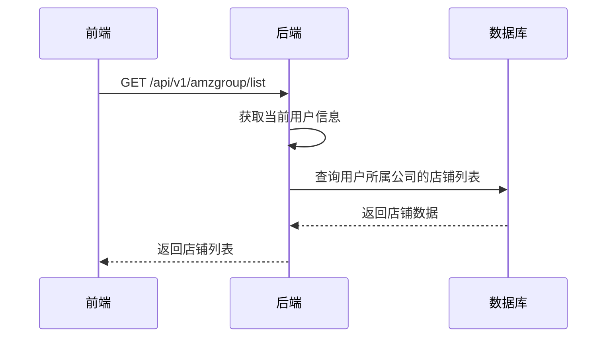
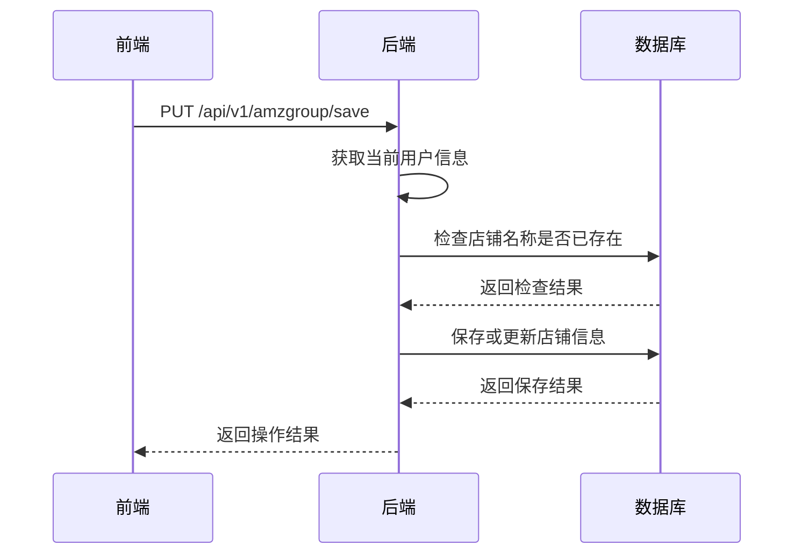
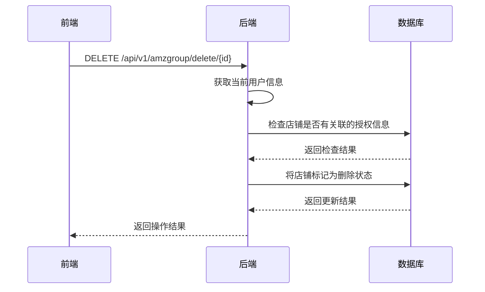
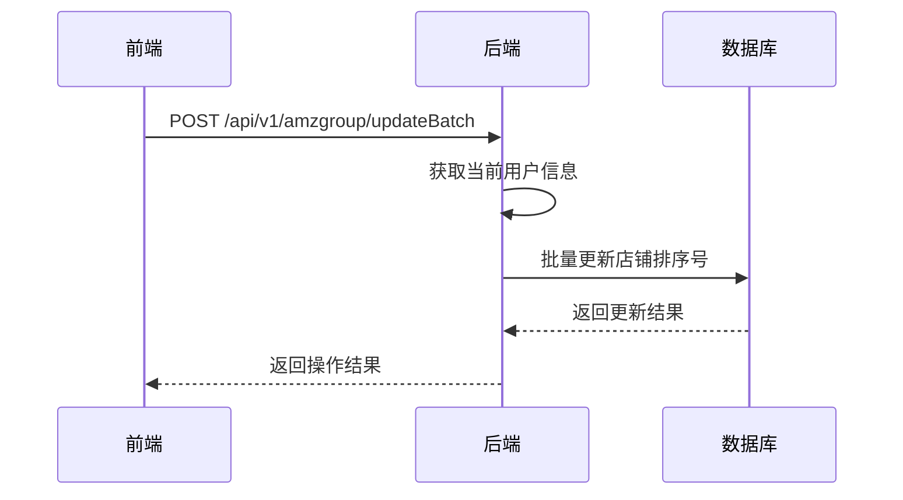

# 店铺管理模块功能解析文档

## 1. 模块架构概述

店铺管理模块采用前后端分离架构，前端使用Vue 3 Composition API实现用户界面和交互逻辑，后端使用Spring Boot实现API接口和业务逻辑。模块主要负责管理亚马逊店铺的基本信息、财务设置和海关信息。

### 1.1 系统架构图

```
┌─────────────┐     ┌─────────────┐     ┌─────────────┐
│ 前端页面    │────>│ 后端API     │────>│ 数据库      │
│ (Vue 3)     │<────│ (Spring Boot)│<────│ (MySQL)     │
└─────────────┘     └─────────────┘     └─────────────┘
```

### 1.2 核心组件

- **前端组件**：`wimoor-ui/src/views/amazon/storeAuth/index.vue` - 店铺管理主组件
- **API服务**：`wimoor-ui/src/api/amazon/group/groupApi.js` - 前端API调用服务
- **后端控制器**：`AmazonGroupController.java` - 处理店铺相关的HTTP请求
- **服务实现**：`AmazonGroupServiceImpl.java` - 实现店铺管理的业务逻辑
- **数据模型**：`AmazonGroup.java` - 店铺数据实体

## 2. 前端代码结构分析

### 2.1 主组件结构

前端主组件 `index.vue` 包含以下核心部分：

- **模板部分**：
  - 左侧店铺列表区域，展示已创建的店铺信息
  - 右侧店铺详情和授权区域
  - 添加/编辑店铺弹窗
  - 店铺排序弹窗

- **脚本部分**：
  - 响应式数据：店铺列表、表单数据、弹窗状态等
  - 生命周期钩子：组件挂载时加载店铺列表
  - 核心方法：
    - `addStorename()`：打开添加店铺弹窗
    - `saveStore()`：保存店铺信息
    - `loadStoreList()`：加载店铺列表
    - `updataStorename()`：编辑店铺信息
    - `delectStore()`：删除店铺
    - `submitFormIndex()`：提交店铺排序

### 2.2 API调用服务

`groupApi.js` 定义了与后端交互的API方法：

- `getAmazongroupList()`：获取店铺列表
- `AmazonGroupSave()`：保存店铺信息
- `getAmazonGroupById()`：根据ID获取店铺详情
- `deleteAmazongroup()`：删除店铺
- `updateBatch()`：批量更新店铺排序

## 3. 后端代码结构分析

### 3.1 控制器层

`AmazonGroupController.java` 提供以下API端点：

- `GET /list`：获取店铺列表
- `GET /listByAdmin`：管理员根据公司ID获取店铺列表
- `GET /id/{id}`：根据ID获取店铺详情
- `DELETE /delete/{id}`：删除店铺
- `POST /updateBatch`：批量更新店铺排序
- `PUT /save`：保存店铺信息

### 3.2 服务实现层

`AmazonGroupServiceImpl.java` 实现了以下核心功能：

- `getGroupByUser()`：根据用户信息获取店铺列表
- `selectByShopId()`：根据公司ID获取店铺列表
- `findAmazonGroupByName()`：根据店铺名称和公司ID查找店铺
- `selectTaskInfoList()`：获取任务信息列表

### 3.3 数据模型

`AmazonGroup` 实体包含以下核心字段：

- `id`：主键ID
- `name`：店铺名称
- `shopid`：公司ID
- `profitcfgid`：匹配的利润计算方案ID
- `company`：公司名称
- `isfinance`：是否财务账套
- `taxNumber`：税务编码
- `customNumber`：海关注册编码
- `dxpid`：海关Dxpid
- `findex`：排序号
- `operator`：操作人ID
- `opttime`：操作时间
- `creator`：创建人ID
- `createtime`：创建时间
- `isdelete`：逻辑删除标记

## 4. 核心功能实现

### 4.1 店铺管理实现

1. **添加店铺**：
   - 前端调用 `addStorename()` 方法打开添加弹窗
   - 用户填写店铺信息后点击保存
   - 前端调用 `saveStore()` 方法，通过 `groupApi.AmazonGroupSave()` 向后端发送请求
   - 后端 `saveAmazonGroupAction()` 方法处理请求，保存店铺信息到数据库

2. **编辑店铺**：
   - 前端点击店铺右侧的编辑图标，调用 `updataStorename()` 方法
   - 前端通过 `groupApi.getAmazonGroupById()` 获取店铺详情
   - 用户修改信息后点击保存
   - 前端调用 `saveStore()` 方法保存修改
   - 后端 `saveAmazonGroupAction()` 方法处理请求，更新店铺信息

3. **删除店铺**：
   - 前端点击店铺右侧的删除图标，调用 `delectStore()` 方法
   - 前端显示确认对话框，用户确认删除
   - 前端调用 `groupApi.deleteAmazongroup()` 向后端发送请求
   - 后端 `delAmazonGroupByIdAction()` 方法处理请求，检查店铺是否有关联的授权信息
   - 如果没有关联授权，将店铺标记为删除状态

### 4.2 店铺排序实现

1. **打开排序弹窗**：
   - 前端点击"排序"按钮，打开排序弹窗
   - 前端显示店铺列表，支持拖拽排序

2. **拖拽排序**：
   - 用户通过拖拽方式调整店铺顺序
   - 前端 `dragEnd()` 方法更新店铺的排序号

3. **保存排序**：
   - 用户点击"确认"按钮保存排序
   - 前端调用 `submitFormIndex()` 方法，通过 `groupApi.updateBatch()` 向后端发送请求
   - 后端 `updateAmazonGroupConfigAction()` 方法处理请求，批量更新店铺排序

### 4.3 财务设置实现

1. **设置财务账套**：
   - 前端编辑店铺信息，开启"是否财务账套"开关
   - 前端显示公司名称和税号输入框
   - 用户填写相关信息

2. **初始化财务账套**：
   - 前端开启"初始化财务账套"开关
   - 前端调用 `saveStore()` 方法保存设置
   - 前端先调用 `initFinAccountingSubjects()` 初始化财务科目
   - 然后调用 `groupApi.AmazonGroupSave()` 保存店铺信息

### 4.4 权限控制实现

- **用户权限**：后端通过 `UserInfoContext.get()` 获取当前用户信息
- **公司权限**：根据用户的公司ID过滤店铺列表
- **管理员权限**：管理员用户可以查看和管理所有公司的店铺
- **操作权限**：删除店铺时检查店铺是否有关联的授权信息

## 5. API调用流程

### 5.1 获取店铺列表流程



### 5.2 保存店铺信息流程



### 5.3 删除店铺流程



### 5.4 批量更新店铺排序流程



## 6. 技术要点和难点

### 6.1 前端技术要点

- **Vue 3 Composition API**：使用Vue 3的Composition API实现组件逻辑，提高代码可维护性
- **拖拽排序**：使用vuedraggable库实现店铺的拖拽排序功能
- **响应式数据**：使用ref和reactive实现响应式数据管理
- **表单验证**：实现基本的表单验证逻辑，确保数据的完整性

### 6.2 后端技术要点

- **权限控制**：基于用户角色和公司ID实现权限控制
- **事务管理**：确保数据操作的原子性和一致性
- **数据校验**：检查店铺名称的唯一性，防止重复创建
- **逻辑删除**：使用逻辑删除标记，保留数据历史

### 6.3 技术难点

- **拖拽排序实现**：确保拖拽过程的流畅性和排序结果的准确性
- **财务账套初始化**：协调财务系统和店铺管理系统的数据同步
- **权限控制**：实现细粒度的权限控制，确保数据安全
- **数据一致性**：确保店铺信息与其他模块数据的一致性

## 7. 代码优化建议

### 7.1 前端代码优化

1. **错误处理优化**：
   - 当前代码在API调用失败时缺少统一的错误处理机制
   - 建议实现全局错误处理拦截器，统一处理API错误

2. **表单验证优化**：
   - 当前表单验证逻辑较为简单，建议使用Element Plus的表单验证规则
   - 实现更全面的表单验证，确保数据的有效性

3. **代码结构优化**：
   - 将店铺管理相关的逻辑抽取为独立的composable函数
   - 提高代码的复用性和可读性

4. **性能优化**：
   - 实现店铺列表的虚拟滚动，提高大数据量下的渲染性能
   - 使用缓存机制减少重复的API调用

### 7.2 后端代码优化

1. **安全性优化**：
   - 当前代码中缺少对输入参数的验证，建议实现请求参数验证
   - 使用@Valid注解和校验组实现更严格的参数验证

2. **异常处理优化**：
   - 当前代码中异常处理较为简单，建议实现统一的异常处理机制
   - 提供更详细的错误信息和错误码

3. **性能优化**：
   - 实现店铺列表的缓存机制，减少数据库查询
   - 使用批量操作减少数据库交互次数

4. **代码结构优化**：
   - 将业务逻辑进一步分离，提高代码的可维护性
   - 实现更细粒度的服务层接口

### 7.3 架构优化

1. **微服务架构**：
   - 考虑将店铺管理模块抽取为独立的微服务
   - 提高系统的扩展性和可维护性

2. **缓存架构**：
   - 实现分布式缓存，提高系统性能
   - 缓存店铺列表和常用数据

3. **监控架构**：
   - 实现店铺管理模块的监控和告警机制
   - 及时发现和处理系统异常

## 8. 总结

店铺管理模块是Wimoor系统中管理亚马逊店铺信息的核心模块，通过该模块用户可以方便地管理店铺的基本信息、财务设置和海关信息。模块采用前后端分离架构，前端使用Vue 3 Composition API实现用户界面，后端使用Spring Boot实现业务逻辑。

模块的核心功能包括店铺的添加、编辑、删除，店铺排序的调整，财务账套的设置和初始化，以及海关信息的配置。通过这些功能，用户可以有效地管理多个亚马逊店铺的信息，为后续的业务操作提供基础数据支持。

在技术实现上，模块解决了权限控制、数据一致性、拖拽排序等技术难点，为系统的稳定运行提供了保障。同时，通过代码优化建议的实施，可以进一步提高模块的性能、安全性和可维护性。
