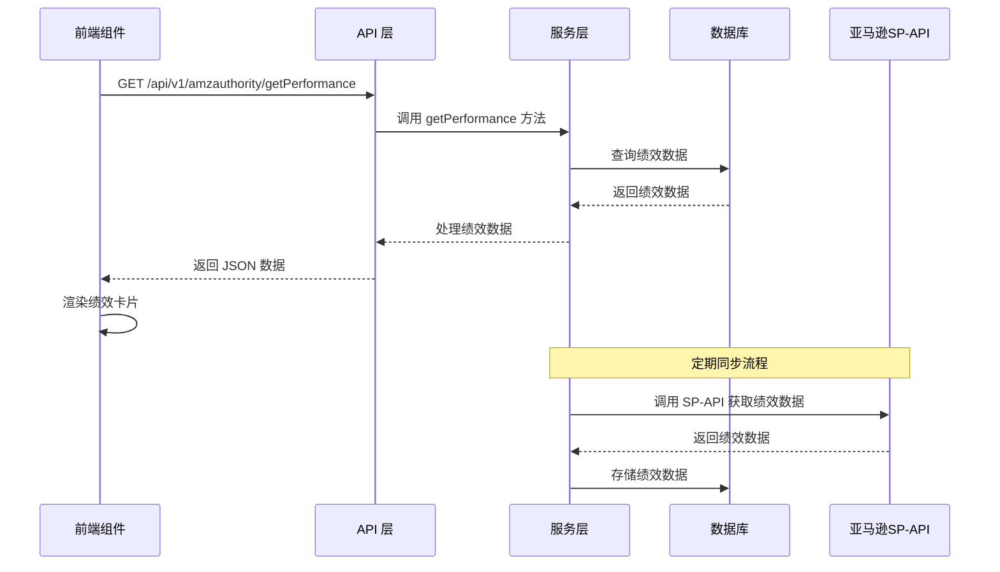

# 店铺绩效模块功能解析文档

## 1. 模块概述

店铺绩效模块是 Wimoor ERP 系统中用于展示和监控亚马逊店铺绩效指标的功能模块。该模块通过前后端技术的紧密配合，实现了客户服务绩效、商品政策合规性和配送绩效三个核心维度的绩效数据展示，为卖家提供了直观、全面的店铺运营状况监控工具。

## 2. 技术架构

### 2.1 前端技术栈

- **框架**：Vue 3 + Composition API
- **UI 组件库**：Element Plus
- **HTTP 客户端**：Axios
- **工具库**：日期格式化、数字格式化等

### 2.2 后端技术栈

- **框架**：Spring Boot 2.x
- **ORM**：MyBatis-Plus
- **数据库**：MySQL
- **Amazon API**：SP-API (Selling Partner API)

### 2.3 架构流程图



## 3. 核心功能实现

### 3.1 前端实现

#### 3.1.1 组件结构

**文件路径**：`wimoor-ui/src/views/amazon/report/performance/seller/index.vue`

- **主组件**：负责整体布局和绩效数据展示
- **子组件**：
  - `header.vue`：店铺选择器组件
  - 绩效卡片组件：客户服务绩效、商品政策合规性、配送绩效

#### 3.1.2 核心代码分析

```vue
<template>
  <div class="main-sty">
    <div class="con-header">
      <MyHeader @getdata="loadData"></MyHeader>
    </div>
    <el-row :gutter="16">
      <el-col :span="8">
        <!-- 客户服务绩效卡片 -->
      </el-col>
      <el-col :span="8">
        <!-- 商品政策合规性卡片 -->
      </el-col>
      <el-col :span="8">
        <!-- 配送绩效卡片 -->
      </el-col>
    </el-row>
  </div>
</template>

<script setup>
  import { ref, reactive, onMounted, toRefs } from 'vue';
  import MyHeader from "./header.vue"
  import authApi from "@/api/amazon/auth/authApi.js";

  let state = reactive({
    dataList: {},
    queryParams: {}
  });

  function loadData(params) {
    authApi.getPerformance(params).then((res) => {
      if (res && res.data) {
        state.dataList = res.data.performanceJson;
      }
    })
  }
</script>
```

**关键方法**：

- `loadData(params)`：加载绩效数据，调用后端 API 获取绩效信息
- `accountHealth(val)`：根据账号健康得分计算健康评级

#### 3.1.3 API 调用

**文件路径**：`wimoor-ui/src/api/amazon/auth/authApi.js`

```javascript
function getPerformance(data){
    return request.get('/amazon/api/v1/amzauthority/getPerformance',{params:data});
}
```

### 3.2 后端实现

#### 3.2.1 控制器

**文件路径**：`wimoor-amazon/amazon-boot/src/main/java/com/wimoor/amazon/auth/controller/AmazonAuthorityController.java`

**核心方法**：

- `getPerformanceAction(String groupid, String marketplaceid)`：处理绩效数据查询请求，返回绩效信息

#### 3.2.2 服务层

**文件路径**：`wimoor-amazon/amazon-boot/src/main/java/com/wimoor/amazon/auth/service/impl/AmazonAuthorityServiceImpl.java`

**核心方法**：

- `getPerformance(AmazonAuthority auth, String marketplaceid)`：查询店铺绩效数据
- 定期同步方法：从亚马逊 SP-API 获取最新的绩效数据并存储到数据库

#### 3.2.3 数据访问层

**核心数据表**：

- `t_amz_auth_market_performance`：存储店铺绩效数据

## 4. 数据模型

### 4.1 核心数据表

| 表名 | 说明 | 主要字段 |
|------|------|----------|
| t_amz_auth_market_performance | 店铺绩效表 | id, amazonauthid, marketplaceid, performance, performanceJson, createdate, opttime |

### 4.2 数据传输对象

**AmazonAuthMarketPerformance 实体**：
- id：主键ID
- amazonauthid：亚马逊授权ID
- marketplaceid：市场ID
- performance：绩效数据（JSON格式）
- performanceJson：解析后的绩效数据（JSON对象）
- createdate：创建日期
- opttime：更新日期

### 4.3 绩效数据结构

```json
{
  "orderDefectRate": {
    "mfn": {
      "rate": 0.01,
      "orderCount": 1000,
      "orderWithDefects": {"count": 10},
      "negativeFeedback": {"count": 5},
      "claims": {"count": 3},
      "chargebacks": {"count": 2}
    },
    "afn": {
      "rate": 0.005,
      "orderCount": 2000,
      "orderWithDefects": {"count": 10},
      "negativeFeedback": {"count": 4},
      "claims": {"count": 4},
      "chargebacks": {"count": 2},
      "targetValue": 0.01
    },
    "reportingDateRange": {
      "reportingDateFrom": "2024-01-01T00:00:00Z",
      "reportingDateTo": "2024-01-31T23:59:59Z"
    }
  },
  "invoiceDefectRate": {
    "rate": 0.002,
    "orderCount": 1500,
    "lateInvoice": {"count": 2},
    "missingInvoice": {"count": 1},
    "invoiceDefect": {"count": 0},
    "targetValue": 0.01,
    "reportingDateRange": {
      "reportingDateFrom": "2024-01-01T00:00:00Z",
      "reportingDateTo": "2024-01-31T23:59:59Z"
    }
  },
  "accountHealthRating": {
    "ahrScore": 250,
    "ahrStatus": "Good",
    "reportingDateRange": {
      "reportingDateFrom": "2024-01-01T00:00:00Z",
      "reportingDateTo": "2024-01-31T23:59:59Z"
    }
  },
  "lateShipmentRate": {
    "rate": 0.008,
    "targetValue": 0.04,
    "reportingDateRange": {
      "reportingDateFrom": "2024-01-01T00:00:00Z",
      "reportingDateTo": "2024-01-31T23:59:59Z"
    }
  },
  "onTimeDeliveryRate": {
    "rate": 0.02,
    "targetValue": 0.05,
    "reportingDateRange": {
      "reportingDateFrom": "2024-01-01T00:00:00Z",
      "reportingDateTo": "2024-01-31T23:59:59Z"
    }
  },
  "validTrackingRate": {
    "rate": 0.01,
    "targetValue": 0.02,
    "reportingDateRange": {
      "reportingDateFrom": "2024-01-01T00:00:00Z",
      "reportingDateTo": "2024-01-31T23:59:59Z"
    }
  },
  "preFulfillmentCancellationRate": {
    "rate": 0.015,
    "targetValue": 0.025,
    "reportingDateRange": {
      "reportingDateFrom": "2024-01-01T00:00:00Z",
      "reportingDateTo": "2024-01-31T23:59:59Z"
    }
  },
  "listingPolicyViolations": {
    "defectsCount": 0
  },
  "productAuthenticityCustomerComplaints": {
    "defectsCount": 0
  },
  "productConditionCustomerComplaints": {
    "defectsCount": 1
  },
  "productSafetyCustomerComplaints": {
    "defectsCount": 0
  },
  "restrictedProductPolicyViolations": {
    "defectsCount": 0
  },
  "receivedIntellectualPropertyComplaints": {
    "defectsCount": 0
  },
  "suspectedIntellectualPropertyViolations": {
    "defectsCount": 0
  },
  "foodAndProductSafetyIssues": {
    "defectsCount": 0
  },
  "customerProductReviewsPolicyViolations": {
    "defectsCount": 0
  },
  "otherPolicyViolations": {
    "defectsCount": 0
  }
}
```

## 5. 功能流程

### 5.1 数据加载流程

1. **用户选择店铺**：
   - 前端用户在店铺选择器中选择店铺分组和站点
   - 前端调用 `loadData` 方法，传递店铺参数

2. **后端处理**：
   - 后端控制器接收请求，获取店铺授权信息
   - 调用服务层方法查询绩效数据
   - 从数据库中获取绩效数据
   - 将绩效数据解析为JSON格式返回

3. **前端渲染**：
   - 前端接收绩效数据
   - 渲染客户服务绩效卡片
   - 渲染商品政策合规性卡片
   - 渲染配送绩效卡片

### 5.2 数据同步流程

1. **定期任务**：
   - 系统定时执行绩效数据同步任务
   - 调用亚马逊 SP-API 获取最新的绩效数据

2. **数据处理**：
   - 解析 API 返回的绩效数据
   - 存储或更新数据库中的绩效数据

3. **数据更新**：
   - 前端用户刷新页面时获取最新数据
   - 系统实时展示最新的绩效指标

## 6. 性能优化

### 6.1 前端优化

- **组件懒加载**：子组件采用懒加载方式，减少初始加载时间
- **响应式设计**：使用 Vue 3 Composition API 实现响应式数据管理
- **数据缓存**：对绩效数据进行本地缓存，减少重复请求
- **防抖处理**：对店铺选择操作进行防抖处理，减少 API 调用

### 6.2 后端优化

- **数据缓存**：使用 Redis 缓存绩效数据，提高查询效率
- **批量处理**：批量同步绩效数据，减少 API 调用次数
- **异步处理**：使用异步任务处理数据同步，提高系统响应速度
- **数据库优化**：为绩效数据表添加索引，提高查询效率

## 7. 安全措施

### 7.1 前端安全

- **输入验证**：对用户输入进行验证，防止恶意输入
- **XSS 防护**：对数据进行转义，防止跨站脚本攻击
- **CSRF 防护**：使用 token 验证，防止跨站请求伪造

### 7.2 后端安全

- **权限控制**：基于用户角色和权限进行访问控制
- **API 调用安全**：使用亚马逊 SP-API 的安全认证机制
- **数据验证**：对请求参数进行验证，确保数据合法性
- **异常处理**：完善异常处理机制，防止敏感信息泄露

## 8. 扩展点

### 8.1 功能扩展

- **历史数据趋势**：添加绩效指标的历史趋势图表
- **绩效预警**：当绩效指标接近或低于目标值时进行预警
- **多店铺对比**：支持多个店铺的绩效指标对比
- **自定义指标**：允许用户自定义关注的绩效指标
- **导出功能**：支持导出绩效报告为 Excel 或 PDF 格式

### 8.2 技术扩展

- **实时数据**：使用 WebSocket 实现绩效数据的实时更新
- **数据可视化**：使用更高级的图表库，提供更丰富的数据可视化效果
- **机器学习**：使用机器学习算法预测绩效趋势
- **微服务化**：将绩效功能拆分为独立的微服务，提高系统可维护性

## 9. 代码优化建议

### 9.1 前端优化建议

1. **代码结构优化**：将绩效卡片拆分为独立组件，提高代码可维护性
2. **状态管理优化**：使用 Pinia 管理全局状态，提高代码可扩展性
3. **性能优化**：使用虚拟滚动处理大量数据，提高渲染性能
4. **用户体验优化**：添加加载状态和错误提示，提高用户体验
5. **响应式设计**：优化移动端显示效果，提高跨设备兼容性

### 9.2 后端优化建议

1. **API 优化**：优化亚马逊 SP-API 调用，减少 API 限制影响
2. **代码结构优化**：将绩效数据处理逻辑进一步分层，提高代码可维护性
3. **缓存策略优化**：优化缓存策略，提高数据更新及时性和查询效率
4. **异常处理优化**：完善异常处理机制，提高系统稳定性
5. **数据同步优化**：优化数据同步策略，减少对系统性能的影响

## 10. 总结

店铺绩效模块是 Wimoor ERP 系统中一个重要的功能模块，通过前后端技术的紧密配合，实现了亚马逊店铺绩效指标的展示和监控。该模块采用了现代的技术栈和架构设计，具有良好的性能和可扩展性。

通过本模块，卖家可以实时了解店铺的运营状况，及时发现并解决问题，确保店铺健康运营。同时，该模块的设计也为后续的功能扩展和技术升级奠定了良好的基础。

---

**技术要点**：
- 前端使用 Vue 3 Composition API 实现响应式数据管理
- 后端使用 Spring Boot + MyBatis-Plus 构建 RESTful API
- 集成亚马逊 SP-API 获取绩效数据
- 采用分层架构设计，提高代码可维护性
- 实现了完整的绩效数据展示和监控功能

**功能亮点**：
- 提供三个核心维度的绩效数据展示
- 支持按店铺分组和站点进行数据筛选
- 实时展示绩效数据和目标值对比
- 直观的视觉设计，便于数据解读
- 定期自动同步最新的绩效数据

**应用价值**：
- 帮助卖家实时了解店铺运营状况
- 及时发现并解决绩效问题
- 确保店铺健康运营，避免账号风险
- 为运营决策提供数据支持
- 提高店铺管理效率