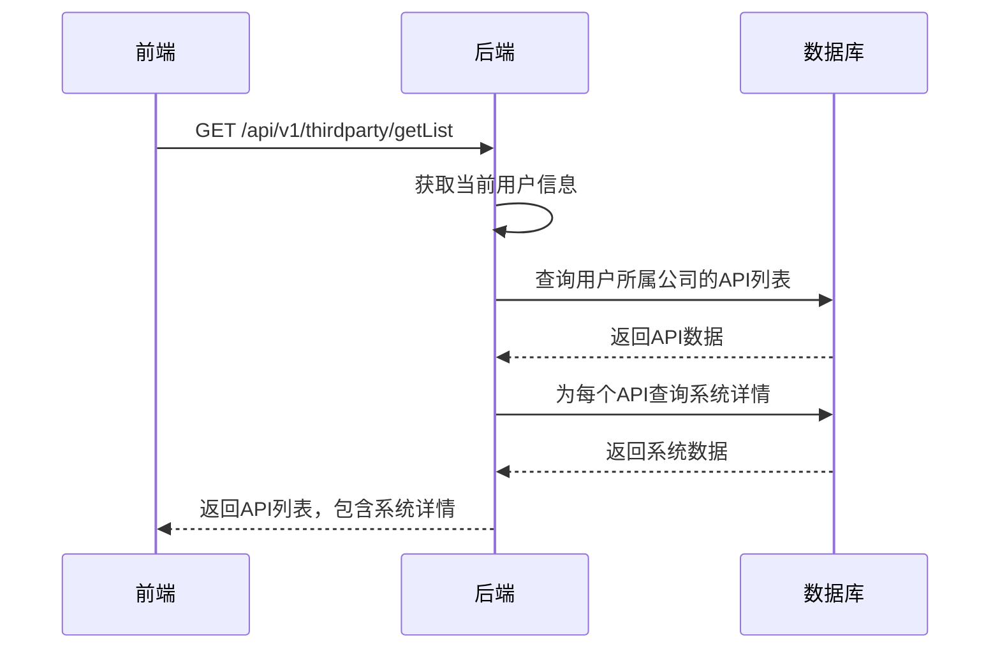
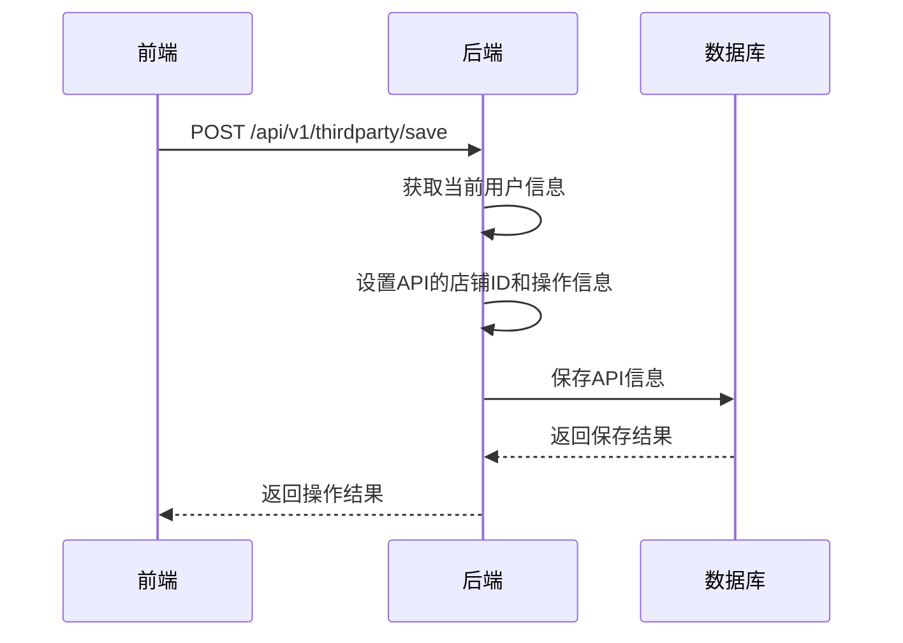
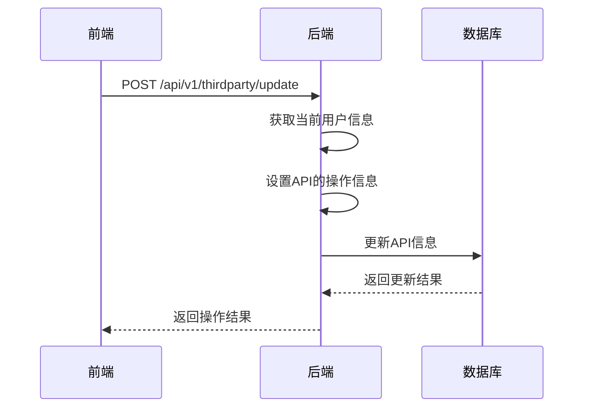
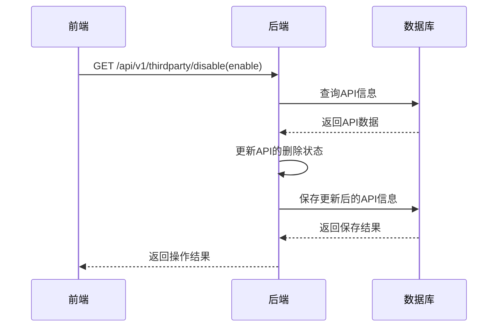

# 设置-物流绑定模块功能解析文档

## 1. 模块架构概述

设置-物流绑定模块采用前后端分离架构，前端使用Vue 3 Composition API实现用户界面和交互逻辑，后端使用Spring Boot实现API接口和业务逻辑。模块主要负责管理第三方物流商和海外仓的API绑定信息，实现与第三方物流系统的对接。

### 1.1 系统架构图

```
┌─────────────┐     ┌─────────────┐     ┌─────────────┐
│ 前端页面    │────>│ 后端API     │────>│ 数据库      │
│ (Vue 3)     │<────│ (Spring Boot)│<────│ (MySQL)     │
└─────────────┘     └─────────────┘     └─────────────┘
```

### 1.2 核心组件

- **前端组件**：`wimoor-ui/src/views/erp/thirdparty/index.vue` - 第三方物流主组件
- **编辑组件**：`wimoor-ui/src/views/erp/thirdparty/components/edit_dialog.vue` - API编辑对话框
- **API服务**：`wimoor-ui/src/api/erp/thirdparty/thirdpartyApi.js` - 前端API调用服务
- **后端控制器**：`ThirdPartyAPIController.java` - 处理第三方API相关的HTTP请求
- **服务实现**：`ThirdPartyApiServiceImpl.java` - 实现第三方API管理的业务逻辑
- **数据模型**：`ThirdPartyAPI.java` - 第三方API数据实体
- **系统模型**：`ThirdPartySystem.java` - 第三方系统数据实体

## 2. 前端代码结构分析

### 2.1 主组件结构

前端主组件 `index.vue` 包含以下核心部分：

- **模板部分**：
  - 添加API按钮
  - API列表表格，展示已创建的API连接信息
  - 编辑API对话框

- **脚本部分**：
  - 响应式数据：API列表、查询参数、加载状态等
  - 生命周期钩子：组件挂载时加载API列表
  - 核心方法：
    - `loadTableData()`：加载API列表数据
    - `showaddApi()`：打开添加/编辑API对话框
    - `disableApi()`：禁用API连接
    - `enableApi()`：启用API连接

### 2.2 编辑对话框组件

`edit_dialog.vue` 组件包含以下核心部分：

- **模板部分**：
  - 系统选择下拉菜单
  - API信息表单，包含公司名称、API连接、授权信息等字段
  - 保存和关闭按钮

- **脚本部分**：
  - 响应式数据：表单数据、系统列表、系统详情等
  - 核心方法：
    - `addApi()`：保存API信息
    - `handleSystemChange()`：处理系统选择变化
    - `loadSystem()`：加载支持的系统列表
    - `show()`：显示编辑对话框

### 2.3 API调用服务

`thirdpartyApi.js` 定义了与后端交互的API方法：

- `getlist()`：获取API列表
- `getAllSupportSystem()`：获取所有支持的系统列表
- `save()`：保存API信息
- `update()`：更新API信息
- `deleteItem()`：禁用API
- `enableItem()`：启用API
- `info()`：获取API详情

## 3. 后端代码结构分析

### 3.1 控制器层

`ThirdPartyAPIController.java` 提供以下API端点：

- `GET /getAllSupportSystem`：获取所有支持的系统列表
- `GET /getSupportApi`：根据支持类型获取API列表
- `GET /getList`：获取API列表
- `POST /update`：更新API信息
- `POST /save`：保存API信息
- `GET /disable`：禁用API
- `GET /enable`：启用API
- `GET /info`：获取API详情
- `GET /getQuoteToken`：获取报价令牌
- `GET /unbindQuoteToken`：解绑报价令牌
- `POST /saveQuoteToken`：保存报价令牌
- `GET /refreshData`：刷新数据

### 3.2 服务实现层

`ThirdPartyApiServiceImpl.java` 实现了以下核心功能：

- `getAllSupportSystem()`：获取所有支持的系统列表
- `getSupportApi()`：根据支持类型获取API列表
- `getApiSystemById()`：根据ID获取API系统详情

### 3.3 数据模型

`ThirdPartyAPI` 实体包含以下核心字段：

- `id`：主键ID
- `shopid`：店铺ID
- `name`：公司名称
- `system`：系统ID
- `api`：API连接地址
- `appkey`：应用ID
- `appsecret`：应用密钥
- `token`：令牌
- `url`：API文档连接
- `isdelete`：删除状态
- `operator`：操作人ID
- `opttime`：操作时间

`ThirdPartySystem` 实体包含以下核心字段：

- `id`：系统ID
- `name`：系统名称
- `support`：支持的功能类型
- `needkey`：是否需要AppKey
- `needtoken`：是否需要Token

## 4. 核心功能实现

### 4.1 API管理实现

1. **添加API**：
   - 前端点击"添加API"按钮，打开编辑对话框
   - 用户填写API信息，选择系统类型
   - 前端调用 `thirdpartyApi.save()` 向后端发送请求
   - 后端 `saveAction()` 方法处理请求，保存API信息到数据库

2. **编辑API**：
   - 前端点击API列表中的"编辑"按钮，打开编辑对话框
   - 前端调用 `thirdpartyApi.info()` 获取API详情
   - 用户修改API信息后点击保存
   - 前端调用 `thirdpartyApi.update()` 向后端发送请求
   - 后端 `updateAction()` 方法处理请求，更新API信息

3. **禁用API**：
   - 前端点击API列表中的"禁用"按钮
   - 前端调用 `thirdpartyApi.deleteItem()` 向后端发送请求
   - 后端 `disableAction()` 方法处理请求，将API标记为删除状态

4. **启用API**：
   - 前端点击API列表中的"启用"按钮
   - 前端调用 `thirdpartyApi.enableItem()` 向后端发送请求
   - 后端 `enableAction()` 方法处理请求，将API标记为非删除状态

### 4.2 系统管理实现

1. **加载系统列表**：
   - 前端打开编辑对话框时，调用 `thirdpartyApi.getAllSupportSystem()` 获取系统列表
   - 后端 `getAllSupportSystemAction()` 方法处理请求，返回所有支持的系统

2. **系统选择**：
   - 用户在编辑对话框中选择系统类型
   - 前端 `handleSystemChange()` 方法更新系统详情
   - 根据系统要求，显示或隐藏AppKey、AppSecret和Token输入框

### 4.3 API列表实现

1. **加载API列表**：
   - 前端组件挂载时，调用 `loadTableData()` 方法
   - 前端调用 `thirdpartyApi.getlist()` 获取API列表
   - 后端 `getListAction()` 方法处理请求，返回API列表
   - 后端为每个API添加系统名称和系统详情

2. **展示API列表**：
   - 前端使用表格展示API列表
   - 显示API的系统名称、授权信息和状态
   - 根据API状态，显示"启用"或"禁用"按钮

## 5. API调用流程

### 5.1 获取API列表流程



### 5.2 保存API信息流程



### 5.3 更新API信息流程



### 5.4 启用/禁用API流程



## 6. 技术要点和难点

### 6.1 前端技术要点

- **Vue 3 Composition API**：使用Vue 3的Composition API实现组件逻辑，提高代码可维护性
- **响应式数据管理**：使用reactive和ref实现响应式数据管理
- **组件通信**：使用emit和props实现组件间通信
- **动态表单**：根据系统类型动态显示或隐藏表单字段

### 6.2 后端技术要点

- **权限控制**：基于用户角色和公司ID实现权限控制
- **数据关联**：关联API和系统数据，提供完整的API信息
- **状态管理**：使用逻辑删除标记管理API的启用/禁用状态
- **异步处理**：使用线程池处理耗时的API数据刷新操作

### 6.3 技术难点

- **动态表单实现**：根据系统类型动态调整表单字段，提高用户体验
- **API授权管理**：安全管理和存储API授权信息，确保数据安全
- **系统集成**：与不同类型的第三方物流系统集成，处理不同的API格式和认证方式
- **数据同步**：确保与第三方物流系统的数据同步及时性和准确性

## 7. 代码优化建议

### 7.1 前端代码优化

1. **错误处理优化**：
   - 当前代码在API调用失败时缺少统一的错误处理机制
   - 建议实现全局错误处理拦截器，统一处理API错误

2. **表单验证优化**：
   - 当前表单验证逻辑较为简单，建议使用Element Plus的表单验证规则
   - 实现更全面的表单验证，确保数据的有效性

3. **代码结构优化**：
   - 将API管理相关的逻辑抽取为独立的composable函数
   - 提高代码的复用性和可读性

4. **性能优化**：
   - 实现API列表的虚拟滚动，提高大数据量下的渲染性能
   - 使用缓存机制减少重复的API调用

### 7.2 后端代码优化

1. **安全性优化**：
   - 当前代码中缺少对输入参数的验证，建议实现请求参数验证
   - 使用@Valid注解和校验组实现更严格的参数验证

2. **异常处理优化**：
   - 当前代码中异常处理较为简单，建议实现统一的异常处理机制
   - 提供更详细的错误信息和错误码

3. **性能优化**：
   - 实现API列表的缓存机制，减少数据库查询
   - 使用批量操作减少数据库交互次数

4. **代码结构优化**：
   - 将业务逻辑进一步分离，提高代码的可维护性
   - 实现更细粒度的服务层接口

### 7.3 架构优化

1. **微服务架构**：
   - 考虑将第三方物流模块抽取为独立的微服务
   - 提高系统的扩展性和可维护性

2. **缓存架构**：
   - 实现分布式缓存，提高系统性能
   - 缓存系统列表和常用API数据

3. **监控架构**：
   - 实现第三方API调用的监控和告警机制
   - 及时发现和处理API调用异常

## 8. 总结

设置-物流绑定模块是Wimoor系统中管理第三方物流商和海外仓API绑定信息的核心模块，通过该模块用户可以方便地管理第三方API连接，实现与第三方物流系统的对接。模块采用前后端分离架构，前端使用Vue 3 Composition API实现用户界面，后端使用Spring Boot实现业务逻辑。

模块的核心功能包括API的添加、编辑、启用、禁用，系统选择，授权信息配置，以及API列表展示。通过这些功能，用户可以有效地管理多个第三方物流商和海外仓的API连接，为后续的物流操作提供基础数据支持。

在技术实现上，模块解决了动态表单、API授权管理、系统集成等技术难点，为系统的稳定运行提供了保障。同时，通过代码优化建议的实施，可以进一步提高模块的性能、安全性和可维护性。
