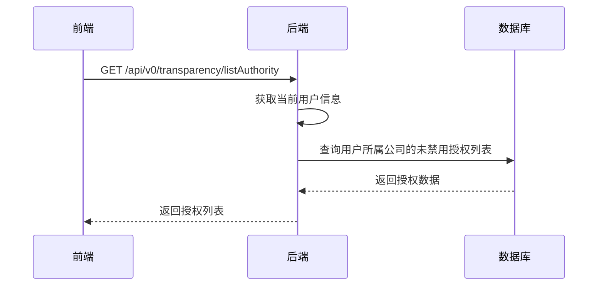
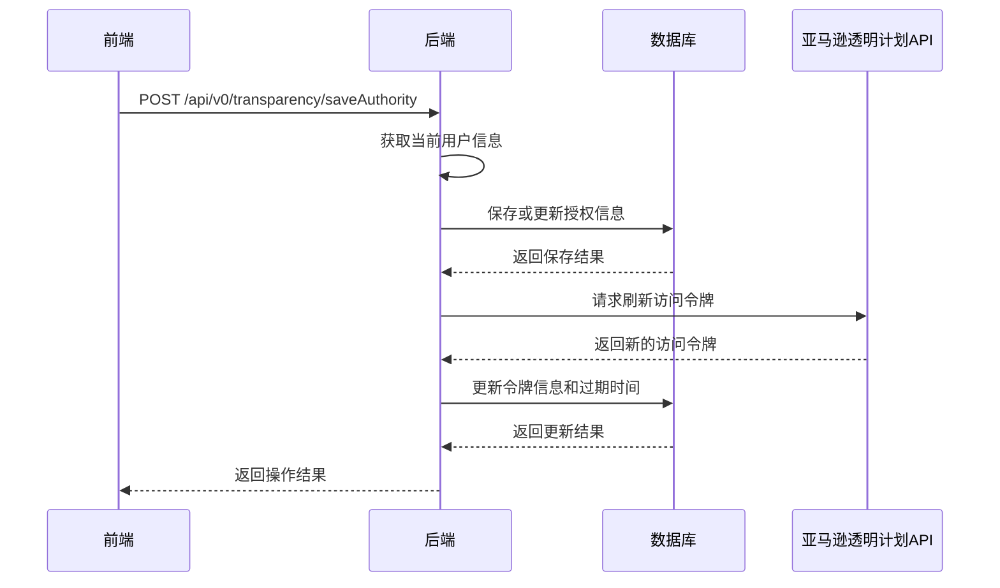
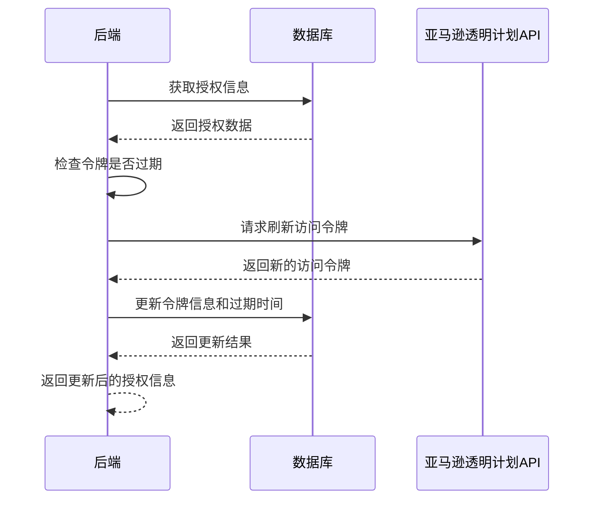

# 设置-透明计划授权模块功能解析文档

## 1. 模块架构概述

设置-透明计划授权模块采用前后端分离架构，前端使用Vue 3 Composition API实现用户界面和交互逻辑，后端使用Spring Boot实现API接口和业务逻辑。模块主要负责管理亚马逊透明计划（Transparency）的授权信息，实现与亚马逊透明计划服务的对接。

### 1.1 系统架构图

```
┌─────────────┐     ┌─────────────┐     ┌─────────────┐     ┌─────────────┐
│ 前端页面    │────>│ 后端API     │────>│ 数据库      │     │ 亚马逊透明  │
│ (Vue 3)     │<────│ (Spring Boot)│<────│ (MySQL)     │<────│ 计划API     │
└─────────────┘     └─────────────┘     └─────────────┘     └─────────────┘
```

### 1.2 核心组件

- **前端组件**：`wimoor-ui/src/views/amazon/transparency/auth/index.vue` - 透明计划授权主组件
- **API服务**：`wimoor-ui/src/api/amazon/transparency/authApi.js` - 前端API调用服务
- **后端控制器**：`TransparencyController.java` - 处理透明计划授权相关的HTTP请求
- **服务实现**：`TransparencyAuthorityServiceImpl.java` - 实现透明计划授权的业务逻辑
- **数据模型**：`TransparencyAuthority.java` - 透明计划授权数据实体

## 2. 前端代码结构分析

### 2.1 主组件结构

前端主组件 `index.vue` 包含以下核心部分：

- **模板部分**：
  - 新增按钮和搜索输入框
  - 授权信息列表表格，展示已创建的授权信息
  - 授权信息编辑对话框

- **脚本部分**：
  - 响应式数据：授权列表、搜索关键词、表单数据、弹窗状态等
  - 生命周期钩子：组件挂载时加载授权列表
  - 核心方法：
    - `handleQuery()`：搜索授权信息
    - `handleAdd()`：打开添加授权对话框
    - `handleEdit()`：打开编辑授权对话框
    - `handleSave()`：保存授权信息
    - `handleDelete()`：删除授权信息

### 2.2 API调用服务

`authApi.js` 定义了与后端交互的API方法：

- `listAuthority()`：获取授权信息列表
- `saveAuthority()`：保存授权信息

## 3. 后端代码结构分析

### 3.1 控制器层

`TransparencyController.java` 提供以下API端点：

- `POST /saveAuthority`：保存授权信息
- `GET /listAuthority`：获取授权信息列表

### 3.2 服务实现层

`TransparencyAuthorityServiceImpl.java` 实现了以下核心功能：

- `saveAuthority()`：保存授权信息
- `refreshToken()`：刷新透明计划API的访问令牌
- `getAuthority()`：获取有效的授权信息，自动处理令牌刷新
- `sgtin()`：调用透明计划API生成SGTIN编码
- `job()`：调用透明计划API执行任务

### 3.3 数据模型

`TransparencyAuthority` 实体包含以下核心字段：

- `clientId`：客户端ID（主键）
- `shopid`：店铺ID
- `clientName`：客户端名称
- `clientSecret`：客户端密钥
- `token`：访问令牌
- `expiry`：令牌过期时间
- `disabled`：是否禁用
- `createtime`：创建时间
- `creator`：创建人

## 4. 核心功能实现

### 4.1 授权管理实现

1. **添加授权**：
   - 前端点击"新增"按钮，打开编辑对话框
   - 用户填写授权信息，包括名称、Client Id和Client Secret
   - 前端调用 `authApi.saveAuthority()` 向后端发送请求
   - 后端 `saveAuthorityAction()` 方法处理请求，保存授权信息到数据库
   - 后端调用 `refreshToken()` 方法获取并保存访问令牌

2. **编辑授权**：
   - 前端点击授权列表中的"编辑"按钮，打开编辑对话框
   - 前端将选中的授权信息复制到表单数据
   - 用户修改授权信息后点击保存
   - 前端调用 `authApi.saveAuthority()` 向后端发送请求
   - 后端 `saveAuthorityAction()` 方法处理请求，更新授权信息
   - 后端调用 `refreshToken()` 方法刷新访问令牌

3. **删除授权**：
   - 前端点击授权列表中的"删除"按钮
   - 前端显示确认对话框，用户确认删除
   - 前端将授权的 `disabled` 属性设置为 `true`
   - 前端调用 `authApi.saveAuthority()` 向后端发送请求
   - 后端 `saveAuthorityAction()` 方法处理请求，更新授权状态

### 4.2 授权列表实现

1. **加载授权列表**：
   - 前端组件挂载时，调用 `handleQuery()` 方法
   - 前端调用 `authApi.listAuthority()` 获取授权列表
   - 后端 `listAuthorityAction()` 方法处理请求，返回未禁用的授权列表
   - 后端根据搜索关键词过滤授权信息

2. **展示授权列表**：
   - 前端使用表格展示授权列表
   - 显示授权的名称、Client Id和创建时间
   - 根据授权状态，显示"编辑"和"删除"按钮

### 4.3 令牌管理实现

1. **令牌获取**：
   - 在 `saveAuthority()` 方法中，调用 `refreshToken()` 获取访问令牌
   - 后端向亚马逊透明计划的OAuth2 token端点发送请求
   - 获取 `access_token` 和 `expires_in` 信息
   - 计算令牌过期时间并保存到数据库

2. **令牌刷新**：
   - 在 `getAuthority()` 方法中，检查令牌是否过期
   - 如果令牌已过期，调用 `refreshToken()` 刷新令牌
   - 保存新的令牌和过期时间

3. **令牌使用**：
   - 在调用透明计划API前，调用 `getAuthority()` 获取有效的授权信息
   - 使用获取的访问令牌构建API请求头
   - 发送API请求并处理响应

## 5. API调用流程

### 5.1 获取授权列表流程



### 5.2 保存授权信息流程



### 5.3 令牌刷新流程



## 6. 技术要点和难点

### 6.1 前端技术要点

- **Vue 3 Composition API**：使用Vue 3的Composition API实现组件逻辑，提高代码可维护性
- **响应式数据管理**：使用reactive和ref实现响应式数据管理
- **表单处理**：实现授权信息的添加和编辑表单
- **事件处理**：处理用户交互事件，如点击、提交等

### 6.2 后端技术要点

- **OAuth2认证**：实现与亚马逊透明计划API的OAuth2认证流程
- **令牌管理**：自动管理访问令牌的获取、刷新和过期处理
- **API调用**：封装透明计划API的调用逻辑，处理请求和响应
- **权限控制**：基于用户角色和公司ID实现权限控制

### 6.3 技术难点

- **令牌管理**：确保访问令牌的及时刷新和有效使用，避免API调用失败
- **API集成**：与亚马逊透明计划API的集成，处理不同的API端点和参数
- **错误处理**：处理API调用过程中可能出现的各种错误情况
- **安全性**：安全存储和管理Client Secret等敏感信息

## 7. 代码优化建议

### 7.1 前端代码优化

1. **错误处理优化**：
   - 当前代码在API调用失败时缺少统一的错误处理机制
   - 建议实现全局错误处理拦截器，统一处理API错误

2. **表单验证优化**：
   - 当前表单验证逻辑较为简单，建议使用Element Plus的表单验证规则
   - 实现更全面的表单验证，确保数据的有效性

3. **代码结构优化**：
   - 将授权管理相关的逻辑抽取为独立的composable函数
   - 提高代码的复用性和可读性

4. **性能优化**：
   - 实现授权列表的缓存机制，减少重复的API调用
   - 使用虚拟滚动提高大数据量下的渲染性能

### 7.2 后端代码优化

1. **安全性优化**：
   - 当前代码中Client Secret直接存储在数据库中
   - 建议对Client Secret进行加密存储，提高安全性

2. **异常处理优化**：
   - 当前代码中异常处理较为简单，建议实现统一的异常处理机制
   - 提供更详细的错误信息和错误码

3. **性能优化**：
   - 实现授权信息的缓存机制，减少数据库查询
   - 使用批量操作减少数据库交互次数

4. **代码结构优化**：
   - 将API调用相关的逻辑抽取为独立的服务
   - 实现更细粒度的服务层接口

### 7.3 架构优化

1. **微服务架构**：
   - 考虑将透明计划相关的功能抽取为独立的微服务
   - 提高系统的扩展性和可维护性

2. **缓存架构**：
   - 实现分布式缓存，提高系统性能
   - 缓存授权信息和访问令牌

3. **监控架构**：
   - 实现透明计划API调用的监控和告警机制
   - 及时发现和处理API调用异常

## 8. 总结

设置-透明计划授权模块是Wimoor系统中管理亚马逊透明计划授权信息的核心模块，通过该模块用户可以方便地管理透明计划的授权信息，实现与亚马逊透明计划服务的对接。模块采用前后端分离架构，前端使用Vue 3 Composition API实现用户界面，后端使用Spring Boot实现业务逻辑。

模块的核心功能包括授权的添加、编辑、删除，授权列表的展示和搜索，以及透明计划API的令牌管理。通过这些功能，用户可以有效地管理透明计划的授权信息，为后续的透明计划编码管理和产品验证提供基础。

在技术实现上，模块解决了OAuth2认证、令牌管理、API集成等技术难点，为系统的稳定运行提供了保障。同时，通过代码优化建议的实施，可以进一步提高模块的性能、安全性和可维护性。
