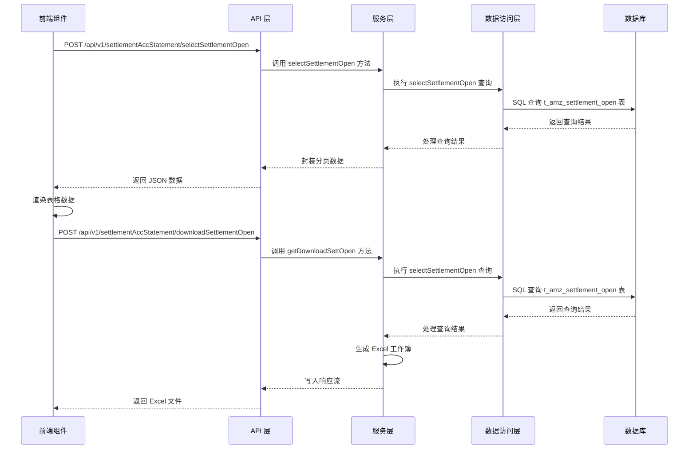

# 账期末结算模块功能解析文档

## 1. 模块概述

账期末结算模块是 Wimoor ERP 系统中用于管理亚马逊平台未结算订单费用的功能模块。该模块提供了未结算费用的查询、筛选和导出功能，帮助用户及时了解平台费用情况，为财务决策提供数据支持。

## 2. 技术架构

### 2.1 前端技术栈

- **框架**：Vue 3 + Composition API
- **UI 组件库**：Element Plus
- **HTTP 客户端**：Axios
- **工具库**：日期格式化工具

### 2.2 后端技术栈

- **框架**：Spring Boot 2.x
- **ORM**：MyBatis-Plus
- **数据库**：MySQL
- **Excel 导出**：SXSSFWorkbook

### 2.3 架构流程图



## 3. 核心功能实现

### 3.1 前端实现

#### 3.1.1 组件结构

**文件路径**：`wimoor-ui/src/views/amazon/report/open/index.vue`

- **模板结构**：包含筛选区域和数据表格
- **筛选区域**：店铺分组选择器、日期选择器、导出按钮
- **数据表格**：展示未结算费用明细，支持排序和分页

#### 3.1.2 核心代码分析

```vue
<template>
  <div class="main-sty">
    <div class="con-header">
      <el-row>
        <el-space>
          <Group @change="groupChange" defaultValue="only"></Group>
          <Datepicker ref="datepickers" :shortIndex="2" @changedate="changedate" />
        </el-space>
        <div class='rt-btn-group' style="margin-bottom:10px;">
          <el-button style="float:right;" :loading="downloading" @click="downloadList">导出</el-button>  
        </div>
      </el-row>
      <GlobalTable ref="globalTable"
        :tableData="tableData" height="calc(100vh - 270px)" 
        :defaultSort="{ prop: 'posted_date', order: 'descending' }" @loadTable="loadTableData" :stripe="true"  
        style="width: 100%;margin-bottom:16px;">
        <!-- 表格列定义 -->
      </GlobalTable>
    </div>
  </div>
</template>
```

**关键方法**：

- `changedate(dates)`：处理日期选择变化，更新查询参数并触发数据加载
- `groupChange(obj)`：处理店铺分组变化，更新查询参数并触发数据加载
- `loadTableData(params)`：加载表格数据，调用后端 API 获取未结算费用数据
- `downloadList()`：导出未结算费用报表，调用后端 API 生成并下载 Excel 文件

#### 3.1.3 API 调用

**文件路径**：`wimoor-ui/src/api/amazon/finances/settlementSkuRptApi.js`

```javascript
function selectSettlementOpen(data){
    return request.post("/amazon/api/v1/settlementAccStatement/selectSettlementOpen",data)
}

function downloadSettlementOpen(data,callback){
    return request({
        url:"/amazon/api/v1/settlementAccStatement/downloadSettlementOpen",
        responseType:"blob",
        data:data,
        method:'post'
    }).then(res => {
        downloadhandler.downloadSuccess(res,"AmzSettementsOpenReport.xlsx");
        if(callback){
            callback();
        }
    }).catch(e=>{
        downloadhandler.downloadFail(e);
        if(callback){
            callback(e);
        }
    });
}
```

### 3.2 后端实现

#### 3.2.1 控制器

**文件路径**：`wimoor-amazon/amazon-boot/src/main/java/com/wimoor/amazon/finances/controller/AmzSettlementAccStatementController.java`

**核心方法**：

- `selectSettlementOpenAction(AmzSettlementDTO dto)`：处理未结算费用查询请求，返回分页数据
- `downloadSettlementOpen(AmzSettlementDTO dto, HttpServletResponse response)`：处理导出请求，生成并下载 Excel 报表

#### 3.2.2 服务层

**文件路径**：`wimoor-amazon/amazon-boot/src/main/java/com/wimoor/amazon/finances/service/impl/AmzSettlementAccStatementImpl.java`

**核心方法**：

- `selectSettlementOpen(AmzSettlementDTO dto, String shopid)`：查询未结算费用数据，返回分页结果
- `getDownloadSettOpen(SXSSFWorkbook workbook, Map<String, Object> map)`：生成 Excel 报表，写入工作簿

#### 3.2.3 数据访问层

**文件路径**：`wimoor-amazon/amazon-boot/src/main/resources/mapper/finances/AmzSettlementAccStatementMapper.xml`

**核心 SQL**：

```xml
<select id="selectSettlementOpen" resultType="java.util.Map" parameterType="java.util.Map">
  SELECT f.financial_event_group_start,
  i.name pname,
  i.`asin`,
  m.name mname,
  de.cname ftypename,
  IFNULL(p.location,p.url) image,
 t.posted_date,t.amazon_order_id,t.marketplace_name,t.event_type,t.sku,ftype,t.currency,t.amount,t.quantity 
 FROM t_amz_settlement_open t 
LEFT join t_amz_fin_account f ON f.amazonAuthid=t.amazonauthid AND f.groupid=t.group_id
LEFT JOIN t_marketplace m ON m.point_name=t.marketplace_name
LEFT JOIN t_amazon_auth a ON a.id=t.amazonauthid
LEFT JOIN t_product_info i ON i.marketplaceid=m.marketplaceId AND i.amazonAuthId=t.amazonauthid AND i.sku=t.sku
LEFT JOIN t_picture p ON p.id=i.image
LEFT JOIN t_amz_settlement_amount_description de ON de.ename=t.ftype
 WHERE a.shop_id=#{param.shopid,jdbcType=CHAR}
  and f.processing_status='Open'
   <if test="param.groupid!=null and param.groupid!=''">
    and a.groupid=#{param.groupid,jdbcType=CHAR}
   </if>
   <if test="param.marketplaceid!=null and param.marketplaceid!=''">
    and m.marketplaceid=#{param.marketplaceid,jdbcType=CHAR}
   </if>
    <if test="param.authid!=null and param.authid!=''">
    and a.id=#{param.authid,jdbcType=CHAR}
   </if>
    <if test="param.endDate!=null and param.endDate!=''">
    and t.posted_date>=#{param.startDate,jdbcType=CHAR}
    and t.posted_date<=#{param.endDate,jdbcType=CHAR}
   </if>
</select>
```

## 4. 数据模型

### 4.1 核心数据表

| 表名 | 说明 | 主要字段 |
|------|------|----------|
| t_amz_settlement_open | 未结算费用表 | id, amazonauthid, group_id, sku, asin, posted_date, amazon_order_id, event_type, ftype, currency, amount, quantity |
| t_amz_fin_account | 财务账户表 | id, amazonAuthid, groupid, financial_event_group_start, processing_status |
| t_marketplace | 市场信息表 | marketplaceId, name, point_name, currency |
| t_amazon_auth | 亚马逊授权表 | id, shop_id, groupid, marketplaceid |
| t_product_info | 产品信息表 | id, amazonAuthId, marketplaceid, sku, asin, name, image |
| t_amz_settlement_amount_description | 费用类型描述表 | ename, cname |

### 4.2 数据传输对象

**文件路径**：`wimoor-amazon/amazon-boot/src/main/java/com/wimoor/amazon/finances/pojo/dto/AmzSettlementDTO.java`

**主要字段**：
- fromDate：开始日期
- endDate：结束日期
- groupid：店铺分组ID
- marketplaceid：市场ID
- amazonAuthId：亚马逊授权ID
- search：搜索关键词

## 5. 功能流程

### 5.1 数据查询流程

1. 前端用户设置筛选条件（日期范围、店铺分组）
2. 前端调用 `selectSettlementOpen` API 发送查询请求
3. 后端控制器接收请求并调用服务层方法
4. 服务层构建查询参数并调用 Mapper 执行 SQL 查询
5. Mapper 从数据库查询未结算费用数据
6. 服务层处理查询结果并封装为分页数据
7. 控制器返回 JSON 格式的分页数据
8. 前端接收数据并渲染到表格中

### 5.2 导出流程

1. 前端用户点击 "导出" 按钮
2. 前端调用 `downloadSettlementOpen` API 发送导出请求
3. 后端控制器接收请求并调用服务层方法
4. 服务层查询未结算费用数据
5. 服务层使用 SXSSFWorkbook 生成 Excel 工作簿
6. 控制器将工作簿写入响应流
7. 前端接收 Excel 文件并下载

## 6. 性能优化

### 6.1 前端优化

- **分页查询**：使用分页加载数据，避免一次性加载大量数据
- **懒加载**：仅在需要时加载数据，减少初始加载时间
- **防抖处理**：对筛选条件变化进行防抖处理，避免频繁请求

### 6.2 后端优化

- **SQL 优化**：使用索引和合理的 SQL 语句，提高查询效率
- **批量处理**：使用 SXSSFWorkbook 处理大量数据导出，避免内存溢出
- **缓存机制**：对频繁查询的数据进行缓存，减少数据库访问

## 7. 安全措施

### 7.1 前端安全

- **输入验证**：对用户输入进行验证，防止恶意输入
- **XSS 防护**：对数据进行转义，防止跨站脚本攻击
- **CSRF 防护**：使用 token 验证，防止跨站请求伪造

### 7.2 后端安全

- **权限控制**：基于用户角色和权限进行访问控制
- **SQL 注入防护**：使用参数化查询，防止 SQL 注入攻击
- **数据加密**：对敏感数据进行加密存储
- **请求验证**：对请求参数进行验证，确保数据合法性

## 8. 扩展点

### 8.1 功能扩展

- **支持更多筛选条件**：如按费用类型、事件类型等进行筛选
- **增加数据可视化**：添加图表展示未结算费用趋势
- **支持更多导出格式**：如 CSV、PDF 等格式

### 8.2 技术扩展

- **引入缓存**：使用 Redis 缓存热点数据，提高查询性能
- **异步处理**：对于大量数据导出，使用异步任务处理
- **微服务化**：将结算功能拆分为独立的微服务，提高系统可维护性

## 9. 代码优化建议

### 9.1 前端优化建议

1. **代码结构优化**：将 API 调用封装为独立的服务，提高代码可维护性
2. **状态管理优化**：使用 Pinia 或 Vuex 管理复杂状态，提高代码可扩展性
3. **性能优化**：使用虚拟滚动处理大量数据，提高表格渲染性能

### 9.2 后端优化建议

1. **SQL 优化**：为 `t_amz_settlement_open` 表的关键字段添加索引，提高查询效率
2. **代码结构优化**：将业务逻辑进一步分层，提高代码可维护性
3. **异常处理优化**：完善异常处理机制，提高系统稳定性
4. **日志优化**：添加详细的日志记录，便于问题排查

## 10. 总结

账期末结算模块是 Wimoor ERP 系统中一个重要的财务功能模块，通过前后端技术的紧密配合，实现了未结算费用的查询、筛选和导出功能。该模块采用了现代的技术栈和架构设计，具有良好的性能和可扩展性。

通过本模块，用户可以实时了解亚马逊平台的未结算费用情况，为财务决策提供及时、准确的数据支持。同时，该模块的设计也为后续的功能扩展和技术升级奠定了良好的基础。

---

**技术要点**：
- 前端使用 Vue 3 Composition API 实现响应式数据管理
- 后端使用 Spring Boot + MyBatis-Plus 构建 RESTful API
- 使用 SXSSFWorkbook 处理大数据量 Excel 导出
- 采用分层架构设计，提高代码可维护性
- 实现了完整的权限控制和安全防护机制

**功能亮点**：
- 支持多维度筛选，满足不同场景的查询需求
- 提供 Excel 导出功能，方便数据离线分析
- 响应式设计，适配不同屏幕尺寸
- 高性能数据处理，支持大量数据的快速加载

**应用价值**：
- 帮助用户及时了解平台费用情况，优化财务决策
- 提高财务管理效率，减少人工操作
- 为财务分析提供准确、完整的数据支持
- 增强系统的整体财务管理能力