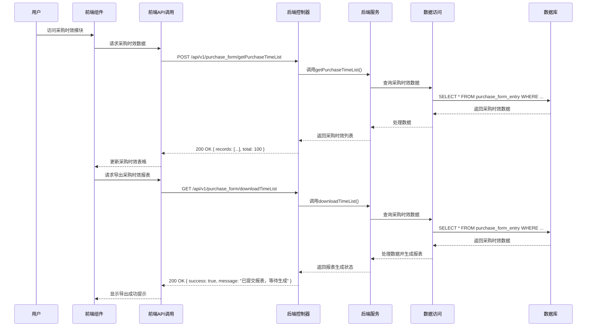

# 采购时效模块功能解析文档

## 1. 系统架构

### 1.1 技术栈

| 分类 | 技术 | 版本 | 说明 |
|------|------|------|------|
| 前端框架 | Vue.js | 3.x | 采用Composition API开发模式 |
| UI组件库 | Element Plus | 最新版 | 提供丰富的UI组件支持 |
| 图标库 | Element Plus Icons | 最新版 | 提供丰富的图标资源 |
| HTTP客户端 | Axios | 0.27.2 | 用于前端与后端API通信 |
| 后端框架 | Spring Boot | 2.5.x | 提供RESTful API服务 |
| 持久层框架 | MyBatis Plus | 3.5.x | 简化数据库操作 |
| 数据库 | MySQL | 5.7+ | 存储采购时效数据和相关信息 |
| 缓存 | Redis | 6.0+ | 提高数据查询性能 |
| 安全框架 | Spring Security | 5.5.x | 提供安全认证和授权 |

### 1.2 架构设计

采购时效模块采用前后端分离的架构设计，具体架构层次如下：

1. **前端层**：
   - 视图层：Vue组件，负责数据展示和用户交互
   - 业务逻辑层：Vue组合式API，处理前端业务逻辑
   - API调用层：封装的API请求函数，与后端通信

2. **后端层**：
   - 控制层：Spring MVC控制器，处理HTTP请求
   - 服务层：业务逻辑服务，处理核心业务逻辑
   - 数据访问层：MyBatis Plus Mapper，与数据库交互

3. **数据层**：
   - 数据库：存储采购时效数据、采购订单数据、库存数据等
   - 缓存：Redis缓存，提高数据查询性能

### 1.3 核心流程图



## 2. 前端实现

### 2.1 组件结构

| 组件名称 | 文件路径 | 主要功能 | 核心方法 |
|---------|---------|----------|----------|
| 主组件 | `wimoor-ui/src/views/erp/purchase/report/time/index.vue` | 采购时效模块主界面 | `loadTableData()`, `handleQuery()`, `generateReport()` |
| 日期选择器组件 | `wimoor-ui/src/components/header/datepicker.vue` | 日期范围选择 | - |
| 仓库选择器组件 | `wimoor-ui/src/components/header/warehouse.vue` | 仓库选择 | - |
| 下载对话框组件 | `wimoor-ui/src/views/erp/components/download_dialog.vue` | 报表下载管理 | - |

### 2.2 核心功能实现

#### 2.2.1 采购时效数据展示

**实现原理**：
- 前端通过API调用获取采购时效数据
- 使用Element Plus的Table组件展示采购时效数据
- 支持分页、排序、筛选等功能
- 实现详细信息的鼠标悬停提示

**关键代码**：
```javascript
function loadTableData(params){
    purchaselistApi.getPurchaseTimeList(params).then((res)=>{
        if(res&&res.data&&res.data.records){
            res.data.records.forEach(row=>{
                if(row.mainsku){
                    row.mainsku="<div>"+row.mainsku.replaceAll(",","</div><div>")+"</div>";
                }
                if(row.changestr){
                    row.changehtml="<el-space><div>"+row.changestr.replaceAll(";","</div><div>")+"</div></el-space>";
                }
                if(row.changeInv){
                    row.changeInv="<div>"+row.changeInv.replaceAll(";","</div><div>")+"</div>";
                }
                row.skuassqty=getTableHtml(row.skuassqty);
                row.skushipqty=getTableHtml(row.skushipqty);
                if(row.changeship){
                    row.changeship.skushipqty=getTableHtml(row.changeship.skushipqty);
                }
                row.mainskuinbound=getTableHtml(row.mainskuinbound);
                row.mainskufulfillable=getTableHtml(row.mainskufulfillable);
                row.mainskuoutbound=getTableHtml(row.mainskuoutbound);
                row.skusubnumber=getTableHtml(row.skusubnumber);
            });
        }
        state.tableData.records = res.data.records;
        state.tableData.total =res.data.total;
    });
}
```

#### 2.2.2 数据筛选功能

**实现原理**：
- 前端通过表单组件收集筛选条件
- 将筛选条件传递给后端API
- 后端根据筛选条件查询数据
- 前端更新表格数据

**关键代码**：
```javascript
function handleQuery(){
    if(state.selectlabel=='sku'){
        state.queryParam.sku=state.searchKeywords;
    }else{
        state.queryParam.msku=state.searchKeywords;
    }
    globalTable.value.loadTable(state.queryParam);
    state.isload=false;
}

function changedate(dates){
    state.queryParam.startDate=dates.start;
    state.queryParam.endDate=dates.end;
    if(state.isload==false){
        handleQuery();
    }
}

function getWarehouse(val){
    state.queryParam.warehouseid=val;
    if(state.isload==false){
        handleQuery();
    }
}
```

#### 2.2.3 报表导出功能

**实现原理**：
- 前端点击导出按钮，触发导出请求
- 后端生成报表并存储
- 前端通过下载对话框下载报表

**关键代码**：
```javascript
function generateReport(){
    state.downLoading=true;
    if(state.selectlabel=='sku'){
        state.queryParam.sku=state.searchKeywords;
    }
    purchaselistApi.downloadTimeList({"sku":state.queryParam.sku,"startDate":state.queryParam.startDate,
    "endDate":state.queryParam.endDate,"warehouseid":state.queryParam.warehouseid}).then(res=>{
        state.downLoading=false;
        ElMessage.success("已提交报表，等待生成");
        downloadDialogRef.value.show();
    });
}

function downloadList(){
    downloadDialogRef.value.show();
}
```

### 2.3 API调用

| API名称 | 方法 | URL | 功能描述 | 参数 | 返回值 |
|---------|------|-----|----------|------|--------|
| getPurchaseTimeList | POST | /api/v1/purchase_form/getPurchaseTimeList | 获取采购时效列表 | startDate, endDate, warehouseid, sku | { records: [...], total: 100 } |
| downloadTimeList | GET | /api/v1/purchase_form/downloadTimeList | 导出采购时效报表 | sku, startDate, endDate, warehouseid | { success: true, message: "已提交报表，等待生成" } |

## 3. 后端实现

### 3.1 控制器

| 控制器名称 | 文件路径 | 主要功能 | 核心方法 |
|-----------|---------|----------|----------|
| PurchaseFormController | `wimoor-erp/erp-boot/src/main/java/com/wimoor/erp/purchase/controller/PurchaseFormController.java` | 采购订单控制 | `getPurchaseTimeList()`, `downloadTimeList()` |

**关键代码**：
```java
@PostMapping(value = "getPurchaseTimeList")
public Result<IPage<Map<String, Object>>> getShipTimeListAction(@RequestBody PurchaseTimeDTO dto) {
    UserInfo user = UserInfoContext.get();
    dto.setShopid(user.getCompanyid());
    if(StrUtil.isEmpty(dto.getSku())){
        dto.setSku(null);
    }
    if(StrUtil.isEmpty(dto.getWarehouseid()) || "all".equals(dto.getWarehouseid().toLowerCase())){
        dto.setWarehouseid(null);
    }
    return Result.success(purchaseFormEntryService.getPurchaseTimeList(dto));
}

@GetMapping("/downloadTimeList")
public Result<?> downloadTimeListAction(String sku,String startDate,String endDate,String warehouseid,HttpServletResponse response){
    UserInfo user = UserInfoContext.get();
    new Thread(new Runnable() {
        @Override
        public void run() {
            downloadReportService.addRun(user);
            try {
                PurchaseTimeDTO dto=new PurchaseTimeDTO();
                dto.setShopid(user.getCompanyid());
                dto.setSku(sku);
                dto.setStartDate(startDate);
                dto.setEndDate(endDate);
                dto.setWarehouseid(warehouseid);
                List<Map<String, Object>> list = purchaseFormEntryService.getPurchaseTimeList(dto);
                downloadReportService.downloadPurchaseTimeReport(user, list, sku, startDate, endDate, warehouseid);
            } catch (Exception e) {
                e.printStackTrace();
            } finally {
                downloadReportService.removeRun(user);
            }
        }
    }).start();
    return Result.success("已提交报表，等待生成");
}
```

### 3.2 服务层

| 服务名称 | 文件路径 | 主要功能 | 核心方法 |
|---------|---------|----------|----------|
| IPurchaseFormEntryService | `wimoor-erp/erp-boot/src/main/java/com/wimoor/erp/purchase/service/IPurchaseFormEntryService.java` | 采购订单条目服务 | `getPurchaseTimeList()` |
| PurchaseFormEntryServiceImpl | `wimoor-erp/erp-boot/src/main/java/com/wimoor/erp/purchase/service/impl/PurchaseFormEntryServiceImpl.java` | 采购订单条目服务实现 | `getPurchaseTimeList()`, `handlePurchaseTime()` |

**关键代码**：
```java
@Override
public IPage<Map<String, Object>> getPurchaseTimeList(PurchaseTimeDTO dto) {
    List<Map<String, Object>> list =null;
    if(dto.getSort()!=null&&
            (dto.getSort().equals("sku")
                    ||dto.getSort().equals("name")
                    ||dto.getSort().equals("number")
                    ||dto.getSort().equals("amount")
                    ||dto.getSort().equals("inwaretime")
                    ||dto.getSort().equals("recqty")
                    ||dto.getSort().equals("inbound")
                    ||dto.getSort().equals("outbound")
                    ||dto.getSort().equals("fulfillable")
            )){
        IPage<Map<String, Object>> page = this.baseMapper.getPurchaseTimeList(dto.getPage(), dto);
        if(page!=null&&page.getRecords()!=null){
            list=page.getRecords();
            handlePurchaseTime(dto,list);
            return page;
        }
    }
    if(list==null){
        list=this.baseMapper.getPurchaseTimeList(dto);
        handlePurchaseTime(dto,list);
        return dto.getListPage(list);
    }
    return null;
}

public List<Map<String, Object>> handlePurchaseTime(PurchaseTimeDTO dto,List<Map<String, Object>> list) {
    for(Map<String,Object> item:list){
        Date inwaretime = GeneralUtil.getDate(item.get("inwaretime"));
        String mainmid=item.get("mainmid")==null?"":item.get("mainmid").toString();
        String mainimage=item.get("mainimage")==null?"":item.get("mainimage").toString();
        String mainname=item.get("mainname")==null?"":item.get("mainname").toString();
        String mainsku=item.get("mainsku")==null?"":item.get("mainsku").toString();
        String sku=item.get("sku")==null?"":item.get("sku").toString();
        Map<String,Object> changeentry=null;
        if(inwaretime!=null){
            item.put("shopid",dto.getShopid());
            Map<String,Object> subparam=new HashMap<String,Object>();
            subparam.put("materialid",item.get("materialid").toString());
            subparam.put("shopid",item.get("shopid").toString());
            subparam.put("inwaretime",GeneralUtil.formatDate(inwaretime));
            Set<String> materialidSet=new TreeSet<String>();
            materialidSet.add(item.get("materialid").toString());
            Map<String, Object> assmap = assemblyEntryInstockMapper.getAssInstockBySub(subparam);
            if(assmap!=null){
                item.putAll(assmap);
                if(assmap.get("mainsku")!=null&&mainsku!=null){
                    String m_mainsku=assmap.get("mainsku").toString();
                    if(m_mainsku.equals(mainsku)){
                        item.put("mainsku",assmap.get("mainsku"));
                    }else{
                        Set<String> skuset=new TreeSet<String>();
                        skuset.addAll(Arrays.asList(m_mainsku.split(",")));
                        skuset.addAll(Arrays.asList(mainsku.split(",")));
                        item.put("mainsku", StrUtil.join(",",skuset));
                    }
                    materialidSet.addAll(Arrays.asList(assmap.get("mainmid").toString().split(",")));
                }
                subparam.put("midlist",materialidSet);
            }
            changeentry=iChangeWhFormEntryService.getByFromMaterial(subparam);
            Map<String, Object> stocking = stockTakingItemMapper.getStockingItem(subparam);
            Integer chamount=changeentry==null||changeentry.get("changeAmount")==null?0:Integer.parseInt(changeentry.get("changeAmount").toString());
            if(changeentry!=null&&changeentry.size()>0){
                String changestr=changeentry.get("changeitem").toString();
                String[] changeform=changestr.split(";\");
                for(int i=0;i<changeform.length;i++){
                    String changeformitem=changeform[i];
                    if(StrUtil.isNotBlank(changeformitem)){
                        String[] changeitem=changeformitem.split("->");
                        if(changeitem.length>0){
                            if(changeitem[0].equals(item.get("materialid"))){
                                Map<String,Object> subparam2=new HashMap<String,Object>();
                                subparam2.put("materialid",changeitem[1]);
                                subparam2.put("shopid",item.get("shopid").toString());
                                subparam2.put("inwaretime",GeneralUtil.formatDate(inwaretime));
                                Map<String, Object> assmap2 = assemblyEntryInstockMapper.getAssInstockBySub(subparam2);
                                if(assmap2!=null) {
                                    if (assmap2.get("mainsku") != null && mainsku != null) {
                                        String m_mainsku = assmap2.get("mainsku").toString();
                                        if (m_mainsku.equals(mainsku)) {
                                            item.put("changeskus",(item.get("changeskus")!=null? item.get("changeskus").toString() + ",":"" ) + assmap2.get("mainsku"));
                                        } else {
                                            Set<String> skuset = new TreeSet<String>();
                                            skuset.addAll(Arrays.asList(m_mainsku.split(",")));
                                            item.put("changeskus",(item.get("changeskus")!=null? item.get("changeskus").toString() + ",":"" ) + StrUtil.join(",", skuset));
                                        }
                                    }
                                }
                            }
                        }
                    }
                }
                item.putAll(changeentry);
            }
            if(stocking!=null){
                item.putAll(stocking);
                chamount=chamount+(stocking.get("lossamount")==null?0:Integer.parseInt(stocking.get("lossamount").toString()));
            }
            Map<String,Object> param=new HashMap<String,Object>();
            param.put("inwaretime",GeneralUtil.formatDate(inwaretime));
            param.put("msku",sku+(item.get("mainsku")!=null?","+item.get("mainsku").toString():""));
            param.put("shipmentids",null);
            param.put("shopid",dto.getShopid());
            Map<String, Object> map = amazonClientOneFeignManager.getLastShipmentQty(param);
            if(map!=null){
                item.putAll(map);
            }
        }
    }
    return list;
}
```

### 3.2 数据模型

| 模型名称 | 文件路径 | 主要功能 | 核心字段 |
|---------|---------|----------|----------|
| PurchaseTimeDTO | `wimoor-erp/erp-boot/src/main/java/com/wimoor/erp/purchase/pojo/dto/PurchaseTimeDTO.java` | 采购时效数据传输对象 | sku, shopid, warehouseid, startDate, endDate |
| PurchaseFormEntry | `wimoor-erp/erp-boot/src/main/java/com/wimoor/erp/purchase/pojo/entity/PurchaseFormEntry.java` | 采购订单条目 | id, formid, materialid, amount, price, recqty, inwaretime |
| PurchaseForm | `wimoor-erp/erp-boot/src/main/java/com/wimoor/erp/purchase/pojo/entity/PurchaseForm.java` | 采购订单 | id, number, warehouseid, createdate, audittime |

### 3.3 数据访问

| Mapper名称 | 文件路径 | 主要功能 | 核心方法 |
|-----------|---------|----------|----------|
| PurchaseFormEntryMapper | `wimoor-erp/erp-boot/src/main/java/com/wimoor/erp/purchase/mapper/PurchaseFormEntryMapper.java` | 采购订单条目映射 | `getPurchaseTimeList()` |

**关键代码**：
```java
IPage<Map<String, Object>> getPurchaseTimeList(Page<?> page, @Param("param")PurchaseTimeDTO dto);
List<Map<String, Object>> getPurchaseTimeList( @Param("param") PurchaseTimeDTO dto);
```

## 4. 核心功能分析

### 4.1 采购时效分析

**功能说明**：
- 分析从下单到入库的全过程时效
- 展示下单时间、审核时间、入库时间等关键节点
- 计算总时效天数

**技术实现**：
- 前端通过API调用获取采购时效数据
- 后端通过数据库查询和计算生成时效数据
- 使用Element Plus的Tooltip组件展示详细时效节点

**业务价值**：
- 识别采购流程中的瓶颈环节
- 评估采购效率，为流程优化提供依据
- 监控采购时效变化趋势

### 4.2 数据筛选

**功能说明**：
- 按日期范围筛选采购时效数据
- 按仓库筛选采购时效数据
- 按SKU筛选采购时效数据

**技术实现**：
- 前端使用Element Plus的DatePicker、Select、Input组件实现筛选
- 后端根据筛选条件构建SQL查询
- 支持多条件组合筛选

**业务价值**：
- 快速定位特定条件下的采购时效数据
- 便于进行针对性分析
- 提高数据查询效率

### 4.3 库存状态分析

**功能说明**：
- 分析采购物品的库存状态
- 展示可用库存、待入库、待出库等信息
- 分析主SKU的库存状态（如果是组装件）

**技术实现**：
- 前端通过鼠标悬停查看详细库存状态
- 后端通过多表关联查询获取库存数据
- 支持库存状态的多维度展示

**业务价值**：
- 全面了解采购物品的库存情况
- 优化库存管理策略
- 避免库存积压和断货风险

### 4.4 报表导出

**功能说明**：
- 导出采购时效报表
- 支持Excel格式导出
- 包含完整的采购时效数据

**技术实现**：
- 前端触发导出请求，显示导出状态
- 后端异步生成报表，存储到服务器
- 前端通过下载对话框下载报表

**业务价值**：
- 方便离线分析采购时效数据
- 支持数据存档和备份
- 便于与其他系统集成

### 4.5 多维数据展示

**功能说明**：
- 展示收货、换货、出库等相关数据
- 展示组装消耗、发货消耗等数据
- 支持数据的多维度分析

**技术实现**：
- 前端使用Element Plus的Table、Tooltip组件展示数据
- 后端通过多表关联查询获取相关数据
- 支持数据的实时计算和展示

**业务价值**：
- 全面了解采购物品的流向
- 分析采购对库存的影响
- 为采购决策提供多维度参考

## 5. 技术亮点

### 5.1 高效的数据查询

**技术实现**：
- 使用MyBatis Plus的分页查询功能，提高大数据量查询效率
- 优化SQL查询语句，减少数据库负担
- 支持多种排序方式，提高数据查询灵活性

**优势**：
- 快速响应大规模数据查询
- 减少系统资源消耗
- 提高用户体验

### 5.2 丰富的数据展示

**技术实现**：
- 使用Element Plus的Table组件实现灵活的数据展示
- 使用Tooltip组件展示详细信息，减少界面复杂度
- 支持HTML格式的富文本展示，提高数据可读性

**优势**：
- 信息展示清晰、直观
- 用户操作便捷
- 数据可视化效果好

### 5.3 异步报表生成

**技术实现**：
- 使用多线程异步生成报表，避免阻塞主线程
- 报表生成状态实时反馈给用户
- 支持大规模数据的报表生成

**优势**：
- 提高系统响应速度
- 支持处理大数据量报表
- 提升用户体验

### 5.4 多维度数据整合

**技术实现**：
- 整合采购、库存、组装、发货等多维度数据
- 构建完整的数据关联体系
- 支持数据的交叉分析

**优势**：
- 提供全面的数据视角
- 支持深度数据分析
- 为决策提供充分依据

## 6. 数据安全

### 6.1 权限控制

**实现方案**：
- 基于Spring Security的权限控制体系
- 实现基于用户角色的访问控制
- 对敏感操作进行权限验证

**安全措施**：
- 验证用户身份和权限
- 限制数据访问范围
- 记录关键操作日志

### 6.2 数据保护

**实现方案**：
- 使用HTTPS协议传输数据
- 对敏感数据进行加密存储
- 实现数据访问审计

**安全措施**：
- 防止数据传输过程中的窃听和篡改
- 保护敏感信息不被未授权访问
- 确保数据的完整性和可靠性

### 6.3 合规性

**实现方案**：
- 遵守相关法律法规和行业标准
- 实现数据隐私保护
- 确保数据处理的合法性

**合规措施**：
- 定期进行安全审计和合规检查
- 建立数据处理规范和流程
- 确保系统符合相关法规要求

## 7. 扩展性分析

### 7.1 功能扩展

**潜在扩展点**：
- 增加供应商绩效分析功能，基于时效数据评估供应商
- 增加采购预测功能，基于历史时效数据预测未来采购需求
- 增加采购成本分析功能，结合时效数据分析采购成本
- 增加采购流程优化建议功能，基于时效数据提供流程改进建议

**扩展方案**：
- 模块化设计：采用模块化架构，便于功能扩展
- API标准化：提供标准化的API接口，便于与其他系统集成
- 插件机制：支持通过插件方式增加新功能

### 7.2 技术扩展

**潜在扩展点**：
- 增加实时数据处理能力：使用流处理技术处理实时采购数据
- 增加机器学习能力：使用机器学习算法进行采购预测和优化
- 增加大数据分析能力：使用大数据技术处理和分析海量采购数据
- 增加移动应用：开发移动应用，方便随时随地查看采购时效数据

**扩展方案**：
- 微服务架构：将核心功能拆分为微服务，便于独立扩展
- 容器化部署：使用Docker容器化部署，提高部署灵活性
- 云原生架构：采用云原生技术，提高系统的可扩展性和可靠性

### 7.3 集成扩展

**潜在扩展点**：
- 与供应商管理系统的集成：实现供应商信息的自动同步
- 与ERP系统的集成：实现采购数据与ERP系统的无缝对接
- 与财务系统的集成：实现采购成本的自动核算
- 与供应链系统的集成：实现供应链全流程的可视化管理

**扩展方案**：
- 统一API接口：提供标准化的API接口，便于与其他系统集成
- 消息队列：使用消息队列实现系统间的异步通信
- Webhooks：支持通过Webhooks与第三方系统集成

## 8. 代码优化建议

### 8.1 前端优化

**优化建议**：
1. **组件拆分**：将大型组件拆分为更小的、可复用的组件，提高代码可维护性
2. **状态管理优化**：合理使用Vue的响应式系统，减少不必要的状态更新
3. **性能优化**：
   - 使用虚拟滚动处理大量数据列表
   - 优化图表渲染，减少不必要的重绘
   - 使用防抖和节流优化频繁触发的事件处理函数
   - 实现数据的懒加载，减少初始加载时间
4. **代码规范**：
   - 统一代码风格，使用ESLint进行代码检查
   - 添加必要的注释，提高代码可读性
   - 遵循Vue最佳实践，如使用computed属性缓存计算结果
5. **用户体验优化**：
   - 添加加载状态和错误提示，提高用户体验
   - 实现数据的批量操作，提高操作效率
   - 优化表单验证，提供清晰的错误提示

**具体实现**：
```javascript
// 优化前：频繁触发的事件处理函数
function handleQuery() {
    purchaselistApi.getPurchaseTimeList(queryParams).then(res => {
        tableData.records = res.data.records;
        tableData.total = res.data.total;
    });
}

// 优化后：使用防抖函数
import { debounce } from 'lodash-es';

const handleQuery = debounce(() => {
    purchaselistApi.getPurchaseTimeList(queryParams).then(res => {
        tableData.records = res.data.records;
        tableData.total = res.data.total;
    });
}, 300);

// 优化前：直接操作DOM
function getTableHtml(value) {
    if(value){
        value=value.replaceAll(",","<br/>");
        return value;
    }else{
        return value;
    }
}

// 优化后：使用Vue的响应式数据和计算属性
const processedData = computed(() => {
    return tableData.records.map(item => {
        if(item.mainsku){
            item.mainsku="<div>"+item.mainsku.replaceAll(",","</div><div>")+"</div>";
        }
        // 其他处理...
        return item;
    });
});
```

### 8.2 后端优化

**优化建议**：
1. **数据库优化**：
   - 为频繁查询的字段添加索引，提高查询效率
   - 优化SQL查询，减少不必要的字段查询和表连接
   - 使用分页查询处理大量数据，减少内存占用
   - 实现数据库读写分离，提高并发处理能力
2. **缓存优化**：
   - 对频繁查询的数据使用Redis缓存，减少数据库压力
   - 合理设置缓存过期时间，确保数据的及时性
   - 实现缓存预热机制，提高系统启动速度
   - 实现缓存穿透、缓存击穿、缓存雪崩的防护
3. **代码优化**：
   - 减少重复代码，提取公共方法和工具类
   - 使用Lambda表达式和Stream API简化代码
   - 添加必要的注释和文档，提高代码可读性
   - 实现异常的统一处理，提高系统稳定性
4. **性能监控**：
   - 添加性能监控点，监控关键操作的执行时间
   - 定期分析性能瓶颈，进行针对性优化
   - 实现系统的健康检查，及时发现系统异常
5. **并发处理**：
   - 优化并发处理，提高系统的并发能力
   - 使用线程池管理线程，减少线程创建和销毁的开销
   - 实现请求的限流和降级，保护系统稳定性

**具体实现**：
```java
// 优化前：重复的参数处理代码
@PostMapping(value = "getPurchaseTimeList")
public Result<IPage<Map<String, Object>>> getShipTimeListAction(@RequestBody PurchaseTimeDTO dto) {
    UserInfo user = UserInfoContext.get();
    dto.setShopid(user.getCompanyid());
    if(StrUtil.isEmpty(dto.getSku())){
        dto.setSku(null);
    }
    if(StrUtil.isEmpty(dto.getWarehouseid()) || "all".equals(dto.getWarehouseid().toLowerCase())){
        dto.setWarehouseid(null);
    }
    return Result.success(purchaseFormEntryService.getPurchaseTimeList(dto));
}

// 优化后：提取公共方法
@PostMapping(value = "getPurchaseTimeList")
public Result<IPage<Map<String, Object>>> getShipTimeListAction(@RequestBody PurchaseTimeDTO dto) {
    UserInfo user = UserInfoContext.get();
    dto.setShopid(user.getCompanyid());
    validateAndProcessParams(dto);
    return Result.success(purchaseFormEntryService.getPurchaseTimeList(dto));
}

private void validateAndProcessParams(PurchaseTimeDTO dto) {
    if(StrUtil.isEmpty(dto.getSku())){
        dto.setSku(null);
    }
    if(StrUtil.isEmpty(dto.getWarehouseid()) || "all".equals(dto.getWarehouseid().toLowerCase())){
        dto.setWarehouseid(null);
    }
}

// 优化前：同步处理报表生成
@GetMapping("/downloadTimeList")
public Result<?> downloadTimeListAction(String sku,String startDate,String endDate,String warehouseid,HttpServletResponse response){
    UserInfo user = UserInfoContext.get();
    // 同步处理报表生成
    PurchaseTimeDTO dto=new PurchaseTimeDTO();
    dto.setShopid(user.getCompanyid());
    dto.setSku(sku);
    dto.setStartDate(startDate);
    dto.setEndDate(endDate);
    dto.setWarehouseid(warehouseid);
    List<Map<String, Object>> list = purchaseFormEntryService.getPurchaseTimeList(dto);
    downloadReportService.downloadPurchaseTimeReport(user, list, sku, startDate, endDate, warehouseid);
    return Result.success("报表生成成功");
}

// 优化后：异步处理报表生成
@GetMapping("/downloadTimeList")
public Result<?> downloadTimeListAction(String sku,String startDate,String endDate,String warehouseid,HttpServletResponse response){
    UserInfo user = UserInfoContext.get();
    // 异步处理报表生成
    CompletableFuture.runAsync(() -> {
        downloadReportService.addRun(user);
        try {
            PurchaseTimeDTO dto=new PurchaseTimeDTO();
            dto.setShopid(user.getCompanyid());
            dto.setSku(sku);
            dto.setStartDate(startDate);
            dto.setEndDate(endDate);
            dto.setWarehouseid(warehouseid);
            List<Map<String, Object>> list = purchaseFormEntryService.getPurchaseTimeList(dto);
            downloadReportService.downloadPurchaseTimeReport(user, list, sku, startDate, endDate, warehouseid);
        } catch (Exception e) {
            e.printStackTrace();
        } finally {
            downloadReportService.removeRun(user);
        }
    }, executorService);
    return Result.success("已提交报表，等待生成");
}
```

### 8.3 数据处理优化

**优化建议**：
1. **批量处理**：
   - 对大量数据的操作使用批量处理，减少数据库交互次数
   - 实现数据的批量导入导出，提高数据处理效率
   - 使用分页查询和批量更新，减少内存占用
2. **异步处理**：
   - 对耗时的数据计算任务采用异步处理，提高系统响应速度
   - 使用消息队列处理异步任务，提高系统的可靠性
   - 实现任务的优先级和重试机制，确保任务的执行
3. **数据压缩**：
   - 对传输的数据进行压缩，减少网络传输量
   - 使用JSON格式传输数据，减少数据大小
   - 实现数据的增量同步，减少数据传输量
4. **预计算**：
   - 对常用统计数据进行预计算，减少实时计算压力
   - 使用定时任务定期计算统计数据，提高查询效率
   - 实现数据的实时预计算，确保数据的及时性

**具体实现**：
```java
// 优化前：逐条处理数据
public List<Map<String, Object>> handlePurchaseTime(PurchaseTimeDTO dto, List<Map<String, Object>> list) {
    for(Map<String,Object> item:list){
        // 处理单个数据项
    }
    return list;
}

// 优化后：批量处理数据
public List<Map<String, Object>> handlePurchaseTime(PurchaseTimeDTO dto, List<Map<String, Object>> list) {
    // 批量获取需要的数据
    Set<String> materialIds = new HashSet<>();
    for(Map<String,Object> item:list){
        if(item.get("materialid") != null){
            materialIds.add(item.get("materialid").toString());
        }
    }
    
    // 批量查询相关数据
    Map<String, Object> relatedData = batchGetRelatedData(materialIds, dto);
    
    // 批量处理数据
    for(Map<String,Object> item:list){
        // 使用批量查询的数据处理
        processItem(item, relatedData);
    }
    
    return list;
}

// 批量获取相关数据
private Map<String, Object> batchGetRelatedData(Set<String> materialIds, PurchaseTimeDTO dto) {
    Map<String, Object> result = new HashMap<>();
    // 批量查询组装数据
    // 批量查询库存数据
    // 批量查询发货数据
    return result;
}
```

## 9. 总结

### 9.1 核心价值

采购时效模块是Wimoor系统中功能强大、数据全面的采购管理工具，具有以下核心价值：

1. **提高采购效率**：通过时效分析，识别并改进采购流程中的瓶颈环节，提高采购效率
2. **优化库存管理**：基于时效数据制定更准确的采购计划和库存策略，减少库存积压和断货风险
3. **提升供应商管理**：基于时效数据评估和管理供应商，提高供应商的交货及时性
4. **降低采购成本**：通过流程优化和供应商管理，降低采购成本
5. **增强决策能力**：基于数据驱动的决策，提高采购决策的准确性
6. **全面的数据分析**：提供多维度的数据分析，为采购管理提供全面的参考

### 9.2 技术创新

采购时效模块在技术实现上具有以下创新点：

1. **高效的数据查询**：使用MyBatis Plus的分页查询和优化的SQL语句，提高大数据量查询效率
2. **丰富的数据展示**：使用Element Plus的组件和自定义的Tooltip，实现灵活、直观的数据展示
3. **异步报表生成**：使用多线程异步生成报表，提高系统响应速度
4. **多维度数据整合**：整合采购、库存、组装、发货等多维度数据，提供全面的数据视角
5. **前后端分离架构**：采用前后端分离的架构设计，提高开发效率和系统灵活性
6. **微服务集成**：与其他微服务的集成，实现数据的共享和协同

### 9.3 未来发展

采购时效模块具有广阔的发展前景，未来可以从以下几个方面进行发展：

1. **功能增强**：
   - 增加供应商绩效分析功能，基于时效数据评估供应商
   - 增加采购预测功能，基于历史时效数据预测未来采购需求
   - 增加采购成本分析功能，结合时效数据分析采购成本
   - 增加采购流程优化建议功能，基于时效数据提供流程改进建议

2. **技术升级**：
   - 采用微服务架构，提高系统的可扩展性和可靠性
   - 使用容器化技术，提高部署和运维效率
   - 集成更多人工智能技术，如智能采购预测、智能供应商推荐等
   - 实现系统的实时数据处理能力，提高数据的及时性

3. **用户体验优化**：
   - 优化前端界面，提高用户体验
   - 实现移动端适配，方便用户随时随地查看采购时效数据
   - 增加更多个性化功能，满足不同用户的需求
   - 提供更多数据可视化工具，提高数据的可读性

4. **生态建设**：
   - 构建采购管理生态，整合更多第三方服务
   - 提供开放的API接口，方便与其他系统集成
   - 建立采购数据共享平台，促进数据的流通和利用
   - 提供行业数据分析和洞察，帮助用户了解采购趋势

### 9.4 结论

采购时效模块是Wimoor系统中不可或缺的核心功能模块，通过该模块，用户可以全面了解采购流程的时效情况，分析采购效率，优化采购流程，提高供应链管理水平。该模块采用先进的技术架构和实现方案，具有功能强大、数据全面、性能高效、扩展性强等特点，为用户提供了一站式的采购时效管理解决方案。

随着技术的不断发展和业务需求的不断变化，采购时效模块也将不断升级和完善，为用户提供更加智能、全面、高效的采购时效管理服务，帮助用户在激烈的市场竞争中获得更大的优势。