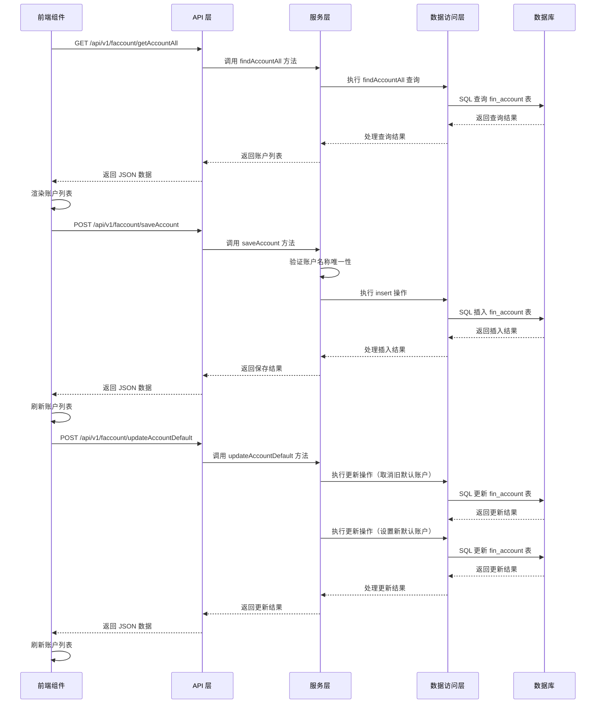

# 采购记账模块功能解析文档

## 1. 模块概述

采购记账模块是 Wimoor ERP 系统中用于管理采购账户资产及收支和结余情况的功能模块。该模块通过前后端技术的紧密配合，实现了账户管理、收支记录、余额查询和数据可视化等功能，为用户提供了直观、高效的采购财务管理工具。

## 2. 技术架构

### 2.1 前端技术栈

- **框架**：Vue 3 + Composition API
- **UI 组件库**：Element Plus
- **图表库**：ECharts（用于数据可视化）
- **HTTP 客户端**：Axios
- **工具库**：日期格式化、数字格式化等

### 2.2 后端技术栈

- **框架**：Spring Boot 2.x
- **ORM**：MyBatis-Plus
- **数据库**：MySQL
- **事务管理**：Spring 事务注解

### 2.3 架构流程图



## 3. 核心功能实现

### 3.1 前端实现

#### 3.1.1 组件结构

**文件路径**：`wimoor-ui/src/views/erp/finance/account/index.vue`

- **主组件**：负责整体布局和账户列表展示
- **子组件**：
  - `lineChart.vue`：展示收支趋势图
  - `pieChart.vue`：展示收支分布图
  - `table.vue`：展示收支明细表
  - `paymethod_index_dialog.vue`：支付方式管理对话框

#### 3.1.2 核心代码分析

```vue
<template>
  <div class="account"> 
    <div class="account-card el-white-bg" ref="leftdiv" :style="{minHeight: leftheight}">
      <h4>我的账户
        <el-button style="float:right;" @click.stop="showDeleteDailog" type="info" link size="mini">查看删除列表</el-button>
      </h4>
      <el-card :class="item.active?'m-t-16 active':'m-t-16' " class="pointer " v-for="item in DataList"  @click="handleActive(item)">
        <!-- 账户卡片内容 -->
      </el-card>
      <el-card @click="handleAdd" class="add-account pointer" shadow="hover">
        <!-- 添加账户按钮 -->
      </el-card>
    </div>
    <div class="account-chart" ref="rightdiv">
      <el-row :gutter="16">
        <el-col :span="16">
          <LineChart ref="lineChartRef"/>
        </el-col>
        <el-col :span="8">
          <PieChart ref="pieChartRef"/>
        </el-col>
      </el-row>
      <el-row>
        <Table  ref="tableRef" @changeData="refreshData"/>
      </el-row>
    </div>
  </div>
  <!-- 账户编辑对话框 -->
  <!-- 已删除账户列表对话框 -->
  <PaymethodIndex ref="paymentIndexRef" @change="loadPaymentMethod();loadMyAccount(true)"></PaymethodIndex>
</template>
```

**关键方法**：

- `loadMyAccount(isInit)`：加载账户列表数据，计算总余额
- `handleActive(item)`：处理账户点击事件，加载该账户的详细数据
- `handleAdd()`：打开添加账户对话框
- `handleConfirm()`：确认添加或编辑账户
- `handleDefault(item)`：设置账户为默认账户
- `handleCancelDefault(item)`：取消账户的默认状态
- `handleDelect(item)`：删除账户
- `recoverItem(row)`：恢复已删除的账户

#### 3.1.3 API 调用

**文件路径**：`wimoor-ui/src/api/erp/finances/faccountApi.js`

```javascript
function getAccountAll(data){
    return request.get('/erp/api/v1/faccount/getAccountAll',{params:data});
}

function saveAccount(data){
    return request.post('/erp/api/v1/faccount/saveAccount',data);
}

function updateAccountName(data){
    return request.post('/erp/api/v1/faccount/updateAccountName',data);
}

function updateAccountDefault(data){
    return request.post('/erp/api/v1/faccount/updateAccountDefault',data);
}

function cancelAccountDefault(data){
    return request.post('/erp/api/v1/faccount/cancelAccountDefault',data);
}

function updateAccountDelete(data){
    return request.post('/erp/api/v1/faccount/updateAccountDelete',data);
}

function recoverAccountDelete(data){
    return request.post('/erp/api/v1/faccount/recoverAccountDelete',data);
}

function findAccountArchiveAll(data){
    return request.get('/erp/api/v1/faccount/findAccountArchiveAll',{params:data});
}

function getPaymentMethod(data){
    return request.get('/erp/api/v1/faccount/getPaymentMethod',{params:data});
}
```

### 3.2 后端实现

#### 3.2.1 控制器

**文件路径**：`wimoor-erp/erp-boot/src/main/java/com/wimoor/erp/finance/controller/FaccountController.java`

**核心方法**：

- `getAccountAllAction()`：获取所有账户列表
- `saveAccountAction(FinAccount fin)`：保存新账户
- `updateAccountNameAction(FinAccount fin)`：更新账户名称
- `updateAccountDeleteAction(FinAccount fin)`：删除账户
- `recoverAccountDisabledAction(FinAccount fin)`：恢复已删除的账户
- `updateAccountDefaultAction(FinAccount fin)`：设置账户为默认账户
- `cancelAccountDefault(FinAccount fin)`：取消账户的默认状态
- `getPaymentMethodAction()`：获取支付方式列表

#### 3.2.2 服务层

**文件路径**：`wimoor-erp/erp-boot/src/main/java/com/wimoor/erp/finance/service/impl/FaccountServiceImpl.java`

**核心方法**：

- `findAccountAll(String shopid)`：查询所有账户
- `findAccountArchiveAll(String shopid)`：查询已删除的账户
- `saveAccount(FinAccount fin)`：保存新账户，验证名称唯一性
- `updateFinAfterChange(FinAccount account, String projectid, Date createtime, BigDecimal amount, String ftype)`：更新账户余额和记账记录
- `updateFinCancelChange(FinAccount account, String projectid, Date createtime, BigDecimal amount, String ftype)`：取消账户余额和记账记录的更新
- `saveFinAccount(FinAccount account, BigDecimal amount, String ftype)`：更新账户余额
- `saveFinDaily(FinAccount account, Date createtime, BigDecimal amount, String ftype)`：保存日账单记录
- `saveFinMonthly(FinAccount account, String projectid, Date createtime, BigDecimal amount, String ftype)`：保存月账单记录

#### 3.2.3 数据访问层

**核心数据表**：

- `fin_account`：账户表，存储账户基本信息和余额
- `fin_journal_daily`：日账单表，存储每日收支记录
- `fin_type_journal_monthly`：月账单表，存储每月收支记录
- `finance_project`：财务项目表，存储收支项目信息
- `purchase_form_payment_method`：支付方式表，存储支付方式信息

## 4. 数据模型

### 4.1 核心数据表

| 表名 | 说明 | 主要字段 |
|------|------|----------|
| fin_account | 账户表 | id, shopid, paymeth, name, balance, isdefault, isdelete, createdate |
| fin_journal_daily | 日账单表 | id, acct, byday, rec, pay, balance |
| fin_type_journal_monthly | 月账单表 | id, acct, year, month, projectid, rec, pay |
| finance_project | 财务项目表 | id, shopid, name, type, status |
| purchase_form_payment_method | 支付方式表 | id, name, shopid, isdefault, status |

### 4.2 数据传输对象

**FinAccount 实体**：
- id：账户ID
- shopid：店铺ID
- paymeth：支付方式ID
- name：账户名称
- balance：账户余额
- isdefault：是否默认账户
- isdelete：是否已删除
- createdate：创建日期
- paymethName：支付方式名称（非数据库字段，用于前端展示）

## 5. 功能流程

### 5.1 账户管理流程

1. **账户列表加载**：
   - 前端调用 `getAccountAll` API
   - 后端查询所有未删除的账户
   - 前端渲染账户列表，计算总余额

2. **添加账户**：
   - 前端填写账户信息并提交
   - 后端验证账户名称唯一性
   - 后端检查是否需要设置为默认账户
   - 后端保存账户信息
   - 前端刷新账户列表

3. **设置默认账户**：
   - 前端选择账户并设置为默认
   - 后端取消该支付方式下所有账户的默认状态
   - 后端设置选中账户为默认账户
   - 前端刷新账户列表

4. **删除账户**：
   - 前端选择账户并删除
   - 后端检查账户余额是否为零
   - 后端标记账户为已删除
   - 前端刷新账户列表

5. **恢复账户**：
   - 前端查看已删除账户列表
   - 前端选择账户并恢复
   - 后端取消账户的已删除标记
   - 前端刷新账户列表

### 5.2 收支记录流程

1. **收支发生**：
   - 采购等业务操作触发收支
   - 系统调用 `updateFinAfterChange` 方法
   - 更新账户余额
   - 保存日账单记录
   - 保存月账单记录

2. **收支撤销**：
   - 业务操作撤销触发收支撤销
   - 系统调用 `updateFinCancelChange` 方法
   - 恢复账户余额
   - 更新日账单记录
   - 更新月账单记录

## 6. 性能优化

### 6.1 前端优化

- **组件懒加载**：子组件采用懒加载方式，减少初始加载时间
- **响应式设计**：使用 Vue 3 Composition API 实现响应式数据管理
- **图表优化**：使用 ECharts 按需引入，减少包体积
- **防抖处理**：对频繁操作进行防抖处理，减少 API 调用

### 6.2 后端优化

- **SQL 优化**：使用索引和合理的 SQL 语句，提高查询效率
- **事务管理**：使用 Spring 事务注解，确保数据一致性
- **批量操作**：对相关操作进行批量处理，减少数据库访问次数
- **缓存机制**：对频繁查询的数据进行缓存，提高响应速度

## 7. 安全措施

### 7.1 前端安全

- **输入验证**：对用户输入进行验证，防止恶意输入
- **XSS 防护**：对数据进行转义，防止跨站脚本攻击
- **CSRF 防护**：使用 token 验证，防止跨站请求伪造

### 7.2 后端安全

- **权限控制**：基于用户角色和权限进行访问控制
- **SQL 注入防护**：使用参数化查询，防止 SQL 注入攻击
- **数据验证**：对请求参数进行验证，确保数据合法性
- **异常处理**：完善异常处理机制，防止敏感信息泄露

## 8. 扩展点

### 8.1 功能扩展

- **支持更多支付方式**：增加新的支付方式类型
- **多币种支持**：支持不同币种的账户管理
- **账户分类**：对账户进行分类管理，便于统计分析
- **预算管理**：为账户设置预算，进行预算控制
- **报表导出**：支持导出账户收支报表

### 8.2 技术扩展

- **引入缓存**：使用 Redis 缓存热点数据，提高查询性能
- **异步处理**：对于大量数据操作，使用异步任务处理
- **微服务化**：将财务功能拆分为独立的微服务，提高系统可维护性
- **数据分析**：引入数据分析工具，提供更丰富的财务分析功能

## 9. 代码优化建议

### 9.1 前端优化建议

1. **代码结构优化**：将组件进一步拆分，提高代码可维护性
2. **状态管理优化**：使用 Pinia 管理全局状态，提高代码可扩展性
3. **性能优化**：使用虚拟滚动处理大量数据，提高表格渲染性能
4. **用户体验优化**：添加加载状态和错误提示，提高用户体验

### 9.2 后端优化建议

1. **SQL 优化**：为 `fin_account` 表的关键字段添加索引，提高查询效率
2. **代码结构优化**：将业务逻辑进一步分层，提高代码可维护性
3. **异常处理优化**：完善异常处理机制，提高系统稳定性
4. **日志优化**：添加详细的日志记录，便于问题排查
5. **数据备份**：定期备份财务数据，确保数据安全

## 10. 总结

采购记账模块是 Wimoor ERP 系统中一个重要的财务功能模块，通过前后端技术的紧密配合，实现了账户管理、收支记录、余额查询和数据可视化等功能。该模块采用了现代的技术栈和架构设计，具有良好的性能和可扩展性。

通过本模块，用户可以实时了解采购账户的财务状况，为采购决策提供及时、准确的数据支持。同时，该模块的设计也为后续的功能扩展和技术升级奠定了良好的基础。

---

**技术要点**：
- 前端使用 Vue 3 Composition API 实现响应式数据管理
- 后端使用 Spring Boot + MyBatis-Plus 构建 RESTful API
- 使用 ECharts 实现数据可视化
- 采用分层架构设计，提高代码可维护性
- 实现了完整的账户管理和收支记录功能

**功能亮点**：
- 支持多账户管理和默认账户设置
- 提供直观的数据可视化图表
- 自动记录采购过程中的收支情况
- 支持账户的创建、编辑、删除和恢复
- 实时更新账户余额和收支记录

**应用价值**：
- 帮助用户实时了解采购账户的财务状况
- 提高采购财务管理效率，减少人工操作
- 为采购决策提供准确、完整的数据支持
- 增强系统的整体财务管理能力