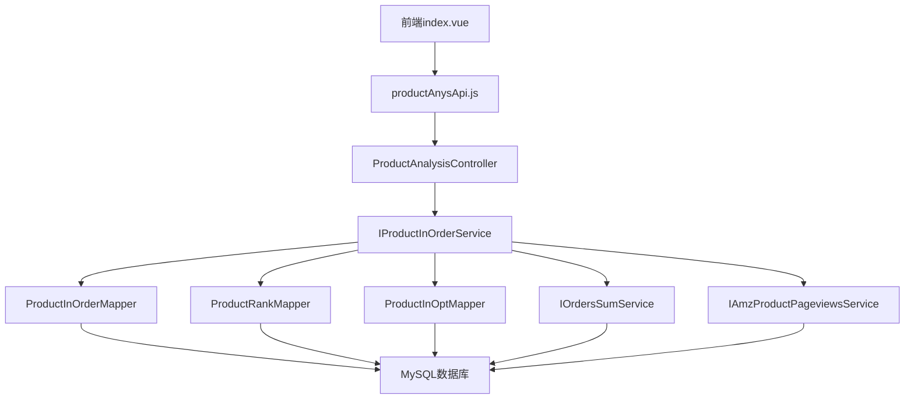

# 销售商品分析模块功能解析文档

## 1. 系统架构

### 1.1 整体架构

销售商品分析模块采用前后端分离架构，主要包含以下组件：

- **前端组件**：Vue 3 + Element Plus 构建的单页应用
- **后端服务**：Spring Boot 微服务，提供 RESTful API
- **数据库**：MySQL 数据库存储商品相关数据
- **外部依赖**：亚马逊API用于获取和同步商品销售、排名、流量和广告数据

### 1.2 模块依赖关系



## 2. 前端实现

### 2.1 核心文件结构

```
wimoor-ui/src/views/amazon/listing/analysis/
├── index.vue                    # 主页面组件
└── components/
    ├── data_deatils.vue         # 数据详情组件
    └── dialog.vue               # 指标选择对话框组件

wimoor-ui/src/api/amazon/product/
└── productAnysApi.js            # 商品分析API接口
```

### 2.2 核心组件分析

#### 2.2.1 主页面组件（index.vue）

**文件路径**：`wimoor-ui/src/views/amazon/listing/analysis/index.vue`

**主要功能**：
- 提供店铺分组选择和商品搜索功能
- 展示SKU列表，支持分页和无限滚动加载
- 管理商品选择状态，传递选中商品信息给详情组件

**核心代码结构**：

```vue
<template>
  <div class="gird-line-head el-white-bg">
    <!-- 顶部筛选区域 -->
    <div class="flex-center">
      <el-space>
        <Group @change="groupChange" ref="groupRef" :init="true"/>
        <el-input v-model="queryParams.search" clearable @input="handleQuery" placeholder="请输入" class="input-with-select">
          <!-- 搜索类型选择 -->
          <template #prepend>
            <el-select v-model="queryParams.ftype" @change='handleQuery' style="width:100px;" placeholder="SKU">
              <!-- 搜索类型选项 -->
            </el-select>
          </template>
          <!-- 搜索按钮 -->
          <template #append>
            <el-button @click="handleQuery">
              <el-icon class="font-base ic-cen"><search /></el-icon>
            </el-button>
          </template>
        </el-input>
      </el-space>
    </div>
  </div>
  
  <!-- 左右分栏布局 -->
  <div class="grid-content">
    <!-- 左侧SKU列表 -->
    <div class="left-content el-white-bg ">
      <div class="con-header"><h4>SKU列表</h4></div>
      <el-scrollbar style="height:calc(100vh - 280px)">
        <div>
          <ul class="sku-list" v-infinite-scroll="load">
            <li class="pointer" v-for="item in tableData" @click="selectSku(item)" :class="{'active':item.active}">
              {{item.sku}}
              <div class="font-extraSmall">ASIN：{{item.asin}}</div>
              <div v-if="showmarket" class="font-extraSmall">{{item.groupname}}-{{item.marketname}}</div>
            </li>
          </ul>
        </div>
      </el-scrollbar>
      <!-- 分页控件 -->
      <pagination v-if="total > 0" :total="total" layout="total,prev,next" v-model:page="queryParams.currentpage" v-model:limit="queryParams.pagesize" @pagination="handleQuery" />
    </div>
    
    <!-- 右侧数据分析区域 -->
    <div class="right-content">
      <el-scrollbar class="screen-height gary-bg">
        <DataDeatils ref="dataDeatilsRef"/>
      </el-scrollbar>
    </div>
  </div>
</template>

<script setup>
import {ref,reactive,toRefs,onMounted}from"vue";
import DataDeatils from"./components/data_deatils.vue"
import Group from '@/components/header/group.vue';
import productAnysApi from '@/api/amazon/product/productAnysApi.js';

// 响应式状态
let state=reactive({
  tableData:[],
  total:10,
  showmarket:false,
  queryParams:{
    pagesize:10,
    currentpage:1,
    ftype:'sku',
  }
})

// 商品选择处理
function selectSku(row){
  state.tableData.forEach((item)=>{
    item.active = false;
  })
  row.active = true;
  dataDeatilsRef.value.show(row);
}

// 店铺分组变更处理
function groupChange(obj){
  state.queryParams.groupid=obj.groupid;
  state.queryParams.marketplaceid=obj.marketplaceid;
  if(state.queryParams.groupid&&state.queryParams.marketplaceid){
    state.showmarket=false;
  }else{
    state.showmarket=true;
  }
  handleQuery();
}

// 查询商品列表
function handleQuery(){
  productAnysApi.productAsinList(state.queryParams).then((res)=>{
    state.tableData=res.data.records;
    state.total=res.data.total;
    if(state.total>0){
      selectSku(res.data.records[0]);
    }
  });
}
</script>
```

#### 2.2.2 数据详情组件（data_deatils.vue）

**文件路径**：`wimoor-ui/src/views/amazon/listing/analysis/components/data_deatils.vue`

**主要功能**：
- 展示商品基本信息和操作按钮
- 提供销量、历史排名和自定义指标标签页
- 支持时间范围选择和图表展示
- 管理商品备注功能

**核心代码结构**：

```vue
<template>
  <div class="gird-line-right">
    <!-- 商品基本信息卡片 -->
    <el-card>
      <el-row gutter="16">
        <el-col :span="16">
          <div class="p-b-h">
            <!-- 商品图片 -->
            <div>
              <el-image v-if="infoMap.image" :src="infoMap.image" class="img-size"></el-image>
              <el-image v-else :src="$require('empty/noimage40.png')" class="img-size"></el-image>
            </div>
            <!-- 商品信息 -->
            <div>
              <div class="name">{{infoMap.name}}</div>
              <div class="sku">{{infoMap.sku}}</div>
              <el-space class="font-extraSmall m-t-8">
                <span>ASIN:{{infoMap.asin}}</span>
                <el-divider direction="vertical"></el-divider>
                <span>首次上架日期:{{infoMap.opendate}}</span>
              </el-space>
              <div class="m-t-8" v-if="infoMap.anysisremark">
                <p>备注:{{infoMap.anysisremark}}</p>
              </div>
            </div>
          </div>
        </el-col>
        <!-- 操作按钮 -->
        <el-col :span="8" class="text-right">
          <el-space :size="16">
            <el-link @click="editRemarks" title="编辑备注" class="flex-center" :underline="false">
              <el-icon class="font-medium"><Edit /></el-icon>&nbsp;备注
            </el-link>
            <el-link title="跳转亚马逊" class="flex-center" target="_blank" :href="infoMap.link" :underline="false">
              <el-icon class="font-medium"><Link/></el-icon>&nbsp;跳转
            </el-link>
          </el-space>
        </el-col>
      </el-row>
    </el-card>
    
    <!-- 标签页导航 -->
    <el-tabs v-model="activeName" type="card" class="card-top-tabs m-t-16" @tab-change="loadChart">
      <el-tab-pane name="sales" label="销量"></el-tab-pane>
      <el-tab-pane name="hisrank" label="历史排名"></el-tab-pane>
      <el-tab-pane v-for="item in queryList" :label="item.name" :name="item.id" :class="item.name=='none'?'nopadding':''" :disabled="item.name=='none'?true:false">
        <template #label>
          <div @click.stop="showQueryDialog" class="custom-tabs-label pointer font-black" style="padding-left: 10px; padding-right: 10px;margin-left:-10px;margin-right:-10px" v-if="item.name=='none'">
            <el-icon><Plus /></el-icon>
          </div>
          <div class="custom-tabs-label" v-else>{{item.name}}</div>
        </template>
      </el-tab-pane>
    </el-tabs>
    
    <!-- 时间范围选择和图表展示 -->
    <el-card class="p-a-card">
      <template #header>
        <div class="flex-center-between">
          <el-space>
            <el-radio-group v-model="times" @change="changeTimes">
              <el-radio-button label="近7天" />
              <el-radio-button label="近30天" />
              <el-radio-button label="近90天" />
            </el-radio-group>
            <Datepicker ref="datepickersRef" :days="1" @changedate="changedate" />
          </el-space>
        </div>
      </template>
      <div class="p-a-body">
        <div class="p-a-right">
          <div id="anaysis-mycharts" class="my-chart"></div>
        </div>
      </div>
    </el-card>
    
    <!-- 数据表格 -->
    <el-card style="margin-top:10px;">
      <el-scrollbar style="width:calc(100vw - 350px);" always>
        <table class="sd-table">
          <tr>
            <td width="80px;">项目名称</td>
            <td width="80px;">汇总</td>
            <td v-for="label in labels" width="60px;">{{label}}</td>
          </tr>
          <tr v-for="(legend,index) in legends">
            <td width="80px;">{{legend}}</td>
            <td width="80px;">{{summary[index]}}</td>
            <td width="60px;" v-if="series && series[index] && series[index].data" v-for="item in series[index].data">
              {{item}}
            </td>
          </tr>
        </table>
      </el-scrollbar>
    </el-card>
    
    <!-- 备注编辑对话框 -->
    <el-dialog v-model="remarkVisable" title="备注">
      <el-input v-model="infoMap.remark2" type="textarea" :rows="3"></el-input>
      <template #footer>
        <el-button @click="remarkVisable=false">取消</el-button>
        <el-button type="primary" @click.stop="updateAnyRemark">确认</el-button>
      </template>
    </el-dialog>
    
    <!-- 指标选择对话框 -->
    <Dialog ref="dialogRef" @change="loadQueryList"></Dialog>
  </div>
</template>

<script setup>
import {ref,reactive,toRefs}from"vue"
import * as echarts from 'echarts';
import productAnysApi from '@/api/amazon/product/productAnysApi.js';
import queryFieldApi from '@/api/sys/tool/queryFieldApi.js';

// 响应式状态
let state=reactive({
  remarkVisable:false,
  activeName:"sales",
  times:"近7天",
  infoMap:{remark2:'',},
  isload:true,
  queryParams:{},
  labels:[],
  series:[],
  summary:[],
  legends:[],
  queryList:[{name:"none"}],
})

// 加载图表数据
function loadChart(){
  var ftype="";
  if(state.activeName=="hisrank"||state.activeName=="sales"){
    ftype=state.activeName;
  }else{
    state.queryList.forEach(item=>{
      if(state.activeName==item.id){
        ftype=item.queryfield;
      }
    })
  }
  if(ftype!="none"){
    setTimeout(function(){
      productAnysApi.getChartData({"sku":state.infoMap.sku,"marketplaceid":state.infoMap.marketplaceid,"groupid":state.infoMap.groupid,
      "ftype":ftype,"fromDate":state.queryParams.fromDate,"endDate":state.queryParams.endDate}).then((res)=>{
        if (res.data && res.data.length > 0) {
          var data=res.data;
          state.labels = data[0].labels;
          state.series = [];
          state.legends = [];
          var hasrightline=false;
          for (var i = 0; i < data.length; i++) {
            var name = data[i].name;
            if (name == '购物车比例' || name == '销售转化率' || name == '广告点击率' 
                    || name == 'Acos' || name == "AcoAs" || name == "广告转化率"
                        || name == "广告销量占比") {
              hasrightline=true;break;
            }
          }
          
          for (var i = 0; i < data.length; i++) {
            state.legends.push(data[i].name);
            var datas = {};
            state.summary[i]=0;
            data[i].data.forEach(item=>{
              if(item){
                state.summary[i]=state.summary[i]+parseFloat(item);
              }
            })
            datas.name = data[i].name;
            datas.type = "line";
            if (datas.name == '购物车比例' || datas.name == '销售转化率' || datas.name == '广告点击率' 
                    || datas.name == 'Acos' || datas.name == "AcoAs" || datas.name == "广告转化率"
                        || datas.name == "广告销量占比") {
              state.summary[i]=formatFloat(state.summary[i]/data[i].data.length)+" (avg)";
              datas.yAxisIndex = 1;
            } else if(hasrightline==true){
              datas.type = "bar";
              datas.barGap = "0%";
              datas.boundaryGap = "0%";
              datas.barMaxWidth = 32, datas.itemStyle = {
                normal : {
                  barBorderRadius : [ 4, 4, 0, 0 ]
                }
              };
            }
            if(hasrightline==false){
              datas.symbolSize = 0, datas.itemStyle = {
                normal : {
                  lineStyle : {
                    width : 2
                  }
                }
              };
            }
            datas.smooth = 0.5;
            datas.symbol = 'emptycircle';
            datas.data = data[i].data;
            datas.label={
              show:true,
            };
            datas.showAllSymbol=false;
            state.series.push(datas);
          }
          lineChart();
        }
        if(state.isload==true){
          state.isload=false;
        }
      });
    },500);
  }else{
    showQueryDialog();
  }
}

// 初始化图表
function lineChart() {
  if(myChart!=null){
    myChart.clear()
  }else{
    myChart =echarts.init(document.getElementById('anaysis-mycharts'));
  }
  var option = {
    tooltip : {
      trigger : 'axis',
      formatter : function(params) {
        var showHtm = "";
        for (var i = 0; i < params.length; i++) {
          var date = params[i].name;
          var name = params[i].seriesName;
          var value = params[i].value;
          if (name == '购物车比例' || name == '销售转化率' || name == '广告点击率'
                  || name == 'Acos' || name == "AcoAs" || name == "广告转化率"
                      || name == "广告销量占比") {
            showHtm += name + ": " + value + "%" + '<br>';
          } else {
            showHtm += name + ": " + value + '<br>';
          }
        }
        showHtm = date + '<br>' + showHtm;
        return showHtm;
      },
      axisPointer : {
        type : 'line',
        lineStyle : {
          color : '#ccc',
          width : 1,
          type : 'solid'
        },
      }
    },
    legend : {
      data : state.legends,
      y : 'top',
      x : 'center',
    },
    color : [ '#ffa400', '#75D6AA', '#EB6A79', '#7AA5DA', '#d69bf2',
            '#59f3e3', '#8875ff', '#e0e0e5', '#ff8559', '#00FF7F', '#00FF7F' ],
    grid : {
      x : 50,
      x2 : 50,
      y : 50,
      y2 :50,
      borderWidth : 0,
    },
    calculable : false,
    xAxis : [ {
      axisLabel : {
        show : true,
        textStyle : {
          color : '#999'
        }
      },
      splitLine : {
        lineStyle : {
          color : '#f1f1f1',
          width : 1,
        }
      },
      axisTick : {
        show : false,
        lineStyle : {
          color : '#f1f1f1'
        }
      },
      axisLine : {
        lineStyle : {
          color : '#f1f1f1',
          width : 1,
        }
      },
      type : 'category',
      boundaryGap : true,
      data : state.labels
    } ],
    yAxis : [ {
      axisLabel : {
        show : true,
        textStyle : {
          color : '#999'
        },
      },
      splitLine : {
        lineStyle : {
          color : '#f1f1f1',
          width : 1,
        }
      },
      axisLine : {
        lineStyle : {
          color : '#f1f1f1',
          width : 1,
        }
      },
    }, {
      axisLabel : {
        show : true,
        textStyle : {
          color : '#999'
        },
      },
      splitLine : {
        show:false,
      },
      axisLine : {
        lineStyle : {
          color : '#f1f1f1',
          width : 1,
        }
      },
    }, ],
    series : state.series
  };
  myChart.setOption(option);
  window.addEventListener('resize',()=>{
    myChart.resize();
  });
}

// 显示商品详情
function show(row){
  if(row.id){
    productAnysApi.productdetail({"pid":row.id}).then((res)=>{
      state.infoMap=res.data;
      state.infoMap.link="https://"+row.point_name+"/dp/"+res.data.asin;
      loadChart();
    });
  }
  loadQueryList();
}

// 导出组件方法
defineExpose({show})
</script>
```

### 2.3 API接口分析

**文件路径**：`wimoor-ui/src/api/amazon/product/productAnysApi.js`

**API接口列表**：

| 接口名称 | URL | 方法 | 功能描述 |
|---------|-----|------|----------|
| productAsinList | /amazon/api/v1/report/product/analysis/productAsinList | POST | 获取商品ASIN列表 |
| productdetail | /amazon/api/v1/report/product/analysis/productdetail | GET | 获取商品详情 |
| productdetailByInfo | /amazon/api/v1/report/product/analysis/productdetailByInfo | GET | 通过SKU和市场获取商品详情 |
| updateAnyRemark | /amazon/api/v1/report/product/analysis/updateAnyRemark | GET | 更新商品备注 |
| getChartData | /amazon/api/v1/report/product/analysis/getChartData | GET | 获取图表数据 |

## 3. 后端实现

### 3.1 核心文件结构

```
wimoor-amazon/amazon-boot/src/main/java/com/wimoor/amazon/product/
├── controller/
│   └── ProductAnalysisController.java   # 商品分析控制器
├── service/
│   ├── IProductInOrderService.java       # 商品订单服务接口
│   └── impl/
│       └── ProductInOrderServiceImpl.java # 商品订单服务实现
└── mapper/
    ├── ProductInOrderMapper.java         # 商品订单数据访问
    ├── ProductRankMapper.java            # 商品排名数据访问
    └── ProductInOptMapper.java           # 商品操作数据访问
```

### 3.2 核心代码分析

#### 3.2.1 控制器层（ProductAnalysisController.java）

**文件路径**：`wimoor-amazon/amazon-boot/src/main/java/com/wimoor/amazon/product/controller/ProductAnalysisController.java`

**主要功能**：
- 处理商品分析相关的HTTP请求
- 调用相应的服务方法处理业务逻辑
- 返回统一的响应格式

**核心代码**：

```java
@Api(tags = "商品分析")
@RestController
@SystemControllerLog("商品分析")
@RequestMapping("/api/v1/report/product/analysis")
@RequiredArgsConstructor
public class ProductAnalysisController {
    @Autowired
    IProductInfoService iProductInfoService;
    final IAmazonAuthorityService amazonAuthorityService;
    final IProductInOrderService iProductInOrderService;
    final IProductInOptService iProductInOptService;
    
    @PostMapping("/productAsinList")
    public Result<IPage<Map<String, Object>>> productListAction(@RequestBody ProductListDTO query) {
        String search = query.getSearch();
        String searchtype = query.getFtype();
        Map<String, Object> parameter = new HashMap<String, Object>();
        parameter.put("searchtype", searchtype);
        parameter.put("search", search != null && !search.isEmpty() ? "%" + search.trim() + "%" : null);
        String marketplaceid = query.getMarketplaceid();
        String groupid = query.getGroupid();
        parameter.put("marketplaceid", marketplaceid != null && !marketplaceid.isEmpty() && !"all".equals(marketplaceid) ? marketplaceid.trim() : null);
        UserInfo userinfo = UserInfoContext.get();
        if (userinfo.isLimit(UserLimitDataType.operations)) {
            parameter.put("myself", userinfo.getId());
        }
        
        parameter.put("shopid", userinfo.getCompanyid());
        if(!"all".equals(groupid)&&StrUtil.isNotEmpty(groupid)) {
            if(StrUtil.isNotEmpty(marketplaceid)) {
                AmazonAuthority auth = amazonAuthorityService.selectByGroupAndMarket(groupid, marketplaceid);
                if(auth!=null) {
                    parameter.put("amazonAuthId", auth.getId());
                }
            }
        }
        
        if (StrUtil.isBlankOrUndefined(groupid)||"all".equals(groupid)) {
            parameter.put("groupid", null);
            if(userinfo.getGroups()!=null&&userinfo.getGroups().size()>0) {
                parameter.put("groupList", userinfo.getGroups());
            }
        } else {
            parameter.put("groupid", groupid);
        }
        IPage<Map<String, Object>> list = iProductInfoService.getAsinList(query.getPage(), parameter);
        return Result.success(list);
    }
    
    @GetMapping("/productdetail")
    public Result<Map<String, Object>> productListAction(String pid) {
        UserInfo userinfo = UserInfoContext.get();
        return Result.success(iProductInOrderService.selectDetialById(pid, userinfo.getCompanyid()));
    }
    
    @GetMapping("/productdetailByInfo")
    public Result<Map<String, Object>> productdetailByInfoAction(String sku, String marketplaceid, String sellerid, String groupid) {
        UserInfo userinfo = UserInfoContext.get();
        AmazonAuthority auth = amazonAuthorityService.selectByGroupAndMarket(groupid, marketplaceid);
        if(auth!=null) {
            LambdaQueryWrapper<ProductInfo> queryWrapper = new LambdaQueryWrapper<ProductInfo>();
            queryWrapper.eq(ProductInfo::getAmazonAuthId, auth.getId());
            queryWrapper.eq(ProductInfo::getMarketplaceid, marketplaceid);
            queryWrapper.eq(ProductInfo::getSku, sku);
            ProductInfo info = iProductInfoService.getOne(queryWrapper);
            if(info!=null) {
                return Result.success(iProductInOrderService.selectDetialById(info.getId(), userinfo.getCompanyid()));
            } else {
                return Result.failed();
            }
        } else {
            return Result.failed();
        }
    }
    
    @SystemControllerLog("修改分析备注")
    @GetMapping("/updateAnyRemark")
    public Result<?> updateAnyRemarkAction(String pid, String remark) {
        ProductInOpt opt = iProductInOptService.getById(pid);
        if(opt!=null) {
            opt.setRemarkAnalysis(remark);
            return Result.success(iProductInOptService.updateById(opt));
        } else {
            opt = new ProductInOpt();
            opt.setPid(new BigInteger(pid));
            opt.setRemarkAnalysis(remark);
            return Result.success(iProductInOptService.save(opt));
        }
    }
    
    @GetMapping("/getChartData")
    public Result<List<Map<String, Object>>> getChartDataAction(String sku, String marketplaceid, String groupid, String ftype, String fromDate, String endDate) {
        List<Map<String, Object>> maps = null;
        UserInfo user = UserInfoContext.get();
        Map<String, Object> parameter = new HashMap<String, Object>();
        parameter.put("shopid", user.getCompanyid());
        parameter.put("marketplace", marketplaceid != null && !marketplaceid.isEmpty() ? marketplaceid.trim() : null);
        parameter.put("groupid", groupid != null && !groupid.isEmpty() ? groupid.trim() : null);

        if (StrUtil.isEmpty(groupid) || StrUtil.isEmpty(marketplaceid)) {
            throw new BizException("必须有店铺和站点");
        }
        AmazonAuthority amazonAuthority = amazonAuthorityService.selectByGroupAndMarket(groupid, marketplaceid);
        if (amazonAuthority != null) {
            parameter.put("amazonAuthId", amazonAuthority.getId());
        }
        parameter.put("userid", user.getId());
        String beginDate = fromDate;
        Map<String, Integer> ftypeset = new HashMap<String, Integer>();
        if ("sales".equals(ftype)) {
            ftypeset.put("uns", 0);
            ftypeset.put("ods", 1);
        } else if ("hisrank".equals(ftype)) {
            ftypeset.put("rnks", 0);
        } else {
            String[] ftypeStr = ftype.split(",");
            for (int i = 0; i < ftypeStr.length; i++) {
                if(StrUtil.isNotEmpty(ftypeStr[i])) {
                    ftypeset.put(ftypeStr[i], i);
                }
            }
        }
        if (StrUtil.isNotEmpty(ftype)) {
            maps = iProductInOrderService.getChartData(ftypeset, parameter, user);
        } else {
            maps = null;
        }
        return Result.success(maps);
    }
}
```

#### 3.2.2 服务层（ProductInOrderServiceImpl.java）

**文件路径**：`wimoor-amazon/amazon-boot/src/main/java/com/wimoor/amazon/product/service/impl/ProductInOrderServiceImpl.java`

**主要功能**：
- 实现商品分析的核心业务逻辑
- 处理销量、排名、流量和广告数据的整合
- 提供图表数据的计算和格式化

**核心代码**：

```java
@Service
@RequiredArgsConstructor
public class ProductInOrderServiceImpl extends ServiceImpl<ProductInOrderMapper, ProductInOrder> implements IProductInOrderService {
    
    final ProductRankMapper productRankMapper;
    final IAmzProductPageviewsService iAmzProductPageviewsService;
    final IAmazonAuthorityService iAmazonAuthorityService;
    final IOrdersSumService iOrdersSumService;
    final ProductInOptMapper productInOptMapper;
    
    @Override
    public Map<String, Object> selectDetialById(String pid, String shopid) {
        return this.baseMapper.selectDetialById(pid, shopid);
    }

    @Override
    public List<Map<String, Object>> getChartData(Map<String, Integer> typesMap, Map<String, Object> parameter, UserInfo user) {
        String sku = parameter.get("sku") == null ? null : (String) parameter.get("sku");
        String ftype = parameter.get("ftype") == null ? null : (String) parameter.get("ftype");
        String marketplace = parameter.get("marketplace") == null ? null : (String) parameter.get("marketplace");
        String beginDate = parameter.get("beginDate") == null ? null : (String) parameter.get("beginDate");
        String endDate = parameter.get("endDate") == null ? null : (String) parameter.get("endDate");
        String amazonAuthId = parameter.get("amazonAuthId") == null ? null : parameter.get("amazonAuthId").toString();
        
        // 销量汇总
        List<AmzProductPageviews> sessionlist = null;
        List<ProductRank> rnklist = null;
        List<Map<String, Object>> advlist = null;
        List<OrdersSummary> orderlist = null;
        List<Map<String, Object>> ftypeList = null;
        List<Map<String, Object>> rankList = null;
        
        if (typesMap.containsKey("rnk")) {// sales rank
            rnklist = this.productRank(sku, marketplace, beginDate, endDate, amazonAuthId, user, ftype);
        }
        if (typesMap.containsKey("rnks")) {// sales rank 提取多条分类排名
            ftypeList = this.getCountRankBySku(sku, marketplace, amazonAuthId, user);
            if (ftypeList != null && ftypeList.size() > 0) {
                rankList = this.getRankBySku(sku, marketplace, beginDate, endDate, amazonAuthId, user);
                for (int i = 0; i < ftypeList.size(); i++) {
                    typesMap.put(ftypeList.get(i).get("name").toString(), i + 1);
                }
            } else {
                rankList = new ArrayList<Map<String, Object>>();
                typesMap.put("销售排名", 1);
            }
        }
        if (typesMap.containsKey("uns") || typesMap.containsKey("ods") 
                || typesMap.containsKey("pts") || typesMap.containsKey("aups")) {
            // total order item 订单量 // units orders 销售数量, 商品总销售额, 广告销量占比
            orderlist = iOrdersSumService.orderSummaryBySkuDate(sku, marketplace, beginDate, endDate, amazonAuthId, user, ftype);
        }
        if (typesMap.containsKey("cks")// clicks 点击量
                || typesMap.containsKey("imp") // impressions 广告展示量
                || typesMap.containsKey("ctr") // 广告点击率ctr
                || typesMap.containsKey("spd") // adv spend 广告费用
                || typesMap.containsKey("cpc") // CPC
                || typesMap.containsKey("cr") // total order/click 转化率
                || typesMap.containsKey("acos") // total order/click 转化率
                || typesMap.containsKey("tos") // total sales广告销售额
                || typesMap.containsKey("acoas") 
                || typesMap.containsKey("aus") // 广告销量
                || typesMap.containsKey("aups")) {// 广告销量占比
            advlist = this.advInfo(sku, marketplace, beginDate, endDate, amazonAuthId, user, ftype);
            if (typesMap.containsKey("acoas") && orderlist == null) {
                orderlist = iOrdersSumService.orderSummaryBySkuDate(sku, marketplace, beginDate, endDate, amazonAuthId, user, ftype);
            }
        }
        if (typesMap.containsKey("ses")// session 页面访问量
                || typesMap.containsKey("pgv") // pageview 页面浏览量,
                || typesMap.containsKey("bbp") || typesMap.containsKey("osp")) {// Unit_Session_Percentage
            sessionlist = this.sessionPage(sku, marketplace, beginDate, endDate, amazonAuthId, user, ftype);
        }

        List<Map<String, Object>> listMap = new ArrayList<Map<String, Object>>();
        for (Entry<String, Integer> typeentry : typesMap.entrySet()) {
            ftype = typeentry.getKey();
            Map<String, Object> map = new HashMap<String, Object>();
            SimpleDateFormat sdf = new SimpleDateFormat("MM.dd");
            Map<String, Object> tempmap = new HashMap<String, Object>();
            
            if ("ses".equals(ftype)) {// session 页面访问量
                for (int i = 0; i < sessionlist.size(); i++) {
                    AmzProductPageviews item = sessionlist.get(i);
                    tempmap.put(sdf.format(GeneralUtil.getDate(item.getByday())), item.getSessions());
                }
                map.put("name", "访问人数");
            } else if ("pgv".equals(ftype)) {// pageview 页面浏览量
                for (int i = 0; i < sessionlist.size(); i++) {
                    AmzProductPageviews item = sessionlist.get(i);
                    tempmap.put(sdf.format(GeneralUtil.getDate(item.getByday())), item.getPageViews());
                }
                map.put("name", "页面浏览数量");
            } else if ("bbp".equals(ftype)) {// BuyBox percentage 购物车比例
                for (int i = 0; i < sessionlist.size(); i++) {
                    AmzProductPageviews item = sessionlist.get(i);
                    tempmap.put(sdf.format(GeneralUtil.getDate(item.getByday())), item.getBuyBoxPercentage());
                }
                map.put("name", "购物车比例");
            } else if ("osp".equals(ftype)) {// Unit_Session_Percentage 销售转化率
                for (int i = 0; i < sessionlist.size(); i++) {
                    AmzProductPageviews item = sessionlist.get(i);
                    tempmap.put(sdf.format(GeneralUtil.getDate(item.getByday())), item.getUnitSessionPercentage());
                }
                map.put("name", "销售转化率");
            } else if ("uns".equals(ftype)) {// units orders 销售数量
                for (int i = 0; i < orderlist.size(); i++) {
                    OrdersSummary item = orderlist.get(i);
                    tempmap.put(sdf.format(item.getPurchaseDate()), item.getQuantity());
                }
                map.put("name", "销量");
            } else if ("pts".equals(ftype)) {// 商品总销售额
                for (int i = 0; i < orderlist.size(); i++) {
                    OrdersSummary item = orderlist.get(i);
                    tempmap.put(sdf.format(item.getPurchaseDate()), item.getOrderprice());
                }
                map.put("name", "销售额");
            } else if ("ods".equals(ftype)) {// total order item 订单量
                for (int i = 0; i < orderlist.size(); i++) {
                    OrdersSummary item = orderlist.get(i);
                    tempmap.put(sdf.format(item.getPurchaseDate()), item.getOrdersum());
                }
                map.put("name", "销售订单");
            } else if (ftype.equals("rnk")) {
                for (int i = 0; i < rnklist.size(); i++) {
                    ProductRank item = rnklist.get(i);
                    tempmap.put(sdf.format(item.getByday()), item.getRank());
                }
                map.put("name", "销量排名");
            } else if (typesMap.containsKey("rnks")) {
                if (ftype.equals("rnks")) {
                    continue;
                }
                for (Map<String, Object> rankMap : rankList) {
                    String rankName = rankMap.get("name").toString();
                    if (ftype.equals(rankName)) {
                        tempmap.put(sdf.format(rankMap.get("byday")), rankMap.get("rank"));
                    }
                    continue;
                }
                map.put("name", ftype);
            } else {
                if ("acoas".equals(ftype)) {
                    long diff = GeneralUtil.getDatez(endDate).getTime() - GeneralUtil.getDatez(beginDate).getTime();
                    long daysize = diff / (1000 * 60 * 60 * 24);
                    Calendar c = Calendar.getInstance();
                    c.setTime(GeneralUtil.getDatez(beginDate));
                    Map<String, Object> costmap = new HashMap<String, Object>();
                    Map<String, Object> salesmap = new HashMap<String, Object>();
                    for (int i = 0; i < advlist.size(); i++) {
                        Map<String, Object> item = advlist.get(i);
                        costmap.put(sdf.format(item.get("bydate")), item.get("spd"));
                    }
                    for (int i = 0; i < orderlist.size(); i++) {
                        OrdersSummary item = orderlist.get(i);
                        salesmap.put(sdf.format(item.getPurchaseDate()), item.getOrderprice());
                    }
                    for (int i = 1; i <= daysize; i++, c.add(Calendar.DATE, 1)) {
                        String tempkey = sdf.format(c.getTime());
                        BigDecimal sales = new BigDecimal("0");
                        Object obj = salesmap.get(tempkey);
                        if (obj != null) {
                            sales = new BigDecimal(obj.toString());
                        }
                        BigDecimal cost = new BigDecimal("0");
                        Object obj2 = costmap.get(tempkey);
                        if (obj2 != null) {
                            cost = new BigDecimal(obj2.toString());
                        }
                        BigDecimal acoas = new BigDecimal("0");
                        if (sales.compareTo(new BigDecimal("0")) != 0) {
                            acoas = cost.multiply(new BigDecimal("100")).divide(sales, 2, RoundingMode.HALF_DOWN);
                        }
                        tempmap.put(tempkey, acoas);
                    }
                } else if ("aups".equals(ftype)) {//广告销量占比=广告订单销量/总销量
                    long diff = GeneralUtil.getDatez(endDate).getTime() - GeneralUtil.getDatez(beginDate).getTime();
                    long daysize = diff / (1000 * 60 * 60 * 24);
                    Calendar c = Calendar.getInstance();
                    c.setTime(GeneralUtil.getDatez(beginDate));
                    Map<String, Object> adUnitsmap = new HashMap<String, Object>();
                    Map<String, Object> totalUnitsmap = new HashMap<String, Object>();
                    for (int i = 0; i < advlist.size(); i++) {
                        Map<String, Object> item = advlist.get(i);
                        adUnitsmap.put(sdf.format(item.get("bydate")), item.get("aus"));
                    }
                    for (int i = 0; i < orderlist.size(); i++) {
                        OrdersSummary item = orderlist.get(i);
                        totalUnitsmap.put(sdf.format(item.getPurchaseDate()), item.getQuantity());
                    }
                    for (int i = 1; i <= daysize; i++, c.add(Calendar.DATE, 1)) {
                        String tempkey = sdf.format(c.getTime());
                        BigDecimal totalUnits = new BigDecimal("0");
                        Object obj = totalUnitsmap.get(tempkey);
                        if (obj != null) {
                            totalUnits = new BigDecimal(obj.toString());
                        }
                        BigDecimal adUnits = new BigDecimal("0");
                        Object obj2 = adUnitsmap.get(tempkey);
                        if (obj2 != null) {
                            adUnits = new BigDecimal(obj2.toString());
                        }
                        BigDecimal aups = new BigDecimal("0");
                        if (totalUnits.compareTo(new BigDecimal("0")) != 0) {
                            aups = adUnits.multiply(new BigDecimal("100")).divide(totalUnits, 2, RoundingMode.HALF_EVEN);
                        }
                        tempmap.put(tempkey, aups);
                    }
                    map.put("name", "广告销量占比");
                } else if(advlist!=null) {
                    for (int i = 0; i < advlist.size(); i++) {
                        Map<String, Object> item = advlist.get(i);
                        tempmap.put(sdf.format(item.get("bydate")), item.get(ftype));
                    }
                }
                if (ftype.equals("cks")) {
                    map.put("name", "广告点击量");
                } else if (ftype.equals("imp")) {
                    map.put("name", "广告展示量");
                } else if (ftype.equals("ctr")) {
                    map.put("name", "广告点击率");
                } else if (ftype.equals("spd")) {
                    map.put("name", "广告花费");
                } else if (ftype.equals("cpc")) {
                    map.put("name", "广告点击花费");
                } else if (ftype.equals("acos")) {
                    map.put("name", "Acos");
                } else if (ftype.equals("acoas")) {
                    map.put("name", "AcoAs");
                } else if (ftype.equals("cr")) {
                    map.put("name", "广告转化率");
                } else if (ftype.equals("tos")) {
                    map.put("name", "广告销售额");
                } else if (ftype.equals("aus")) {
                    map.put("name", "广告销量");
                }
            }
            
            // 处理日期范围和数据填充
            long diff = GeneralUtil.getDatez(endDate).getTime() - GeneralUtil.getDatez(beginDate).getTime();
            long daysize = diff / (1000 * 60 * 60 * 24);
            Calendar c = Calendar.getInstance();
            c.setTime(GeneralUtil.getDatez(beginDate));
            BigDecimal summary = new BigDecimal("0");
            List<String> listLabel = new ArrayList<String>();
            List<String> listData = new ArrayList<String>();
            for (int i = 1; i <= daysize+1; i++, c.add(Calendar.DATE, 1)) {
                String tempkey = sdf.format(c.getTime());
                String value = tempmap.get(tempkey) == null ? "0" : tempmap.get(tempkey).toString();
                listLabel.add(tempkey);
                listData.add(value);
                summary = summary.add(new BigDecimal(value));
            }
            map.put("summary", summary);
            map.put("labels", listLabel);
            map.put("data", listData);
            listMap.add(map);
        }
        return listMap;
    }
    
    // 获取商品排名数据
    private List<ProductRank> productRank(String sku, String marketplace, String beginDate, String endDate, String amazonAuthId, UserInfo user, String ftype) {
        Map<String, Object> param = new HashMap<String, Object>();
        param.put("sku", sku);
        param.put("marketplaceid", marketplace);
        param.put("begindate", beginDate);
        param.put("enddate", endDate);
        param.put("amazonAuthId", amazonAuthId);
        param.put("shopid", user.getCompanyid());
        List<ProductRank> list = productRankMapper.selectBySku(param);
        return list;
    }

    // 获取商品排名分类
    private List<Map<String, Object>> getCountRankBySku(String sku, String marketplace, String amazonAuthId, UserInfo user) {
        Map<String, Object> param = new HashMap<String, Object>();
        param.put("sku", sku);
        param.put("marketplaceid", marketplace);
        param.put("amazonAuthId", amazonAuthId);
        param.put("shopid", user.getCompanyid());
        List<Map<String, Object>> list = productRankMapper.selectCountRankBySku(param);
        return getProductRank(list);
    }

    // 获取商品排名数据
    private List<Map<String, Object>> getRankBySku(String sku, String marketplace, String beginDate, String endDate, String amazonAuthId, UserInfo user) {
        Map<String, Object> param = new HashMap<String, Object>();
        param.put("sku", sku);
        param.put("marketplaceid", marketplace);
        param.put("begindate", beginDate);
        param.put("enddate", endDate);
        param.put("amazonAuthId", amazonAuthId);
        param.put("shopid", user.getCompanyid());
        List<Map<String, Object>> list = productRankMapper.selectRankBySku(param);
        return getProductRank(list);
    }

    // 获取广告数据
    private List<Map<String, Object>> advInfo(String sku, String marketplace, String beginDate, String endDate, String amazonAuthId, UserInfo user, String ftype) {
        Map<String, Object> param = new HashMap<String, Object>();
        param.put("sku", sku);
        param.put("marketplaceid", marketplace);
        param.put("startdate", beginDate);
        param.put("enddate", endDate);
        param.put("amazonAuthId", amazonAuthId);
        param.put("shopid", user.getCompanyid());
        List<Map<String, Object>> list = null;
        AmazonAuthority auth = iAmazonAuthorityService.getById(amazonAuthId);
        param.put("sellerid", auth.getSellerid());
        list=productInOptMapper.findAdvert(param);
        return list;
    }
    
    // 处理商品排名数据
    public List<Map<String, Object>> getProductRank(List<Map<String, Object>> list) {
        if (list != null) {
            Iterator<Map<String, Object>> iterator = list.iterator();
            while (iterator.hasNext()) {
                Map<String, Object> map = iterator.next();
                Object name = map.get("name");
                if (name == null) {
                    Object categoryId = map.get("categoryId");
                    try {
                        new BigInteger(categoryId.toString());
                        iterator.remove();
                    } catch (Exception e) {
                        String strName = categoryId.toString().replace("_display_on_website", "").replace("_and_", "&").replace("_", " ");
                        String[] categoryName = strName.toString().split("&");
                        String str = "";
                        for (int i = 0; i < categoryName.length; i++) {
                            String str1 = categoryName[i].substring(0, 1).toUpperCase() + categoryName[i].substring(1);
                            if (i == categoryName.length - 1) {
                                str += str1;
                            } else {
                                str += str1 + " & ";
                            }
                        }
                        map.put("name", str);
                    }
                }
            }
        }
        return list;
    }
    
    // 获取页面访问数据
    public List<AmzProductPageviews> sessionPage(String sku, String marketplaceid, String startdate, String enddate, String amazonAuthId, UserInfo user, String ftype) {
        Map<String, Object> param = new HashMap<String, Object>();
        param.put("sku", sku);
        param.put("marketplaceid", marketplaceid);
        param.put("startDate", startdate);
        param.put("endDate", enddate);
        param.put("amazonAuthId", amazonAuthId);
        param.put("shopid", user.getCompanyid());
        List<AmzProductPageviews> list = iAmzProductPageviewsService.findPageviews(param);
        return list;
    }
}
```

## 4. 核心功能分析

### 4.1 商品列表查询

**功能描述**：根据店铺分组、市场和搜索条件查询商品列表

**实现流程**：
1. 前端调用 `productAnysApi.productAsinList()` 方法
2. 后端 `ProductAnalysisController.productListAction()` 处理请求
3. 构建查询参数，包括搜索类型、搜索关键词、店铺分组、市场等
4. 调用 `iProductInfoService.getAsinList()` 获取商品列表
5. 返回分页后的商品列表数据

### 4.2 商品详情查询

**功能描述**：根据商品ID查询商品详细信息

**实现流程**：
1. 前端调用 `productAnysApi.productdetail()` 方法
2. 后端 `ProductAnalysisController.productListAction()` 处理请求
3. 调用 `iProductInOrderService.selectDetialById()` 获取商品详情
4. 返回商品的基本信息、图片、ASIN等数据

### 4.3 图表数据获取

**功能描述**：根据商品SKU、市场、时间范围和指标类型获取图表数据

**实现流程**：
1. 前端调用 `productAnysApi.getChartData()` 方法
2. 后端 `ProductAnalysisController.getChartDataAction()` 处理请求
3. 构建查询参数，解析指标类型
4. 调用 `iProductInOrderService.getChartData()` 获取图表数据
5. 根据指标类型获取不同的数据：
   - 销量数据：从订单汇总服务获取
   - 排名数据：从商品排名数据获取
   - 流量数据：从页面访问服务获取
   - 广告数据：从广告数据获取
6. 处理数据格式，计算汇总值，填充日期范围
7. 返回格式化的图表数据

### 4.4 商品备注管理

**功能描述**：更新商品的分析备注

**实现流程**：
1. 前端调用 `productAnysApi.updateAnyRemark()` 方法
2. 后端 `ProductAnalysisController.updateAnyRemarkAction()` 处理请求
3. 查询是否存在商品操作记录
4. 存在则更新备注，不存在则创建新记录
5. 返回更新结果

### 4.5 自定义指标分析

**功能描述**：支持用户自定义指标组合进行分析

**实现流程**：
1. 前端点击"+"标签页，打开指标选择对话框
2. 用户选择需要分析的指标
3. 前端创建自定义指标标签页
4. 调用 `productAnysApi.getChartData()` 获取选定指标的数据
5. 后端根据指标类型组合返回相应的数据
6. 前端在图表中展示选定指标的趋势

## 5. 技术亮点

### 5.1 前端技术亮点

1. **组件化设计**：采用Vue 3 Composition API，将页面拆分为主组件和详情组件，提高代码复用性
2. **响应式布局**：使用Element Plus的栅格系统，实现自适应布局
3. **数据可视化**：集成ECharts图表库，支持多种图表类型和交互方式
4. **无限滚动加载**：实现商品列表的无限滚动加载，提升用户体验
5. **实时数据更新**：通过响应式状态管理，实现数据的实时更新和展示

### 5.2 后端技术亮点

1. **服务分层**：采用控制器→服务→数据访问的分层架构，职责清晰
2. **数据整合**：整合多个数据源的数据，包括订单、排名、流量和广告数据
3. **动态指标计算**：支持根据用户选择的指标动态计算和返回数据
4. **日期范围处理**：智能处理日期范围，填充缺失数据，确保数据连续性
5. **性能优化**：通过缓存和批量查询，优化数据查询性能

### 5.3 整体架构亮点

1. **前后端分离**：采用RESTful API设计，实现前后端解耦
2. **数据一致性**：确保前端展示的数据与后端存储的数据一致
3. **可扩展性**：模块化设计，支持轻松添加新的指标和分析维度
4. **安全性**：实现用户权限控制，确保数据安全
5. **可维护性**：代码结构清晰，文档完善，易于维护和扩展

## 6. 代码优化建议

### 6.1 前端优化建议

1. **性能优化**：
   - 实现商品列表的虚拟滚动，减少DOM节点数量
   - 优化图表渲染，避免频繁重绘
   - 使用缓存机制，减少重复请求

2. **代码质量**：
   - 提取重复的图表配置为可复用的函数
   - 优化响应式状态管理，避免不必要的状态更新
   - 添加TypeScript类型定义，提高代码可读性和可维护性

3. **用户体验**：
   - 添加数据加载状态和错误处理
   - 实现图表的导出功能
   - 优化移动端适配

### 6.2 后端优化建议

1. **性能优化**：
   - 实现数据缓存，减少数据库查询
   - 优化SQL查询，添加适当的索引
   - 使用异步处理，提高并发性能

2. **代码质量**：
   - 提取重复的日期处理逻辑为工具类
   - 优化异常处理，提供更详细的错误信息
   - 添加单元测试，提高代码覆盖率

3. **功能扩展**：
   - 支持更多的指标类型和分析维度
   - 实现数据导出功能
   - 添加数据预测和趋势分析功能

### 6.3 数据库优化建议

1. **索引优化**：
   - 为常用查询字段添加索引
   - 优化复合索引的设计

2. **表结构优化**：
   - 考虑分区表，提高大数据量查询性能
   - 优化字段类型和长度

3. **数据清理**：
   - 实现历史数据的归档策略
   - 定期清理无效数据

## 7. 总结

销售商品分析模块是Wimoor系统中一个功能强大的亚马逊商品数据分析工具，通过前后端分离的架构，实现了多维度数据的整合和可视化展示。该模块支持销量、排名、流量、广告等多个维度的数据分析，为用户提供了全面的商品表现视图。

### 7.1 模块价值

- **数据驱动决策**：通过多维度数据分析，帮助用户做出更明智的运营决策
- **运营效率提升**：自动化数据收集和分析，减少人工操作，提高运营效率
- **销售业绩增长**：通过深入的数据分析，发现销售机会，优化运营策略，提升销售业绩
- **竞争优势建立**：通过对商品表现的持续监控和分析，建立竞争优势

### 7.2 技术实现

- **前端**：Vue 3 + Element Plus + ECharts，实现了响应式布局和丰富的数据可视化
- **后端**：Spring Boot + MyBatis Plus，实现了高效的数据处理和业务逻辑
- **数据**：整合亚马逊多个数据源的数据，提供全面的分析视角
- **架构**：前后端分离，模块化设计，确保系统的可扩展性和可维护性

### 7.3 未来展望

1. **功能扩展**：
   - 支持更多的数据分析维度和指标
   - 实现数据预测和趋势分析
   - 添加竞品对比分析功能

2. **技术升级**：
   - 采用更先进的前端框架和状态管理方案
   - 引入大数据处理技术，提高数据处理能力
   - 实现实时数据更新和推送

3. **用户体验优化**：
   - 提供更个性化的数据分析视图
   - 实现更丰富的图表交互功能
   - 优化移动端体验

销售商品分析模块通过技术创新和功能优化，为亚马逊卖家提供了强大的数据分析工具，帮助他们更好地理解商品表现，优化运营策略，实现销售增长。
